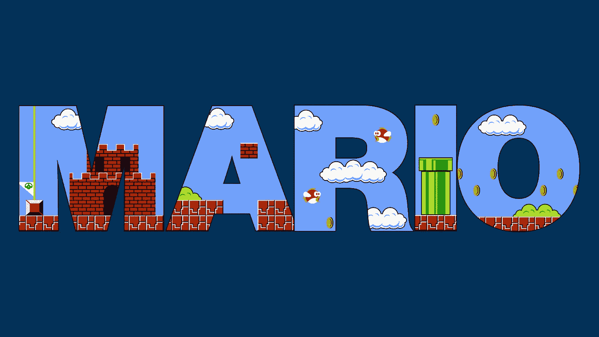
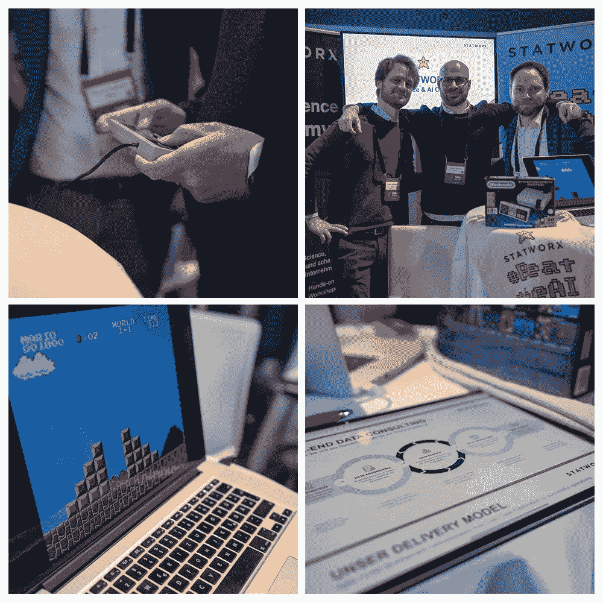
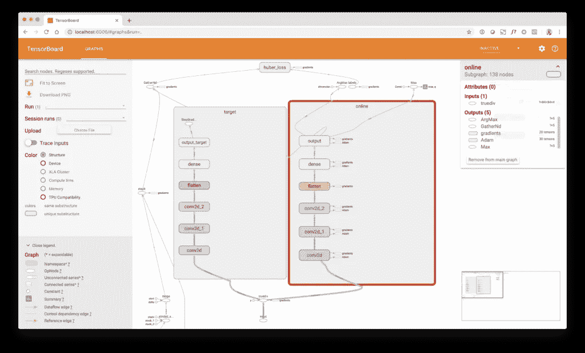

# 使用强化学习在 NES 上玩超级马里奥兄弟

> 原文：<https://towardsdatascience.com/using-reinforcement-learning-to-play-super-mario-bros-on-nes-using-tensorflow-31281e35825?source=collection_archive---------9----------------------->



强化学习是目前机器学习领域最热门的话题之一。对于我们最近参加的一次会议(在慕尼黑举行的令人敬畏的[数据节](https://www.datafestival.de/))，我们开发了一个强化学习模型，学习在 NES 上玩超级马里奥兄弟，这样一来，来到我们展台的参观者就可以在关卡完成时间方面与代理竞争。



推广活动取得了巨大成功，人们喜欢“人机”竞赛。只有一名选手能够通过一条人工智能不知道的秘密捷径打败人工智能。此外，用 Python 开发模型非常有趣。因此，我决定写一篇关于它的博文，涵盖强化学习的一些基本概念以及我们的超级马里奥代理在 TensorFlow 中的实际实现(注意，我使用的是 TensorFlow 1.13.1，在撰写本文时 TensorFlow 2.0 尚未发布)。

# 回顾:强化学习

大多数机器学习模型在输入和输出之间有明确的联系，这种联系在训练期间不会改变。因此，很难对输入或目标本身依赖于先前预测的系统进行建模或预测。然而，通常情况下，模型周围的世界会随着所做的每一个预测而自我更新。听起来很抽象的东西实际上是现实世界中非常常见的情况:自动驾驶、机器控制、过程自动化等。—在许多情况下，模型做出的决策会对其周围环境产生影响，从而影响下一步要采取的行动。在这种情况下，经典的监督学习方法只能在有限的范围内使用。为了解决后者，需要能够处理相互依赖的输入和输出的时间相关变化的机器学习模型。这就是强化学习发挥作用的地方。

在强化学习中，模型(称为*代理*)通过从环境的每个*状态*中的一组可能的*动作*(动作空间)中进行选择，与它的*环境*进行交互，这些动作从环境中引起正面或负面的*回报*。把奖励想象成一个抽象的概念，表明所采取的行动是好是坏。因此，由环境发出的奖励可以是即时的，也可以延迟到将来。通过从环境状态、动作和相应的奖励的组合中学习(所谓的*转换*，代理试图达到一组最优的决策规则(策略*策略*),使代理在每个状态下收集的总奖励最大化。

# Q 学习和深度 Q 学习

在强化学习中，我们经常使用一个叫做 *Q-learning* 的学习概念。Q-learning 基于所谓的 Q 值，它帮助代理在给定当前环境状态的情况下确定最佳行动。q 值是“贴现”的未来奖励，是我们的代理在培训期间通过采取行动和在不同环境状态中移动收集的。q 值本身试图在训练期间被近似，或者通过简单的环境探索，或者通过使用函数近似器，例如深度神经网络(如我们这里的情况)。通常，我们在每个状态中选择具有最高 Q 值的行动，即，给定环境的当前状态，最高的贴现未来回报。

当使用神经网络作为 Q 函数逼近器时，我们通过计算预测 Q 值和“真实”Q 值之间的差异进行学习，即当前状态下最佳决策的表示。基于计算的损失，我们使用梯度下降更新网络的参数，就像在任何其他神经网络模型中一样。通过经常这样做，我们的网络收敛到一个状态，在给定当前环境状态的情况下，它可以近似下一个状态的 Q 值。如果近似足够好，我们简单地选择具有最高 Q 值的动作。通过这样做，代理人能够在每种情况下决定哪种行为在奖励收集方面产生最好的结果。

在大多数深度强化学习模型中，实际上涉及两个深度神经网络:在线网络和目标网络。这样做是因为在训练期间，单个神经网络的损失函数是针对稳定变化的目标(Q 值)计算的，这些目标是基于网络权重本身的。这增加了优化问题的难度，或者可能导致根本不收敛。目标网络基本上是在线网络的副本，具有不直接训练的冻结权重。相反，在一定数量的训练步骤之后，目标网络的权重与在线网络同步。强制在每个训练步骤之后不改变的目标网络的“稳定输出”确保了计算损耗所需的计算的目标 Q 值不会稳定地改变，这支持了优化问题的收敛。

# 深度双 Q 学习

Q-learning 的另一个可能的问题是，由于选择最大 Q 值来确定最佳动作，模型有时会在训练期间产生非常高的 Q 值。基本上，这并不总是一个问题，但可能会变成一个问题，如果对某些行为的强烈关注导致对不太有利但“值得一试”的行为的忽视。如果一直忽略后者，模型可能会陷入局部最优解，甚至更糟的是一直选择相同的动作。处理这个问题的一个方法是引入 Q-learning 的更新版本，称为[双 Q-learning](https://arxiv.org/abs/1509.06461) 。

在双 Q 学习中，每个状态中的动作不是简单地通过选择具有目标网络的最大 Q 值的动作来选择的。相反，选择过程分为三个不同的步骤:(1)首先，目标网络在采取行动后计算状态的目标 Q 值。然后，(2)在线网络计算采取行动后状态的 Q 值，并通过找到最大 Q 值来选择最佳行动。最后，(3)使用目标网络的目标 Q 值来计算目标 Q 值，但是是在在线网络的所选动作指数处。这保证了不会出现对 Q 值的高估，因为 Q 值不是基于它们自身更新的。

# 健身房环境

为了构建一个强化学习应用程序，我们需要两样东西:(1)一个代理可以与之交互并向其学习的环境(2)代理，它观察环境的状态并使用 Q 值选择适当的动作，这(理想情况下)会给代理带来高回报。环境通常被提供为所谓的体育馆(gym ),一个包含必要代码的类，以模拟作为代理的动作的函数的环境的状态和回报以及进一步的信息，例如关于可能的动作空间。以下是 Python 中一个简单环境类的示例:

```
class Environment:
    """ A simple environment skeleton """
    def __init__(self):
       # Initializes the environment
        pass

    def step(self, action):
       # Changes the environment based on agents action
        return next_state, reward, done, infodef reset(self):
        # Resets the environment to its initial state
        passdef render(self):
       # Show the state of the environment on screen
        pass
```

环境有三个主要的类函数:(1) `step()`执行环境代码作为代理选择的动作的函数，并返回环境的下一个状态、关于`action`的奖励、指示环境是否已经到达其终止状态的`done`标志以及关于环境及其状态的附加信息的字典，(2) `reset()`将环境重置为其原始状态，以及(3) `render()`在屏幕上打印当前状态(例如显示超级马里奥兄弟游戏的当前帧)。

对于 Python 来说，寻找健身房的必去之地是 [OpenAI](https://gym.open.ai) 。它包含许多不同的游戏和问题，非常适合使用强化学习来解决。此外，还有一个名为 [Gym Retro](https://github.com/openai/retro) 的开放人工智能项目，包含数百个世嘉和 SNES 游戏，随时可以通过强化学习算法解决。

# 代理人

代理消耗环境的当前状态，并基于选择策略选择适当的动作。该策略将环境状态映射到代理要采取的操作。寻找正确的策略是强化学习中的一个关键问题，通常涉及深度神经网络的使用。下面的代理只是观察环境的状态，如果`state`大于 0，则返回`action = 1`，否则返回`action = 0`。

```
class Agent:
    """ A simple agent """
    def __init__(self):
        passdef action(self, state):
        if state > 0:
            return 1
        else:
            return 0
```

这当然是一个非常简单化的政策。在实际的强化学习应用中，环境的状态可能是非常复杂和高维的。一个例子是视频游戏。环境的状态由屏幕上的像素和玩家之前的动作决定。我们的代理人需要找到一种策略，将屏幕像素映射为从环境中产生回报的行为。

# 环境包装

健身房环境包含在强化学习场景中使用它们所需的大部分功能。然而，有一些功能并不是健身房中预先内置的，例如图像缩小、[跳帧和堆叠](https://danieltakeshi.github.io/2016/11/25/frame-skipping-and-preprocessing-for-deep-q-networks-on-atari-2600-games/)、[奖励剪辑](https://ai.stackexchange.com/questions/8348/should-the-reward-or-the-q-value-be-clipped-for-reinforcement-learning)等等。幸运的是，有所谓的健身房包装器提供这种实用功能。在这里可以找到一个可以用于很多视频游戏的例子，比如 Atari 或者 NES。对于视频游戏健身房来说，为了实现代理的良好性能，使用包装函数是非常常见的。下面的例子展示了一个简单的奖励剪辑包装器。

```
import gymclass ClipRewardEnv(gym.RewardWrapper):
  """ Example wrapper for reward clipping """
    def __init__(self, env):
        gym.RewardWrapper.__init__(self, env)def reward(self, reward):
        # Clip reward to {1, 0, -1} by its sign
        return np.sign(reward)
```

从上面的例子可以看出，通过“覆盖”环境的核心功能，可以改变环境的默认行为。这里，基于奖励的符号，使用`np.sign()`将环境的奖励修剪为[-1，0，1]。

# 超级马里奥兄弟 NES 环境

对于我们的超级马里奥兄弟强化学习实验，我使用了 [gym-super-mario-bros](https://github.com/Kautenja/gym-super-mario-bros) 。这个 API 很简单，非常类似于[开放人工智能健身房 API](http://gym.openai.com/docs/) 。下面的代码显示了一个随机代理玩超级马里奥。这导致马里奥在屏幕上扭动，当然，不会导致游戏成功完成。

```
from nes_py.wrappers import BinarySpaceToDiscreteSpaceEnv
import gym_super_mario_bros
from gym_super_mario_bros.actions import SIMPLE_MOVEMENT# Make gym environment
env = gym_super_mario_bros.make('SuperMarioBros-v0')
env = BinarySpaceToDiscreteSpaceEnv(env, SIMPLE_MOVEMENT)# Play random
done = True
for step in range(5000):
    if done:
        state = env.reset()
    state, reward, done, info = env.step(env.action_space.sample())
    env.render()# Close device
env.close()
```

代理通过从环境的动作空间中选择随机动作来与环境交互。视频游戏的动作空间实际上相当大，因为你可以同时按下多个按钮。这里动作空间缩减为`SIMPLE_MOVEMENT`，涵盖了四面八方跑、跳、鸭等基本游戏动作。`BinarySpaceToDiscreteSpaceEnv`将二进制动作空间(所有按钮和方向的虚拟指示器变量)转换为单个整数。例如，整数动作 12 对应于按下右键和 A(跑步)。

# 使用深度学习模型作为代理

当在 NES 上玩超级马里奥兄弟时，人类看到的是游戏屏幕——更准确地说，他们看到的是高速显示在屏幕上的连续像素帧。我们人类的大脑能够将来自我们眼睛的原始感官输入转换为电信号，这些电信号由我们的大脑处理，从而触发相应的动作(按下控制器上的按钮)，这些动作(有希望)将马里奥引向终点线。

在训练代理人时，健身房根据代理人采取的相应动作，将每个游戏帧呈现为像素矩阵。基本上，这些像素可以用作任何机器学习模型的输入。然而，在强化学习中，我们经常使用卷积神经网络(CNN ),与其他 ML 模型相比，它擅长图像识别问题。我不会在这里深入 CNN 的技术细节，有太多关于 CNN 的精彩介绍文章，比如[这篇](http://cs231n.github.io/convolutional-networks/)。

不仅仅使用当前游戏屏幕作为模型的输入，通常使用多个堆叠的帧作为 CNN 的输入。通过这样做，模型可以处理屏幕上连续帧之间的变化和“运动”,这在仅使用单个游戏帧时是不可能的。这里，我们模型的输入张量的大小是`[84, 84, 4]`。这对应于 4 个灰度帧的堆栈，每个帧的大小为 84×84 像素。这对应于二维卷积的默认张量大小。

深度学习模型的架构包括三个卷积层，随后是一个扁平化和一个具有 512 个神经元的全连接层，以及一个输出层，由`actions = 6`个神经元组成，对应于游戏的动作空间(在这种情况下是`RIGHT_ONLY`，即向右移动马里奥的动作——扩大动作空间通常会导致问题复杂性和训练时间的增加)。

如果你仔细看看下面的 TensorBoard 图像，你会注意到这个模型实际上不仅由一个，而是由两个相同的卷积分支组成。一个是*在线网络分支*，另一个是*目标网络分支*。在线网络实际上是使用梯度下降来训练的。目标网络不是直接训练的，而是通过将权重从网络的在线分支复制到目标分支，定期同步每个`copy = 10000`步骤。通过使用分支输出层周围的`tf.stop_gradient()`函数，将目标网络分支排除在梯度下降训练之外。这将导致输出层的梯度流停止，因此它们无法沿分支传播，因此权重不会更新。



代理通过以下方式进行学习:(1)随机抽取历史转换样本，(2)使用目标网络分支和双 Q 学习规则，根据行动后的环境状态`next_state`计算“真实”Q 值，(3)使用`gamma = 0.9`对目标 Q 值进行贴现，(4)根据网络内部 Q 预测和`target_q`提供的真实 Q 值运行批量梯度下降步骤。为了加快训练过程，代理不是在每个动作后进行训练，而是每隔`train_each = 3`帧进行训练，这相当于每隔 4 帧进行一次训练。此外，不是每一帧都存储在重放缓冲器中，而是每第 4 帧。这叫做跳帧。更具体地，执行最大汇集操作，该操作聚集最后 4 个连续帧之间的信息。这是由于连续的帧包含几乎相同的信息，这不会给学习问题增加新的信息，并且可能引入强自相关的数据点。

说到相关数据:我们的网络使用自适应矩估计(ADAM)和梯度下降在 a `learning_rate = 0.00025`进行训练，这需要 i.i.d .数据点才能正常工作。这意味着，我们不能简单地随后使用所有新的转移元组进行训练，因为它们高度相关。为了解决这个问题，我们使用了一个叫做经验重放缓冲区的概念。因此，我们将游戏的每个过渡存储在一个环形缓冲区对象中(Python 中的`deque()`函数),当我们获取`batch_size = 32`的训练数据时，会随机从中抽取样本。通过使用随机采样策略和足够大的重放缓冲区，我们可以假设得到的数据点(希望)是不相关的。下面的代码框显示了`DQNAgent`类。

```
import time
import random
import numpy as np
from collections import deque
import tensorflow as tf
from matplotlib import pyplot as plt class DQNAgent:
    """ DQN agent """
    def __init__(self, states, actions, max_memory, double_q):
        self.states = states
        self.actions = actions
        self.session = tf.Session()
        self.build_model()
        self.saver = tf.train.Saver(max_to_keep=10)
        self.session.run(tf.global_variables_initializer())
        self.saver = tf.train.Saver()
        self.memory = deque(maxlen=max_memory)
        self.eps = 1
        self.eps_decay = 0.99999975
        self.eps_min = 0.1
        self.gamma = 0.90
        self.batch_size = 32
        self.burnin = 100000
        self.copy = 10000
        self.step = 0
        self.learn_each = 3
        self.learn_step = 0
        self.save_each = 500000
        self.double_q = double_qdef build_model(self):
        """ Model builder function """
        self.input = tf.placeholder(dtype=tf.float32, shape=(None, ) + self.states, name='input')
        self.q_true = tf.placeholder(dtype=tf.float32, shape=[None], name='labels')
        self.a_true = tf.placeholder(dtype=tf.int32, shape=[None], name='actions')
        self.reward = tf.placeholder(dtype=tf.float32, shape=[], name='reward')
        self.input_float = tf.to_float(self.input) / 255.
        # Online network
        with tf.variable_scope('online'):
            self.conv_1 = tf.layers.conv2d(inputs=self.input_float, filters=32, kernel_size=8, strides=4, activation=tf.nn.relu)
            self.conv_2 = tf.layers.conv2d(inputs=self.conv_1, filters=64, kernel_size=4, strides=2, activation=tf.nn.relu)
            self.conv_3 = tf.layers.conv2d(inputs=self.conv_2, filters=64, kernel_size=3, strides=1, activation=tf.nn.relu)
            self.flatten = tf.layers.flatten(inputs=self.conv_3)
            self.dense = tf.layers.dense(inputs=self.flatten, units=512, activation=tf.nn.relu)
            self.output = tf.layers.dense(inputs=self.dense, units=self.actions, name='output')
        # Target network
        with tf.variable_scope('target'):
            self.conv_1_target = tf.layers.conv2d(inputs=self.input_float, filters=32, kernel_size=8, strides=4, activation=tf.nn.relu)
            self.conv_2_target = tf.layers.conv2d(inputs=self.conv_1_target, filters=64, kernel_size=4, strides=2, activation=tf.nn.relu)
            self.conv_3_target = tf.layers.conv2d(inputs=self.conv_2_target, filters=64, kernel_size=3, strides=1, activation=tf.nn.relu)
            self.flatten_target = tf.layers.flatten(inputs=self.conv_3_target)
            self.dense_target = tf.layers.dense(inputs=self.flatten_target, units=512, activation=tf.nn.relu)
            self.output_target = tf.stop_gradient(tf.layers.dense(inputs=self.dense_target, units=self.actions, name='output_target'))
        # Optimizer
        self.action = tf.argmax(input=self.output, axis=1)
        self.q_pred = tf.gather_nd(params=self.output, indices=tf.stack([tf.range(tf.shape(self.a_true)[0]), self.a_true], axis=1))
        self.loss = tf.losses.huber_loss(labels=self.q_true, predictions=self.q_pred)
        self.train = tf.train.AdamOptimizer(learning_rate=0.00025).minimize(self.loss)
        # Summaries
        self.summaries = tf.summary.merge([
            tf.summary.scalar('reward', self.reward),
            tf.summary.scalar('loss', self.loss),
            tf.summary.scalar('max_q', tf.reduce_max(self.output))
        ])
        self.writer = tf.summary.FileWriter(logdir='./logs', graph=self.session.graph)def copy_model(self):
        """ Copy weights to target network """
        self.session.run([tf.assign(new, old) for (new, old) in zip(tf.trainable_variables('target'), tf.trainable_variables('online'))])def save_model(self):
        """ Saves current model to disk """
        self.saver.save(sess=self.session, save_path='./models/model', global_step=self.step)def add(self, experience):
        """ Add observation to experience """
        self.memory.append(experience)def predict(self, model, state):
        """ Prediction """
        if model == 'online':
            return self.session.run(fetches=self.output, feed_dict={self.input: np.array(state)})
        if model == 'target':
            return self.session.run(fetches=self.output_target, feed_dict={self.input: np.array(state)})def run(self, state):
        """ Perform action """
        if np.random.rand() < self.eps:
            # Random action
            action = np.random.randint(low=0, high=self.actions)
        else:
            # Policy action
            q = self.predict('online', np.expand_dims(state, 0))
            action = np.argmax(q)
        # Decrease eps
        self.eps *= self.eps_decay
        self.eps = max(self.eps_min, self.eps)
        # Increment step
        self.step += 1
        return actiondef learn(self):
        """ Gradient descent """
        # Sync target network
        if self.step % self.copy == 0:
            self.copy_model()
        # Checkpoint model
        if self.step % self.save_each == 0:
            self.save_model()
        # Break if burn-in
        if self.step < self.burnin:
            return
        # Break if no training
        if self.learn_step < self.learn_each:
            self.learn_step += 1
            return
        # Sample batch
        batch = random.sample(self.memory, self.batch_size)
        state, next_state, action, reward, done = map(np.array, zip(*batch))
        # Get next q values from target network
        next_q = self.predict('target', next_state)
        # Calculate discounted future reward
        if self.double_q:
            q = self.predict('online', next_state)
            a = np.argmax(q, axis=1)
            target_q = reward + (1\. - done) * self.gamma * next_q[np.arange(0, self.batch_size), a]
        else:
            target_q = reward + (1\. - done) * self.gamma * np.amax(next_q, axis=1)
        # Update model
        summary, _ = self.session.run(fetches=[self.summaries, self.train],
                                      feed_dict={self.input: state,
                                                 self.q_true: np.array(target_q),
                                                 self.a_true: np.array(action),
                                                 self.reward: np.mean(reward)})
        # Reset learn step
        self.learn_step = 0
        # Write
        self.writer.add_summary(summary, self.step)
```

# 训练代理玩游戏

首先，我们需要实例化环境。在这里，我们使用第一级的超级马里奥兄弟，`SuperMarioBros-1-1-v0`，以及一个离散的事件空间与`RIGHT_ONLY`的行动空间。此外，我们使用了一个包装器，该包装器将帧大小调整、堆叠和最大池、奖励剪辑以及惰性帧加载应用到环境中。

当训练开始时，代理通过采取随机行动开始探索环境。这样做是为了积累初步经验，作为实际学习过程的起点。在`burin = 100000`游戏帧之后，代理慢慢开始用 CNN 政策决定的动作来代替随机动作。这被称为*ε贪婪政策*。ε-同意意味着代理以概率\ε采取随机动作，或者以概率(1-\ε)采取基于策略的动作。这里，\epsilon 在训练期间以因子`eps_decay = 0.99999975`线性减小，直到它达到`eps = 0.1`，在训练过程的剩余时间内保持不变。重要的是不要完全消除训练过程中的随机行为，以避免陷入局部最优解。

对于采取的每个动作，环境返回四个对象:(1)下一个游戏状态，(2)采取动作的奖励，(3)如果一集结束，则返回一个标志，以及(4)包含来自环境的附加信息的信息字典。在采取动作之后，返回对象的元组被添加到重放缓冲区，并且代理执行学习步骤。学习后，当前`state`用`next_state`更新，循环递增。如果`done`标志为`True`，则 while 循环中断。这相当于马里奥的死亡或者成功完成关卡。在这里，特工接受 10000 集的训练。

```
import time
import numpy as np
from nes_py.wrappers import BinarySpaceToDiscreteSpaceEnv
import gym_super_mario_bros
from gym_super_mario_bros.actions import RIGHT_ONLY
from agent import DQNAgent
from wrappers import wrapper # Build env (first level, right only)
env = gym_super_mario_bros.make('SuperMarioBros-1-1-v0')
env = BinarySpaceToDiscreteSpaceEnv(env, RIGHT_ONLY)
env = wrapper(env)# Parameters
states = (84, 84, 4)
actions = env.action_space.n# Agent
agent = DQNAgent(states=states, actions=actions, max_memory=100000, double_q=True)# Episodes
episodes = 10000
rewards = []# Timing
start = time.time()
step = 0# Main loop
for e in range(episodes): # Reset env
    state = env.reset() # Reward
    total_reward = 0
    iter = 0 # Play
    while True: # Show env (disabled)
        # env.render() # Run agent
        action = agent.run(state=state) # Perform action
        next_state, reward, done, info = env.step(action=action) # Remember transition
        agent.add(experience=(state, next_state, action, reward, done)) # Update agent
        agent.learn() # Total reward
        total_reward += reward # Update state
        state = next_state # Increment
        iter += 1 # If done break loop
        if done or info['flag_get']:
            break # Rewards
    rewards.append(total_reward / iter) # Print
    if e % 100 == 0:
        print('Episode {e} - +'
              'Frame {f} - +'
              'Frames/sec {fs} - +'
              'Epsilon {eps} - +'
              'Mean Reward {r}'.format(e=e,
                                       f=agent.step,
                                       fs=np.round((agent.step - step) / (time.time() - start)),
                                       eps=np.round(agent.eps, 4),
                                       r=np.mean(rewards[-100:])))
        start = time.time()
        step = agent.step# Save rewards
np.save('rewards.npy', rewards)
```

在每一集游戏结束后，这一集的平均奖励将被添加到`rewards`列表中。此外，每 100 集后会打印不同的统计数据，如每秒帧数和当前 epsilon。

# 重播

在训练期间，程序在`save_each = 500000`帧检查当前网络，并在磁盘上保存 10 个最新型号。我在培训期间下载了几个模型版本到我的本地机器上，并制作了下面的视频。

看到代理人的学习进步真是太牛逼了！在 Google Cloud 上的 GPU 加速虚拟机上，培训过程花费了大约 20 个小时。

# 总结与展望

强化学习是机器学习中令人兴奋的领域，同样在科学和商业中提供了广泛的可能应用。然而，强化学习代理的训练仍然相当麻烦，并且通常需要对超参数和网络体系结构进行冗长的调整，以便很好地工作。最近有一些进展，如 [RAINBOW](https://arxiv.org/abs/1710.02298) (多种 RL 学习策略的组合)，旨在为训练强化学习代理提供更强大的框架，但该领域仍然是一个活跃的研究领域。除了 Q-learning，强化学习中还有许多其他有趣的训练概念被开发出来。如果您想尝试不同的 RL 代理和培训方法，我建议您查看[稳定基线](https://stable-baselines.readthedocs.io/en/master/index.html)，这是一个轻松使用最先进的 RL 代理和培训概念的好方法。

如果你是一个深度学习初学者，并且想了解更多，你应该查看我们全新的 STATWORX [深度学习训练营](https://www.statworx.com/de/academy/deep-learning-bootcamp)，这是一个为期 5 天的现场介绍，涵盖了开发你的第一个深度学习模型所需知道的一切:神经网络理论，反向传播和梯度下降，Python，TensorFlow 和 Keras 中的编程模型，CNN 和其他图像识别模型，时间序列数据和 NLP 的递归网络和 LSTMs，以及深度强化学习和 GANs 等高级主题。

如果您对我的帖子有任何意见或问题，请随时联系我！此外，请随意使用我的代码([链接到 GitHub repo](https://github.com/sebastianheinz/super-mario-reinforcement-learning) )或在你选择的社交平台上与你的同行分享这篇文章。

如果你对更多类似的内容感兴趣，请加入我们的邮件列表，不断为你带来来自我和我在 STATWORX 的团队的新鲜数据科学、机器学习和人工智能阅读和对待！

最后，如果你对更多感兴趣，请在 [LinkedIn](https://www.linkedin.com/in/sebastian-heinz-90885272/) 上关注我，或者在 [Twitter](https://twitter.com/statworx) 上关注我的公司网站！

*原载于 2019 年 5 月 29 日*[*https://www.statworx.com*](https://www.statworx.com/de/blog/using-reinforcement-learning-to-play-super-mario-bros-on-nes-using-tensorflow/)*。*