# 使用最先进的技术优化深度学习交易机器人

> 原文：<https://towardsdatascience.com/using-reinforcement-learning-to-trade-bitcoin-for-massive-profit-b69d0e8f583b?source=collection_archive---------0----------------------->

## 让我们教我们的深度 RL 代理使用特征工程和贝叶斯优化赚更多的钱

在上一篇文章中，我们使用深度强化学习[创造了不赔钱的比特币交易机器人](/creating-bitcoin-trading-bots-that-dont-lose-money-2e7165fb0b29)。虽然代理商盈利了，但结果并不令人印象深刻，所以这次我们要更上一层楼，大幅提高我们模型的盈利能力。

提醒一下，这一系列文章的目的是试验最先进的深度强化学习技术，看看我们能否创造出盈利的比特币交易机器人。现状似乎是迅速关闭任何创建强化学习算法的尝试，因为这是“构建交易算法的错误方式”。然而，该领域的最新进展表明，在相同的问题域内，RL 代理通常能够比监督学习代理学习更多的东西。出于这个原因，我写这些文章是为了看看这些交易代理能给我们带来多大的利润，或者说现状的存在是有原因的。

我们将首先改进我们的模型的策略网络，并使输入数据集保持稳定，这样我们就可以从更少的数据中学习更多的知识。接下来，我们将使用高级特征工程来改善我们的代理的观察空间，并微调我们的奖励函数，以产生更有吸引力的策略。最后，我们将使用一种称为贝叶斯优化的技术，在训练和测试最终代理盈利能力之前，锁定最有利可图的超参数。各位坐稳了，这将是一场疯狂的旅程。

 [## 更明智地交易和投资——强化学习方式

### 深入探讨 TensorTrade——一个用于培训、评估和部署稳健交易的开源 Python 框架…

towardsdatascience.com](/trade-smarter-w-reinforcement-learning-a5e91163f315) 

> 当你读完这篇文章后，看看[TensorTrade](/trade-smarter-w-reinforcement-learning-a5e91163f315)——这篇文章中产生的代码库的后继框架。

# 修改

为了提高我们模型的盈利能力，我们需要做的第一件事是对我们在上一篇文章中写的代码做一些改进。如果你还没有代码，可以从我的 [**GitHub**](https://github.com/notadamking/RLTrader) 中抓取。

## 循环网络

我们需要做的第一个改变是更新我们的策略，使用一个循环的长短期记忆(LSTM)网络，代替我们以前的多层感知器(MLP)网络。由于循环网络能够随着时间的推移保持内部状态，我们不再需要滑动的“回顾”窗口来捕捉价格行为的运动。相反，它被网络的递归性质所固有地捕获。在每个时间步，来自数据集的输入与来自最后一个时间步的输出一起被传递到算法中。

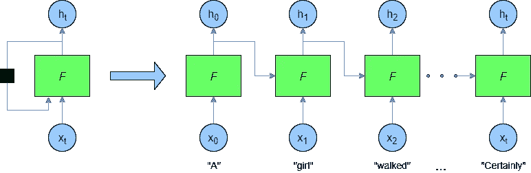

Source: [https://adventuresinmachinelearning.com/recurrent-neural-networks-lstm-tutorial-tensorflow/](https://adventuresinmachinelearning.com/recurrent-neural-networks-lstm-tutorial-tensorflow/)

这允许 LSTM 维护一个内部状态，当代理“记住”和“忘记”特定的数据关系时，该状态在每个时间步得到更新。

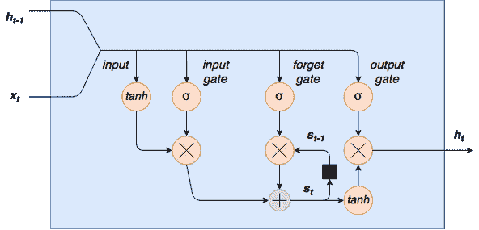

Source: [https://adventuresinmachinelearning.com/recurrent-neural-networks-lstm-tutorial-tensorflow/](https://adventuresinmachinelearning.com/recurrent-neural-networks-lstm-tutorial-tensorflow/)

Here we update our PPO2 model to use the MlpLstmPolicy, to take advantage of its recurrent nature.

## 平稳数据

我在上一篇文章中还指出，我们的时间序列数据不是[稳定的](https://www.analyticsvidhya.com/blog/2018/09/non-stationary-time-series-python/)，因此，任何机器学习模型都将很难预测未来的值。

> 平稳时间序列的均值、方差和自相关(与自身的滞后相关)是恒定的。

底线是，我们的时间序列包含一个明显的趋势和季节性，这两个影响我们的算法准确预测时间序列的能力。我们可以通过使用差分和转换技术从现有的时间序列中产生一个更正态的分布来解决这个问题。

差分是从每个时间步长的值中减去该时间步长的导数(回报率)的过程。在我们的例子中，这有消除趋势的预期结果，但是，数据仍然有明显的季节性。我们可以尝试通过在差分前对每个时间步长取对数来消除这种影响，这将产生最终的**平稳**时间序列，如下图右侧所示。

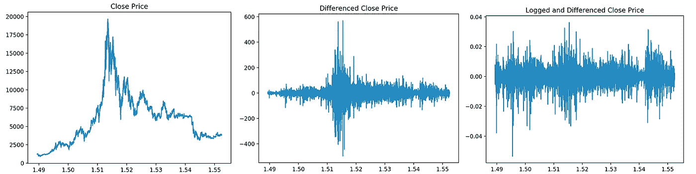

我们可以通过运行一个[增强的 Dickey-Fuller 测试](https://en.wikipedia.org/wiki/Augmented_Dickey%E2%80%93Fuller_test)来验证产生的时间序列是平稳的。这样做得到的 p 值为 0.00，允许我们拒绝测试的零假设，并确认我们的时间序列是平稳的。

Here we run the Augmented Dicker-Fuller Test on our transformed data set to ensure stationarity.

现在我们已经解决了这个问题，我们将使用一点特征工程来进一步更新我们的观察空间。

# 特征工程

为了进一步改进我们的模型，我们将做一些功能工程。

> **特征工程**是使用特定领域的知识来创建**额外输入数据**以改进机器学习模型的过程。

在我们的案例中，我们将向我们的数据集添加一些常见但有见地的技术指标，以及来自 [StatsModels SARIMAX](https://www.statsmodels.org/dev/generated/statsmodels.tsa.statespace.sarimax.SARIMAX.html) 预测模型的输出。技术指标应该向我们的数据集添加一些相关的滞后信息，这将由我们的预测模型的预测数据很好地补充。这些特性的组合应该为我们的模型提供一个很好的有用观察的平衡。

## 技术分析

为了选择我们的技术指标集，我们将比较`[ta](https://github.com/bukosabino/ta)` [库](https://github.com/bukosabino/ta)中所有 32 个指标(58 个特征)的相关性。我们可以使用`pandas`找到同一类型(动量、成交量、趋势、波动)的每个指标之间的相关性，然后从每个类型中只选择相关性最小的指标作为特征。这样，我们可以从这些技术指标中获得尽可能多的好处，而不会给我们的观察空间增加太多的噪音。

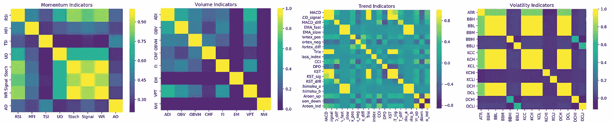

Seaborn heatmap of technical indicator correlation on BTC data set.

事实证明，波动率指标和一些动量指标都是高度相关的。当我们移除所有重复的特征(在它们的组内具有绝对平均相关性> 0.5 的特征)时，我们剩下 38 个技术特征添加到我们的观察空间。这是完美的，所以我们将创建一个名为`add_indicators`的实用方法来将这些特征添加到我们的数据框中，并在我们的环境初始化中调用它，以避免必须在每个时间步长上计算这些值。

Here we initialize our environment, adding the indicators to our data frame before making it stationary.

## 统计分析

接下来我们需要添加我们的预测模型。我们选择使用季节性自回归综合移动平均(SARIMA)模型来提供价格预测，因为它可以在每一步快速计算，并且在我们的静态数据集上相当准确。另外，它实现起来非常简单，并且允许我们为它的未来预测创建一个置信区间，这通常比单个值更有洞察力。例如，当置信区间很小时，我们的主体可以学习更加谨慎地相信预测，而当置信区间很大时，我们的主体可以学习冒更大的风险。

Here we add the SARIMAX predictions and confidence intervals to our observation space.

既然我们已经更新了政策，使用了更适用的循环网络，并通过上下文特征工程改善了我们的观察空间，现在是优化所有事情的时候了。

# 奖励优化

有人可能会认为我们上一篇文章中的奖励函数(即奖励增加的净值收益)是我们所能做到的最好的，然而，进一步的研究表明这与事实相差甚远。虽然我们上次的简单回报函数能够盈利，但它产生了不稳定的策略，经常导致资本的巨大损失。为了改善这一点，除了简单的未实现利润之外，我们还需要考虑其他奖励指标。

正如 Sean O'Gordman 在我上一篇文章的评论中提到的，对这个策略的一个简单的改进是，不仅在价格上涨时奖励持有 BTC 的利润，而且在价格下跌时奖励不持有 BTC 的利润。例如，当我们的代理持有 BTC/美元头寸时，我们可以对其净值的任何增量*增加*进行奖励，而当其不持有任何头寸时，我们可以对其 BTC/美元价值的增量*减少*进行奖励。

虽然这种策略在奖励增加的回报方面很棒，但它没有考虑到产生这些高回报的风险。投资者早就发现了简单利润指标的这一缺陷，传统上转向风险调整后的回报指标来解释这一缺陷。

## 基于波动性的指标

最常见的风险调整回报指标是夏普比率。这是一个简单的投资组合的超额收益与波动性的比率，在一段特定的时间内测量。为了保持高夏普比率，投资必须同时具有高回报和低波动性(即风险)。其数学原理如下:

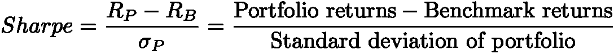

这一指标经受住了时间的考验，然而它对我们的目的来说也是有缺陷的，因为它惩罚了上行波动。对于比特币来说，这可能会有问题，因为参与上行波动(价格大幅上涨)通常会非常有利可图。这就引出了我们将与代理一起测试的第一个奖励指标。

索蒂诺比率与夏普比率非常相似，只是它只将下行波动视为风险，而不是整体波动。因此，这一比率不会对上行波动造成不利影响。数学是这样的:

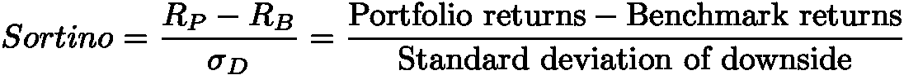

## 其他指标

我们将在该数据集上测试的第二个奖励指标是 Calmar 比率。到目前为止，我们的所有指标都没有考虑到*的缩减*。

> 提取是衡量投资组合价值从高峰到低谷的具体损失。

大额提款可能不利于成功的交易策略，因为长期的高回报可能会被突然的大额提款迅速逆转。

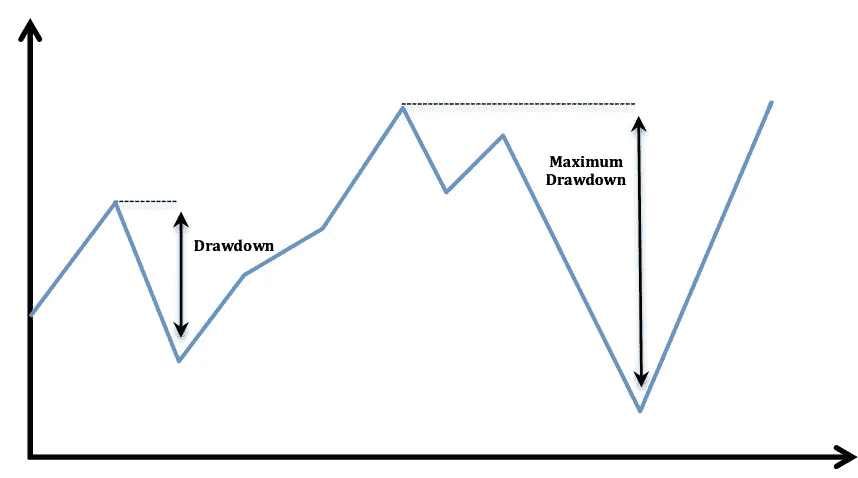

为了鼓励积极防止大规模提款的策略，我们可以使用专门说明这些资本损失的奖励指标，如卡尔马比率。这个比率与夏普比率相同，除了它使用最大提款来代替投资组合价值的标准差。

我们的最后一个指标是欧米伽比率，在对冲基金行业被大量使用。理论上，在衡量风险与回报时，Omega 比率应优于 Sortino 和 Calmar 比率，因为它能够在单一指标中说明风险与回报分布的整体情况。要找到它，我们需要计算一个投资组合在特定基准之上或之下移动的概率分布，然后取两者之比。比率越高，上涨潜力超过下跌潜力的概率就越高。

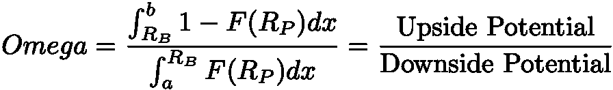

If this looks complicated, don’t worry. It get’s simpler in code.

## 代码

虽然为这些奖励指标中的每一个写代码听起来*真的* *有趣，但是*我选择使用`[empyrical](https://github.com/quantopian/empyrical)` [库](https://github.com/quantopian/empyrical)来计算它们。幸运的是，这个库恰好包含了我们上面定义的三个奖励标准。获取每个时间步长的比率非常简单，只需向相应的经验函数提供一段时间内的回报和基准回报列表。

Here we set the reward at each time step based on our pre-defined reward function

既然我们已经决定了如何衡量一个成功的交易策略，是时候找出这些指标中哪一个能产生最吸引人的结果了。让我们将这些奖励函数中的每一个都插入到 Optuna 中，并使用传统的贝叶斯优化来为我们的数据集找到最佳策略。

# 工具集

任何优秀的技术人员都需要一套优秀的工具。我们不会重新发明轮子，而是要利用我们之前的程序员的痛苦和折磨。对于今天的工作，我们最重要的工具将是`optuna`库，它使用[树结构 Parzen 估计器](https://papers.nips.cc/paper/4443-algorithms-for-hyper-parameter-optimization.pdf) (TPEs)实现贝叶斯优化。TPE 是可并行化的，这允许我们利用我们的 GPU，大大减少了我们的总搜索时间。简而言之，

> 贝叶斯优化是一种有效搜索超空间以找到最大化给定目标函数的参数集的技术。

简单来说，贝叶斯优化是改进任何黑盒模型的有效方法。它通过使用代理函数或代理函数的分布来建模您想要优化的目标函数。随着算法探索超空间和产生最大价值的区域，这种分布会随着时间而改善。

这如何适用于我们的比特币交易机器人？本质上，我们可以使用这种技术来找到使我们的模型最有利可图的一组超参数。我们正在大海捞针，贝叶斯优化是我们的磁铁。让我们开始吧。

## 实施 Optuna

用 Optuna 优化超参数相当简单。首先，我们需要创建一个`optuna`研究，它是我们所有超参数试验的父容器。*试验*包含超参数的特定配置及其从目标函数产生的成本。然后我们可以调用`study.optimize()`并传入我们的目标函数，Optuna 将使用贝叶斯优化来找到产生最低成本的超参数配置。

在这种情况下，我们的目标函数包括在我们的比特币交易环境中训练和测试我们的 PPO2 模型。我们从函数中返回的成本是测试期间的平均回报，被否定。我们需要否定平均回报，因为 Optuna 将较低的回报值解释为更好的试验。`optimize`函数为我们的目标函数提供了一个试验对象，然后我们用它来指定要优化的每个变量。

`optimize_ppo2()`和`optimize_envs()`方法接受一个试验对象并返回一个参数字典进行测试。[我们每个变量的搜索空间](https://optuna.readthedocs.io/en/stable/tutorial/configurations.html#defining-parameter-spaces)由我们在试验中调用的特定`suggest`函数定义，我们将参数传递给该函数。

例如，`trial.suggest_loguniform('n_steps', 16, 2048)`将以对数方式建议 16–2048 之间的新浮点数(16，32，64，…，1024，2048)。此外，`trial.suggest_uniform('cliprange’, 0.1, 0.4)`将以一种简单的、相加的方式建议浮点数(0.1，0.2，0.3，0.4)。我们在这里不使用它，但是 Optuna 也提供了一个建议分类变量的方法:`suggest_categorical('categorical', ['option_one', ‘option_two'])`。

稍后，在使用合适的 CPU/GPU 组合运行我们的优化功能一夜之后，我们可以从我们告诉 Optuna 创建的 sqlite 数据库中加载研究。这项研究跟踪其测试中的最佳试验，我们可以用它来获取我们环境的最佳超参数集。

我们修改了我们的模型，改进了我们的功能集，优化了我们所有的超参数。现在是时候看看我们的代理商如何使用他们的新奖励机制了。我已经训练了一个代理人来优化我们的四个回报指标:简单利润、索提诺比率、卡尔马尔比率和奥米加比率。让我们在一个测试环境中运行每一个优化的代理，这个测试环境是用它们没有被训练过的价格数据初始化的，看看它们是否有利可图。

# 标杆管理

在我们看结果之前，我们需要知道成功的交易策略是什么样的。对于这种叛逆，我们将参照几个常见但有效的交易比特币获利的策略。信不信由你，在过去的十年里，交易 BTC 最有效的策略之一就是买入并持有。我们将要测试的另外两个策略使用非常简单，但是有效的技术分析来产生买入和卖出信号。

1.  买入并持有

> 这个想法是尽可能多的购买，并尽最大努力持有(HODL)。虽然这种策略并不特别复杂，但它在过去取得了很高的成功率。

2.RSI 背离

> 当连续收盘价随着 RSI 继续下降而继续上涨时，这是一个负面趋势反转(卖出)的信号。当收盘价随着 RSI 连续上升而连续下跌时，表明趋势正反转(买入)。

3.简单移动平均线交叉

> 当长期的 SMA 在短期的 SMA 上面交叉时，一个负面的趋势反转(卖出)信号被发出。当短期的 SMA 在长期的 SMA 上面交叉时，一个积极的趋势反转(买入)被发出信号。

根据这些简单的基准测试的目的是证明我们的 RL 代理实际上在市场上创造 alpha。如果我们不能击败这些简单的基准测试，那么我们就是在浪费无数小时的开发时间和 GPU 周期，只是为了做一个很酷的科学项目。让我们证明事实并非如此。

# 结果呢

> 我必须在这一节之前声明，这一节中的正利润是错误代码的直接结果。由于当时的日期排序方式，代理商可以随时提前 12 小时看到价格，这是一种明显的前瞻偏差。这个问题已经得到了解决，尽管还没有投入时间来替换下面的每个结果集。请理解，这些结果是完全无效的，极不可能被复制。
> 
> 也就是说，仍然有大量的研究进入了这篇文章，目的从来不是为了赚大量的钱，而是为了看看当前最先进的强化学习和优化技术有什么可能。因此，为了让这篇文章尽可能地接近原文，我将把旧的(无效的)结果留在这里，直到我有时间用新的、有效的结果来替换它们。

代理在数据集的前 80%接受训练(来自 [CryptoDataDownload](https://www.cryptodatadownload.com/data/northamerican/) 的每小时 OHCLV 数据)，并在最后 20%接受测试，以查看策略如何推广到新数据。这种简单的交叉验证足以满足我们的需求，因为当我们最终将这些算法发布到野外时，我们可以在整个数据集上进行训练，并将新的输入数据视为新的测试集。

让我们快速浏览失败者，这样我们就能得到好的东西。首先，我们有欧米茄策略，这最终是对我们的数据集相当无用的交易。

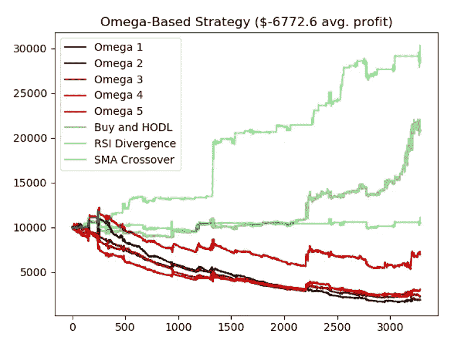

Average net worth of Omega-based agents over 3500 hours of trading

观察这个代理交易，很明显这个奖励机制产生了过度交易的策略，并且不能利用市场机会。

基于 Calmar 的策略比基于 Omega 的策略稍有改进，但最终结果非常相似。看起来我们已经投入了大量的时间和精力，只是为了让事情变得更糟…

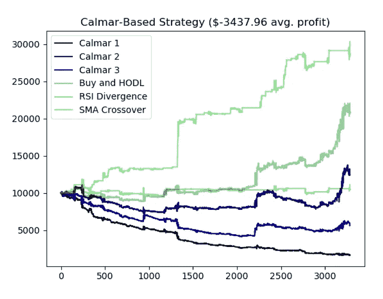

Average net worth of Calmar-based agents over 3500 hours of trading

还记得我们的老朋友，简单的增量利润吗？虽然在我们的上一篇文章中，这种奖励机制并不太成功，但我们所做的所有修改和优化似乎都极大地提高了代理的成功率。

在我们四个月的测试期内，平均利润刚刚超过初始账户余额的 350% 。如果你不知道平均市场回报，这种结果绝对是疯狂的。当然，这是我们在强化学习中所能做到的最好的了…对吗？

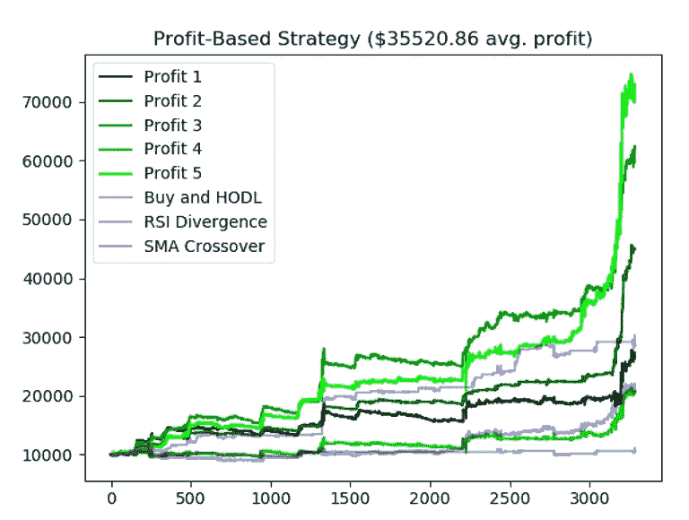

Average net worth of Profit-based agents over 3500 hours of trading

不对。按排序比例奖励的代理商产生的平均利润接近 **850%** 。当我看到这些策略的成功时，我必须快速检查以确保没有错误。编者注:准备好接受下面这句话的讽刺吧。]经过彻底检查后，很明显代码没有错误，这些代理只是非常擅长交易比特币。

Average net worth of Sortino-based agents over 3500 hours of trading

这些代理人没有过度交易和资金不足，而是似乎明白低买高卖的重要性，同时将持有 BTC 的风险降至最低。不管代理人学会了什么具体策略，我们的交易机器人显然已经学会了交易比特币并从中获利。如果你不相信我，你自己看吧。

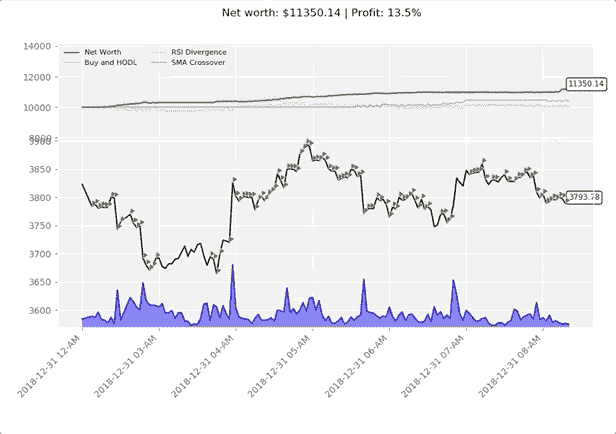

One of the Sortino-based agents trading BTC/USD. Green triangles signal buys, red triangles signal sells.

我不是傻瓜。我明白，这些测试的成功可能[阅读:不会]推广到现场交易。也就是说，这些结果远比我迄今为止见过的任何算法交易策略都令人印象深刻(这应该是出了问题的第一个线索……)。考虑到这些代理人事先不知道市场如何运作或如何盈利交易，而是通过反复试验(以及一些良好的前瞻性偏见)学会了获得巨大成功，这确实令人惊讶。很多很多的尝试和错误。

# 结论

在这篇文章中，我们优化了我们的强化学习代理，以便在交易比特币时做出更好的决策，从而赚更多的钱！这需要做相当多的工作，但我们通过以下方式成功完成了这项工作:

*   升级现有模型，使用具有固定数据的循环 LSTM 政策网络
*   工程师使用特定领域的技术和统计分析为代理学习 40 多项新功能
*   改善代理人的报酬系统，考虑风险，而不是简单的利润
*   使用贝叶斯优化微调模型的超参数
*   以普通交易策略为基准，确保机器人总是跑赢市场

理论上，高利润的交易机器人是伟大的。然而，我收到了相当多的反馈，声称这些代理人只是在学习拟合曲线，因此，在实时数据上交易永远不会盈利。虽然我们在独立数据集上训练/测试的方法应该可以解决这个问题，但是我们的模型*可能*过度适合这个数据集，而*可能*不能很好地推广到新数据。也就是说，我有一种感觉，这些代理正在学习的不仅仅是简单的曲线拟合，因此，他们将能够在实时交易中获利。

为了对这一假设进行实验，在社区的帮助下，我建立了一个成熟的强化学习框架，用于交易股票、外汇、加密货币和任何其他带有 API 的金融工具。下面来看看吧。

 [## 更明智地交易和投资——强化学习方式

### 深入探讨 TensorTrade——一个用于培训、评估和部署稳健交易的开源 Python 框架…

towardsdatascience.com](/trade-smarter-w-reinforcement-learning-a5e91163f315) 

作为一个题外话，仍然有很多事情可以做，以提高这些代理的性能，但是我只有这么多时间，我已经在这篇文章上工作了太长时间，不能再推迟发布了。如果你感兴趣，拿着我做的和[去改进它吧！如果你能击败我的结果，把你得到的发给我，我们谈谈。](https://github.com/notadamking/Bitcoin-Trader-RL)

*重要的是要明白，本文中记录的所有研究都是出于教育目的，不应作为交易建议。你不应该根据本文定义的任何算法或策略进行交易，因为你很可能会失去你的投资。*

*感谢阅读！一如既往，本教程的所有代码都可以在我的* [*GitHub*](https://github.com/notadamking/RLTrader) *上找到。如果您有任何问题或反馈，请在下面留下评论，我很乐意收到您的来信！我也可以通过@notadamking 上的*[*Twitter*](https://twitter.com/notadamking)*联系到。*

*你也可以通过下面的链接在* [*Github 赞助商*](https://github.com/users/notadamking/sponsorship) *或者*[*Patreon*](https://www.patreon.com/join/notadamking)*上赞助我。*

 [## GitHub 赞助商

### 嗨，我是亚当。我是一名开发人员、作家和企业家，尤其对深度…

github.com](https://github.com/users/notadamking/sponsorship) 

> Github 赞助商目前正在 1:1 匹配所有捐款，最高可达 5000 美元！

 [## 亚当·金正在创造改变世界的内容

### 嗨，我是亚当。我是一名开发人员、作家和企业家，尤其对深度…

patreon.com](https://patreon.com/notadamking) 

## 资源

[1.][《Python 和 TensorFlow 中的递归神经网络和 LSTM 教程》*机器学习历险记*，2017 年 10 月 9 日。](https://adventuresinmachinelearning.com/recurrent-neural-networks-lstm-tutorial-tensorflow/)

[2.] [“用 Python 进行时间序列预测的 SARIMA 简介。”*机器学习掌握*，2019 年 5 月 12 日。](https://machinelearningmastery.com/sarima-for-time-series-forecasting-in-python/)

[3.】[辛格，艾西瓦娅。"用 Python 处理非平稳时间序列的简明介绍."*分析 Vidhya* ，2019 年 5 月 7 日。](https://www.analyticsvidhya.com/blog/2018/09/non-stationary-time-series-python/)

[4.] [“超参数优化算法”神经信息处理系统进展 24 (NIPS 2011)，2011。](https://papers.nips.cc/paper/4443-algorithms-for-hyper-parameter-optimization.pdf)

[5.] [普拉多马科斯洛佩斯德。*金融机器学习的进展*。威利，2018。](https://www.amazon.com/gp/product/1119482089/ref=as_li_tl?ie=UTF8&camp=1789&creative=9325&creativeASIN=1119482089&linkCode=as2&tag=notadamking-20&linkId=79754cdeac011b4af5c86464638f82f6)