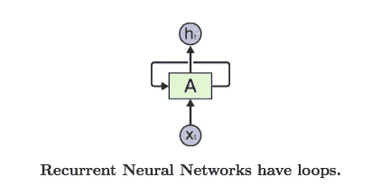
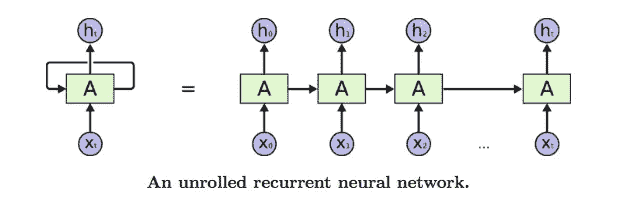
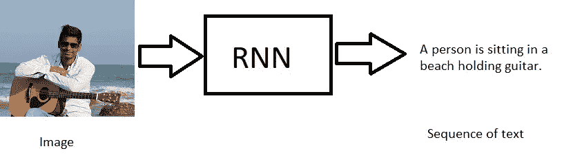
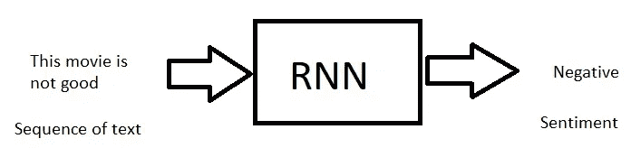
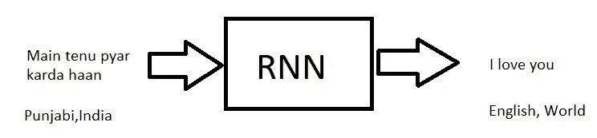
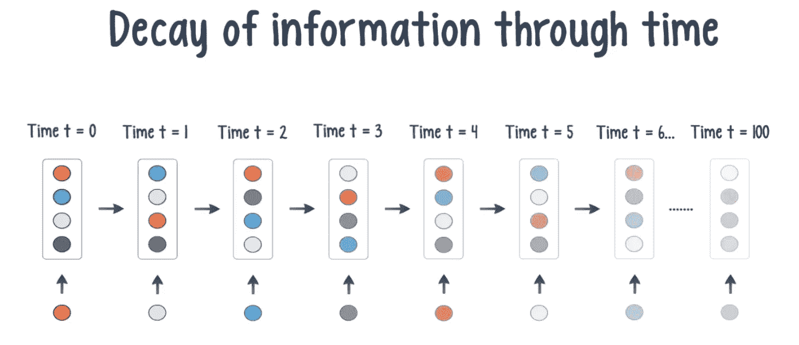

# 使用 RNNs 进行机器翻译

> 原文：<https://towardsdatascience.com/using-rnns-for-machine-translation-11ddded78ddf?source=collection_archive---------8----------------------->

Photo by [Atharva Tulsi](https://unsplash.com/@atharva_tulsi) on [Unsplash](https://unsplash.com/photos/eQ7j390QAEs)

## 介绍 RNN 和 LSTM 网络及其应用。

故事是人类文化的精髓。它们包含了我们过去的信息和未来的理论。它们让我们能够深入人类思维的内部运作和微妙之处，发现传统上不可能分析的方面。

虽然过去故事总是由我们人类撰写，但随着深度学习领域的发展和研究，我们看到计算机程序能够编写故事，并像人类一样使用语言，但如何做到呢？

当你读最后两段时，你对每个单词的理解都是基于前面的句子和单词。你用以前的数据来理解现在的数据。传统的神经网络会查看循环中的每个单词，并且只理解每个单词的字面意思，而不考虑其上下文或之前可能添加了信息的任何单词。这使得它们在试图理解上下文(和过去的信息)重要的信息时非常糟糕。那么我们如何解决这个问题呢？

# 递归神经网络

RNNs 是一种特殊类型的神经网络，具有**循环**，允许信息在网络的不同步骤中保持不变。

该循环使神经网络在决定当前单词的实际意思之前，返回并检查所有先前单词中发生的事情。RNN 可以被认为是一次又一次地复制粘贴同一个网络，每一次新的复制粘贴都会比前一次添加更多的信息。

RNN 神经网络的应用与传统神经网络有很大的不同，因为它们没有一个输出和输入集作为一个具体的值，相反，它们把序列作为输入或输出。

**那么我们可以用 RNNs 做什么呢？**

*   自然语言处理
*   股票市场数据(时间序列分析)
*   图像/视频字幕
*   翻译
*   还有更多

## RNN 也有不同的模式可以效仿。

1.  **固定到序列**

RNN 接受固定大小的输入，并输出一个序列。

Image captioning takes an image and outputs a sentence of words

2.**序列到固定**

RNN 接受一个输入序列并输出一个固定的大小。

Sentiment analysis where a given sentence is classified as expressing positive or negative sentiment

3.**序列到序列**

RNN 接收一个输入序列并输出一个序列。

Machine Translation: an RNN reads a sentence in one language and then outputs it in another

这应该有助于你对 RNNs 有一个高层次的理解，如果你想了解更多关于 RNN 运算背后的数学知识，我推荐你查看这个[链接](https://www.cs.toronto.edu/~tingwuwang/rnn_tutorial.pdf)！

# 消失梯度问题

这个问题发生在任何使用基于梯度的优化技术的网络中。当计算反向传播时(计算相对于权重的损失梯度)，随着反向传播算法在网络中移动，梯度变得非常小。这导致早期层的学习速度比后期层慢。这降低了 rnn 的有效性，因为它们通常不能完全考虑长序列。随着所需信息之间的差距越来越大，RNN 变得越来越低效。

现在，这个问题的一个常见解决方案是使用不会导致渐变消失的激活函数，如 RELU，而不是其他激活函数，如 sigmoid 或双曲线正切。一个更好的解决方法是使用长短期记忆网络！

# 长短期记忆

LSTM 网络的建立只有一个目的——解决传统无线网络的长期依赖性问题。记住很久以前的事情是他们与生俱来的天性，他们根本不会为此而挣扎。

The repeating module in an LSTM contains 4 layers, as opposed to only one in an RNN.

LSTMs 工作良好的原因主要是由于网络中存在的小区状态。这是您在图中看到的穿过网络顶部的线。信息很容易在细胞状态中流动而不会改变。连接到单元状态的门能够在需要时添加或删除信息。有一堆更复杂的数学材料，你可以在这里阅读更多关于[的内容](http://colah.github.io/posts/2015-08-Understanding-LSTMs/)，但总的来说，LSTMs 真的很擅长记忆旧信息。

# 神经机器翻译

既然我们对 LSTMs 和 RNNs 有了基本的了解，让我们试着用 Keras 开发一个机器翻译模型。

这将演示一个序列到序列 LSTM 网络如何被用来将文本从英语翻译成法语。数据可以在[这里](http://www.manythings.org/anki/fra-eng.zip)找到。

我们从 Keras 导入 LSTM 层，并在这里设置几个重要的变量。

现在我们需要**将**我们的文本矢量化成数字格式，这使得神经网络更容易处理。你可以在这里阅读更多关于这是如何工作的[。](https://medium.com/@paritosh_30025/natural-language-processing-text-data-vectorization-af2520529cf7)

现在我们需要创建我们的模型。因为这是一个序列到序列模型，我们需要两个部分——编码器和解码器。编码器抛出一个隐藏状态，它包含了作为输入获得的所有信息。然后，解码器获取这些信息，然后生成指定格式的输出(在本例中是法语)。

在这之后，就像训练模型和使用它一样简单。所有代码的详细回顾可以在[这里](https://github.com/keras-team/keras/blob/master/examples/lstm_seq2seq.py)找到。在我的[网站](https://aryanmisra.com/translate/)上查看现场演示。

## TL；速度三角形定位法(dead reckoning)

RNNs 和 LSTM 网络今天正在提供非常酷的用例，我们看到它在大量技术中得到应用。

递归神经网络不同于传统的人工神经网络，因为它们不需要固定的输入/输出大小，并且它们还使用以前的数据来进行预测。

LSTM 网络是专门为解决 rnn 中的长期依赖性问题而制造的，并且它们超级擅长通过使用小区状态来利用来自前一段时间的数据(这是其本质所固有的)。

**如果你喜欢我的文章或者学到了新东西，请务必:**

*   在 [LinkedIn](https://www.linkedin.com/in/aryan-misra/) 上和我联系。
*   给我发一些反馈和评论(aryanmisra@outlook.com)。
*   在我的网站上查看现场演示:[https://aryanmisra.com/translate/](https://aryanmisra.com/translate/)