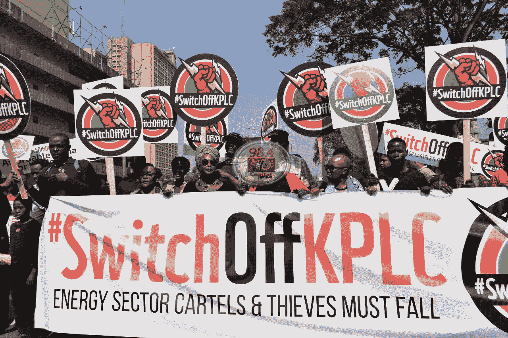
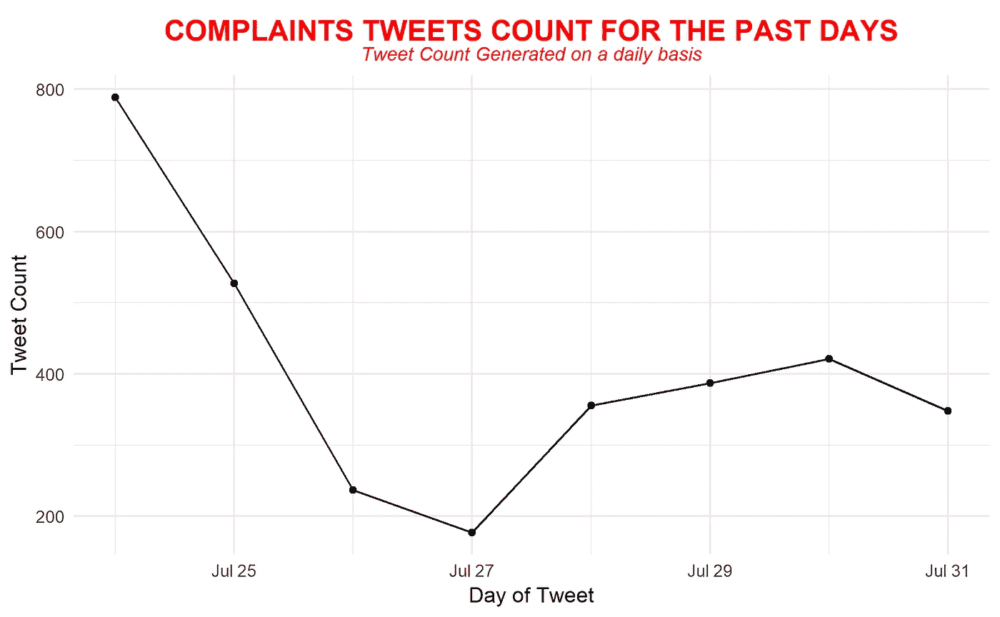
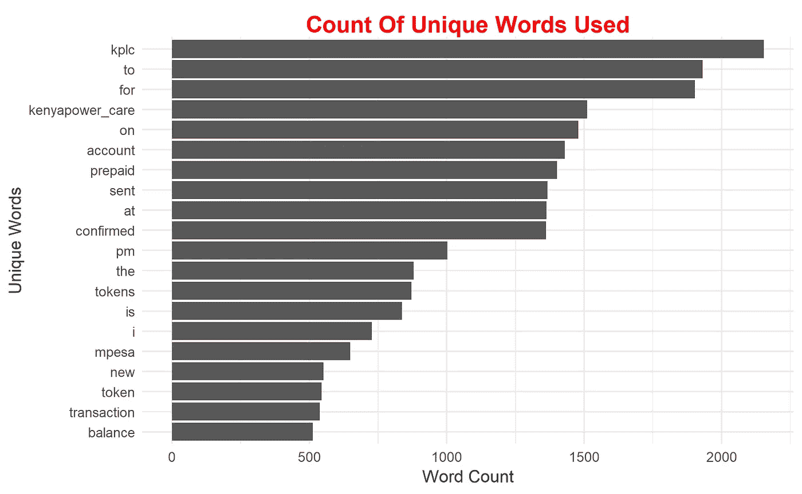
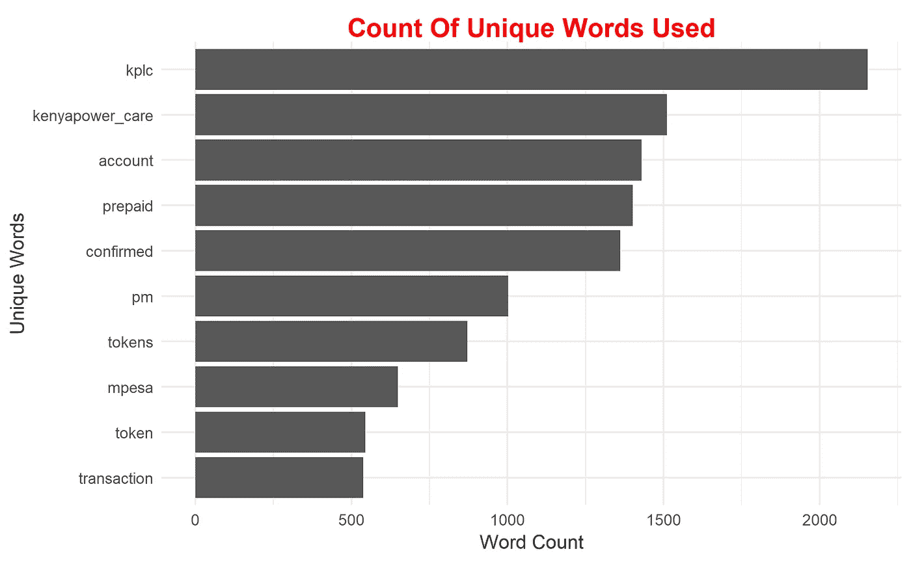
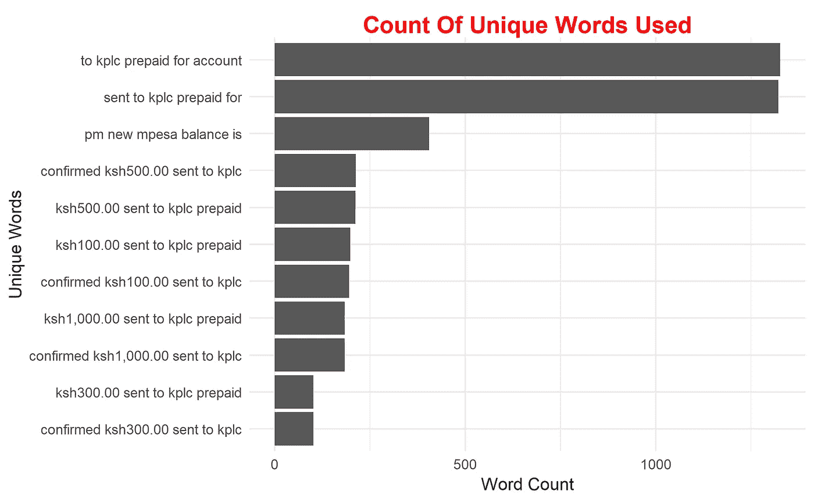
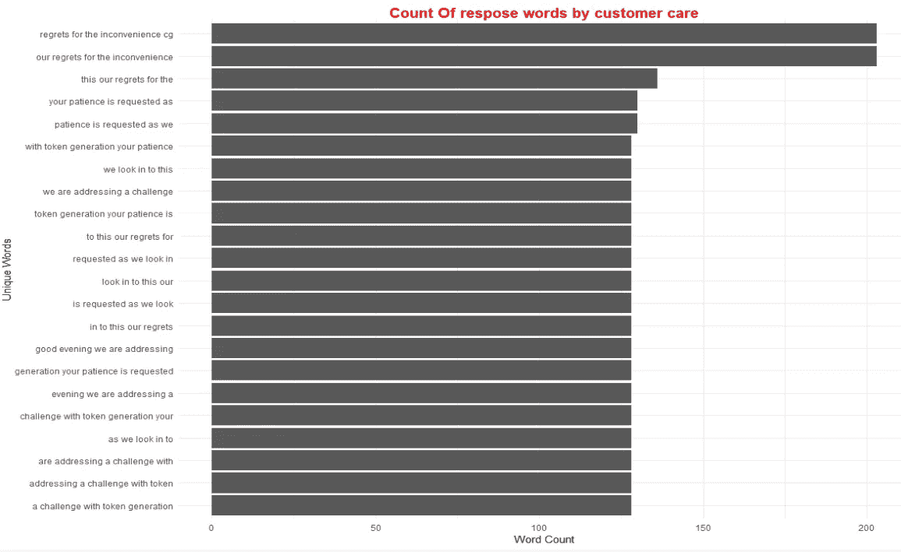

# 使用 Rtweet R package 与肯尼亚电力和照明公司(KPLC)一起分析肯尼亚人的困境。

> 原文：<https://towardsdatascience.com/using-rtweet-r-package-to-analyze-the-plight-of-kenyans-with-the-kenya-power-lighting-77f6b1cd4bce?source=collection_archive---------35----------------------->



Kenyans on the streets demonstrating against KPLC.

**引言。**

肯尼亚电力和照明公司(KPLC)向肯尼亚各地的客户输送、分配和零售电力。它是服务的唯一提供者。

在过去的几周里，肯尼亚人在推特上表达了他们对公用事业公司糟糕的服务的不满。KPLC 意识到了困境，但正在花时间解决这个问题。

在本文中，我们将使用 [Rtweet](https://rtweet.info/) 包来收集和分析针对 KPLC 的 twitter 投诉，并更好地了解肯尼亚人在使用 KPLC 服务时所面临的问题。

**入门。**

我们必须建立一个 twitter 账户(如果你没有的话)。

使用这个帐户，我们将建立一个应用程序，能够使用 r 访问 twitter。

关于在 twitter 中设置应用程序以访问推文的全面指南，请阅读[使用您的 twitter 帐户设置 twitter 应用程序中的指南。](https://cran.r-project.org/web/packages/rtweet/vignettes/auth.html)

我们将使用 ***rtweet、*******tidy text***和***tidy verse****软件包，并使用以下命令安装它们:**

```
***Install.packages(c(“rtweet”,”tidytext”,”tidyverse”))***
```

**然后，我们将使用以下命令加载库:**

```
*****#loading required libraries*** *library(rtweet)
library(tidyverse)
library(tidytext)***
```

**在推特上搜索对 KPLC 的投诉。**

**让我们首先找到所有带有 KPLC 标签的推文。我们将使用带有以下参数的***search _ tweets()***函数:**

**问 —这是我们要寻找的查询词。**

****n** —我们希望返回的推文数量。twitter 设定的最大限额是 18000 条推文。**

****Include_rts()** —如果我们想要包含共享的推文(retweets)，我们将它设置为 TRUE，否则我们使用 FALSE。**

**郎:我们将只过滤那些英文推文。**

```
****#collecting tweets**kplc<-search_tweets(q=”KPLC”,n=15000,lang=”en”,include_rts = FALSE)**
```

****策划推文。****

**下图显示了从 7 月 24 日到 7 月 31 日每天生成的推文的时间序列。大多数推文都是在 7 月 24 日生成的，有趣的是，这一天正是示威游行在街头举行的日子。**

```
****#plot time series of the tweets**
kplc %>% ts_plot(by="days",trim = 1L)+
          geom_point()+
          theme_minimal()+
          theme(plot.title = element_text(size=15, hjust=0.5, face="bold", colour="red", vjust=-1),
                 plot.subtitle=element_text(size=10, hjust=0.5, face="italic", color="red"))+
          labs(x="Day of Tweet",y="Tweet Count",title = "COMPLAINTS TWEETS COUNTS FOR THE PAST DAYS",
               subtitle = "Tweet Count Generated on a daily basis")**
```

****

**Tweet counts per day by the KPLC customers**

****清洁&分析客户投诉推文。****

**我们将分析推特上使用的文本，以理解肯尼亚人对公用事业公司的困境。**

```
****#preview of the text elements**
head(kplc$text)
[1] "[@KenyaPower_Care](http://twitter.com/KenyaPower_Care) Dear Kenya Power. It's been 5months since our power was disconnected ostensibly to investigate unlawful connection of power by an individual living among us in Utawala. We have made countless trips to KPLC offices to pursue this matter in vain. This darkness is a security threat."
[2] "[@KenyaPower_Care](http://twitter.com/KenyaPower_Care) Dear Kenya Power. It's been 5months since our power was disconnected ostensibly to investigate unlawful connection of power by an individual living among us in Utawala. We have made countless trips to KPLC offices to pursue this matter in vain. This darkness is a security threat."                 
[3] "[@KenyaPower_Care](http://twitter.com/KenyaPower_Care) [@kot](http://twitter.com/kot) [@citizentvkenya](http://twitter.com/citizentvkenya) how long do one  need to visit kplc office for your matter to be solved?\n#kplcmonoply should stop"** 
```

**在进行分析时，URL 并不重要，我们将通过以下命令消除它们:**

```
****#removing http element**
kplc$text<-gsub("http.*","",kplc$text)**
```

**然后我们将使用 tidytext 包中的 ***unnest_tokens()*** 函数来神奇地清理文本。该函数清除以下内容:**

**与文本相关的所有标点符号(逗号、句号)都将被删除。**

**添加与每个 tweeted 单词的出现相关联的唯一 id。**

**推文被转换成小写。**

**我们创建一个新的变量*单词*来保存清理后的文本。**

```
****#remove punctuation, convert to lowercase, add id for each** tweettext_clean<-kplc %>% select(text) %>% unnest_tokens(word,text)**
```

**然后，我们将按照出现的顺序对前 20 个单词进行排序，并绘制结果。**

```
****#plotting the top 20 words in the tweets**text_clean %>% count(word,sort = TRUE) %>%top_n(20) %>%mutate(word=reorder(word,n)) %>%ggplot(aes(x=word,y=n))+geom_col()+coord_flip()+theme_minimal()+theme(plot.title = element_text(size=15, hjust=0.5, face="bold", colour="red", vjust=-1))+labs(x="Unique Words",y="Word Count",title="Count Of Unique Words Used")**
```

****

**Unique words used in the complaints tweets**

**从我们的情节来看，有些独特的词，如 to、From、on、at，对我们的分析来说并不重要。这些字是 ***停止字*** ，我们将使用 ***anti_join()*** 命令删除它们。**

```
****#removing stop words**
kplc_clean<-text_clean %>% anti_join(stop_words)**
```

**然后，我们只过滤推文中使用的前 10 个词，然后绘制结果。**

```
****#plotting top 10 words**
kplc_clean %>% count(word,sort = TRUE) %>%
  top_n(10) %>%
  mutate(word=reorder(word,n)) %>%
  ggplot(aes(x=word,y=n))+
  geom_col()+
  coord_flip()+
  theme_minimal()+
  theme(plot.title = element_text(size=15, hjust=0.5, face="bold", colour="red", vjust=-1))+
  labs(x="Unique Words",y="Word Count",
      title="Count Of Unique Words Used")**
```

****

**Top unique words used in the text**

****结果。****

**Kenyapower_care 是公用事业公司的客户关怀 twitter 句柄，因此大多数投诉都引用该句柄，同时在 Twitter 上发布他们的问题。**

*****账户、预付费、已确认、mpesa、transcation、余额*** 都是向 KPLC 某预付费账户的移动资金转账报文。大多数发推的客户都有他们预付 KPLC 账户的问题，希望服务提供商解决这个问题。**

**探索一起出现的单词。**

**我们希望通过探索一起出现的单词来对文本做进一步的分析，以获得更多的见解。**

**我们将使用 ***widyr*** 软件包进行分析。**

```
*****#loading package***
library(widyr)**
```

**我们将使用***unnest _ token()***函数对文本进行清理，并保存在一个名为 ***paired_words*** 的变量中。 ***ngrams*** 指定单词是成对的， ***n*** 是单词在一起的个数。**

**我们对一起使用的前 10 个单词进行排序，然后输出一个图。**

```
*****#exploring words that occur together***
library(widyr)
kpl_pairs<-kplc %>% select(text) %>% unnest_tokens(paired_words,text,token = "ngrams",n=5)kpl_pairs %>% count(paired_words,sort = TRUE) %>% top_n(10) %>%
   mutate(paired_words=reorder(paired_words,n)) %>%
  ggplot(aes(x=paired_words,y=n))+
  geom_col()+
  coord_flip()+
  theme_minimal()+
  theme(plot.title = element_text(size=15, hjust=0.5, face="bold", colour="red", vjust=-1))+
  labs(x="Unique Words",y="Word Count",
      title="Count Of Unique Words Used")**
```

****

**Exploring words used together in the tweets**

**为预付 KPLC 账户发送的大部分移动货币(M-Pesa)金额在 ***【凯斯 500】******凯斯 1000******凯斯 100*** 和 ***凯斯 300*** 的维度中。**

****分析 KPLC 对投诉的回应。****

**在这个分析中，我们将分析公用事业公司 customer care 如何回应 twitter 投诉。**

**我们将使用***get _ timeline()***函数来获取客户关怀 twitter 句柄专门发送的推文数量(n)。**

```
*****# obtaining customer care response tweets***
kplc_timeline<-get_timeline("KenyaPower_Care",n=10000)**
```

**我们将清理后的文本保存在变量 care_response 中，然后绘制输出。**

****

**Response by Kenya power customer care**

**KPLC 客户服务部无法立即解决该问题，并要求客户在处理令牌生成问题时保持耐心。**

****结论。****

**我们从 twitter 文本分析中获得了关于肯尼亚人与公用事业公司 KPLC 的困境的宝贵见解。**

**有关收集和分析 Twitter 数据的更多指导，您可以查看以下链接:**

**https://mkearney.github.io/nicar_tworkshop/#1**

**[](https://www.earthdatascience.org/courses/earth-analytics/get-data-using-apis/text-mining-twitter-data-intro-r/) [## 用 R 中的 TidyText 挖掘 Twitter 数据

### 完成本教程后，您将能够:清理或“管理”社交媒体数据，为分析做准备。使用…

www.earthdatascience.org](https://www.earthdatascience.org/courses/earth-analytics/get-data-using-apis/text-mining-twitter-data-intro-r/) [](https://medium.com/@wanjirumaggie45/the-power-of-social-media-analytics-twitter-text-mining-using-r-1fceb26ac32b) [## 社交媒体分析的力量:使用 R

### 介绍

medium.com](https://medium.com/@wanjirumaggie45/the-power-of-social-media-analytics-twitter-text-mining-using-r-1fceb26ac32b) 

欢迎喜欢、评论和分享这篇文章。更多讨论，你可以通过 [Linkedln](https://www.linkedin.com/in/brianmwangi/) 或 [twitter 联系我。](https://twitter.com/itsbrianmwangi)**