# 使用 Spark 预测客户流失

> 原文：<https://towardsdatascience.com/using-spark-to-predict-churn-c69e675272bf?source=collection_archive---------30----------------------->


Image by author

在面向客户的业务中，预测客户流失是一个具有挑战性且常见的问题。由于预测通常是根据大量的用户活动日志做出的，我们需要一种分布式的方法来有效地处理大型数据集，而不必一次将它放入我们的内存中。

该项目将探索如何使用 Spark 建立客户流失预测模型，包括以下步骤:

*   探索和操作我们的数据集
*   为我们的问题设计相关功能
*   通过抽样流失将数据分为训练集和测试集
*   使用 [Spark 的基于数据帧的 MLlib](https://spark.apache.org/docs/latest/ml-guide.html) 构建二进制分类器模型
*   使用 [Spark 的 ML 管道](https://spark.apache.org/docs/latest/ml-pipeline.html)和[stratifiedcrossfvalidator](https://github.com/interviewstreet/spark-stratifier)选择并微调最终模型

# 关于数据集

我们将使用名为 Sparkify 的音乐流媒体服务的用户事件日志(持续时间约为 2 个月)作为我们的数据集。通过这些日志，我们可以预测该用户是更有可能留下来还是更有可能流失。

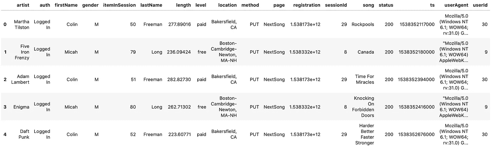

A log(row) will be appended whenever a user interacts with the service: play the next song, add a song to playlist, thumb up/down a song, etc.

这里，我们仅使用一个数据子集(128MB)来训练我们的带有本地 Spark 的流失预测模型。为了使用完整数据集(12GB)进行模型训练，您可能需要在云服务上部署一个集群。

# 加载和清理数据

## 加载数据

```
user_log = spark.read.json('mini_sparkify_event_data.json')
user_log.count()
# 286500
user_log.printSchema()
# root
 |-- artist: string (nullable = true)
 |-- auth: string (nullable = true)
 |-- firstName: string (nullable = true)
 |-- gender: string (nullable = true)
 |-- itemInSession: long (nullable = true)
 |-- lastName: string (nullable = true)
 |-- length: double (nullable = true)
 |-- level: string (nullable = true)
 |-- location: string (nullable = true)
 |-- method: string (nullable = true)
 |-- page: string (nullable = true)
 |-- registration: long (nullable = true)
 |-- sessionId: long (nullable = true)
 |-- song: string (nullable = true)
 |-- status: long (nullable = true)
 |-- ts: long (nullable = true)
 |-- userAgent: string (nullable = true)
 |-- userId: string (nullable = true)
```

## 干净的数据

在我们的数据集中检查缺失/null/空值之后，我们发现了一些事实:

*   所有列中没有缺失(NaN)值。

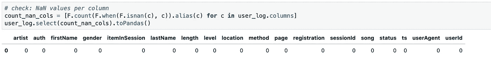

*   在与用户信息和歌曲信息相关的列中发现空值。

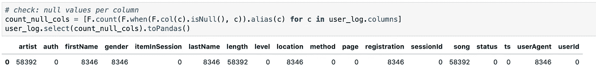

*   不是`NextSong`的页面的`artist`、`length`和`song`将为空值。

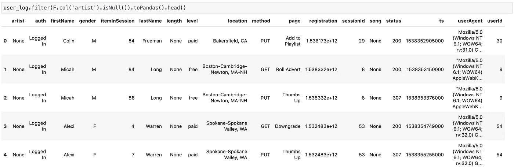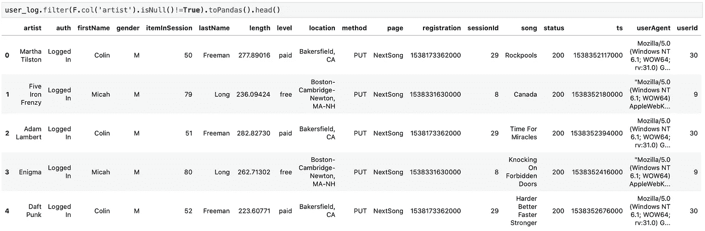

*   仅在列`userId`中发现空值。

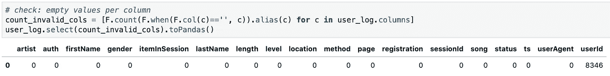

*   空`userId`的用户是没有注册登录的用户。

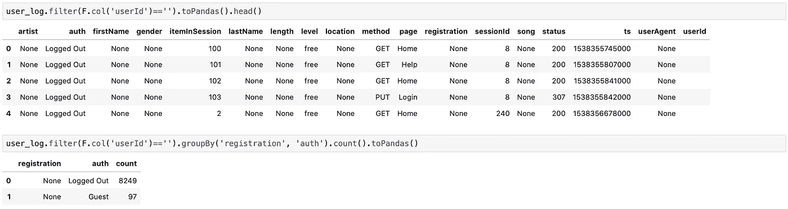

由于空`userId`的日志无法帮助我们识别后面的用户，所以我们无法对他们进行预测。所以我们把它们从分析中去掉了。

```
# drop rows with empty userId
df = user_log.filter(F.col('userId')!='')
df.count()
# 278154
```

# 探索性数据分析

## 定义流失

我们将使用`Cancellation Confirmation`事件来定义客户流失。搅动的用户将在列`churn`中有一个`1`，这是我们模型的标签列。

```
flag_churn = F.udf(lambda x: 1 if x == 'Cancellation Confirmation' else 0, T.IntegerType())
df = df.withColumn('churn', flag_churn('page'))
```

## 转换数据

在这一步中，我们将把原始数据集(每个日志一行)转换成具有用户级信息或统计数据的数据集(每个用户一行)。在进行聚合之前，我们将首先执行以下步骤:

1.  将时间戳(毫秒)转换为日期时间
    `ts`和`registration`列是使用以毫秒为单位的时间戳记录的，非常难以读取，因此我们将它们转换为日期时间对象，并保存为两个新列:`dt`和`reg_dt`。
2.  推断每个用户的观察开始日期
    a .对于`reg_dt` *比`min_dt`(整个分析的开始日期)早*的用户:使用`min_dt`作为`obs_start`(观察开始日期)列的值；b*。对于`reg_dt``min_dt`*`first_dt`(用户第一个日志的`dt`)之间有*的用户:使用`reg_dt`作为`obs_start`列的值；
    c .对于`reg_dt` *晚于`first_dt`*的用户:使用`first_dt`作为`obs_start`列的值。
    *奇怪的是注册日期在第一次登录日期之后，但有些用户(如 userId=154)会发生这种情况。**
3.  *推断每个用户的观察结束日期
    a .对于流失用户，使用他们最后的日志`dt`(他们流失的日期)作为列`obs_end`(观察结束日期)的值；对于非流失用户，使用`max_dt`(整个分析的结束日期)作为`obs_end`栏的值。*
4.  *获取每个用户的最后订阅级别
    将用户的最后订阅级别保存到新列`last_level`。*

*然后，我们按用户聚合所有必需的列:*

*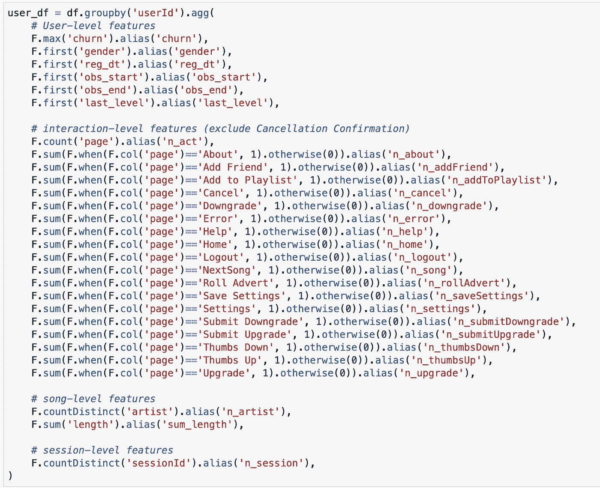*

*在聚合之后，我们还提取了一些与事件相关的基于时长的特征。*

*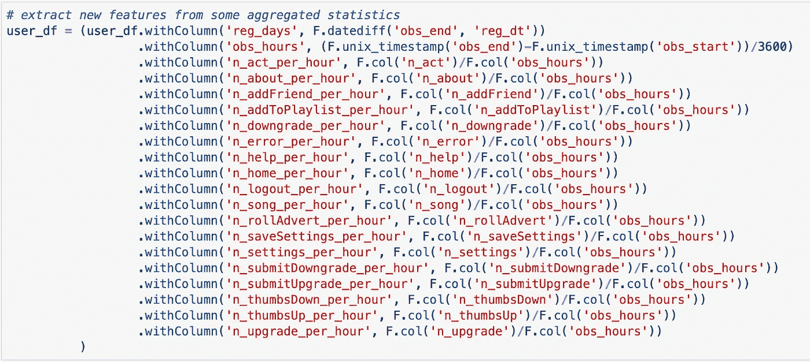*

*并添加一些会话级特性。*

*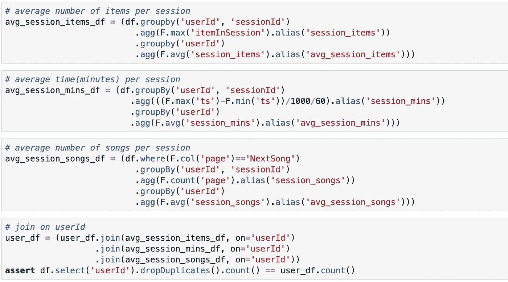*

*最后，我们只选择这些对于以后的探索和分析是必要的列。*

```
*root
 |-- userId: string (nullable = true)
 |-- churn: integer (nullable = true)
 |-- gender: string (nullable = true)
 |-- last_level: string (nullable = true)
 |-- sum_length: double (nullable = true)
 |-- n_session: long (nullable = false)
 |-- reg_days: integer (nullable = true)
 |-- obs_hours: double (nullable = true)
 |-- n_act_per_hour: double (nullable = true)
 |-- n_about_per_hour: double (nullable = true)
 |-- n_addFriend_per_hour: double (nullable = true)
 |-- n_addToPlaylist_per_hour: double (nullable = true)
 |-- n_cancel: long (nullable = true)
 |-- n_downgrade_per_hour: double (nullable = true)
 |-- n_error_per_hour: double (nullable = true)
 |-- n_help_per_hour: double (nullable = true)
 |-- n_home_per_hour: double (nullable = true)
 |-- n_logout_per_hour: double (nullable = true)
 |-- n_song_per_hour: double (nullable = true)
 |-- n_rollAdvert_per_hour: double (nullable = true)
 |-- n_saveSettings_per_hour: double (nullable = true)
 |-- n_settings_per_hour: double (nullable = true)
 |-- n_submitDowngrade_per_hour: double (nullable = true)
 |-- n_submitUpgrade_per_hour: double (nullable = true)
 |-- n_thumbsDown_per_hour: double (nullable = true)
 |-- n_thumbsUp_per_hour: double (nullable = true)
 |-- n_upgrade_per_hour: double (nullable = true)
 |-- avg_session_items: double (nullable = true)
 |-- avg_session_mins: double (nullable = true)
 |-- avg_session_songs: double (nullable = true)*
```

## *浏览数据*

*在这里，我们将重点比较留下来的用户和离开的用户之间的行为。*

*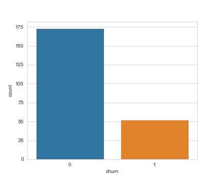*

*Distribution of Churn*

*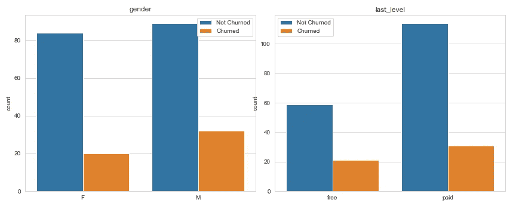*

*Distributions of Categorical Features*

*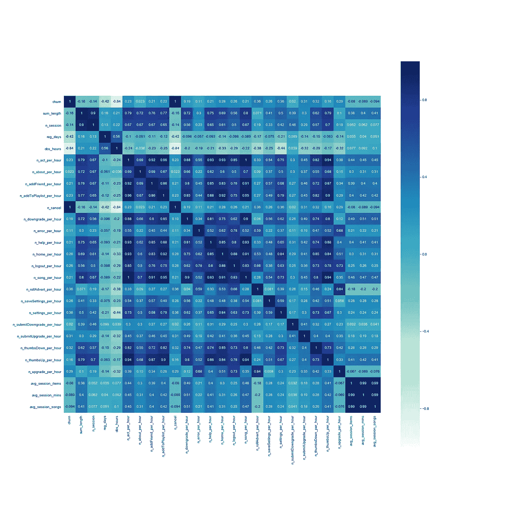*

*Correlations among Numerical Features*

*根据上述相关性，我们发现这些高度相关(> 0.8)的变量对(组):*

*   *流失，obs_hours，n_cancel*
*   *总和 _ 长度，n _ 会话*
*   *平均会话项目数，平均会话分钟数，平均会话歌曲数*
*   *n_act_per_hour，n_addFriend_per_hour，n_addToPlaylist_per_hour，n_downgrade_per_hour，
    n_help_per_hour，n_home_per_hour，n_song_per_hour，n_thumbsUp_per_hour*

*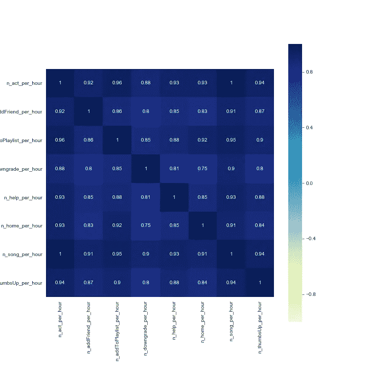*

*Correlations among ‘n_help_per_hour’ Numerical Features*

*删除高度相关的列后，相关性看起来好得多。*

*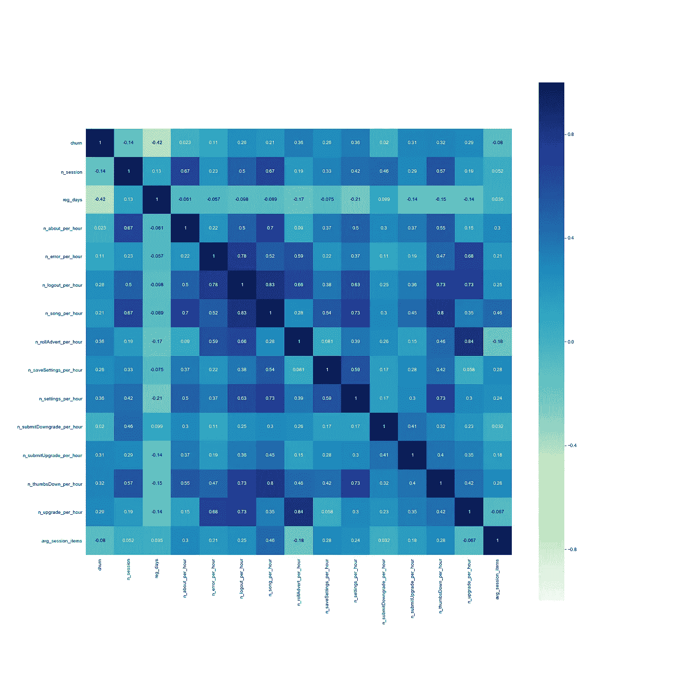*

*Correlations between Numerical Features (after removing highly correlated columns)*

*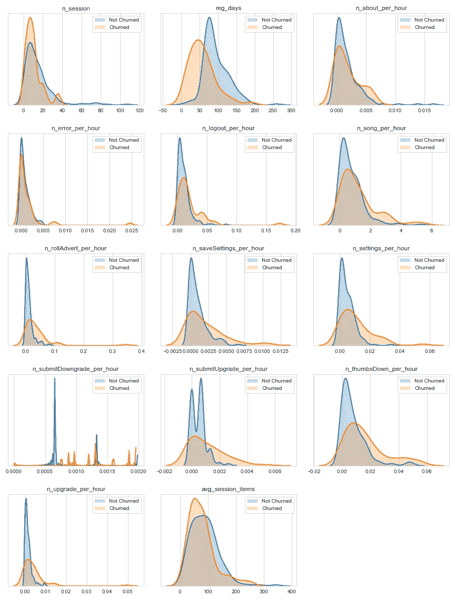*

*Distributions of Numerical Features*

# *特征工程*

*现在我们总共有 16 个特性(不包括`userId`和`label(churn)`列)。*

```
*root
 |-- userId: string (nullable = true)
 |-- label: integer (nullable = true)
 |-- gender: string (nullable = true)
 |-- last_level: string (nullable = true)
 |-- n_session: long (nullable = false)
 |-- reg_days: integer (nullable = true)
 |-- n_about_per_hour: double (nullable = true)
 |-- n_error_per_hour: double (nullable = true)
 |-- n_logout_per_hour: double (nullable = true)
 |-- n_song_per_hour: double (nullable = true)
 |-- n_rollAdvert_per_hour: double (nullable = true)
 |-- n_saveSettings_per_hour: double (nullable = true)
 |-- n_settings_per_hour: double (nullable = true)
 |-- n_submitDowngrade_per_hour: double (nullable = true)
 |-- n_submitUpgrade_per_hour: double (nullable = true)
 |-- n_thumbsDown_per_hour: double (nullable = true)
 |-- n_upgrade_per_hour: double (nullable = true)
 |-- avg_session_items: double (nullable = true)*
```

*在特征工程的正常情况下，在将它们输入到我们的模型之前，我们必须将它们编码、缩放和组合成一个特征向量。但是由于我们这次使用 pipeline 来构建模型，而不是现在就处理它们，我们只是将它们准备为一些数据处理阶段。*

*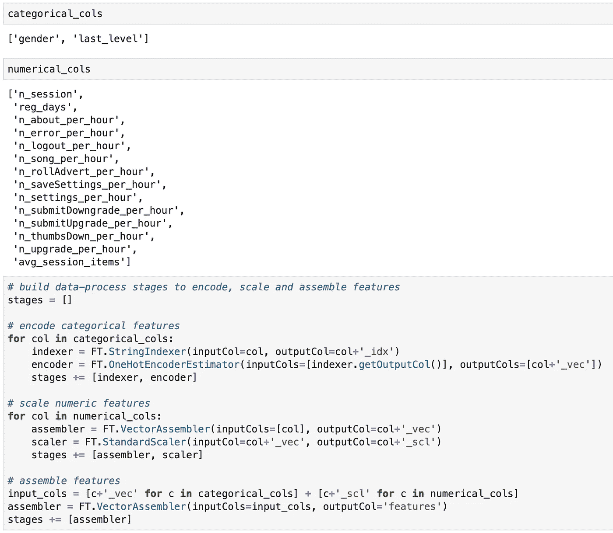*

# *建模*

## *将数据分成训练集和测试集*

*从上一节展示的流失分布来看，我们知道这是一个不平衡的数据集，只有 1/4 的用户被标记为流失。为了避免随机分裂中的不平衡结果，我们首先用标签抽样建立一个训练集，然后从整个数据集中减去它们得到测试集。*

*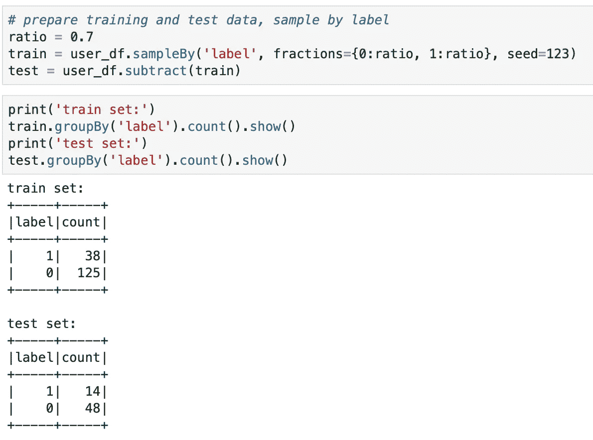*

## *型号选择*

*为了选择一个好的模型进行最终调整，我们在 [Spark 的 MLlib](https://spark.apache.org/docs/latest/ml-guide.html) 中比较了三个不同的分类器模型。*

*   *因为 Spark 提供的评估器不太适合我们的使用，所以我们定制了一个评估方法，以便在测试原型时查看分数。*

*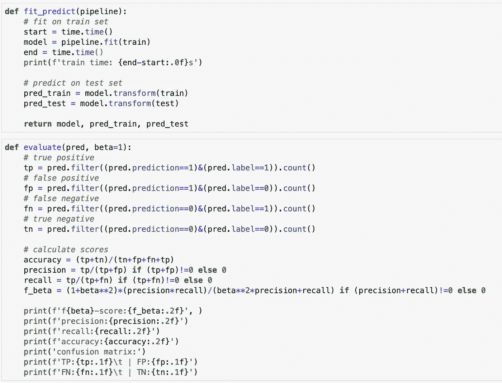**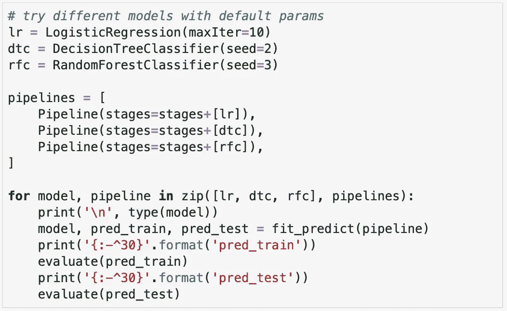*

```
*<class 'pyspark.ml.classification.LogisticRegression'>
train time: 30s
----------pred_train----------
f1-score:0.88
precision:0.91
recall:0.84
accuracy:0.94
confusion matrix:
TP:32.0	 | FP:3.0
FN:6.0	 | TN:122.0
----------pred_test----------
f1-score:0.75
precision:0.90
recall:0.64
accuracy:0.90
confusion matrix:
TP:9.0	 | FP:1.0
FN:5.0	 | TN:47.0

 <class 'pyspark.ml.classification.DecisionTreeClassifier'>
train time: 23s
----------pred_train----------
f1-score:0.93
precision:1.00
recall:0.87
accuracy:0.97
confusion matrix:
TP:33.0	 | FP:0.0
FN:5.0	 | TN:125.0
----------pred_test----------
f1-score:0.62
precision:0.60
recall:0.64
accuracy:0.82
confusion matrix:
TP:9.0	 | FP:6.0
FN:5.0	 | TN:42.0

 <class 'pyspark.ml.classification.RandomForestClassifier'>
train time: 27s
----------pred_train----------
f1-score:0.88
precision:1.00
recall:0.79
accuracy:0.95
confusion matrix:
TP:30.0	 | FP:0.0
FN:8.0	 | TN:125.0
----------pred_test----------
f1-score:0.64
precision:0.64
recall:0.64
accuracy:0.84
confusion matrix:
TP:9.0	 | FP:5.0
FN:5.0	 | TN:43.0*
```

*基于测试集的 f1 分数，我们决定使用`LogisticRegression`进行最终调整。*

## *分层交叉验证的模型调整*

*由于被搅动的用户是一个相当小的子集，我们将使用 f1 分数作为优化的主要指标。如上所述，Spark 的评估器不太适合我们的使用，所以我们需要构建一个`FbetaScore`评估器类来使用交叉验证器。*

*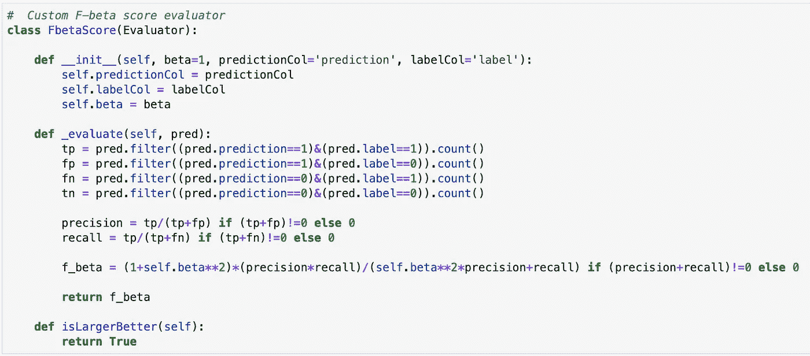*

*因为 PySpark 的`[CrossValidator](https://spark.apache.org/docs/latest/api/python/pyspark.ml.html#pyspark.ml.tuning.CrossValidator)`目前只支持简单的 K-fold CV，我们将使用 pip 库`[spark-stratifier](https://github.com/interviewstreet/spark-stratifier)`为不平衡数据集执行分层 K-fold CV。*

*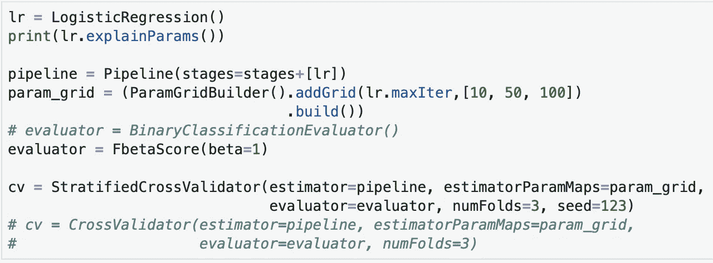*

*`explainParams()`中`maxIter`参数的解释:*

*   *maxIter:最大迭代次数(> = 0)。(默认值:100)*

*现在让我们发动引擎！我们的目标是超过原型的 0.75 分。*

*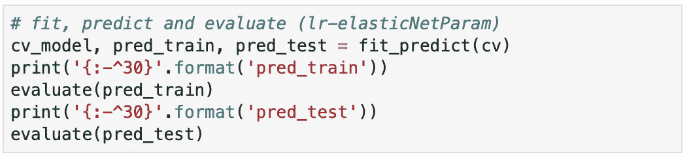*

```
*train time: 3113s
----------pred_train----------
f1-score:0.88
precision:0.91
recall:0.84
accuracy:0.94
confusion matrix:
TP:32.0	 | FP:3.0
FN:6.0	 | TN:122.0
----------pred_test----------
f1-score:0.75
precision:0.90
recall:0.64
accuracy:0.90
confusion matrix:
TP:9.0	 | FP:1.0
FN:5.0	 | TN:47.0*
```

*与原型相比没有观察到改进…也许原型`LogisticRegression`已经是最好的了；)*

## *特征重要性*

*让我们检查一下最重要的特性是否有意义。*

*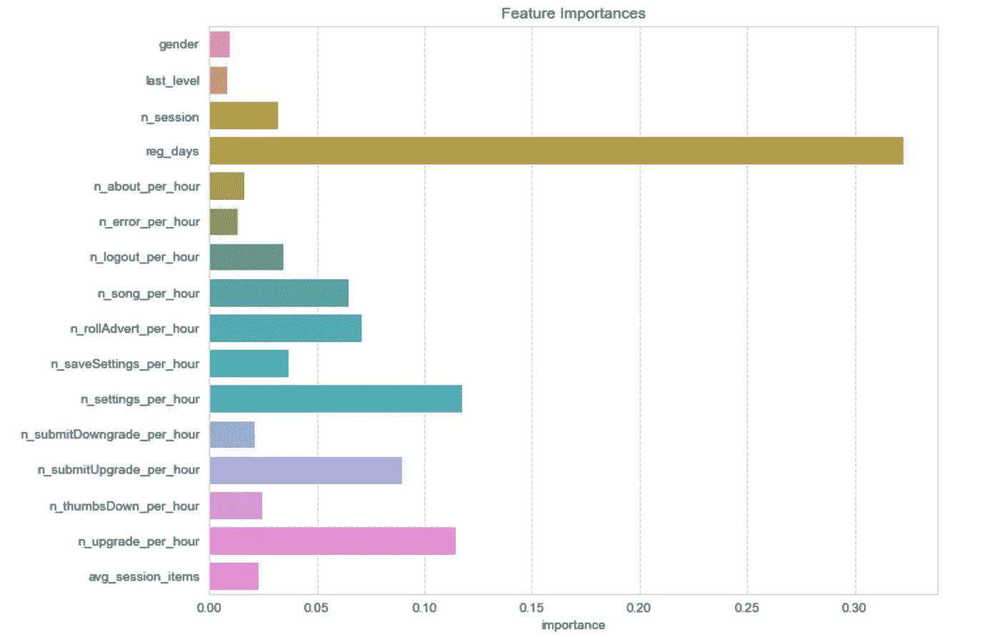*

1.  *reg_days(注册后天数)
    注册天数越短的用户越容易流失。
    **从数据探索会话中数字特征的分布可以得出相同的结论。**
2.  *设置-每小时检查事件
    用户检查设置越频繁，他们就越有可能流失！*
3.  *每小时升级相关的事件*
4.  *每小时观看的广告*
5.  *每小时播放的歌曲*

*对我来说，这一切似乎都是合理的…尽管我期望在查看数字特征的分布时，否定事件具有更高的重要性:(*

# *结论*

*到目前为止，我们已经完成了这些步骤:*

*   *探索和操作我们的数据集*
*   *为我们的问题设计相关功能*
*   *通过抽样流失将数据分为训练集和测试集*
*   *用 [Spark 的基于数据帧的 MLlib](https://spark.apache.org/docs/latest/ml-guide.html) 构建二进制分类器模型*
*   *用 [Spark 的 ML 管道](https://spark.apache.org/docs/latest/ml-pipeline.html)和[stratifiedcrossfvalidator](https://github.com/interviewstreet/spark-stratifier)选择并微调最终模型*

*关于这个项目有趣或困难的方面:*

*   *如何使用 Spark 的数据框架进行聚合*
*   *如何处理不平衡数据集*

*改进:*

*   *给定一些日志作为输入，实际预测哪些用户更有可能流失*
*   *在模型优化会话中探索更多参数*
*   *一种更加自动化的方法来过滤掉高度相关的特征*

*感谢阅读！完整的代码可以在这个[报告](https://github.com/silviaclaire/sparkify)中找到。*