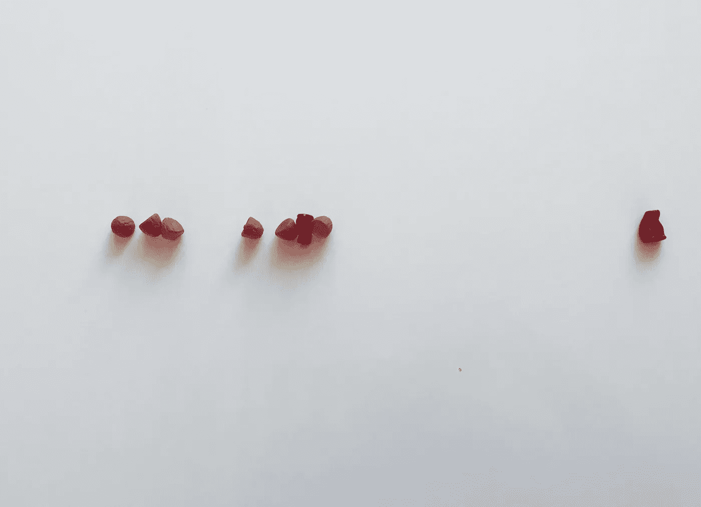
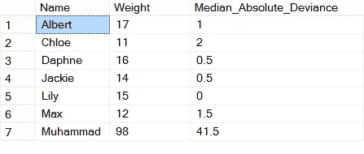

# 使用 SQL 检测异常值

> 原文：<https://towardsdatascience.com/using-sql-to-detect-outliers-aff676bb2c1a?source=collection_archive---------8----------------------->



An outlying black cat (photo by author)

SQL 不具备像 R 或 Python 这样的语言的特性，但这并不意味着你不能用它来通过寻找异常点或异常值来对数据进行初步清理。

许多数据科学家习惯于这样的工作流，即在用 R 或 Python 进行真正的工作之前，他们从符合 SQL 的数据库中吸取数据。这显然是低效的，因为这意味着有缺陷的、不正确的或由于某些其他原因最终不可用的数据需要移动到真正的分析环境中。

虽然 SQL 确实缺乏统计工具和分布库，但这并不意味着它不能用于进行有用的数据分析，只是工具集仅限于您可以动态编码的工具。

一旦知道如何检测异常值和其他数据异常，您就可以在 SQL 中轻松完成一项重要任务。我们将看看两种对 SQL 代码友好的方式。

一种这样的方法是使用中间绝对偏差来检测数据异常值。这种方法实际上比人们通常使用的 z 分数更可靠，因为它没有对数据的分布进行假设。

从概念上讲，这种方法的优点是非常简单。任意观测值的[中位数绝对偏差](https://en.wikipedia.org/wiki/Median_absolute_deviation)是该观测值的绝对差与所有观测值的中位数以及所有观测值的中位数绝对差与所有观测值的中位数的比值。

在非参数统计中，工作人员已经提出了中位数绝对偏差的临界值 5，因为中位数绝对偏差值略低于 1.5 相当于一个标准偏差，所以 MAD = 5 大约等于 3 个标准偏差。

这是 SQL 编码，缺点是您需要使用一个公共表表达式或其他解决方法，因为这种方法需要对聚合函数的结果进行进一步的操作。另一个有点挑战性的部分是，在主要的 SQL 实现中还没有一个简单的“中间值”函数。在下面的代码中，我使用了' Percentile_Cont '函数，我将在下面对其进行更多的注释。

有三个步骤，需要两个 cte 来捕捉中间步骤—

1.  求感兴趣的变量的中值。您需要这个值来进行进一步的计算，如果没有 CTE，作为一个集合是很困难的。
2.  计算中值偏差。偏差就是上面发现的中值体重和个体体重之间的绝对差值。求这个值的中间值。
3.  最后找到…的偏差

此处的代码创建了一个学龄前儿童的体重(以千克为单位)和年龄(以岁为单位)的表格，可能会在儿科诊所或市婴儿健康服务中心记录。最后一张表显示了每个学龄前儿童的体重及其与表中所有学龄前儿童体重中位数的偏差:

```
CREATE TABLE KidWts (Name nvarchar(20),Age int ,Weight float);INSERT INTO KidWts VALUES(‘Lily’,3,15), (‘Muhammad’,30,98), (‘Daphne’, 3, 16), (‘Max’, 2, 12),(‘Chloe’,1,11),(‘Jackie’,2,14),(‘Albert’,3,17);WITH MedianTab (MedianWt)AS(SELECT PERCENTILE_CONT(0.5) WITHIN GROUP (ORDER BY Weight)OVER () as MedianWeightFROM KidWts),DispersionTab (AbsDispersion)AS(SELECT PERCENTILE_CONT(0.5) WITHIN GROUP (ORDER BY (Abs(Weight-MedianWt)))OVER () as AbsDispersionFROM MedianTab JOIN KidWts on 1=1)Select DISTINCT *,ABS((Weight-MedianWt)/AbsDispersion) FROM KidWts Join DispersionTab on 1=1JOIN MedianTab on 1=1
```

该查询返回以下结果:



The results of the query — Muhammad looks a little out of place

看着表格，一个结果突出了出来——穆罕默德的 98 公斤没有，与中位数的偏差为 41.5，是非常不合适的。经过一点调查，我们意识到，原因是穆罕默德的问题，是穆罕默德阿里，98 公斤是他在 1974 年与乔治·福尔曼比赛前的体重。对一个重量级拳击手来说并不算特别重，但对一个学龄前儿童来说却不合适。可能是一个装箱悲剧 DBA 在输入真实数据之前使用装箱统计数据来测试数据库功能，并且没有完全清除测试数据—这是一个极端的例子，但并非不可能。

MAD 值 41.5 可能比您在现实生活中看到的要大，并且旨在说明只是错误地出现在数据集中的数据类型，这是现实生活数据集中出现异常或异常值的一种方式。

更详细地看代码，Percentile_Cont 函数在最新的 ANSI SQL 标准中，但这并不意味着它在 SQL 的每一个实现中都有效——我在 SQL Server 上测试过，我的信息是这个函数在 Oracle 和 PostgreSQL 中也可用。MySQL 没有这个功能，所以你需要使用另一种方法来寻找中间值。

您可能想从下面的文章中选择您最喜欢的——[Joe Celko 的关于 SQL 中值的文章](https://www.red-gate.com/simple-talk/sql/t-sql-programming/median-workbench/)——但是请注意，它是在 cte 之前写的，因此可以通过用 cte 替换临时表或视图来改进这些解决方案。正如 Joe Celko 的文章所示，在 SQL 中有很多计算中位数的方法——找到适合您的方法，并相应地更新代码。

*罗伯特·德格拉夫是《管理你的数据科学项目* *》一书的作者，该书将于 2019 年 7 月中旬由 Apress 出版社出版。*

*你可以在推特上关注罗伯特:*[*https://twitter.com/RobertdeGraaf2*](https://twitter.com/RobertdeGraaf2)