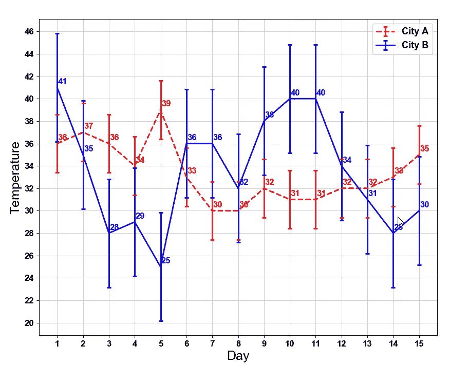

# 在 Python 中使用标准差

> 原文：<https://towardsdatascience.com/using-standard-deviation-in-python-77872c32ba9b?source=collection_archive---------3----------------------->


Standard Deviation in Practice

## Python 中的均值、标准差和误差线

正如[这篇文章](https://www.dummies.com/education/math/statistics/why-standard-deviation-is-an-important-statistic/)提到的，通过标准差，你可以了解你的数据是接近平均值还是分布在很大范围内。例如，如果一个雇主想确定他的一个部门的工资对所有员工是否公平，或者是否有很大的差异，他可以使用标准差。为此，他可以找到该部门的平均工资，然后计算标准偏差。一个场景可能如下所示:他发现标准差略高于他的预期，他进一步检查了数据，发现虽然大多数员工都属于类似的薪酬等级，但有四名忠诚的员工在该部门工作了 15 年或更长时间，比其他人长得多，由于他们在该公司工作的时间长，他们的薪酬也高得多。

一般来说，低标准偏差意味着数据与平均值非常接近，因此非常可靠，而高标准偏差意味着数据与统计平均值之间存在较大差异，因此不太可靠。

标准差最重要的应用之一是比较两个数据集。如果两个数据集有相同的平均值，这并不意味着它们一定完全相同，对吗？例如，数据集`199, 200, 201`和`0, 200, 400`都具有相同的平均值(`200`，但是第一个数据集与第二个数据集( *s* =200)相比具有非常小的标准差( *s* =1)。

# 样本或总体的标准偏差

***群体*** 数据集包含指定组的所有成员(可能数据值的完整列表)。例如，人口可能是“居住在加拿大的所有人”。 ***样本*** 数据集包含群体的一部分或子集。样本的大小总是小于被抽取样本的总体大小。例如，样本可能是“生活在加拿大的一些人”。

我们通常对了解 ***总体*** ***标准差*** 感兴趣，因为它包含了我们想要分析的所有值。如果我们有整个人口或更大人口的样本，我们通常会计算人口标准差，但我们不想将我们的发现推广到整个人口。在许多情况下，我们有一个样本数据，我们想从中归纳出一个群体的分析。一般来说，如果您只有一个数据样本，并且想要对从中抽取样本的总体标准偏差进行陈述，则需要使用样本标准偏差。在本文中，我将重点讨论总体标准差。**总体标准差**公式如下:


formula from [here](https://statistics.laerd.com/statistical-guides/measures-of-spread-standard-deviation.php)

例如，如果我们的数据集是`[13, 22, 26, 38, 36, 42,49, 50, 77, 81, 98, 110]`，总体均值或平均值将是:数据集中所有单个项目的总和除以项目数，结果将是`53.5`。

现在，从集合中的每个项目中减去平均值，并计算每个数字与平均值之间的差值的平方。例如，对于第一个项目`13`，我们有:

```
(13–53.5)=(-40.5) and square of (-40.5) will be: 1,640.25
```

然后，对所有的平方差求和(`10,581`)，并将这个和除以项目数。结果将是`881.75‬`。这个数字被称为**方差**。求方差的平方根，求出标准差。所以这个数据集的标准差会是`29.69`。

# Python 中的标准差

可以使用 Python 中的`Numpy`库计算数据集的总体均值和标准差。下面的代码展示了这项工作:

```
import numpy as np
dataset=[13, 22, 26, 38, 36, 42,49, 50, 77, 81, 98, 110]print('Mean:', np.mean(dataset))
print('Standard Deviation:', np.std(dataset))Mean:53.5
Standard Deviation: 29.694275542602483
```

# 在 Python 中使用标准差比较两个数据集

下面的两个数据集显示了两个城市在 15 天内的高温(以华氏度为单位)。我们想比较这两个城市气温的平均值和标准偏差。

```
City A= 36, 37, 36, 34, 39, 33, 30, 30, 32, 31, 31, 32, 32, 33, 35City B= 41, 35, 28, 29, 25, 36, 36, 32, 38, 40, 40, 34, 31, 28, 30
```

两个城市的平均气温分别是 A 市的`33.4`和 B 市的`33.5`，非常接近。两个城市都有点冷。但是 A 市的标准差`2.60`远小于有`4.83`的 B 市。这表明城市 A 的温度比城市 B 更稳定。换句话说，城市 B 的温度每天变化更大。

为了在图中显示这种变化，我在 Python 中使用了误差线。误差线对问题解决者很有用，因为它们显示了一组计算值的置信度或精度。可以使用 Python 中的`matlibplot`库来描述平均值和标准偏差。如下图所示，与城市 b 相比，城市 A 的变化较小。



Error bar with mean and standard deviation

# 用于创建误差线的 Python 代码

现在我将解释我是如何创建误差线的。

首先，在导入库之后，我计算了两个数据集的平均值和标准差:

```
City_A=[36,37,36,34,39,33,30,30,32,31,31,32,32,33,35] 
City_B=[41,35,28,29,25,36,36,32,38,40,40,34,31,28,30] Mean_City_A=np.mean(City_A)
Mean_City_B=np.mean(City_B) STDV_City_A=np.std(City_A)
STDV_City_B=np.std(City_B)
```

然后，我创建一个图形对象并设置轴标签:

```
# Create a figure with customized size
fig = plt.figure(figsize=(10, 8))
ax = fig.add_subplot(111) # Set the axis lables
ax.set_xlabel('Day', fontsize = 18)
ax.set_ylabel('Temperature', fontsize = 18)
```

我们需要给 X 轴分配天数(15 天的周期):

```
# X axis is day numbers from 1 to 15
xaxis = np.array(range(1,16))
```

当我们在线上创建误差线时，我们也可以设置该图形的颜色和线条设置:

```
# Line color for error bar
color_City_A = 'red'
color_City_B = 'darkgreen' # Line style for each dataset
lineStyle_City_A={"linestyle":"--", "linewidth":2, "markeredgewidth":2, "elinewidth":2, "capsize":3}lineStyle_City_B={"linestyle":"-", "linewidth":2, "markeredgewidth":2, "elinewidth":2, "capsize":3}
```

现在，我们为每个数据集项、标准偏差和我们设置的线条样式创建两个误差线。

```
# Create an error bar for each datasetline_City_A=ax.errorbar(xaxis, City_A, yerr=STDV_City_A, **lineStyle_City_A, color=color_City_A, label='City A')line_City_B=ax.errorbar(xaxis, City_B, yerr=STDV_City_B, **lineStyle_City_B, color=color_City_B, label='City B')
```

我想在每一行上显示数字，这就是为什么，我使用`annotate` 函数给点添加文本。功能中的`xy`显示数字在图形上的位置，`xytext`显示标签的位置。

```
# Label each dataset on the graph, xytext is the label's position for i, txt in enumerate(City_A):   
     ax.annotate(txt, xy=(xaxis[i], City_A[i]), 
             xytext=(xaxis[i]+0.03,City_A[i]+0.3),
             color=color_City_A) for i, txt in enumerate(City_B):        
     ax.annotate(txt, xy=(xaxis[i], City_B[i]), 
            xytext=(xaxis[i]+0.03,
            City_B[i]+0.3),color=color_City_B)
```

此外，我将为图形绘制一个图例，以及关于图例样式、轴字体样式的其他设置，并向图形添加一个灰色网格:

```
# Customize the legend font and handle 
lengthparams = {'legend.fontsize': 13,          'legend.handlelength': 2}
plt.rcParams.update(params) # Customize the font
font = {'family' : 'Arial', 'weight':'bold','size': 12}
matplotlib.rc('font', **font) # Draw a grid for the graph and set face color to the graph
ax.grid(color='lightgrey', linestyle='-')
ax.set_facecolor('w')
```

最后，使用`plt.show()`命令显示误差栏。

在下面找到 Python 代码:

感谢您阅读本文！