# 使用统计过滤器提高盈利能力

> 原文：<https://towardsdatascience.com/using-statistical-filters-to-improve-profitability-an-applied-example-to-a-dax30-volatility-mean-df2dd8e1a837?source=collection_archive---------14----------------------->

## DAX30 波动率/均值回归策略的应用实例

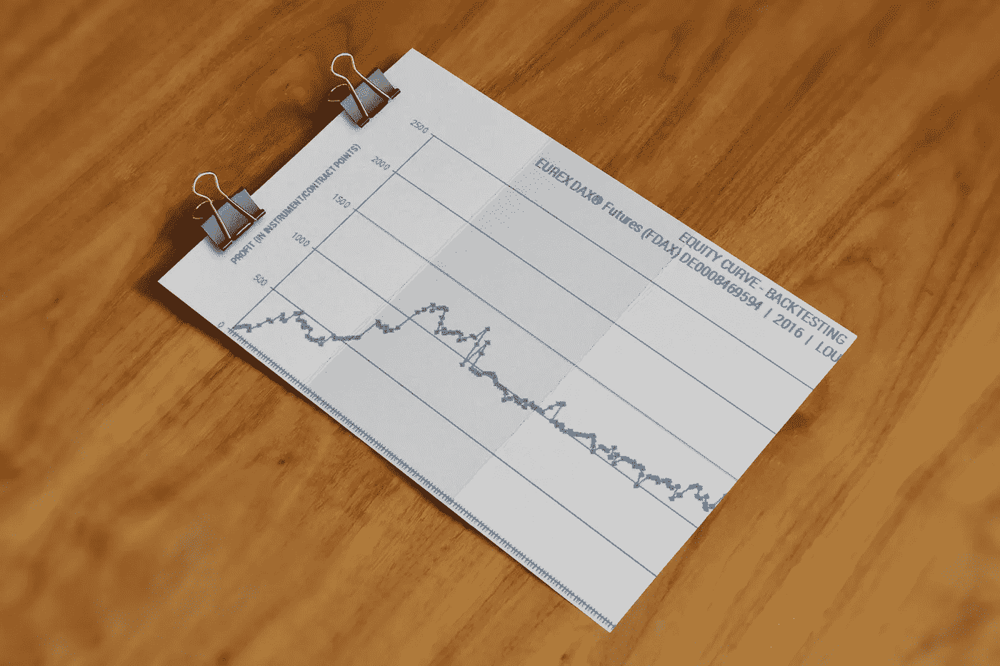

Every analysis must begin with a profitable equity curve backtested over different market regimes and during several years (analysis can be split by periods, in this example just one year will be covered).

找到合理的盈利策略并不是一件容易的事情，因此任何提高盈利能力和减少亏损的资源都值得探索。

在本文中，我将通过使用统计过滤器来讨论策略优化。

统计过滤器和参数蒙特卡罗分析是优化交易策略最简单的方法。

统计数据更易于应用，可用于改变尺寸或在某些操作中过滤掉。这种方法只需要来自回测的结果数据集，尽管推荐通过自动化回测引擎进行最终检查。

值得一提的是，这一过程并不专门针对盈利能力和/或权益曲线，但它也可能具有减少执行交易数量的积极副作用，这有效地消除了一些费用并减轻了操作者的心理压力——如果策略被设计为任意执行的话。

在这个例子中，正在分析一个自主策略。该策略是围绕 DAX30 工具(期货或差价合约)的风险控制和情境化均值回归/波动率设置而设计的。

任何策略和任何工具/资产都可以以类似的方式进行分析，因为过滤器可以应用于任何设置。

设计滤波器与其说是一门科学，不如说是一门艺术，需要大量的数据观察。数据观察包括读取实际数据和图表以及创建辅助图表，以识别和隔离可能对盈利能力或权益曲线产生影响的因素。

在解释数据时，必须考虑每个参数或设置在市场环境中的意义。这意味着在阅读数据时发挥积极的作用，因为最初的假设需要建立，然后通过进一步的统计分析来证实或反驳。

> 优化不一定涉及盈利能力。可能会有优化目标来平滑权益曲线。一条友好的权益曲线更容易通过金融杠杆或信用来衡量，而一条起伏不定的权益曲线的严重下降很容易使我们的资本面临严重风险。

# 输入数据

分析从来自策略的人工回溯测试的数据开始，这同样适用于自动交易。这些数据作为 CSV 文件合并到分析中。

本文专门讨论回测结果的统计分析。尽管将包含一些命令来展示如何添加键列，但我假设任何对应用这些概念感兴趣的人都知道如何编写统计分析代码。

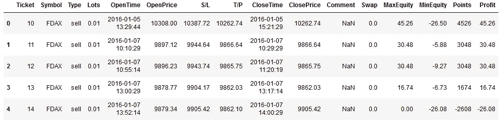

Figure 1\. CSV File incorporated to Analysis.

# 股票曲线与市场条件

回溯测试可以让你重新发现你的策略，并且经常会揭示策略中隐藏的行为和偏见，这些行为和偏见不是最初定义的一部分。

根据基础资产/工具直观检查权益曲线，以确定特定市场条件和权益曲线行为之间是否存在潜在相关性，这一点极其重要。可以检查大量项目:潜在趋势、趋势强度/斜率、超买和超卖条件、波动性、成交量、较高时间框架市场条件等。—仅举几个例子--。

有些项目可以量化(波动性可以通过 ATR 量化)，但其他项目则不能(趋势、趋势强度或市场机制可能是主观的)。对于那些无法量化的数据，可以手动将操作员注释或代码合并到数据集中。

# 绘制权益曲线

对数据的第一个操作是合并策略中的累计权益列。假设您的数据已经合并到一个名为 *data* 的 Pandas 数据框架中，下面的命令将添加一个新的列来提供股票曲线。

> 数据['权益'] =数据['利润']。累计和(轴=0)

虽然*利润*栏预计是以欧元表示的利润/损失，但回溯测试已经调整，因此 1€对应一个点，因此该栏实际上代表每次交易的工具点利润。实际利润可以很容易地通过定义正在操作的期货合约的数量来获得，或者如果策略是使用 CFD 工具操作的，则通过定义批量来获得。

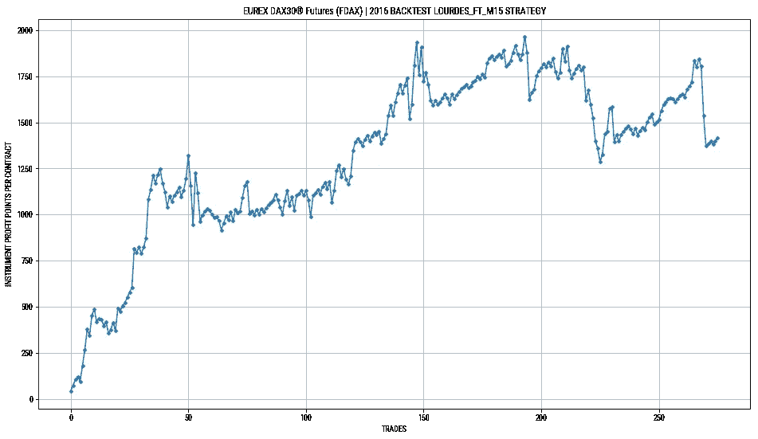

Figure 2\. Equity Curve vs. Trades

该战略的权益曲线如图 2 所示。x 轴代表已执行的交易，y 轴以点数显示累计利润。这条曲线有助于直观地理解策略的机制，包括连续亏损和盈利的次数，以及每次交易的相对盈利/亏损点数。这种表现与时间上的权益曲线相关，但并不匹配，因为交易并不是随时间线性分布的。

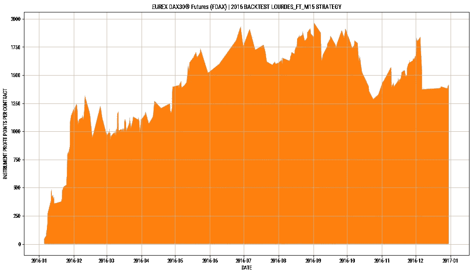

Figure 3\. Equity Curve vs. Time

这两张图都很有意义，第一张图关注的是交易的顺序，第二张图给出了股票随时间发展的思路。

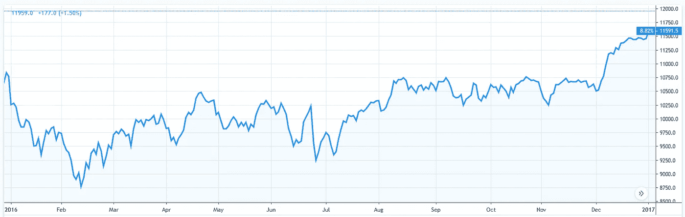

Figure 4\. DAX Futures for the backtested period.

从图表中可以看出，在上半年，该战略的执行是有利可图的。市场已经下跌了 2000 点左右，该策略已经能够从该运动中捕捉到 1250 点。在下一季度，该战略已经能够纳入额外的 500/600 个利润点。

相反，今年下半年根本没有盈利。它已经累积了 500/600 点的跌幅。分析图表和最大交易的进场设置，我们推断试图捕捉更大波动的交易可能会亏损。从回溯测试的执行来看，我也有这样的主观感觉，持久的交易往往是输家，而最好的交易会很快达到盈利目标。这实际上符合策略中使用的基本原则:波动性和均值回归。

> 主观感觉不能重新定义策略，但它们构成了进一步分析的合法线索，因为它们是经营者市场知识的一部分(通常是启发性的)。

# 交易盈亏点与交易持续时间

如前所述，出现的一个问题是交易持续时间是否与交易的盈亏概率相关。一个简单的分析方法是使用散点图，在 y 轴上画交易规模，在 x 轴上画交易持续时间。在这个例子中，我用蓝色标出了盈利的交易，用红色标出了亏损的交易。额外的色谱柱易于整合:

> data[' trade size ']= ABS(data[' S/L ']—data[' T/P '])
> data[' trade duration ']= data[' close time ']—data[' open time ']

交易规模的定义有点武断，带止损或带盈利点同样有效。

对盈亏交易进行分类很容易，你只需要为每个图表系列生成一个新的过滤熊猫数据框。

> 子数据=数据[数据['利润']。astype(float) < 0]

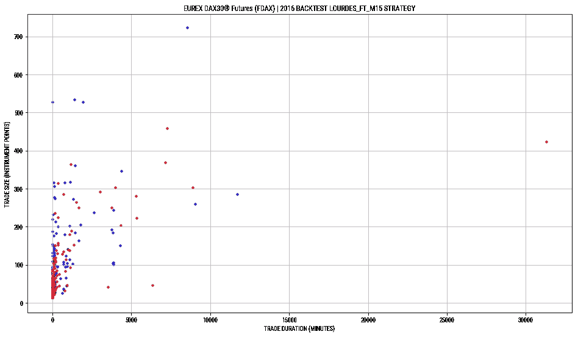

Figure 5\. Scatter plot to analyse trade size/trade duration relation

可以清楚地看到，大多数交易都集中在大约 400 点/ 5000 分钟的区域。在这个范围之外，只有 13 个观察值。

我将从离群值开始，因为它们更容易分析。将它们过滤掉将有助于关注交易集中的区域。

我之前提到过，我们所关注的主观感受指向:

1.  大额交易可能无利可图。
2.  长期交易是亏损的。

从图表上看，我注意到在这个特定的案例中，大额交易是有利可图的。只有 6 笔交易的目标是交易规模大于 400，而在这 6 笔交易中，有 2 笔是亏损的。然而，值得一提的是，六次观察可能是一个太小的样本量，无法获得统计相关的结果。

关于第二个假设，在持续时间大于 5000 分钟的所有交易中，7 个是亏损交易，3 个是盈利交易。同样，10 次交易可能不足以提取信息，所以如果可以重新定义策略来避免这些交易，会更安全。

即使利用这种简单的分析，第一滤波器也可以被选作假设。我将分析在密度更大的区域会发生什么。事实上，我们会选择持续 180 分钟以上的平仓交易——这个值是经过反复选择的。就差价合约而言，它还将取消互换费用。

在期货交易中，如果交易持续时间超过结算期，它可以避免对合约进行展期。我们也可以评估其他过滤器，如对交易止损设置 100 点的限制。这将有助于满怀信心地增加杠杆，因为我们不接受止损较大的交易。

> 缺乏对大额交易和较长交易持续时间的观察可能会导致嘈杂的结果，因为这些领域的观察数量很少，因此更容易发生变化。

我将最初纳入贸易超时过滤器。这个分析并不准确，因为我不知道在交易结束时会发生什么。它们可能会导致部分盈利或亏损。我会先假设赢和输是有补偿的。缩短交易持续时间的想法很有吸引力。直觉上，这可能会产生更平滑的权益曲线，降低费用(尤其是差价合约中的掉期费用)并简化操作。

这些结果可以在以后用新的回溯测试来验证，最好是运行一组新的数据，即不同的年份，以避免过度拟合。

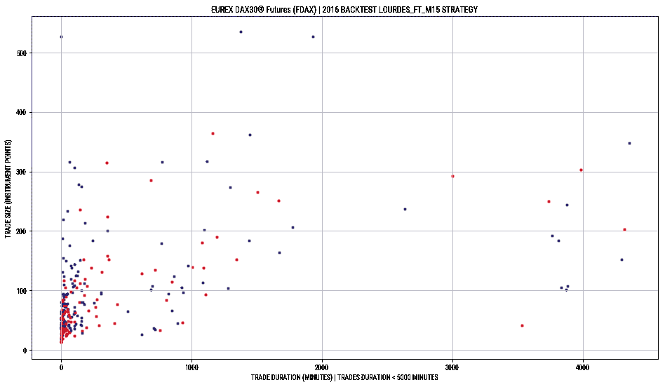

Figure 6\. Scatter plot to analyse trade size/trade duration relation for <5000 minutes

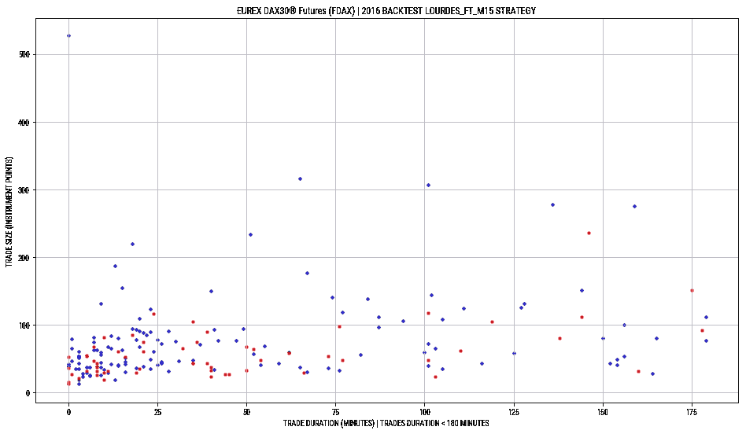

Figure 7\. Scatter plot to analyse trade size/trade duration relation for <180 minutes

图 6 和图 7 显示了两个条件子集，分别进一步限制了持续时间小于 5000 分钟和 180 分钟的交易。在这两种情况下，但特别是在第二种情况下，可以看到蓝色占主导地位的红色。

这个说法可以通过绘制 180 分钟时限权益曲线来证明。

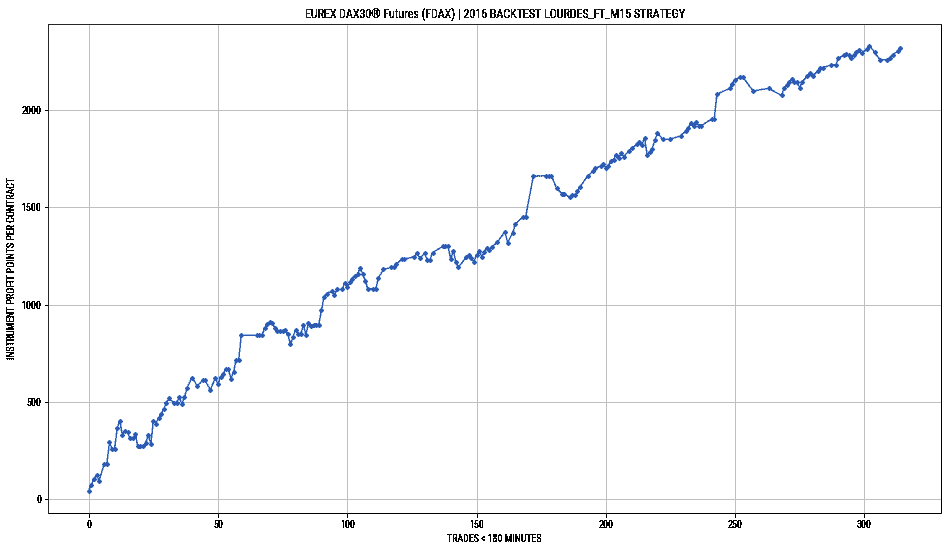

Figure 8\. Equity curve removing the trades longer than 180 minutes: Too good to be true.

在这条股票曲线中，我假设当你在 180 分钟后平仓时，亏损和盈利的交易互相补偿。这可能是真的，也可能不是，但可以肯定的是，他们可能会对下降产生影响。

这一简化方法的关键信息是，当遵循这一途径时，公平似乎会得到改善。因此，花时间进一步回测这个场景是值得的。

# 回溯测试超时交易场景

现在看来，在 180 分钟后过早平仓可能会改善股票曲线，我们分析一下实际情况。为了做到这一点，我们编写了一个定制的回溯测试引擎(实际上只是 Python 中的几行代码),在实际交易时输入交易，并对 SL、TP 或超时的结果进行回溯测试。

这个新的回溯测试给出了一个更真实但仍有改进的结果，如图 9 所示。

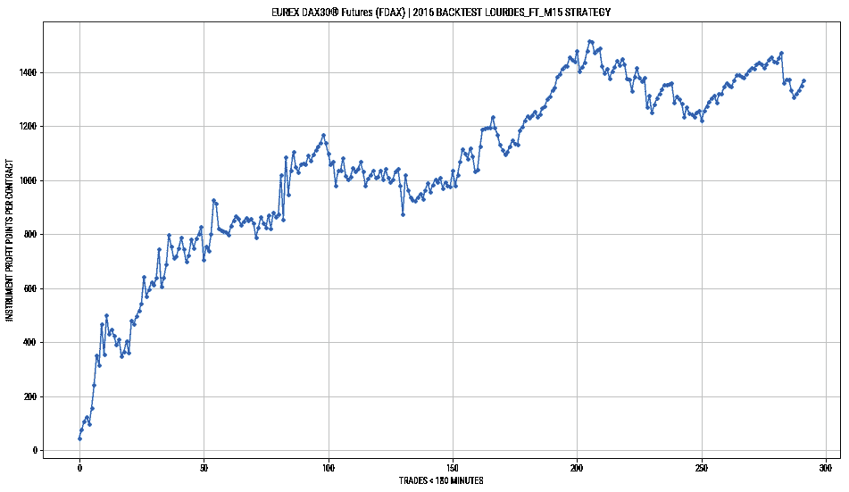

Figure 9\. Actual equity curve closing trades that last longer than 180 minutes.

虽然曲线不如理论曲线好，但已经实现了显著的改善。在最初的策略中，最大减仓是持续 30/40 交易的 750 点的大减仓。

通过应用这个简单的过滤器，我们将下降减少到 300 点，减少了 60%。过滤器提供了与原始策略相似的利润水平。

有限的提款，有效地提供更平滑的权益曲线，是策略中最重要的方面。即使实现了较小的利润。利润可以很容易地通过财务杠杆或具有更安全权益曲线的信贷来扩大。

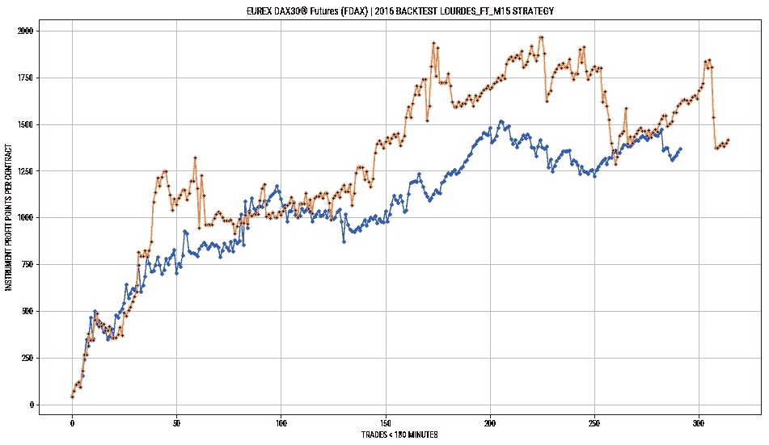

Figure 10\. Same strategy without and with filter applied. Improvement on drawdown is evident.

图 10 显示了两种策略之间的比较(有无滤波器)。虽然将计算两种策略的夏普比率，以量化哪种策略更好，但在这种情况下，很明显，滤波器改善了策略。

夏普比率将风险(标准差)与盈利能力联系起来，它可以用作给定策略或基金经理的品质因数。虽然我不会在本文中讨论夏普比率，但它值得一提，因为它适用于正确量化两种策略并与其他策略进行比较。

# 摘要

在这篇文章中，使用简单的统计过滤器的概念，以改善盈利能力和/或下降已经提出。整个逻辑过程包括分析数据、绘制权益曲线、做出一些初始假设和反复测试数据。

已经强调了提款和权益曲线的相关性，并提供了已实现结果的最终比较。

虽然该示例非常简单，并且没有探索进一步的过滤器或更数学的方法来优化结果，但它实现了以一种易于理解的方式说明统计过滤器的使用的目标。它还显示了有时简单的数据观察和有限的一组图和迭代如何能够在没有复杂数学的情况下改进策略。

[1][https://www.investopedia.com/terms/s/sharperatio.asp](https://www.investopedia.com/terms/s/sharperatio.asp)