# 使用生存分析来衡量资产表现

> 原文：<https://towardsdatascience.com/using-survival-analysis-to-gauge-asset-performance-2013afdb071?source=collection_archive---------25----------------------->

## 用概率解决现实世界的问题

## 介绍

生存分析顾名思义就是对某个人或某件事的生存分析。可以想象，我们需要一些数据来进行分析。最初，这些数据是人们从出生到死亡的存活时间。

它起源于 17 世纪，是一种决策支持工具。首先，用于确定特定区域的人口增长是否证明开设商店是合理的，其次，用于帮助确定年金。

负责这些创新的两位早期数据科学先驱是约翰·格兰特和埃德蒙多·哈雷。这个事实对哈雷的改进版本尤其有效，因为它有效地标志着精算科学的诞生。

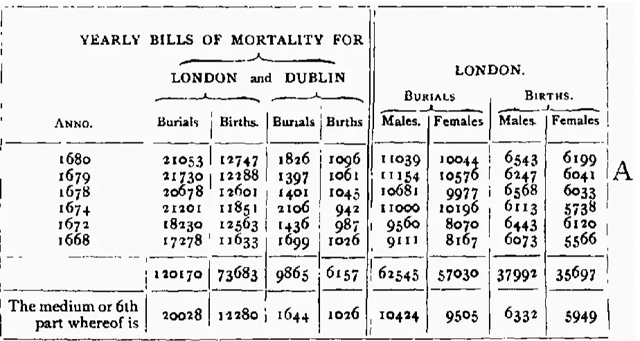

Early Life Table by John Graunt — [https://circa-navigate.corsairs.network/](https://circa-navigate.corsairs.network/)


Improved Edmond Halley Life Table — [https://papp.iussp.org/](https://papp.iussp.org/)

生存分析起源于精算界和医学界。然而，它可以用于研究关于同一受试者的任何两对相关事件，其中所述受试者是群体的一部分。例如，从我们委托资产到特定故障模式发生的时间，或者订户第一次加入服务的时间和她最终取消或退出的日期。

因此，当我们说资产时，我们指的是需要维护或保留的为组织产生收入的任何东西，包括但不限于物理资产、员工和订户。

在本文中，我们查看一些理论背景，以及对一些现实世界中的资产故障数据的分析，以获得具体的见解。

## 生存分析背景。

生存函数 S 的定义由下式给出，

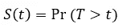

有了时间， *T* 感兴趣的事件的时间。就资产可靠性而言，我们称之为可靠性函数。

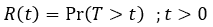

可靠性定义为在特定条件下，资产或零件在给定时间内执行其预期功能的概率。

*在可靠性工程、其故障和订阅取消的情况下，生存函数是感兴趣事件的累积分布的补充。*

由于根据定义，整个群体或队列将存活至所选研究、分析或报告间隔开始，并且没有一个将无限期持续，因此我们通常可以声称:

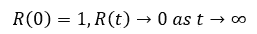

特定人群作为时间函数的确切生存概率可以从数据中得知。这可以使用参数化和非参数化方法来完成，正如我们在后面的真实例子中看到的。

不可靠度 F(t)是累积失效分布，是可靠度函数的补函数，即 *F(t) = P (T < = t) = 1-R(t)，*本次 *F(t) = P (T < = t) = 1-R(t)。*

根据定义，故障时间的密度函数为

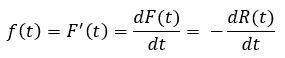

危险率或瞬时故障率函数描述如下:

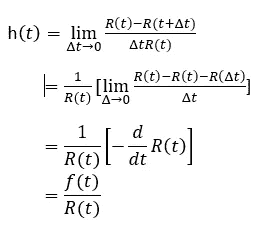

还记得我们之前说过，根据定义 *f(t)=-R'(t)。*

关于生存函数的更多背景，请访问维基百科，这里是 https://en.wikipedia.org/wiki/Survival_function，关于失败率和风险函数，这里是 https://en.wikipedia.org/wiki/Failure_rate。

## 事件时间数据分析

要将生存分析技术应用于事件数据，如委托和失败的资产或订户加入和取消，需要将数据转换成通常的格式。

在这个实际的例子中，我们考虑资产被安装在特定的功能位置，并在出现故障时被替换。个人的“寿命”定义为从第一次安装到第一次更换的时间，或者从一次更换到下一次更换的时间间隔。这个间隔可以用许多不同的方式来定义。对于一个特定的研究或决策支持生产系统来说，清晰和一致的完成是至关重要的。确保数据工程的高效和正确也很关键。

在下图中，每条线代表一个资产位置，每个初始点代表第一次安装，每个后续点代表更换事件。两条垂直线代表“研究”或“实验”的开始和结束。第一行代表初始数据，第二行代表今天。圆点和间隔替换时间代表我们的样本。

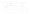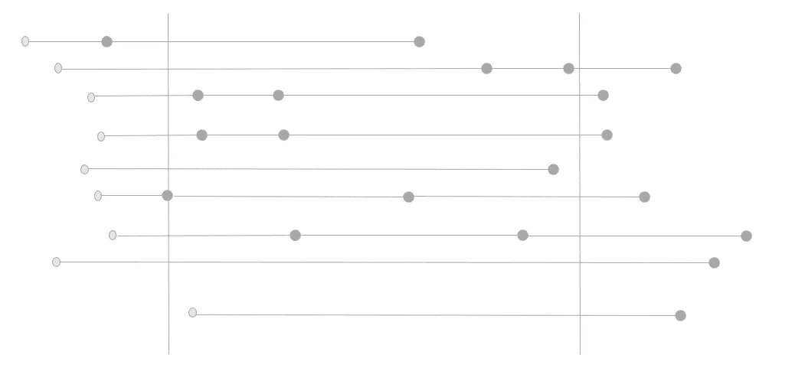

Original Time to Event Data distributed in time

我们把我们的数据重新整理成生活或生存数据集。研究/报告结束前的每个更换时间/故障代表一个事件，而在该期间结束时仍在使用的每个资产代表一个“审查观察”

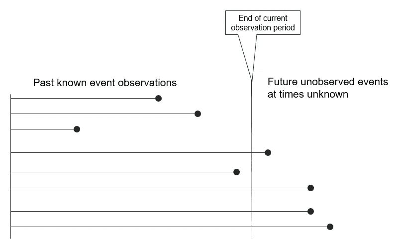

生存数据可以用表格的形式表示，如下表所示。

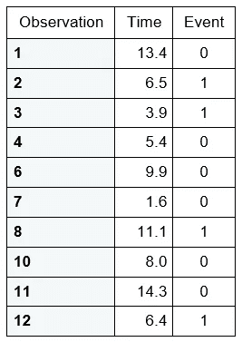

Table 1 — Event Observations

Event=1 表示发生了故障，即生命线在当前观察期之前结束，Event=0 表示感兴趣的事件将在未来某个*未知*时间发生。

## 挑战

我们的客户怀疑他们的一些资产类别受到婴儿死亡率的影响，希望更好地了解情况。他们最近启动了可靠性数据质量计划，可以为我们提供最近的故障观察。数据很可能不足以做全面的生存分析，构建完整的生命表和浴缸曲线。然而，它应该足以获得一些关于婴儿死亡率的见解，并建立一个部分生命表。

## 分析

通常情况下，我们从 Kaplan Meier 估计量开始。正如几个世纪前的格兰特和哈雷一样，卡普兰和迈耶对生存分析和精算科学做出了根本性的贡献。当他们在 1958 年发表这种创新的非参数方法来估计存在删失数据的生存曲线时，这一成就就发生了。

此示例的工程数据集子集可在此处找到:[https://drive . Google . com/OpenID = 1 q w9 b 0 mdjmodppo 9 iib Cl2 xvkiqrjjerm](https://drive.google.com/open?id=1QW9b0MDjMoDPPO9iIBcL2xvKIQrjjreM)

```
library(survival)
library(ggfortify)################################################################################### Do Meier Kaplan estimation##################################################################################dfEventsArea <- read.csv(file="D:/ACE/initiatives/APA/DATA/eventDataArea.csv", header=TRUE, sep=",")survRecent=Surv(dfEventsArea$LIFE, dfEventsArea$EVENT)
eventsRecent.km <- survfit(survRecent ~ 1, data=dfEventsArea)
summary(eventsRecent.km, times = seq(0,5,0.5))
autoplot(eventsRecent.km, main="Kaplan Meier estimate of survival")
```

这里使用的汇总为我们提供了这一资产类别的生命表。

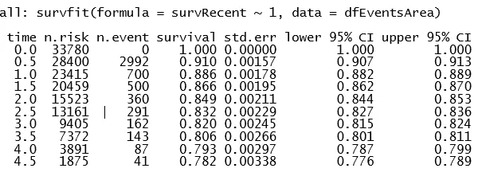

Life Table for Asset Class

时间的单位是年。它表示对其余变量有效的区间。当时的事件数由 n.event 给出，生存概率由生存给出。

ggfortify 库允许我们根据输入数据，仅使用一个命令，就可以绘制出估计的可靠性/存活率函数的可视化图形。

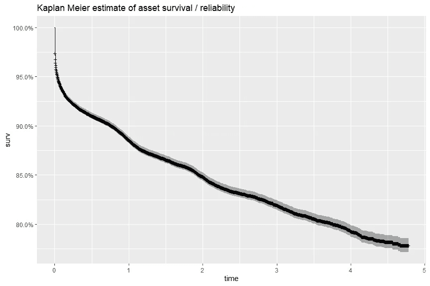

我们还对每个运营区域的资产可靠性感兴趣。

注意，这也可以是每个制造商、安培小时(从物联网或其他仪器获得)、容量等级或任何其他感兴趣的因素。

```
n_recentOU.km <- survfit(Surv(LIFE, EVENT) ~ OU, data=dfEventsArea)
autoplot(n_recentOU.km,main=”Survival probability of asset per area”)
```

正如我们在下面看到的，在可靠性方面，有两个区域似乎很突出——一个高于标准，一个低于标准。

对于一般预期持续 15 年或更长时间的资产类别来说，在过去四年中有超过 60%的资产似乎是一个值得关注的原因。从这里，人们可以对问题的根源展开调查。这可能包括设计不足、操作条件或主要向该地区供货的制造商的质量问题。

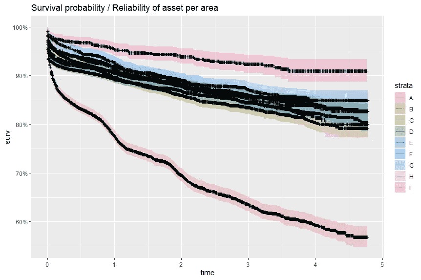

如前所述，我们还可以用参数方法分析故障事件时间数据集。

这在下面举例说明，不要太深入所涉及的理论。从随后的图表中可以看出，参数威布尔生存曲线与非参数曲线吻合得相当好。

```
recent.wbs <- survreg( Surv(LIFE, EVENT)~ 1, data=dfEventsArea, dist='weibull', x=TRUE)# There are multiple ways to parameterize a Weibull distribution. The survreg
# function embeds it in a general location-scale family, which is a
# different parameterization than the rweibull function, and often leads
# to confusion.#   survreg's scale  =    1/(rweibull shape)
#   survreg's intercept = log(rweibull scale)
#   For the log-likelihood all parameterizations lead to the same value.rweibullShape = 1/recent.wbs$scale
rweibullScale  = exp(recent.wbs$coefficients)
weibSurv <- function(x, shape, scale) pweibull(x, shape=shape,
scale=scale, lower.tail=FALSE)# Survivalcurve(weibSurv(x, shape=1/recent.wbs$scale, scale=exp(coef(recent.wbs))), from=0, to=18,
ylim=c(0,1), ylab="Survival probability", xlab="Time")# Survival 2curve(pweibull(x, scale=exp(coef(recent.wbs)), shape=1/recent.wbs$scale,lower.tail=FALSE),from=0, to=5, main="Weibull fit of Survival Probability in first few years of asset class", ylab = "probability", xlab = "time in years", ylim=c(0,1))lines(eventsRecent.km, col="blue")
```

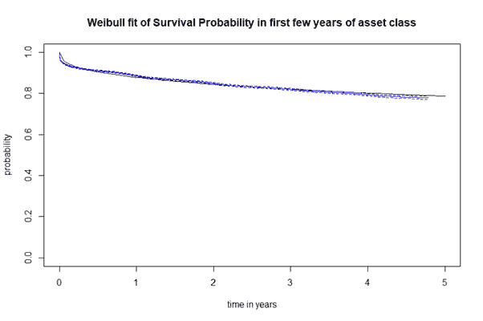

我们还可以推导并绘制风险函数:

```
# Hazard
curve( dweibull(x, shape=1/recent.wbs$scale,
                scale=exp(coef(recent.wbs)))/pweibull(x, scale=exp(coef(recent.wbs)), shape=1/recent.wbs$scale,lower.tail=FALSE),from=0, to=5,
      main="Parametric estimate of failure rate based on recent data"
      , ylab = "h(t)", xlab = "time in years")
```

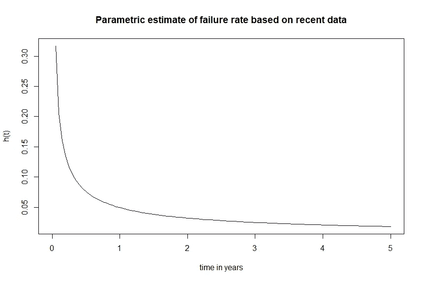

危险函数和浴缸曲线的左侧

上面绘制的危险函数也是浴盆曲线的左侧。

在这种情况下，没有足够的数据来确定该群体的失败概率是否会随着成员年龄的增长而增加。因此，无法构建完整的浴盆曲线。

然而，我们可以从非常高的初始失败率和随后迅速下降的失败率中得出结论，人口中的婴儿死亡率很高。这给了我们进一步的线索，告诉我们应该如何研究提高资产可靠性的方法。

## 结论

精算方法在资产管理中的应用是一个广阔而令人兴奋的领域。我希望你喜欢这个简短的介绍。其他应用包括远期风险预测计算、检查优先级排序和剩余使用寿命估计。