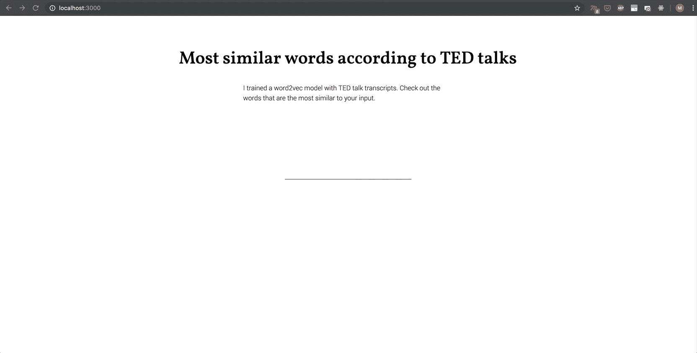
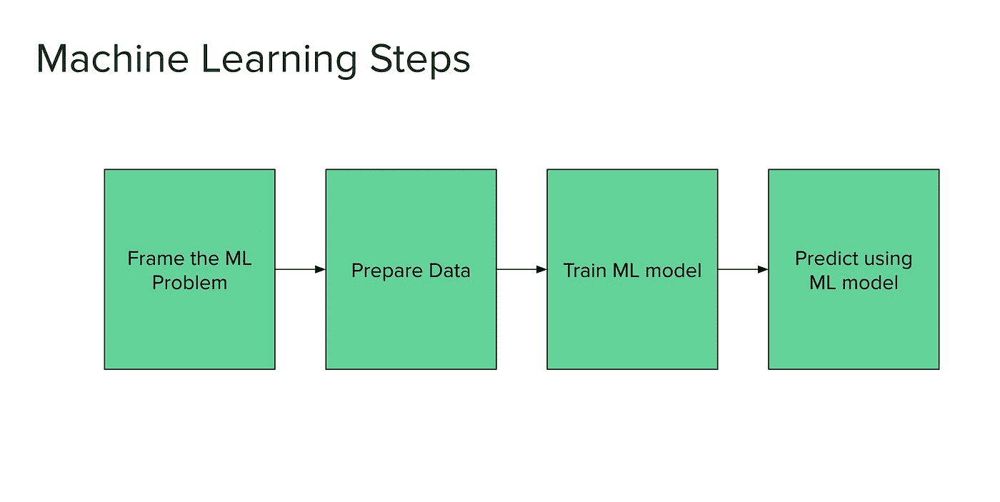
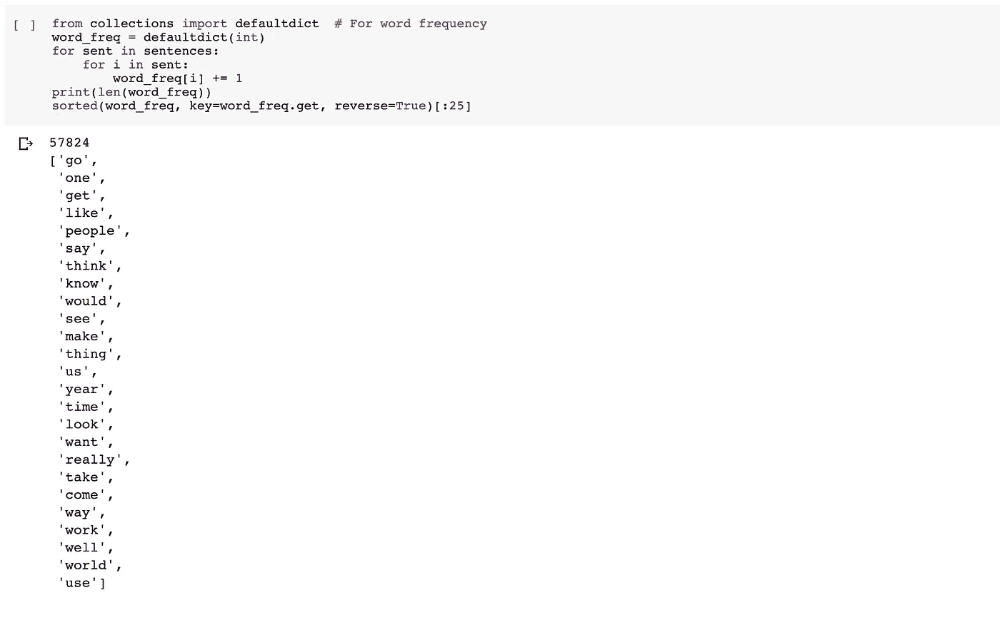
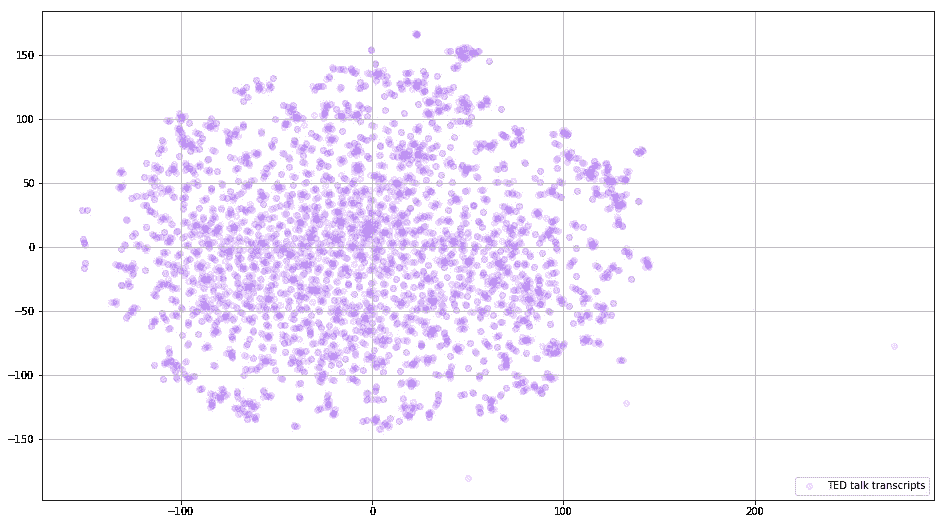
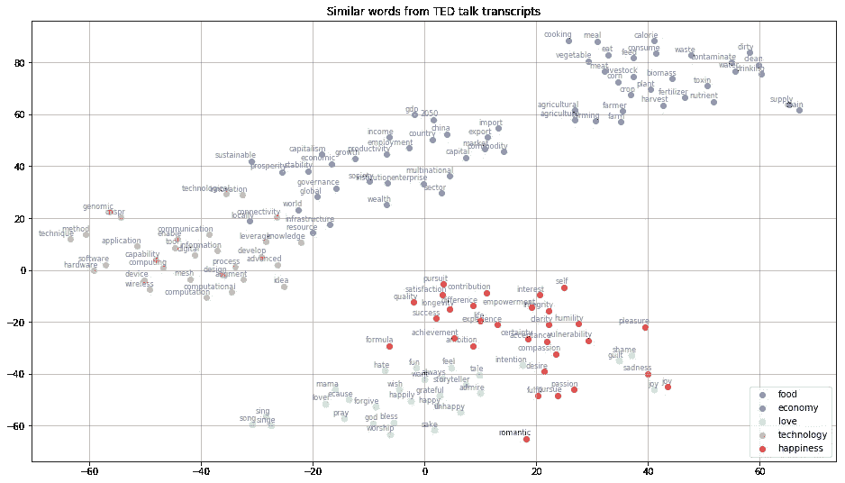

# 利用 TED 演讲进行机器学习

> 原文：<https://towardsdatascience.com/using-ted-talks-for-machine-learning-1cbbf22b4d72?source=collection_archive---------25----------------------->

## 在我第一次尝试建立一个机器学习项目时，我对网上提供的大量资源和教程印象深刻。看看我经历了什么。

Photo by [Miguel Henriques](https://unsplash.com/@miguel_photo?utm_source=medium&utm_medium=referral) on [Unsplash](https://unsplash.com?utm_source=medium&utm_medium=referral)

# **这一切是如何开始的**

今年夏天，我在学习一门关于应用机器学习的课程，并被要求寻找一个项目创意。在我研究的时候，我遇到了一个朋友。这个朋友话很多。我说的很多是指从一个句子开始另一个句子，直到不清楚他在说什么。当他继续说的时候，我试着去想他的句子结构会有多复杂。用积极的话来说:它们一定是在我周围摇曳的美丽而复杂的树。因此我有了一个宽泛的想法:分析文本的结构。我的另一个重要目标是掌握机器学习的四个阶段，即:

1.  框定问题，
2.  准备数据，
3.  训练 ML 模型并
4.  使用 ML 模型进行预测。

在这个领域做了一些研究(实际上是一整袋新的墨西哥卷饼，我真的很惊讶和不知所措)之后，一个特定的算法引起了我的注意:Word2vec 建模([这里](https://medium.com/artists-and-machine-intelligence/ami-residency-part-1-exploring-word-space-andprojecting-meaning-onto-noise-98af7252f749)是 Memo Akten 关于单词嵌入及其应用的一篇非常有趣的文章)。

This is a web application where you can look for similar words according to TED talks, the final result of my work

## **什么是 word2Vec 算法？**

作为输入，该算法接收大量文本数据(演讲、书籍内容、字典、从网站抓取的文本等)，并将每个单词分配给空间中相应的向量(向量的维度通常在 50–1000 左右，取决于数据集)。这些“单词向量”的位置靠近在类似上下文中使用的其他单词，例如在同一个句子中。例如，单词“sing”可以位于“song”附近。但是作业也取决于数据集(不管你用的是新闻文章还是哲学论文，但我会在最后一个阶段讲到)。

# 机器学习的四个阶段

The four stages of a machine learning project

下面我将解释我是如何经历机器学习的四个阶段的。

## 1.框定问题

通常，首先弄清楚你想要解决的问题是什么以及一些成功指标，以及机器学习是否是唯一合适的技术是有帮助的(参见 [this)](https://developers.google.com/machine-learning/problem-framing/) 。但是我没有什么特别的问题，我只是好奇去探索可能性并从中获得灵感。此外，我还想知道如何将机器学习输出用于艺术目的。因此，我的方法是探索各种可能性，并学习建立这样一个项目的基本步骤。

## 2.准备数据

准备数据是最有见地的部分。首先，问题是我想使用什么样的数据。因为 word2Vec 模型使用大量的文本是有帮助的，所以我决定使用英语的 TED 演讲记录。TED 演讲提供了大量关于各种事物的演讲。从 [kaggle](https://www.kaggle.com/rounakbanik/ted-talks) 导入数据集后，该准备数据了。从多个教程(像[这个](https://www.kaggle.com/pierremegret/gensim-word2vec-tutorial)或者[这个](/a-practitioners-guide-to-natural-language-processing-part-i-processing-understanding-text-9f4abfd13e72)一个)我用了以下方法:

英语中有这种缩写，比如“has not”或“is not”，尤其是在口语中，比如 TED 演讲。为了确保这些短语不会影响训练，我扩展了文本语料库中的每个缩写。

**删除特殊字符和数字** 这是一个很容易解释的步骤，用来清理模型并专注于单词。

**删除停用词** 停用词是常用词(如‘a’，‘the’，‘of’，‘in’)，对文本的意义没有贡献，可能会严重影响模型的性能。

**小写全字
这是我经过几次训练后实施的一个步骤。预先降低所有单词的大小写可以极大地改进模型，因为如果没有它，模型将对“雄心”和“抱负”进行不同的处理。**

**对文本进行词汇化** 词汇化或词干化是自然语言处理中的常用术语。在我们所说的语言中，我们经常使用从另一个词派生出来的词。
因此，有必要将这些特定的单词转换回词根，以避免冗余。

**特别是对于 TED talk 抄本:移除抄本注释** 前面所有的步骤实际上都可以应用于所有的 nlp 项目。但是看一看个人的语料库也是很重要的，所以我注意到了在我的文本中频繁出现的抄本评论。因为它们总是以括号开始和结束，所以很容易通过正则表达式删除它们。

我对这些方法的顺序掌握得越精确，越能确保它们真正清理了语料库，训练就越好。

我的最后一步是将语料库分成句子，并将每个句子分成模型的单词标记。

## **3。训练 ML 模型**

就在培训之前，我检查了最常用的单词，以确保准备足够精确。如您所见，最常见的单词不包含任何特殊字符，并且几乎没有停用词。

Checking out the most frequent words before training the model

然后我初始化了模型。我在这个项目中使用了 Gensim Word2Vec 模型。经过多次测试，这个数据集的理想维数是 50。超过 100 导致拟合不足，从而导致不显著的结果。

我将最小计数调整为 50，忽略了所有出现频率低于这个最小计数的单词。这导致了总共 4703 个词汇。后来我用 30 个历元训练了这个模型。培训没有像我预期的那样持续很长时间。总共是 3 分钟。

## **4。使用 ML 模型预测**

由于 word2vec 模型是无监督的，所以我所能测试的就是单词根据一个人的上下文直觉映射的有多好。

最有见地的是绘制模型。这意味着将高维向量投射到 2D 画布上([这里是](/google-news-and-leo-tolstoy-visualizing-word2vec-word-embeddings-with-t-sne-11558d8bd4d)一个很棒的教程，我就是为了这个而遵循的)。由于模型应该理想地将相似的词放置在彼此更近的位置，这些点应该显示某种聚类，因此这个情节非常令人宽慰(你必须想象:在长时间准备数据和训练之后，最终看到这样的结果是值得的)。

Plotting the word2vec model via TSNE

当绘制类似的单词云，如“食物”、“经济”或“爱情”时，你会注意到模型训练得有多好。尤其是看到这些单词云的位置与我将要使用它们的上下文如此接近，令人印象深刻。

## 我的申请

为了使用这个经过训练的模型，我构建了一个 web 应用程序，它不用深入代码就能提供相似的单词。

这真的很有趣。我用了 [node.js](https://nodejs.org/en/) 和 [p5](https://p5js.org/) 。在这里你可以查看我的 [github](https://github.com/mekiii/word2vecApp) 。

## 替代文本语料库

我也试过尼采的书和维基百科的电影情节。由于复杂的文本风格，尼采没有像其他模型那样成功。但是它提供了大量不同的词汇。

维基百科的动机图比谈话语料库大 10 倍，所以准备数据需要更长的时间。结果还没有出来，所以等我的下一篇文章吧😉。

## 结论

总而言之，训练一个模型，而不仅仅是使用一个从模型中派生出来的应用程序，是一次很好的学习经历。现在有如此多的资源，用一些合理的编程知识开始一个项目并不困难。到目前为止，我还不能将这个模型用于艺术目的，但是让我们看看几个月后我会发布什么😉。