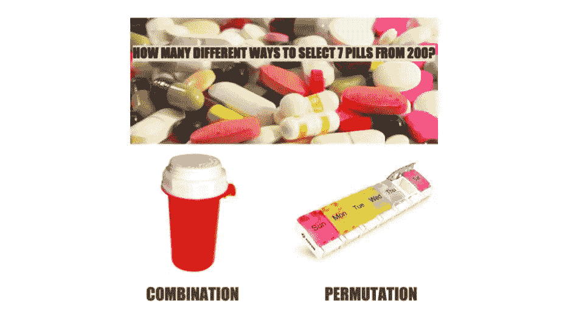
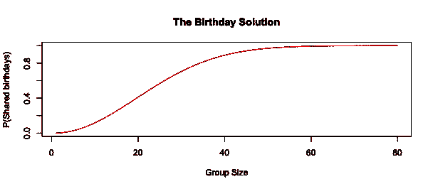
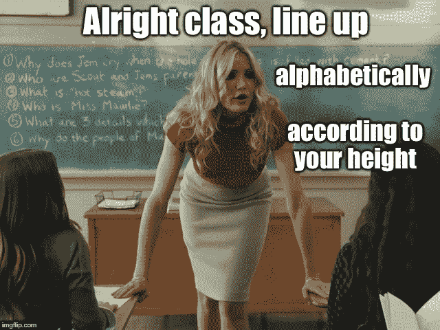

# 利用生日悖论教授概率基础知识

> 原文：<https://towardsdatascience.com/using-the-birthday-paradox-to-teach-probability-fundamentals-c08bbcb351d1?source=collection_archive---------0----------------------->

## 你的两个朋友同一天生日的可能性有多大？

**简答:**这取决于你有多少朋友…


Here’s the audio version of the article, read for you by the author.

今天是我亲爱的人的生日(万岁！)，这是一个神话般的借口来涵盖一些生日语言中的概率基础知识。我们的目标是一起找出这个常年统计作业排行榜榜首:

> 如果你有 N 个人在一个小组里，至少有一个人是同一天生日的概率是多少？

如果你还没想过这个，花点时间猜猜看。想象一下这个小组有 30 个人，他们是 T2。两个人在同一天得到蛋糕的几率有多大？或者，如果这让人望而生畏，只需回答这个问题:你愿意跟我赌 10 美元有生日副本，还是 10 美元没有？让我们看看你的直觉有多好！


我们将作为笑点到达那里，但是首先我们将开发所有你需要自己解决[生日问题](https://en.wikipedia.org/wiki/Birthday_problem)的乐高积木(下面的大字体)

# 最基本的基础

为了纯粹的卖弄学问，让我们抛开这个令人瞠目结舌的启示:概率介于 0 和 1 之间(或者 0%和 100%，如果你愿意)。酷毙了。现在你知道为什么像*“我 1000%确定，他们会迟到”*这样的句子会让数据人员感到恐慌。

# 概率的三种方法

思考概率有三种主要方法:

*   ***基于事件的*** (包括枚举事件并计数)
*   ***基于频率的*** (涉及[分布](https://bit.ly/quaesita_distributions)象征着如果我们在无限平行宇宙中观察我们的现象，事物会如何发生变化)

**如果你上了一堂统计学课，而你的教授并没有采用强调显而易见的东西的木槌敲脑袋的方式，那么让我来详细说明这些东西在你的课本中的什么地方。**

# **基于事件的概率**

> **概率=[分子]/[分母]**

**前几章倾向于从基于事件的概率 方法 ***开始。这是因为这是一个简单的游戏场，大多数人可能已经有了这方面的直觉。*例子:*你的硬币正面朝上的几率有多大？1/2.你在六面骰子上掷出 6 的几率有多大？1/6.这里发生了什么事？*****

> **分子:我们感兴趣的事件可能发生的方式的数量。**
> 
> **分母:任何(相关)事件可能发生的方式的数量。**

**在一枚硬币上，可能的相关事件是正面和反面。这就是 2 的由来。很简单。**

**A small amusement for you on the topic of heads and tails…**

# **清点东西**

**要使用 ***基于事件的概率*** ，您需要能够枚举事件并对其进行计数。这就是为什么你的教科书可能会把你拖进 ***组合学*** 直到你彻底厌倦为止。[组合学](https://en.wikipedia.org/wiki/Combinatorics)给你计算事件发生的方式的数学知识(为了你所追求的分子和分母)。**

**欢迎来到大量的家庭作业问题，都是关于“我有多少种不同的方法可以从 100 名候选人中选出 10 名委员会成员？”( [*17，310，309，456，440*](https://www.hackmath.net/en/calculator/n-choose-k?n=100&k=10&order=0&repeat=0) *)* 或*设置 4 位 PIN 码时，我可以选择多少种不同的选项？”(10000)***

**在基于事件的世界里，所有的积木事件都是同样可能发生的，这样它们就可以不受层层杂乱修饰词的干扰，进行基本的算术运算。这是一个所有的硬币都是公平的，所有的骰子都是平衡的，所有的牌都是无填料的，所有的生日都是同等概率的世界。**

****

**Since we’re on the topic of Counting things.**

**对于生日问题，我们需要快速了解一下[计数](https://en.wikipedia.org/wiki/Combinatorial_principles):**

> **“和”要求您乘以(x)个计数**
> 
> **“或”要求您添加(+)计数**

**如果你喜欢的话，去找一个证明…或者用一个简单的例子来满足你自己，然后继续:如果我有两个素食的选择或者三个荤菜的选择，那么我有多少餐的选择？2 + 3 = 5.如果我可以选择一道主菜和两道甜点中的一道呢？我从多少种不同的食物中选择？5 x 2 = 10。用具体的菜品例子试试，不信都写出来。**

**随机选择的一餐是素食友好型的概率有多大？**

**分子= 2 x 2 = 4；分母= 10。答案= 4/10 = 40%**

****

**The difference between [a combination and a permutation](https://www.calculator.net/permutation-and-combination-calculator.html?cnv=200&crv=7&x=73&y=20) is that **order matters with permutations** but not with combinations. If you think about the image above for a moment, you’ll see why the number of possible options is bigger with permutations than with combinations (if you run the numbers on choosing 7 from 200, you’ll see that the answer on the left is a 13 digit number while on the right it’s a 17 digit number, and if you ogle the formula you’ll see that there’s an extra term in the combination’s denominator that removes the effect of ordering after selection, dumping all the pills into a single container and shaking it). Fun fact: your so-called “combination” bike lock is actually a permutation-with-replacement bike lock. (Technically, a *combination* lock that opens with 1008 should also open with 0810 because order doesn’t matter.)**

# **超越事件**

**你已经学了 3 章，突然你的课本把组合学忘得一干二净。就在你掌握所有这些组合和排列的窍门时(见上图)，它们再也没有消息了。反而突然到处都是[分布](http://bit.ly/quaesita_hist)。那是怎么回事？**

**考虑这个问题:*“你需要等 10 分钟以上公交车的概率有多大？”*这将很难计算(以纳秒为单位？)也很痛苦，因为计算事件意味着你不能把时间当作一件[连续](http://bit.ly/quaesita_datatypes)的事情来处理。更糟糕的是，如果你有一个公共汽车司机，他有可能停下来抽根烟，这取决于公共汽车已经晚点了多长时间。你打算怎么列举呢？你不是。也许计数事件不是你在这里的朋友…**

****

**Your bus is here!**

**输入 ***基于频率的定义*** ，其内容类似于*“如果这是发生在无限个平行宇宙中的随机事件(由我指定的规则管理，呃，假设)，其中有多少个公共汽车需要超过 10 分钟才能到达？”*(平行宇宙？！是啊，难怪我们统计学家有一双疯狂的眼睛。)**

**然后——通常是很久以后——当你在你的[贝叶斯统计](http://bit.ly/quaesita_stc011)教科书中碰到 ***主观定义*** 时，你就可以根据你*感觉*有可能发生的事情来编造[分布](https://flowingdata.com/2011/05/13/plush-statistical-distribution-pillows/)。看看当我们剥夺你列举事件的能力时，你会得到什么样的扭曲的东西？嗯，幸运的是，对于生日问题，*如果我们假设所有 366 个生日的概率是相等的** ，我们可以继续计数。咻！**

***什么，你不喜欢我的假设？战胜你自己——所有的统计都是为了简化假设——否则宇宙就是一个可怕的地方。如果你不喜欢我的假设，那么你需要想出一个不同的解决方案，因为我的对你没有好处。统计变得有创造性，因为我们都被允许做任何我们喜欢的假设。引用乔治·博克斯的话:“所有的解决方案都是错的，但是无论哪一个符合你愿意接受的假设，都可能对你有用。”**

# **不是赞美**

**对于生日问题，我们需要的最后一块积木是补语，也就是通常所说的谦逊的 NOT。**

> **P(非 A) = 1 — P(A)**

**这被解读为*“一个事件(我们将其命名为事件 A，因为我们缺乏创造力)不发生的概率等于 100%减去该事件发生的概率。”***

**那么掷骰子得不到 6 的概率有多大呢？1–1/6 = 5/6**

**好了，就这些。我们准备好解决生日问题了！**

****

**Why is the birthday problem also called the birthday paradox? The paradox has to do with the vast number of birthday possibilities in a group of people versus the surprising probably of a match. The paradox resolution is to flip the problem to think about unique birthdays.**

# **生日问题**

**问题是什么来着？啊，这个:**

> **如果你有 N 个人在一个小组里，至少有一个人是同一天生日的概率是多少？**

**所以，让我们用我们的乐高积木试一试…**

## **生日分母**

**一个人有多少生日选择？366(见上文)。**

**N=30 人我们有多少生日选择？**

**我们有第一个人 366，第二个人 366，第三个人 366……第 n 个人 366。在所有的 and 处放一个乘法，瞧！**

**分母= 366 ^ N =天啊，这么多数字！如果 N 是 30，就是 77 个。这可不仅仅是一个 quattuorvigintillion。(给东西命名不是很好玩吗？)**

## **生日分子**

**准备好头晕吧。我们必须计算所有不同的方式，以使任何两个人中至少有一个匹配。因此，人 1 有 366 个选项，人 29 有 1 个选项，因为他们与人 1 匹配，但也可能是人 2 和人 17 或两对，或者可能是三个人同一天生日，或者…或者…不，这将很快变得混乱，而我们跑来跑去，试图让所有的选项在我们的脑海中保持直线。**

**…这就是为什么这是一个有趣的家庭作业问题。你应该用你的头去撞它，直到你明白其中的诀窍。(或者求网上的作弊码。你就是这样找到这篇博文的吗？太酷了，我抓住你了。)**

## ****解决生日问题的诀窍！****

**与其数出人们过生日的所有方式，不如把问题重新措辞，数出一个简单得多的事情:相反！**

> **p(至少有一个共同的生日)=**
> 
> **1 — P(所有生日都是唯一的)**

**所以我们需要找到这个问题的答案:*“人群中没有任何生日分享的概率是多少？”换句话说，所有生日都是独一无二的概率有多大？***

## **独特的生日分母**

**仍然是 366 ^ N。通过处理互补事件，我们转移了对分子的关注。分母毫发无损。**

## **唯一生日分子**

**这是美丽而光荣的魔法发生的地方！**

**第一个人有 366 个生日选择(贪婪的猪)，第二个人只有 365 个，因为我们强迫他们过不同的生日。如果第一个人出生在 10 月 8 日，我们强迫我们的房间里有 N 个不同的生日，我们会把所有 10 月 8 日生日的人拒之门外。每个申请房间的人都少了一个选择。**

**因此，第 1 个人有 366 个选项，第 2 个人有 365 个选项，第 3 个人有 364 个选项，第 N 个人有(367— N)个选项。**

**如果 N 是 30，放入乘号，嘣！**

**366 x 365 x 364 x 363 x 362 x 361 x 360 x 359 x 357 x 356 x 355 x 354 x 353 x 352 x 351 x 350 x 349 x 348 x 347 x 346 x 345 x 344 x 343 x 342 x 341 x 340 x 339 x 338 x 337 =…**

**呸，又是一个 77 位数的大数字。**

**但是，对我们来说幸运的是，如果我们友好地请求，计算机会替我们处理除法。**

## **不是我们想要的可能性**

**p(所有 30 个生日都是唯一的)=(366 x 365 x 364 x 363 x 362 x 360 x 359 x 358 x 357 x 356 x 355 x 354 x 353 x 352 x 351 x 350 x 349 x 348 x 347 x 346 x 345 x 344 x 343 x 342 x 341 x 340 x 339 x 338 x 338**

**= 0.3(四舍五入到我的注意力范围)**

## **终于，我们想要的答案来了！**

**p(30 人一组的共同生日)= 1 — 0.3 = 70%**

> **一个 30 人的团队，有大约 70%的机会是同一天生日。**

**我希望你没有跟我赌 10 美元，说在一个 30 人的小组中，同一天出生的人比同一天出生的人更少……但是如果你赌了，我不会说不，如果你愿意把它捐给维基百科。**

**赌错了一方，是因为低估了找到一个没有重复房间的房间有多难——如果你是门口的保镖，负责赶走那些生日被占的人，用不了多久，你就会赶走第一个失望的人。**

## **这取决于你有多少朋友…**

**在我的笔记本电脑上打开 2 分钟和 [R](http://bit.ly/vanillar) ，我可以为 N 的任何一个选择画出答案。如果你想知道实际的数字(50%发生在 N = 23 时，99%发生在 N = 55 时)，继续用[在你的浏览器中用我下面丑陋但功能强大的小代码片段玩](https://rdrr.io/snippets/)，不需要安装。**

****

```
# Initialize settings for N = 1:
probability <- 0
numerator <- 366
denominator <- 366# Loops are terrible in R, let's make one anyways:
for (N in 2:80) {
  numerator <- numerator * (366 + 1 - N)
  denominator <- denominator * 366
  p <- 1 - (numerator / denominator)
  probability <- c(probability, p)
}# Look at the answer to 2 decimal places:
paste("For N =", 1:80, "prob is", round(probability, 2))# Plot!
plot(1:80, probability, xlab = "Group Size", ylab = "P(Shared birthdays)", type = "l", col = "red", main = "The Birthday Solution")
```

# **我们在这里学到了什么？**

**除了一些概率基础知识(比如不同的概率方法、补数、分子和分母的取值)和计数原则(求和规则和乘积规则)之外，这篇文章要讲的是*为什么*你会按照一定的顺序学习某些概念。**

****

**为什么数数在你的课本中是一件大事，然后突然消失了，让每个人都不高兴？事实证明，这主要是达到目的的一种手段，因为假设所有基本事件都同样可能发生，对于大多数专业人士来说太业余了，以至于无法接受… [甚至对于生日来说](https://www.panix.com/~murphy/bday.html)。有趣的是，当非专业人士想到我们这些统计人员整天都在做什么时，他们往往会想到算牌和扔硬币。有些谣言是很难抹杀的！**

**生日问题之所以成为统计学本科生经历中的一个经典问题，很大程度上是因为它给了你足够的痛苦来抓住一个关键点:初出茅庐的统计学家需要学习如何重新表述问题，以便他们的活动部分更容易处理。蛮力方法往往太难计算，所以我们学会了斜着看事情。如果你选择[统计](http://bit.ly/quaesita_statistics)的生活，那就做好大量翻转和反转的准备。**

**这篇文章有意不同于我平时的文章。有时候尝试新的东西来看看人们是否喜欢它们是很好的——如果你想知道更多这是从哪里来的，喜欢和分享是你让我知道的方式。❤**

# **感谢阅读！人工智能课程怎么样？**

**如果你在这里玩得开心，并且你正在寻找一个为初学者和专家设计的有趣的应用人工智能课程，这里有一个我为你制作的娱乐课程:**

**Enjoy the entire course playlist here: [bit.ly/machinefriend](http://bit.ly/machinefriend)**