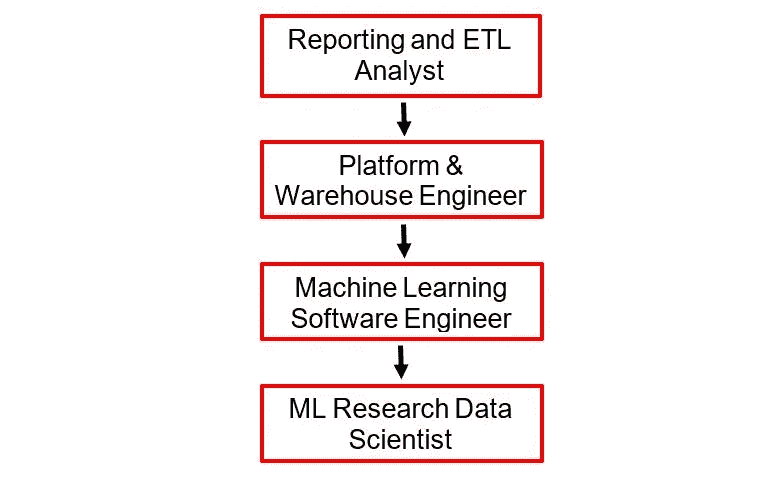

# 利用数据科学谱找到适合您的数据科学职业道路

> 原文：<https://towardsdatascience.com/using-the-data-science-spectrum-to-find-the-right-data-science-career-path-for-you-eff98b6c589c?source=collection_archive---------11----------------------->

## 并非所有的数据科学工作都是一样的

我刚大学毕业的时候，数据科学还没有作为一个职业存在。我受过精算师和统计师的训练，所以我去做了精算分析师。

当我第一次听说数据科学时，我已经从事过各种与数据相关的工作，所以当我申请第一个真正的数据科学职位时，我已经有了多年的相关经验。

虽然研究生数据科学角色确实存在，但这些角色可能很难获得，而且竞争非常激烈。更重要的是，顾名思义，他们通常是针对刚毕业的学生，而不是那些试图在职业生涯中期跳槽的人。

因此，很少有人的第一个数据相关职位是数据科学家。

更常见的情况是，人们从一个非数据科学家但与数据相关的角色开始，然后利用这一经验说服雇主他们有能力担任数据科学家。

与申请数据科学职位相比，针对非数据科学家的数据相关职位通常是更有效的进入数据科学的方法，特别是对于那些来自非数据背景的人来说，因为这些职位通常比数据科学家职位更常见，并且通常对技术和经验的要求更低。

这当然提出了一个问题:哪些与数据相关的角色是进入数据科学的最佳敲门砖？答案取决于你对数据科学的兴趣所在。

# 数据科学领域

数据科学通常被视为统计学和计算机科学的结合，根据这些学科对特定职位的相对重要性，在该行业中的角色也有所不同。我称之为数据科学光谱。

例如，更接近统计端的数据科学角色可能专注于使用统计和机器学习技术来从数据中获得洞察力，而更接近计算机科学端的角色可能更专注于开发机器学习模型，以作为人工智能系统的一部分进行部署。

在这个范围内，角色可以根据资格水平和所需的技术技能而有所不同。

我还将与数据相关的角色包括在内，这些角色虽然不是实际的数据科学职位，但与数据科学角色有一些重叠，可以为数据科学职业道路提供早期步骤。

因为数据科学角色可以存在于光谱上的任何一点，而非数据科学角色通常被错误地命名为“数据科学家”(反之亦然)，所以仅根据职称来判断数据相关角色可能会产生误导。

然而，如果你看了足够多的数据相关职位的招聘广告，模式就开始出现了，使得识别各种类型的数据角色成为可能，而与职位无关。

# 七种类型的数据角色

在 2019 年 4 月 22 日至 2019 年 5 月 5 日期间，我从 LinkedIn 收集了 200 个数据相关角色的招聘广告(即，标题为数据科学家(100 个广告)、数据分析师(40 个广告)、商业智能分析师(20 个广告)、机器学习工程师(20 个广告)和数据工程师(20 个广告)的角色)，横跨四个英语国家(澳大利亚、加拿大、英国和美国)。

我超越了“数据科学家”这个头衔的工作，考虑到了潜在的命名错误，以及不同雇主对一份工作具体要求的差异。

通过将 k-means 聚类应用于这些广告，使用选择标准作为特征，我能够将招聘广告分组为七个聚类或角色类型。这些是:

1.  报告和 ETL 分析师；
2.  数据科学通才；
3.  洞察分析师；
4.  ML 研究数据科学家；
5.  ML 软件工程师；
6.  平台和仓库工程师；和
7.  数据科学专家。

我在我的文章中详细描述了这些角色:[你是什么类型的数据科学家？](/what-type-of-data-scientist-are-you-84c3c2b9fc16)。但是，下表总结了每种角色类型所需的典型学位要求，包括级别和领域以及关键技术。

根据他们在数据科学领域所处的位置，将上面列出的七种角色类型进行分组，并根据所涉及的技术要求级别对他们进行排名，从而出现了两条进入数据科学的职业道路。

# 职业道路#1:统计和洞察数据科学

对于那些有统计或数学背景的人来说，洞察分析师的角色可以提供进入众所周知的数据科学大门的一只脚，而不需要硕士学位。

Insights analyst 角色通常以“数据分析师”的头衔进行广告宣传，尽管在一些组织中也可能以“数据科学家”的职位进行广告宣传，并且通常专注于提取、争论和分析数据，以便提供见解并生成报告和/或仪表板。这些技能都与在统计领域工作的数据科学家通常需要的技能相重叠。

insights 分析师角色和真正的数据科学职位之间的主要区别在于，insights 分析师通常不需要拥有数据科学家所需的机器学习和统计技术方面的高级知识。然而，这并不意味着这些技能不能在担任这样的角色时得到发展(无论是通过开发涉及这些技能的工作项目，还是通过额外的学习)。

随着相关技能和经验的发展，洞察分析师角色自然会成为数据科学通才，而这又自然会成为数据科学专家角色。

# 职业道路#2:工程和开发数据科学

另一方面，对于那些更接近计算机科学的人来说，报告和 ETL 分析师、平台和仓库工程师或 ML 软件工程师都可以提供数据科学的切入点，这取决于你的计算机科学和软件开发技能水平。

报告和 ETL 分析师(通常以“数据分析师”或“商业智能分析师”的头衔宣传)，以及平台和仓库工程师(通常宣传为“数据工程师”)角色都非常强调能够管理数据库、仓库或平台中的数据。

两者通常只需要计算机科学学士学位，报告和 ETL 分析师倾向于更关注传统(关系型)数据库，平台和仓库工程师更关注更现代的(非关系型)大数据平台。

这些角色通常位于数据科学/分析团队中，让他们有机会与数据科学家合作，尽管在机器学习和统计方面没有相同的技术要求。然而，根据团队经理的态度，这些角色的人可能有能力随着时间的推移提升技能并过渡到数据科学角色。

平台和仓库工程师角色也经常有很强的软件开发方面，导致这些角色自然地进入 ML 软件工程师角色(通常在标题“机器学习工程师”下广告)。

机器学习软件工程师和机器学习研究数据科学家本质上是一枚硬币的两面，前者专注于模型部署，后者专注于模型开发。因此，随着技能和资格的增长，机器学习软件工程师角色可以自然地成为机器学习研究数据科学家。

上面介绍的两条职业道路绝不是进入数据科学的唯一职业道路。仅仅因为你开始是一名报告和 ETL 分析师，并不意味着你不会有一天成为数据科学专家。

这不是*捉鬼敢死队*，溪流可以穿越。

举例来说，我自己的职业生涯包括在成为数据科学通才之前担任洞察分析师，然后成为 ML Research 数据科学家。

然而，对于那些希望过渡到数据科学，或在数据科学阶梯上向上移动的人来说，这些职业道路提供了一个模板来指导你，并提供了一种方法来确定你的技能在数据科学层次中的位置。

因此，如果你正在寻找数据科学方面的角色，找到你的技能最接近的角色类型，并开始搜索和申请该类型的数据相关角色。一旦你得到了第一个角色，看看接下来是什么角色，然后开始朝那个方向努力。

数据科学是一个旅程，就像任何其他旅程一样，如果你有一张地图，这将容易得多。

*Genevieve Hayes 博士是数据科学家、教育家和人工智能及分析专家，拥有*[*Genevieve Hayes Consulting*](https://www.genevievehayes.com/)*。你可以在*[*LinkedIn*](https://www.linkedin.com/in/gkhayes/)*或者*[*Twitter*](https://twitter.com/genevievekhayes)*上关注她。她还是* [*价值驱动数据科学*](https://www.genevievehayes.com/episodes/) *的主持人，这是一个每月两次的播客，面向希望最大化其数据和数据团队价值的企业。*

*想要发掘企业数据的价值，但不知道从哪里开始？**[***下载免费的数据科学项目发现指南。***](https://www.genevievehayes.com/discovery-guide/)*