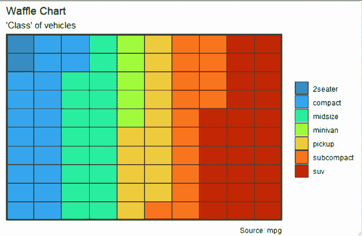
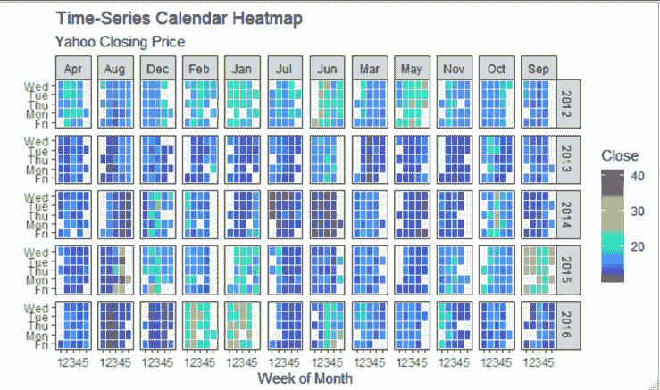
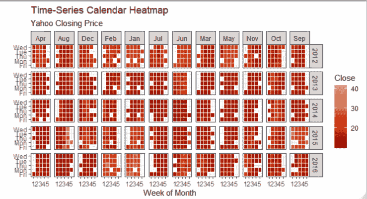

# 在 R 中使用来自 Google 的新 Turbo 调色板

> 原文：<https://towardsdatascience.com/using-the-new-turbo-palette-from-google-in-r-af19b9424cc0?source=collection_archive---------19----------------------->

注意:这是最初发布在我的博客上的[。](https://davidbaranger.com/2019/08/22/using-the-new-turbo-palette-from-google-in-r/)

几天前，一名来自谷歌[的人工智能工程师发布了一个他开发的新调色板](https://ai.googleblog.com/2019/08/turbo-improved-rainbow-colormap-for.html?m=1)。这个调色板“Turbo”和广泛使用的“jet”调色板一样丰富多彩，但感觉上是统一的，并且像[的绿色调色板](https://cran.r-project.org/web/packages/viridis/vignettes/intro-to-viridis.html)一样对色盲友好。他分享了使用调色板的 python 和 C 代码，但 R 中没有任何内容。其他人从[开始发布 R](https://gist.github.com/jlmelville/be981e2f36485d8ef9616aef60fd52ab) 中的代码，尽管还需要一点工作来使其可用于我最喜欢的图形包 ggplot2。这是一篇关于如何快速开始在 ggplots 中使用 Turbo 的短文。

编辑:这篇文章的代码现在也可以在这里找到:[https://github.com/dbaranger/turbo_palette_R](https://github.com/dbaranger/turbo_palette_R)

首先，我们需要颜色的实际值，这是在 sRGB 给出的。然后我把这些转换成十六进制代码，这就是 ggplot2 使用的。

```
install.packages("colorspace")
library(colorspace)A<-c((0.18995),(0.19483),(0.19956),(0.20415),(0.2086),(0.21291),(0.21708),(0.22111),(0.225),(0.22875),(0.23236),(0.23582),(0.23915),(0.24234),(0.24539),(0.2483),(0.25107),(0.25369),(0.25618),(0.25853),(0.26074),(0.2628),(0.26473),(0.26652),(0.26816),(0.26967),(0.27103),(0.27226),(0.27334),(0.27429),(0.27509),(0.27576),(0.27628),(0.27667),(0.27691),(0.27701),(0.27698),(0.2768),(0.27648),(0.27603),(0.27543),(0.27469),(0.27381),(0.27273),(0.27106),(0.26878),(0.26592),(0.26252),(0.25862),(0.25425),(0.24946),(0.24427),(0.23874),(0.23288),(0.22676),(0.22039),(0.21382),(0.20708),(0.20021),(0.19326),(0.18625),(0.17923),(0.17223),(0.16529),(0.15844),(0.15173),(0.14519),(0.13886),(0.13278),(0.12698),(0.12151),(0.11639),(0.11167),(0.10738),(0.10357),(0.10026),(0.0975),(0.09532),(0.09377),(0.09287),(0.09267),(0.0932),(0.09451),(0.09662),(0.09958),(0.10342),(0.10815),(0.11374),(0.12014),(0.12733),(0.13526),(0.14391),(0.15323),(0.16319),(0.17377),(0.18491),(0.19659),(0.20877),(0.22142),(0.23449),(0.24797),(0.2618),(0.27597),(0.29042),(0.30513),(0.32006),(0.33517),(0.35043),(0.36581),(0.38127),(0.39678),(0.41229),(0.42778),(0.44321),(0.45854),(0.47375),(0.48879),(0.50362),(0.51822),(0.53255),(0.54658),(0.56026),(0.57357),(0.58646),(0.59891),(0.61088),(0.62233),(0.63323),(0.64362),(0.65394),(0.66428),(0.67462),(0.68494),(0.69525),(0.70553),(0.71577),(0.72596),(0.7361),(0.74617),(0.75617),(0.76608),(0.77591),(0.78563),(0.79524),(0.80473),(0.8141),(0.82333),(0.83241),(0.84133),(0.8501),(0.85868),(0.86709),(0.8753),(0.88331),(0.89112),(0.8987),(0.90605),(0.91317),(0.92004),(0.92666),(0.93301),(0.93909),(0.94489),(0.95039),(0.9556),(0.96049),(0.96507),(0.96931),(0.97323),(0.97679),(0.98),(0.98289),(0.98549),(0.98781),(0.98986),(0.99163),(0.99314),(0.99438),(0.99535),(0.99607),(0.99654),(0.99675),(0.99672),(0.99644),(0.99593),(0.99517),(0.99419),(0.99297),(0.99153),(0.98987),(0.98799),(0.9859),(0.9836),(0.98108),(0.97837),(0.97545),(0.97234),(0.96904),(0.96555),(0.96187),(0.95801),(0.95398),(0.94977),(0.94538),(0.94084),(0.93612),(0.93125),(0.92623),(0.92105),(0.91572),(0.91024),(0.90463),(0.89888),(0.89298),(0.88691),(0.88066),(0.87422),(0.8676),(0.86079),(0.8538),(0.84662),(0.83926),(0.83172),(0.82399),(0.81608),(0.80799),(0.79971),(0.79125),(0.7826),(0.77377),(0.76476),(0.75556),(0.74617),(0.73661),(0.72686),(0.71692),(0.7068),(0.6965),(0.68602),(0.67535),(0.66449),(0.65345),(0.64223),(0.63082),(0.61923),(0.60746),(0.5955),(0.58336),(0.57103),(0.55852),(0.54583),(0.53295),(0.51989),(0.50664),(0.49321),(0.4796))
B<-c((0.07176),(0.08339),(0.09498),(0.10652),(0.11802),(0.12947),(0.14087),(0.15223),(0.16354),(0.17481),(0.18603),(0.1972),(0.20833),(0.21941),(0.23044),(0.24143),(0.25237),(0.26327),(0.27412),(0.28492),(0.29568),(0.30639),(0.31706),(0.32768),(0.33825),(0.34878),(0.35926),(0.3697),(0.38008),(0.39043),(0.40072),(0.41097),(0.42118),(0.43134),(0.44145),(0.45152),(0.46153),(0.47151),(0.48144),(0.49132),(0.50115),(0.51094),(0.52069),(0.5304),(0.54015),(0.54995),(0.55979),(0.56967),(0.57958),(0.5895),(0.59943),(0.60937),(0.61931),(0.62923),(0.63913),(0.64901),(0.65886),(0.66866),(0.67842),(0.68812),(0.69775),(0.70732),(0.7168),(0.7262),(0.73551),(0.74472),(0.75381),(0.76279),(0.77165),(0.78037),(0.78896),(0.7974),(0.80569),(0.81381),(0.82177),(0.82955),(0.83714),(0.84455),(0.85175),(0.85875),(0.86554),(0.87211),(0.87844),(0.88454),(0.8904),(0.896),(0.90142),(0.90673),(0.91193),(0.91701),(0.92197),(0.9268),(0.93151),(0.93609),(0.94053),(0.94484),(0.94901),(0.95304),(0.95692),(0.96065),(0.96423),(0.96765),(0.97092),(0.97403),(0.97697),(0.97974),(0.98234),(0.98477),(0.98702),(0.98909),(0.99098),(0.99268),(0.99419),(0.99551),(0.99663),(0.99755),(0.99828),(0.99879),(0.9991),(0.99919),(0.99907),(0.99873),(0.99817),(0.99739),(0.99638),(0.99514),(0.99366),(0.99195),(0.98999),(0.98775),(0.98524),(0.98246),(0.97941),(0.9761),(0.97255),(0.96875),(0.9647),(0.96043),(0.95593),(0.95121),(0.94627),(0.94113),(0.93579),(0.93025),(0.92452),(0.91861),(0.91253),(0.90627),(0.89986),(0.89328),(0.88655),(0.87968),(0.87267),(0.86553),(0.85826),(0.85087),(0.84337),(0.83576),(0.82806),(0.82025),(0.81236),(0.80439),(0.79634),(0.78823),(0.78005),(0.77181),(0.76352),(0.75519),(0.74682),(0.73842),(0.73),(0.7214),(0.7125),(0.7033),(0.69382),(0.68408),(0.67408),(0.66386),(0.65341),(0.64277),(0.63193),(0.62093),(0.60977),(0.59846),(0.58703),(0.57549),(0.56386),(0.55214),(0.54036),(0.52854),(0.51667),(0.50479),(0.49291),(0.48104),(0.4692),(0.4574),(0.44565),(0.43399),(0.42241),(0.41093),(0.39958),(0.38836),(0.37729),(0.36638),(0.35566),(0.34513),(0.33482),(0.32473),(0.31489),(0.3053),(0.29599),(0.28696),(0.27824),(0.26981),(0.26152),(0.25334),(0.24526),(0.2373),(0.22945),(0.2217),(0.21407),(0.20654),(0.19912),(0.19182),(0.18462),(0.17753),(0.17055),(0.16368),(0.15693),(0.15028),(0.14374),(0.13731),(0.13098),(0.12477),(0.11867),(0.11268),(0.1068),(0.10102),(0.09536),(0.0898),(0.08436),(0.07902),(0.0738),(0.06868),(0.06367),(0.05878),(0.05399),(0.04931),(0.04474),(0.04028),(0.03593),(0.03169),(0.02756),(0.02354),(0.01963),(0.01583))
C<-c((0.23217),(0.26149),(0.29024),(0.31844),(0.34607),(0.37314),(0.39964),(0.42558),(0.45096),(0.47578),(0.50004),(0.52373),(0.54686),(0.56942),(0.59142),(0.61286),(0.63374),(0.65406),(0.67381),(0.693),(0.71162),(0.72968),(0.74718),(0.76412),(0.7805),(0.79631),(0.81156),(0.82624),(0.84037),(0.85393),(0.86692),(0.87936),(0.89123),(0.90254),(0.91328),(0.92347),(0.93309),(0.94214),(0.95064),(0.95857),(0.96594),(0.97275),(0.97899),(0.98461),(0.9893),(0.99303),(0.99583),(0.99773),(0.99876),(0.99896),(0.99835),(0.99697),(0.99485),(0.99202),(0.98851),(0.98436),(0.97959),(0.97423),(0.96833),(0.9619),(0.95498),(0.94761),(0.93981),(0.93161),(0.92305),(0.91416),(0.90496),(0.8955),(0.8858),(0.8759),(0.86581),(0.85559),(0.84525),(0.83484),(0.82437),(0.81389),(0.80342),(0.79299),(0.78264),(0.7724),(0.7623),(0.75237),(0.74265),(0.73316),(0.72393),(0.715),(0.70599),(0.69651),(0.6866),(0.67627),(0.66556),(0.65448),(0.64308),(0.63137),(0.61938),(0.60713),(0.59466),(0.58199),(0.56914),(0.55614),(0.54303),(0.52981),(0.51653),(0.50321),(0.48987),(0.47654),(0.46325),(0.45002),(0.43688),(0.42386),(0.41098),(0.39826),(0.38575),(0.37345),(0.3614),(0.34963),(0.33816),(0.32701),(0.31622),(0.30581),(0.29581),(0.28623),(0.27712),(0.26849),(0.26038),(0.2528),(0.24579),(0.23937),(0.23356),(0.22835),(0.2237),(0.2196),(0.21602),(0.21294),(0.21032),(0.20815),(0.2064),(0.20504),(0.20406),(0.20343),(0.20311),(0.2031),(0.20336),(0.20386),(0.20459),(0.20552),(0.20663),(0.20788),(0.20926),(0.21074),(0.2123),(0.21391),(0.21555),(0.21719),(0.2188),(0.22038),(0.22188),(0.22328),(0.22456),(0.2257),(0.22667),(0.22744),(0.228),(0.22831),(0.22836),(0.22811),(0.22754),(0.22663),(0.22536),(0.22369),(0.22161),(0.21918),(0.2165),(0.21358),(0.21043),(0.20706),(0.20348),(0.19971),(0.19577),(0.19165),(0.18738),(0.18297),(0.17842),(0.17376),(0.16899),(0.16412),(0.15918),(0.15417),(0.1491),(0.14398),(0.13883),(0.13367),(0.12849),(0.12332),(0.11817),(0.11305),(0.10797),(0.10294),(0.09798),(0.0931),(0.08831),(0.08362),(0.07905),(0.07461),(0.07031),(0.06616),(0.06218),(0.05837),(0.05475),(0.05134),(0.04814),(0.04516),(0.04243),(0.03993),(0.03753),(0.03521),(0.03297),(0.03082),(0.02875),(0.02677),(0.02487),(0.02305),(0.02131),(0.01966),(0.01809),(0.0166),(0.0152),(0.01387),(0.01264),(0.01148),(0.01041),(0.00942),(0.00851),(0.00769),(0.00695),(0.00629),(0.00571),(0.00522),(0.00481),(0.00449),(0.00424),(0.00408),(0.00401),(0.00401),(0.0041),(0.00427),(0.00453),(0.00486),(0.00529),(0.00579),(0.00638),(0.00705),(0.0078),(0.00863),(0.00955),(0.01055))

turbo_colormap_data<-cbind(A,B,C) 
turbo_colormap_data_sRGB<-sRGB(turbo_colormap_data)
turbo_colormap_data_HEX = hex(turbo_colormap_data_sRGB)
```

现在让我们来看看调色板:

```
install.packages("pals")
library(pals)TurboPalette<-colorRampPalette(colors = turbo_colormap_data_HEX ,space="rgb", interpolate = "spline")
pal.test(TurboPalette)
```


整体 Turbo 表现相当不错。它缺少的一个地方是亮度曲线(灰色线，右下角)。亮度在调色板的中途达到峰值，因此使用整个调色板进行连续缩放可能不是在所有情况下都能很好地工作。

最后，我编写了一个更短的助手函数，以便更容易地将调色板集成到 ggplot2 中:

```
Turbo <- function(pal.min = 0,pal.max = 1,out.colors = NULL,pal = turbo_colormap_data_HEX,reverse = F) {
 # pal.min = lower bound of the palette to use [0,1]
 # pal.max = upper bound of the palette [0,1]
 # out.colors = specify the number of colors to return if out.colors = 1, will return pal.min color. if unspecified, will return all the colors in the original palette that fall within the min and max boundaries
 # pal = vector of colors (HEX) in palette
 # reverse = flip palette T/F - performed as last step

  if(pal.min == 0){pal.start = 1}
  if(pal.min > 0){pal.start = round(length(pal)*pal.min) }
  pal.end = round(length(pal)*pal.max )
  out = pal[pal.start:pal.end]

 if(!is.null(out.colors)){
   pal2 = colorRampPalette(colors = out ,space="rgb", interpolate = "linear")
   out = pal2(out.colors)
 }
  if(reverse == T){out = rev(out)}
  return(out)
}
```

该函数将调色板分成子集，如果需要，将输出指定数量的颜色(对分类变量有用)。

现在让我们来兜一圈吧！下面我从 http://r-statistics.co/的[中借用](http://r-statistics.co/)[分类变量](http://r-statistics.co/Top50-Ggplot2-Visualizations-MasterList-R-Code.html#Waffle%20Chart)和一个连续变量。

分类变量是一个[华夫图](http://r-statistics.co/Top50-Ggplot2-Visualizations-MasterList-R-Code.html#Waffle%20Chart)。请注意，下面我已经注释掉了原来的颜色，它是一个 [colorBrewer](http://colorbrewer2.org/) 刻度，并替换为一个手动刻度，其颜色由我的新 Turbo()函数提供:

```
var <- mpg$class  # the categorical data 
nrows <- 10
df <- expand.grid(y = 1:nrows, x = 1:nrows)
categ_table <- round(table(var) * ((nrows*nrows)/(length(var))))
categ_table
df$category <- factor(rep(names(categ_table), categ_table)) ggplot(df, aes(x = x, y = y, fill = category)) + 
  geom_tile(color = "black", size = 0.5) +
  scale_x_continuous(expand = c(0, 0)) +
  scale_y_continuous(expand = c(0, 0), trans = 'reverse') +
 ####scale_fill_brewer(palette = "Set3") +####
  scale_fill_manual(values = Turbo(out.colors = 7))+ ## This is the change
  labs(title="Waffle Chart", subtitle="'Class' of vehicles",
       caption="Source: mpg") + 
  theme(panel.border = element_rect(size = 2),
        plot.title = element_text(size = rel(1.2)),
        axis.text = element_blank(),
        axis.title = element_blank(),
        axis.ticks = element_blank(),
        legend.title = element_blank(),
        legend.position = "right")
```

我已经用“scale _ fill _ manual(values = Turbo(out . colors = 7)”替换了“scale _ fill _ brewer(palette = " set 3"”。


如果我们不喜欢它的颜色，两端很暗，我们可以改变调色板的最小值和最大值:“scale _ fill _ manual(values = Turbo(out . colors = 7，pal.min = .1，pal.max = .9)”



好多了！现在让我们用一个连续的尺度来尝试一下，像[热图](http://r-statistics.co/Top50-Ggplot2-Visualizations-MasterList-R-Code.html#Calendar%20Heat%20Map)，再次借用 http://r-statistics.co/。

```
library(ggplot2)
library(plyr)
library(scales)
library(zoo)
df <- read.csv("https://raw.githubusercontent.com/selva86/datasets/master/yahoo.csv")
df$date <- as.Date(df$date)  # format date
df <- df[df$year >= 2012, ]  # filter red years
# Create Month Week
df$yearmonth <- as.yearmon(df$date)
df$yearmonthf <- factor(df$yearmonth)
df <- ddply(df,.(yearmonthf), transform, monthweek=1+week-min(week))  # compute week number of month
df <- df[, c("year", "yearmonthf", "monthf", "week", "monthweek", "weekdayf", "VIX.Close")]
# Plot
ggplot(df, aes(monthweek, weekdayf, fill = VIX.Close)) + 
  geom_tile(colour = "white") + 
  facet_grid(year~monthf) + 
  ###scale_fill_gradient(low="red", high="green") +##
  scale_fill_gradientn(colours = Turbo()) + ## this is new
  labs(x="Week of Month",
       y="",
       title = "Time-Series Calendar Heatmap", 
       subtitle="Yahoo Closing Price", 
       fill="Close")
```

请注意，我已经将“scale_fill_gradient(low="red "，high="green ")”替换为“scale _ fill _ gradient n(colours = Turbo())”。



上面图的一个问题是绿色“弹出”太多，所以我们注意中间值，而不是最大值。这是因为，正如上面的第一张图所示，亮度曲线在调色板的中间达到峰值，在绿色部分。因此，我们可以用颜色的子集来绘图，并翻转调色板，使较浅的颜色更高。这里我把填充改为:“scale _ fill _ gradient n(colors = Turbo(pal . min = . 6，pal.max = 1，reverse = T))



现在，哪一天包含最高值就清楚多了。

就这些了，祝大家策划愉快！