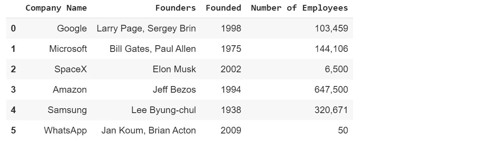
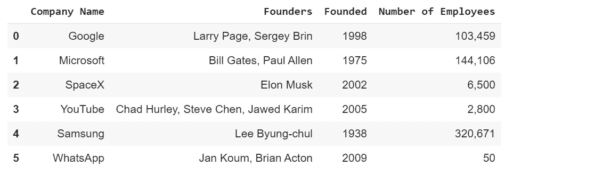
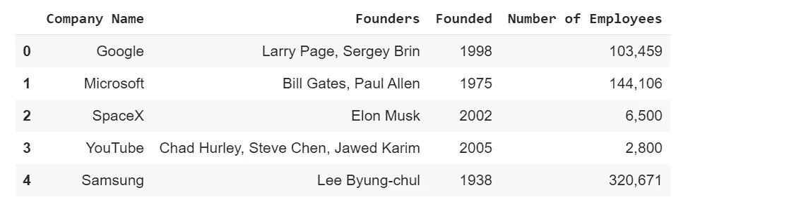

# 使用熊猫数据框作为数据库。

> 原文：<https://towardsdatascience.com/using-the-pandas-data-frame-as-a-database-282edec5a3ab?source=collection_archive---------5----------------------->

让我们了解如何使用熊猫数据框作为数据库。


Image Credits: [Usejournal](https://blog.usejournal.com/tagged/pandas-dataframe)

在开始之前，让我快速介绍一下 pandas data frame:它是一个 python 库，为 python 编程语言的数据分析工具提供了高性能和易于使用的数据结构。下面的文章解释了在熊猫数据框上执行的原始操作。

[](/manipulating-the-data-with-pandas-using-python-be6c5dfabd47) [## 使用 Python 操作熊猫的数据。

### 让我们用 Python 来计算我的熊猫数据框架兼职收入。

towardsdatascience.com](/manipulating-the-data-with-pandas-using-python-be6c5dfabd47) 

让我们开始吧，这是一个编程教程，所以我推荐你们和我一起练习。我喜欢使用谷歌笔记本或 T2 笔记本。简而言之，我将教你们如何使用熊猫数据框作为数据库来存储数据并对其执行一些基本操作。与数据库相比，此数据框具有几乎所有的功能。它几乎类似于一个数据库。**也要获得完整代码请访问我的** [**GitHub 资源库**](https://github.com/Tanu-N-Prabhu/Python/blob/master/Using_the_Pandas_Data_Frame_as_a_Database_.ipynb) **下面:**

[](https://github.com/Tanu-N-Prabhu/Python/blob/master/Using_the_Pandas_Data_Frame_as_a_Database_.ipynb) [## 塔努-北帕布/Python

### 此时您不能执行该操作。您已使用另一个标签页或窗口登录。您已在另一个选项卡中注销，或者…

github.com](https://github.com/Tanu-N-Prabhu/Python/blob/master/Using_the_Pandas_Data_Frame_as_a_Database_.ipynb) 

## 本教程将遵循的步骤有

1.  创建熊猫数据框

2.向数据框添加行

3.从数据框中删除行

4.从数据框中访问行的值

5.更改数据框中行的值

## 让我们看看如何执行上面声明的所有步骤

## **1。创建熊猫数据框**

要创建数据框，首先需要导入数据框，然后必须按如下所示的顺序指定列名和值:

```
import pandas as pd
```

让我们创建一个新的数据框。我正在存储公司名称、创始人、创办人和员工人数。您可以在数据框中存储您选择的数据。

```
df = pd.DataFrame({‘Company Name’:[‘Google’, ‘Microsoft’, ‘SpaceX’,‘Amazon’,‘Samsung’]‘Founders’:[‘Larry Page, Sergey Brin’, ‘Bill Gates, Paul Allen’,’Elon Musk’,’Jeff Bezos’, ‘Lee Byung-chul’],‘Founded’: [1998, 1975, 2002, 1994, 1938],‘Number of Employees’: [‘103,459’, ‘144,106’, ‘6,500’, ‘647,500’, ‘320,671’]})df **# used to print the data frame df, or use print(df) both are same**
```


不要担心，这里没有什么复杂的，只是价值观可能会让你困惑，因为它们只是公司名称、创始人、创办人等。小心括号，如果你弄乱了它，你的生活会变得很痛苦。

## 2.向数据框添加新行

假设现在您想要向数据框添加一个新行，您所能做的就是将新行添加到数据框的末尾或您选择的任何特定位置。

**情况 1:在数据帧的末尾添加一行:**

要将行追加到数据框的末尾，您需要使用“ **append 方法**，传递您想要追加的值。以下是 append 函数的官方文档:

 [## 熊猫。DataFrame.append - pandas 0.25.3 文档

### 将 other 的行追加到调用方的末尾，返回一个新对象。“其他”中不在调用者中的列是…

pandas.pydata.org](https://pandas.pydata.org/pandas-docs/stable/reference/api/pandas.DataFrame.append.html) 

让我们用新值创建一个新的数据框，然后将其追加到现有数据框的末尾。

```
df1 = pd.DataFrame({‘Company Name’:[‘WhatsApp’], 
‘Founders’:[‘Jan Koum, Brian Acton’], 
‘Founded’: [2009], 
‘Number of Employees’: [‘50’] })df1
```


**df1 是我们想要添加到现有数据帧 df** 的新数据帧

```
df = df.append(df1, ignore_index=True)df
```



**案例 2:在特定位置添加新行**

现在让我们在索引 3 处添加一个新的值行，意思是在“SpaceX”公司下面。为此，我们可以通过指定索引和要添加的值来使用 pandas " **iloc 方法**。以下是 iloc 方法的文档

 [## 熊猫。DataFrame.iloc - pandas 0.25.3 文档

### 完全基于整数位置的索引，用于按位置选择。主要基于整数位置(从到的…

pandas.pydata.org](https://pandas.pydata.org/pandas-docs/stable/reference/api/pandas.DataFrame.iloc.html) 

```
df.iloc[3] = [‘YouTube’, ‘Chad Hurley, Steve Chen, Jawed Karim’, 2005, ‘2,800’]df
```



在 iloc 的帮助下，我们可以在数据框内的任意位置添加新行。

## 3.从数据框中删除行

有时，您可能很少需要从数据库或数据框中移除不必要的数据。为此，pandas 中的“ **drop 方法**”完成了这项工作。让我们来看两种情况，比如删除带有索引的行和借助值删除行。下面是熊猫下降方法的文档:

 [## 熊猫。data frame . drop-pandas 0 . 25 . 3+0 . g 851328575 . dirty 文档

### 从行或列中删除指定的标签。通过指定标签名称和相应的轴来删除行或列，或者…

pandas.pydata.org](https://pandas.pydata.org/pandas-docs/stable/reference/api/pandas.DataFrame.drop.html) 

**案例 1:删除带有索引的行**

现在，这可以通过在 drop 方法中提到索引来实现

```
df = df.drop([df.index[5]])df
```



如上所示，索引 5，即 **WhatsApp** 公司的行被完全删除。

**案例 2:借助值删除一行。**

现在让我们看看如何删除一行及其值。

```
df = df[df.Founders != ‘Chad Hurley, Steve Chen, Jawed Karim’]df
```


现在 **YouTube** company 的行在提供其值的帮助下被删除。

## 4.从数据框中访问行的值

从数据框中访问值非常简单，您所要做的就是使用“ **loc 方法**”。loc 方法接受索引作为参数，通过指定它，您可以从中检索值。以下是 loc 方法的文档:

 [## 熊猫。data frame . loc-pandas 0 . 25 . 3+0 . g 851328575 . dirty 文档

### 通过标签或布尔数组访问一组行和列。主要基于标签，但也可用于…

pandas.pydata.org](https://pandas.pydata.org/pandas-docs/stable/reference/api/pandas.DataFrame.loc.html) 

现在，让我们假设我们需要访问第三行的值，调用 **loc[2]** ，你的工作就完成了。这些行从第 0 个索引开始存储，因此第 3 行索引是 2 (0，1，2)。

```
df.loc[2]**Company Name SpaceX 
Founders Elon Musk 
Founded 2002 
Number of Employees 6,500
Name: 2, dtype: object**
```

## 5.更改数据框中行的值

这可以通过使用“at”方法来完成。要使用“at”方法，您只需指定它的索引和列名的位置，然后指定需要更改的值。以下是“at”方法的文档:

 [## 熊猫。DataFrame.at - pandas 0.23.1 文档

### 编辑描述

pandas.pydata.org](https://pandas.pydata.org/pandas-docs/version/0.23/generated/pandas.DataFrame.at.html) 

举个例子，假设我想把微软的员工人数改成 20 万人(对不起微软为了我的教程我不得不这么做)。

```
df.at[1, ‘Number of Employees’] = ‘200,000’df
```


This is after the change of value (Microsoft)


This is before the change of value (Microsoft)

这就是如何将熊猫数据框用作数据库。您已经成功完成了本教程的所有步骤。我希望你喜欢读它。在数据帧上可以执行更多的操作、功能或方法。我不能一口气解释所有的操作，如果你们需要更多关于这些概念的教程，请告诉我。此外，如果你们有任何疑问，请联系我或在评论区发表回复，我会尽快回复。不要忘记阅读我在本教程中提供的熊猫官方数据框的所有文档链接。在那之前再见。祝你愉快。