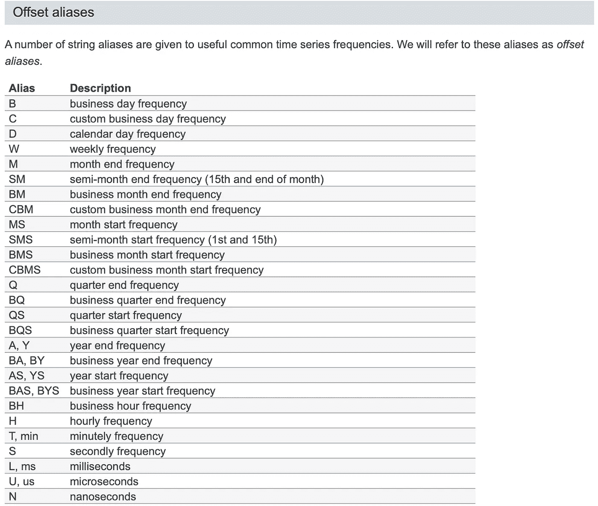

# 使用熊猫“重采样”功能

> 原文：<https://towardsdatascience.com/using-the-pandas-resample-function-a231144194c4?source=collection_archive---------1----------------------->


Photo by [JESHOOTS.COM](https://unsplash.com/@jeshoots?utm_source=unsplash&utm_medium=referral&utm_content=creditCopyText) on [Unsplash](https://unsplash.com/search/photos/calendar?utm_source=unsplash&utm_medium=referral&utm_content=creditCopyText)

## 改变过去的下一件最好的事情——将它聚合起来。熊猫重采样功能的技术介绍。

T 他的文章是对用于日期时间操作的**熊猫重采样功能**的技术方面的介绍。我希望它能成为那些不太愿意去挖掘熊猫源代码的人的一个可读的伪文档来源！

如果您想查看用于生成示例的代码并查看本文中未包含的更多示例，请单击此处的链接。

我们开始吧！

# 什么是重采样？

当给定一个以某个时间间隔记录的数据集，并且您想将时间间隔更改为其他时间间隔时，重新采样是必要的。例如，您可以将每月数据聚合为年度数据，或者将每小时数据向上采样为分钟数据。

重采样的语法非常简单:

```
<DataFrame or Series>.**resample(arguments).<aggregate function>**
```

我将深入探讨什么是参数以及如何使用它们，但首先这里有一个基本的、现成的演示。您将需要一个**日期时间**类型的索引或列来执行以下操作:

```
# Given a Series object called data with some number value per date
>>>
╔═══════════════════════╦══════╗
║         date          ║ val  ║
╠═══════════════════════╬══════╣
║ 2000-01-01 00:00:00   ║    0 ║
║ 2000-01-01 00:01:00   ║    2 ║
║ 2000-01-01 00:02:00   ║    4 ║
║ 2000-01-01 00:03:00   ║    6 ║
║ 2000-01-01 00:04:00   ║    8 ║
║ 2000-01-01 00:05:00   ║   10 ║
║ 2000-01-01 00:06:00   ║   12 ║
║ 2000-01-01 00:07:00   ║   14 ║
║ 2000-01-01 00:08:00   ║   16 ║
╚═══════════════════════╩══════╝
Freq: T, dtype: int64# We can **resample this** to every other minute instead and aggregate by summing the intermediate rows:
data.resample('2min').sum()>>>

╔═════════════════════╦══════╗
║        date         ║ val  ║
╠═════════════════════╬══════╣
║ 2000-01-01 00:00:00 ║    2 ║
║ 2000-01-01 00:02:00 ║   10 ║
║ 2000-01-01 00:04:00 ║   18 ║
║ 2000-01-01 00:06:00 ║   26 ║
║ 2000-01-01 00:08:00 ║   16 ║
╚═════════════════════╩══════╝Freq: 2T, dtype: int64
```

现在，我们已经对重采样有了基本的了解，让我们进入代码！

# 争论

按照源代码的顺序:

```
pd.DataFrame.resample
(
**rule,** 
how=None, 
**axis=0,** fill_method=None, 
**closed=None, 
label=None,** 
convention=”start”, 
kind=None, **
loffset=None,** 
limit=None, 
**base=0, 
on=None,** 
**level=None** )
```

我已经大胆提出了我将涉及的论点。其余部分要么被弃用，要么用于句点，而不是日期时间分析，我在本文中将不再赘述。

# 1.“规则”参数

`string`包含**规则**别名和/或数字

这是重采样的核心。您在这里输入的字符串决定了数据重新采样的时间间隔，如下行的粗体部分所示:

```
data.resample('**2min**').sum()
```

如您所见，您可以在字符串前插入浮点数或整数来更改频率。您甚至可以在非常特定的时间内将**多对浮点/字符串组合在一起**！例如:

```
'3min' or '3T' = 3 minutes'SMS' = Two times a month'1D3H.5min20S' = One Day, 3 hours, .5min(30sec) + 20sec
```

为了省去查找重采样字符串的麻烦，我发布了下表:



From Pandas documentation: [https://pandas.pydata.org/pandas-docs/stable/user_guide/timeseries.html#offset-aliases](https://pandas.pydata.org/pandas-docs/stable/user_guide/timeseries.html#offset-aliases)

一旦你加入了你的规则，你需要决定如何减少旧的数据点或者填充新的数据点。该函数紧接在重采样函数调用之后:

```
data.resample('2min').**sum()**
```

重采样有两种:

1.  **下采样** —在更宽的时间范围内(从几个月到几年)重新采样

*   这非常简单，因为它可以使用所有的 groupby 聚合函数，包括 **mean()、min()、max()、sum()** 等等。
*   在下采样中，行数从**下降到**。

**2 .上采样** —在更短的时间内(从小时到分钟)重新采样

这将导致**额外的**空行，因此您有以下选项用数值填充这些空行:

```
1\. ffill() or pad()
2\. bfill() or backfill()
```

*   **‘向前填充’或‘填充’—**使用最后一个已知值填充新值。
*   **‘回填’—**使用下一个已知值来填充新值。
*   您还可以使用不带参数的 **asfreq()** 函数用 nan 填充**。这将产生包含 nan 的新数据点，您可以稍后使用 **fillna()** 函数。**

以下是向前和向后填充的一些演示:

```
Starting with months table:
╔════════════╦═════╗
║    date    ║ val ║
╠════════════╬═════╣
║ 2000-01-31 ║   0 ║
║ 2000-02-29 ║   2 ║
║ 2000-03-31 ║   4 ║
║ 2000-04-30 ║   6 ║
║ 2000-05-31 ║   8 ║
╚════════════╩═════╝print('Forward Fill')
print(months.resample('SMS').ffill())╔════════════╦═════╗
║    date    ║ val ║
╠════════════╬═════╣
║ 2000-01-15 ║ NaN ║
║ 2000-02-01 ║ 0.0 ║
║ 2000-02-15 ║ 0.0 ║
║ 2000-03-01 ║ 2.0 ║
║ 2000-03-15 ║ 2.0 ║
║ 2000-04-01 ║ 4.0 ║
║ 2000-04-15 ║ 4.0 ║
║ 2000-05-01 ║ 6.0 ║
║ 2000-05-15 ║ 6.0 ║
╚════════════╩═════╝# Alternative to ffill is bfill (backward fill) that takes value of next existing months point
print('Backward Fill')
print(months.resample('SMS').bfill())╔════════════╦═════╗
║    date    ║ val ║
╠════════════╬═════╣
║ 2000-01-15 ║   0 ║
║ 2000-02-01 ║   2 ║
║ 2000-02-15 ║   2 ║
║ 2000-03-01 ║   4 ║
║ 2000-03-15 ║   4 ║
║ 2000-04-01 ║   6 ║
║ 2000-04-15 ║   6 ║
║ 2000-05-01 ║   8 ║
║ 2000-05-15 ║   8 ║
╚════════════╩═════╝
```

# 2.“关闭”参数

`'left', 'right', or None`

我将在这里包括他们的文档注释，因为它相当简洁地描述了基础知识。

> 仓区间的哪一侧是封闭的。除了“M”、“A”、“Q”、“BM”、“T20”、“BA”、“BQ”和“W”之外，所有频率偏移的默认值都是“左”。

closed 参数告诉哪一侧被包括在内，**‘closed’是在每个时间间隔的计算中包括的一侧**(意味着另一侧不包括在内)。你可以在这里看到它的表现:

```
# Original Table 'minutes'

╔═════════════════════╦═════╗
║        date         ║ val ║
╠═════════════════════╬═════╣
║ 2000-01-01 00:00:00 ║   0 ║
║ 2000-01-01 00:01:00 ║   2 ║
║ 2000-01-01 00:02:00 ║   4 ║
║ 2000-01-01 00:03:00 ║   6 ║
║ 2000-01-01 00:04:00 ║   8 ║
║ 2000-01-01 00:05:00 ║  10 ║
║ 2000-01-01 00:06:00 ║  12 ║
║ 2000-01-01 00:07:00 ║  14 ║
║ 2000-01-01 00:08:00 ║  16 ║
╚═════════════════════╩═════╝# The default is closed='left'
df=pd.DataFrame()
df['left'] = minutes.resample('2min').sum()
df['right'] = minutes.resample('2min',closed='right').sum()
df
>>>╔═════════════════════╦══════╦═══════╗
║ index               ║ left ║ right ║
╠═════════════════════╬══════╬═══════╣
║ 2000-01-01 00:00:00 ║ 2    ║ 6.0   ║
║ 2000-01-01 00:02:00 ║ 10   ║ 14.0  ║
║ 2000-01-01 00:04:00 ║ 18   ║ 22.0  ║
║ 2000-01-01 00:06:00 ║ 26   ║ 30.0  ║
║ 2000-01-01 00:08:00 ║ 16   ║ NaN   ║
╚═════════════════════╩══════╩═══════╝
```

# 3.“标签”参数

`'left', 'right', or None`

同样，文档非常有用。

> 用哪个箱柜边缘标签来标记桶。除了“M”、“A”、“Q”、“BM”、“BA”、“BQ”和“W”之外，所有频率偏移的默认值都是“左”。

此参数不会更改基础计算，它只是在执行聚合后根据所需的边重新标记输出。

```
df=pd.DataFrame()
# Label default is left
df['left'] = minutes.resample('2min').sum()
df['right'] = minutes.resample('2min',label='right').sum()
df>>>╔═════════════════════╦══════╦═══════╗
║                     ║ left ║ right ║
╠═════════════════════╬══════╬═══════╣
║ 2000-01-01 00:00:00 ║    2 ║ NaN   ║
║ 2000-01-01 00:02:00 ║   10 ║ 2.0   ║
║ 2000-01-01 00:04:00 ║   18 ║ 10.0  ║
║ 2000-01-01 00:06:00 ║   26 ║ 18.0  ║
║ 2000-01-01 00:08:00 ║   16 ║ 26.0  ║
╚═════════════════════╩══════╩═══════╝
```

# 4.“Loffset”参数

`string`匹配规则符号。

这个论点也是不言自明的。它没有改变任何计算，只是在指定的时间内移动标签。

```
df=pd.DataFrame()
df['no_offset'] = minutes.resample('2min').sum()
df['2min_offset'] = minutes.resample('2min',loffset='2T').sum()
df['4min_offset'] = minutes.resample('2min',loffset='4T').sum()
df>>>
╔═════════════════════╦═══════════╦═════════════╦═════════════╗
║ index               ║ no_offset ║ 2min_offset ║ 4min_offset ║
╠═════════════════════╬═══════════╬═════════════╬═════════════╣
║ 2000-01-01 00:00:00 ║         2 ║ NaN         ║ NaN         ║
║ 2000-01-01 00:02:00 ║        10 ║ 2.0         ║ NaN         ║
║ 2000-01-01 00:04:00 ║        18 ║ 10.0        ║ 2.0         ║
║ 2000-01-01 00:06:00 ║        26 ║ 18.0        ║ 10.0        ║
║ 2000-01-01 00:08:00 ║        16 ║ 26.0        ║ 18.0        ║
╚═════════════════════╩═══════════╩═════════════╩═════════════╝
```

# 5.“基本”参数

`numeric`与重采样规则中使用的单位相关的输入

将计算的基准时间移动一段时间。正如文档所描述的，该函数移动“原点”。

```
minutes.head().resample('30S').sum()
>>>

╔═════════════════════╦═════╗
║        date         ║ val ║
╠═════════════════════╬═════╣
║ 2000-01-01 00:00:00 ║   0 ║
║ 2000-01-01 00:00:30 ║   0 ║
║ 2000-01-01 00:01:00 ║   2 ║
║ 2000-01-01 00:01:30 ║   0 ║
║ 2000-01-01 00:02:00 ║   4 ║
║ 2000-01-01 00:02:30 ║   0 ║
║ 2000-01-01 00:03:00 ║   6 ║
║ 2000-01-01 00:03:30 ║   0 ║
║ 2000-01-01 00:04:00 ║   8 ║
╚═════════════════════╩═════╝minutes.head().resample('30S',base=15).sum()
>>>

╔═════════════════════╦═════╗
║        date         ║ val ║
╠═════════════════════╬═════╣
║ 1999-12-31 23:59:45 ║   0 ║
║ 2000-01-01 00:00:15 ║   0 ║
║ 2000-01-01 00:00:45 ║   2 ║
║ 2000-01-01 00:01:15 ║   0 ║
║ 2000-01-01 00:01:45 ║   4 ║
║ 2000-01-01 00:02:15 ║   0 ║
║ 2000-01-01 00:02:45 ║   6 ║
║ 2000-01-01 00:03:15 ║   0 ║
║ 2000-01-01 00:03:45 ║   8 ║
╚═════════════════════╩═════╝The table shifted by 15 seconds.
```

# 6.轴'，'开'和'水平'

这些参数指定重采样所基于的列名或索引。

如果数据的日期是沿着列而不是沿着行，请指定`axis = 1`

如果日期列不是索引，请使用以下命令指定该列的名称:

`on = 'date_column_name'`

如果您有一个多级索引数据帧，使用`level`指定要重新采样的正确日期时间索引的级别。

# 7.未涉及的其他参数

由于使用其他方法捕获功能，其余的参数已被否决或多余。例如，`how`和`fill_method` 在重采样调用后不再需要聚合函数，但是`how`用于下采样，`fill_method`用于上采样。如果你感兴趣，你可以在[源文档](https://github.com/pandas-dev/pandas/blob/v0.25.1/pandas/core/generic.py#L8135-L8453)中读到更多关于这些论点的内容。

# 谢谢大家！

今天就到这里吧！我希望我能阐明重采样是如何工作的，以及它的每个参数是做什么的。敬请关注更多教程和其他数据科学相关文章！