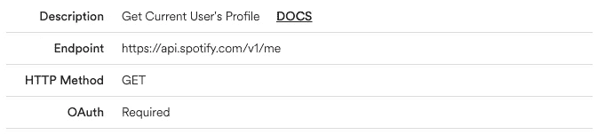
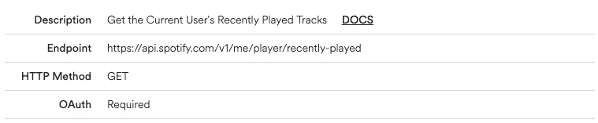
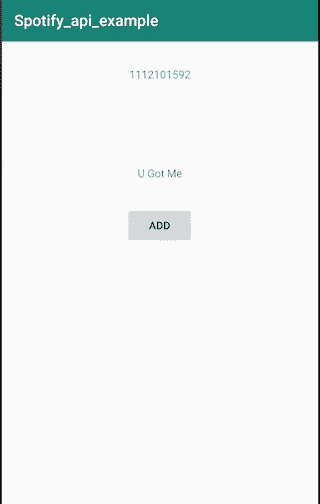
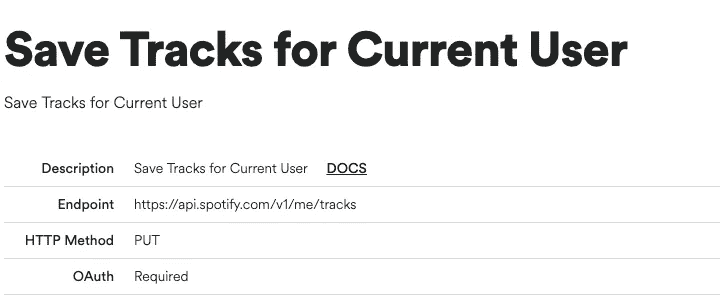
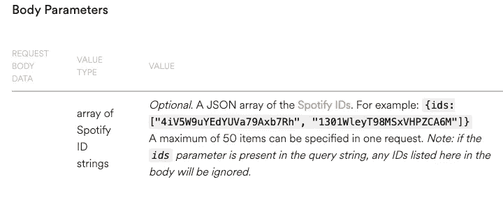

# 在 Android 应用程序中使用 Spotify API:要点

> 原文：<https://towardsdatascience.com/using-the-spotify-api-with-your-android-application-the-essentials-1a3c1bc36b9e?source=collection_archive---------4----------------------->

# 概观

在本教程中，我将向您展示如何与 Spotify API 进行交互。如何认证、调用和解析结果。我们将发现 Spotify API 的能力，可以获得什么样的信息，以及我们可以对它进行什么样的操作。

虽然它是一个 REST API，因此对每个客户端都是一样的，但 iOS、Android 和 Web 的身份验证有很大不同。所以，在这篇文章中，我们将**聚焦于 Android 认证**。我们将要对 API 进行的调用也可以在 iOS 或 web 应用程序中以同样的方式使用。为了在 Android 上创建调用，我们将使用广为人知的凌空框架(【https://github.com/google/volley】)。

所以，我们走吧！

*免责声明:Spotify API 可能会发生变化，因此在该功能中，这些调用可能不再有效，或者必须进行更改。如果出现问题，请查阅官方文档。*

 [## Web API |面向开发者的 Spotify

### 注意:使用 Spotify 开发者工具，即表示您接受 Spotify 开发者服务条款。基于简单的休息…

developer.spotify.com](https://developer.spotify.com/documentation/web-api/) 

# 创建 Spotify API 项目

**首先，我们需要创建一个 Spotify API 项目**，以允许我们使用它进行认证。为此，我们前往[https://developer.spotify.com/dashboard](https://developer.spotify.com/dashboard)，用我们的 Spotify 账户登录。

**现在我们必须执行以下步骤:**

1.  **点击右上角的“创建客户 ID”**
2.  **填写表单、名称、描述和我们正在构建的内容(手机应用程序)**
3.  **回答我们是否正在开发商业集成。答案:否**
4.  接受服务条款。

现在，我们必须将重定向 URI 添加到我们的白名单中。为此，让我们进入“编辑设置”，在“重定向 URIs”下，我们添加要重定向的包名。例如，在我的例子中，这将是*" com . spotifyapiexample://callback "*。请注意，在 URI 中不允许有下划线。也可以在知道包名之后再做，但是必须在我们第一次运行应用程序之前完成。

很好，现在我们已经完成了，我们可以继续我们的 Android 项目了。

# 创建 Android 项目

让我们用一个**空活动**创建一个基本的 android 项目。我将调用我的 *Spotify_api_example* 。请随意选择你的名字。如果您还没有将您的应用程序列入白名单，现在是时候使用“<your _ package name>://callback”来这样做了

首先，我们需要将 Spotify Android auth 库添加到我们的项目中。从 https://github.com/spotify/android-auth/releases.[下载项目](https://github.com/spotify/android-auth/releases.) **解压文件夹，并将文件夹复制到项目根目录下的/app/libs 目录下。**

**然后打开你的 build.gradle (Module: app)文件，添加对库的依赖:**

# 认证和获取用户信息

现在，让我们**创建一个新的活动(空活动)**，我把它叫做 SplashActivity。在这个活动中，我们要做三件事:验证 Spotify API，获取当前用户的一些信息，并在获取令牌和信息后重定向到主活动。

首先，打开您的 **AndroidManifest.xml** 并将启动活动更改为我们新创建的 SplashActivity。此外，将**互联网权限**添加到清单中，这样我们就可以与外界通信了。

现在打开你的**水花活动**。让我们创建一个名为 **authenticateSpotify()** 的新方法。

*   首先，我们打开一个 AuthenticationRequest，其中包含我们的 ClientID、我们想要的响应类型(在本例中是一个身份验证令牌)和 RedirectURI ( **这个 URI 必须被列入我们在 https://developer.spotify.com/dashboard[**和**](https://developer.spotify.com/dashboard) 的项目中的白名单)**
*   然后，我们设置我们请求的范围(例如，用户最近阅读播放)。这些是我们需要向用户请求的不同权限，例如，读取他的个人信息的权限。请求的作用域将显示给用户，他必须将它们授予您的应用程序。
*   最后，我们发送请求。这将打开 Spotify(如果安装了的话)或者返回到用户必须登录的 WebView。REQUEST_CODE 只是一个静态数字(例如 1337)来标识我们刚刚启动的应用程序。

现在，让我们定义一些我们需要的常量。用您的 ClientID 和 RedirectURI 替换它们。您可以在 Spotify 仪表盘中找到 ClientID。

当用户登录时。他将被重定向到您的应用程序。如果请求成功，我们将在那里接收令牌。**将以下内容添加到 SplashActivity 类:**

用户从 Spotify API 被重定向回来。然后你的应用识别 RequestCode，所以很明显它是从 Spotify 重定向过来的。然后，应用程序检查它是否收到了令牌，并相应地继续进行。我们使用 shared preferences([https://developer . Android . com/reference/Android/content/shared preferences](https://developer.android.com/reference/android/content/SharedPreferences))将令牌保存在我们的持久存储中。请务必查看评论，进一步了解正在发生的事情。

**最后，我们必须初始化我们的共享首选项，并调用 authenticateSpotify()方法。**将以下代码添加到您的 SplashActivity 中:

恭喜你。我们现在收到了有效的 API 令牌，可以开始使用 Spotify API 了。如果您想尝试一下，请取消对 waitForUserInfo()的注释；调用 onActivityResult。您应该可以使用您的 Spotify 帐户登录。但遗憾的是，其他事情都不会发生。

我们要打的第一个电话是获取一些关于我们用户的信息。例如，如果您想跟踪谁在使用您的应用程序。您可以通过用户唯一的 Spotify ID 来识别他们。

让我们首先用我们将从 Spotify API 收到的信息为我们的用户创建一个模型。**创建一个名为“用户”的新类，并添加以下代码:**

现在，为了保持结构化，让我们为将要使用的每个 API 端点创建一个服务类。**创建一个名为“Connectors”的新包，创建一个名为“UserService”的新类，并添加以下代码:**

如果我们查看 Spotify API 文档，我们会发现这个请求非常简单。这是一个对端点的标准 GET 请求，我们只需要我们的承载令牌(在上一步中收到的那个)作为报头。不需要其他参数。

[https://developer.spotify.com/documentation/web-api/reference/users-profile/get-current-users-profile/](https://developer.spotify.com/documentation/web-api/reference/users-profile/get-current-users-profile/)

这里，我们用 JsonObjectRequest 生成一个基本的 GET 请求。我们简单地用 Gson 和我们创建的用户类解析结果。所以我们创建了一个新的用户对象，一旦我们从 API 得到响应，我们就用结果填充对象的值。VolleyCallBack 接口有助于我们知道何时收到了有效的响应，然后我们可以相应地继续进行。

**为了让我们的回调工作，我们创建了一个名为“VolleyCallBack”的新接口**

我们只需要一个方法，当请求成功并且我们收到响应时通知我们。

**现在我们需要在 SplashActivity 类中实现 waitForUserInfo()方法。**

现在，如果您启动您的应用程序，您应该获得您的令牌，获得用户信息，并应被重定向到 MainActivity，它将只显示“Hello World！”。在后台，您的应用程序获取了一个有效的认证令牌，并请求有关登录用户的附加信息。Spotify ID 保存在永久存储器中，因此我们可以在以后再次访问它。我们只需要显示信息。

我们不打算构建一个大的用户界面，本教程的主要目标是向您展示如何获取数据，如何使用数据由您决定。

# 获取最近播放的歌曲

现在我们已经收到了令牌和用户信息，是时候使用另一个 API 端点了。我们将获取用户最近播放的歌曲。**为你的歌曲**建立一个新的模型，类似于我们已经创建的用户模型。

接下来，**让我们创建一个非常简单的 UI 来显示 Spotify ID、一首歌曲的标题和一个按钮。**

现在让我们编写两个新方法并初始化我们的 UI 元素。

在我们的 getTracks()方法中，我们调用了 SongService 方法，该方法将从 API 中获取歌曲。收到数据后，我们将使用 updateSong()方法更新歌曲的名称。

我们需要一个名为 SongService 的新类，我们将从 Spotify API 中获取歌曲。这个类类似于我们实现的 UserService，处理我们发送给 API 的请求。

同样，如果我们查看 Spotify API 文档，我们会看到这是一个简单的 GET 请求，除了头中的 Bearer token 之外，没有任何必需的参数。

[https://developer.spotify.com/console/get-recently-played/](https://developer.spotify.com/console/get-recently-played/)

典型的响应如下所示:

**让我们在 SongService 中实现它**

The UI should look like this, but feel free to change things around

这一次，解析结果比上一次稍微困难一些。因为我们收到了一个 *JSON 数组*，所以我们必须遍历那个*数组*中的每一项，并将该项分配给我们的 *song 对象*。我们像上次对 Gson 那样做。最后，我们返回一个类型为 *< Song >* 的*数组列表*，其中包含了我们从 API 中获取的歌曲。

现在，如果你启动这个应用程序，你应该会看到你最近听过的一首歌的名字。我们只展示一个。这个按钮还不能做任何事情，所以我们来改变它。

# 将歌曲添加到您喜欢的歌曲

为我们的按钮创建一个 OnClicklistener，并将其分配给我们的按钮。

我们需要生成一个 PUT 请求。这一次我们必须提供一个主体，它必须包含一组 Spotify ID 字符串。我们将在这个数组中只包含一个 ID，因为我们将为每首歌曲生成一个请求。

[https://developer.spotify.com/console/put-current-user-saved-tracks/](https://developer.spotify.com/console/put-current-user-saved-tracks/)

编辑 SongService 类并添加以下行:

首先，我们准备主体，这里称为有效载荷。我们生成一个新的 JSONArray，并添加一个带有歌曲 ID 的条目。我们将整个东西包装在一个 JSONObject 中，有效载荷就准备好了。

现在我们准备将要发送的请求。这次是一个 PUT 请求，所以方法发生了变化。另外，它类似于我们已经发送的其他请求。最后，我们将请求添加到我们的队列中，因此它将被异步执行。

如果您启动该应用程序，您应该能够看到这首歌，如果您按下添加按钮，它会将这首歌添加到 Spotify 帐户中您喜欢的歌曲中，并且会列出一首新歌，您可以再次将其添加到您的资料库中。继续检查它是否工作。

# 结论

关于 Spotify API 的教程到此结束。这是 Spotify API 可以实现的一个小例子。可能性几乎是无穷无尽的，也许你知道你想用它做什么。不管怎样，祝你编码愉快！

看看我的另一个 Android 项目，我用 Spotify API 提供了更多的功能和调用，比如添加和删除播放列表、播放歌曲等等。

 [## hyferion/SpotifyRecLabelingAndroid

### 这个应用程序是基于机器学习的应用程序的一部分，用于歌曲的分类和制作…

github.com](https://github.com/Hyferion/SpotifyRecLabelingAndroid) 

**另外，你可以在 Github 上找到本教程的代码:**

 [## Hyferion/spotify_api_example

### 此时您不能执行该操作。您已使用另一个标签页或窗口登录。您已在另一个选项卡中注销，或者…

github.com](https://github.com/Hyferion/spotify_api_example) 

在我的下一篇文章中，我将谈论我在 Spotify API 上开发的另一个应用程序。