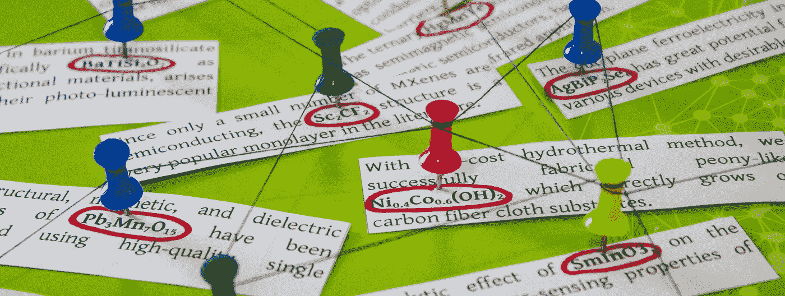
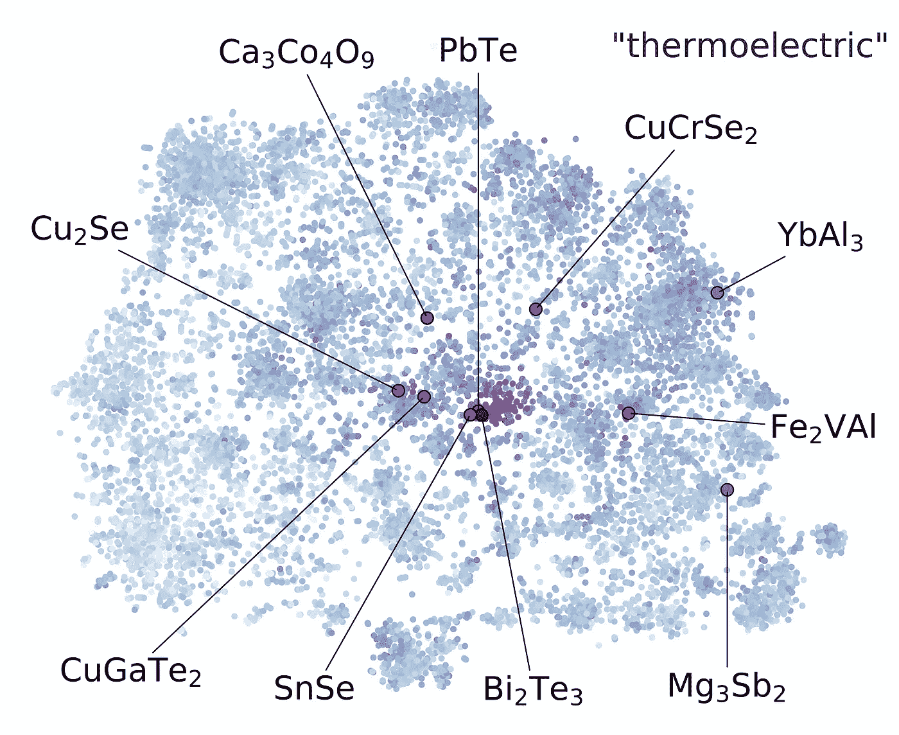
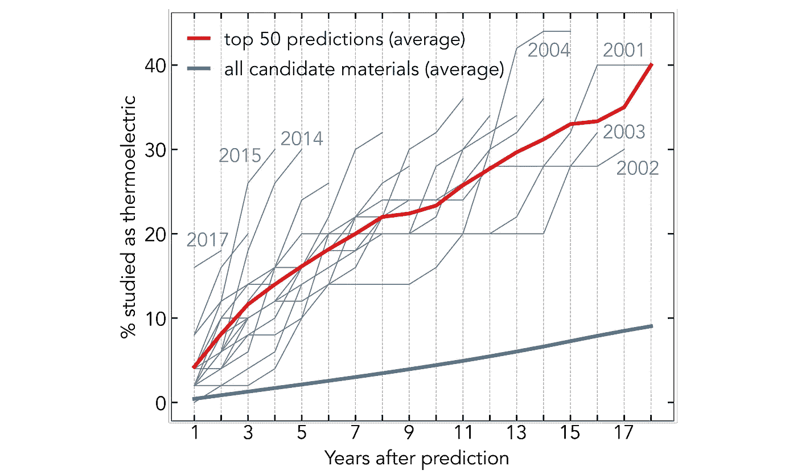
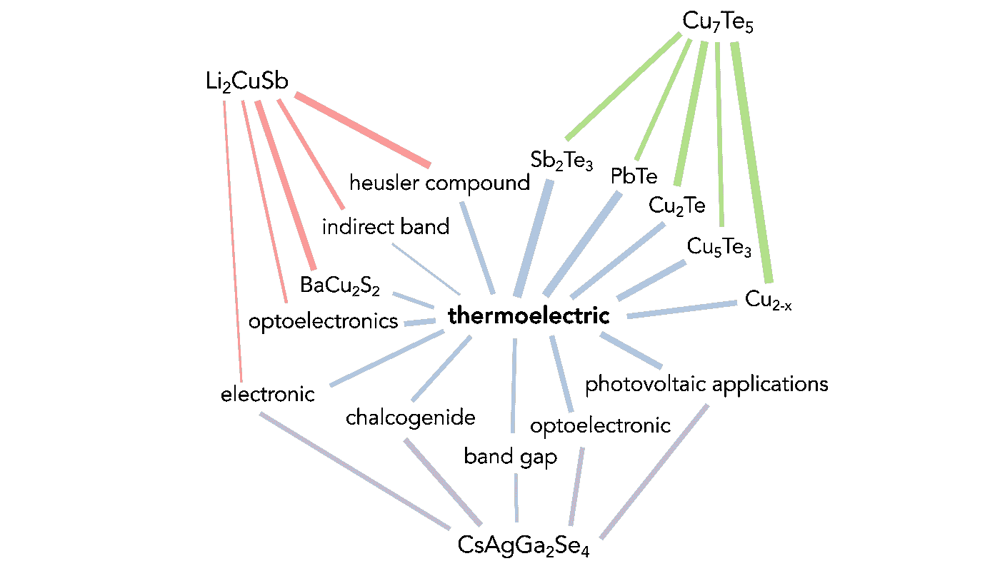

# 使用无监督的机器学习来发现隐藏的科学知识

> 原文：<https://towardsdatascience.com/using-unsupervised-machine-learning-to-uncover-hidden-scientific-knowledge-6a3689e1c78d?source=collection_archive---------14----------------------->

## Word2vec 从数百万份摘要中学习材料科学

Credit: Olga Kononova

跟上新科学文献出版的步伐变得越来越困难。一个研究人员可能要花几个月的时间来做一个广泛的文献综述，即使是一个单一的主题。如果一台机器可以在几分钟内阅读所有发表在特定主题上的论文，并告诉科学家最佳的前进方向，会怎么样？嗯，我们离那还很远，但是我们下面描述的研究提出了一种新的方法，在最少的人类监督下，利用科学文献发现材料。

为了让计算机算法利用自然语言，单词需要以某种数学形式来表示。2013 年，名为 Word2vec [ [1](https://arxiv.org/abs/1301.3781) ， [2](https://arxiv.org/abs/1310.4546) 的算法的作者发现了一种有趣的方法，可以从大量文本中自动学习这种表示。出现在文本中相似上下文中的单词通常具有相似的含义。因此，如果训练神经网络来预测目标单词的相邻单词，它将学习相似目标单词的相似表示。他们表明，单个单词可以有效地表示为高维向量(嵌入)，单词之间的语义关系可以表示为线性向量运算(参见[此处](http://mccormickml.com/2016/04/19/word2vec-tutorial-the-skip-gram-model/)获取更详细解释 Word2vec 的教程)。这种语义关系的一个著名例子是表达式

“国王”——“王后”≘“男人”——“女人”(1)，

其中在相应单词的向量之间执行减法。(1)两边的成对词之间的这种语义关系代表了性别的概念。

Figure 1: Analogies between pairs of words are captured by linear operations between the corresponding embeddings. Figure on the right borrowed from [3].

自然地，如果我们使用纯粹的科学文本，而不是普通的文本源，如[普通爬虫](http://commoncrawl.org/)或[维基百科](https://en.wikipedia.org/wiki/Wikipedia:Database_download)，在我们的例子中[ [3](https://www.nature.com/articles/s41586-019-1335-8) 是几百万份材料科学摘要，这些向量运算嵌入了更专业的知识。举个例子，

“z ro2”-“Zr”≘“NiO”-“Ni”，

其中上述表达式代表氧化物的概念。

语义关系的另一个例子是单词相似度，由嵌入的点积(投影)决定。在最初的 Word2vec 模型中，单词“large”和“big”具有彼此接近的向量(具有大的点积),但是远离“亚美尼亚”的向量。在我们的专业模型中，与“LiCoO2”最相似的词是“LiMn2O4”，这两种都是锂离子电池的阴极材料。事实上，如果我们使用 t-SNE [ [4](http://www.jmlr.org/papers/volume9/vandermaaten08a/vandermaaten08a.pdf) ]将大约 12，000 种最受欢迎的材料(文中提到了 10 种以上)投影到 2D 平面上，我们会发现这些材料主要根据它们的应用和成分相似性进行聚类。

Figure 2: Materials used for similar applications as well as with similar chemical compositions cluster together. The most common elements in each “application cluster” match our materials science knowledge. Each chart on the bottom is obtained by counting chemical elements in the compositions of the materials from the corresponding application clusters. Figure borrowed from [3].

现在，我们可以做一些更有趣的事情，根据特定的应用给图 2 左上角的“材质贴图”上色。对应于单一材料的每个点可以根据其嵌入与应用词嵌入的相似性来着色，例如“热电”(用于描述热到电的转换的词，反之亦然)。

Figure 3: Materials “light up” according to their similarity to the application keyword. Figure borrowed from [3].

正如你们中的许多人可能已经猜到的，上图中最亮的地方是众所周知的热电材料，在科学摘要中与“热电”一词一起被明确提到。然而，其他一些亮点从未作为热电学进行过研究，因此该算法正在指示一种没有在文本中明确写入的关系。问题是，这些材料能成为尚待发现的良好热电材料吗？令人惊讶的是，答案是**是的！**

我们测试这个假设的几种方法之一是通过训练单词嵌入，就好像我们还在过去一样。我们将 2000 年至 2018 年之间发表的科学摘要一年一年地删除，并训练了 18 个不同的模型。我们使用这些模型根据材料与“热电”一词的相似性(图 3 中颜色的强度)对材料进行了排序，并选取了当年未被研究为热电材料的前 50 种材料。事实证明，这些材料中的许多后来被报道为热电材料，如下图所示。

Figure 4: If we went to the past one year at a time and made prediction using only the data available at that time, many of them would have come true by now. Each grey line corresponds to the predictions for a given year, and the solid red and blue lines are averaged across all prediction years. Figure borrowed from [3].

事实上，2009 年的五大预测之一应该是 CuGaTe2，它被认为是 2012 年才发现的当今最好的热电学之一。有趣的是，当我们的手稿[ [3](https://www.nature.com/articles/s41586-019-1335-8) ]在准备和审查中时，我们用所有可用的摘要做出的 50 个预测中有 3 个也被报道为良好的热电学。

那么，这一切是如何运作的呢？我们可以通过查看预测材料的上下文词得到一些线索，看看这些上下文词中，哪些与材料和应用关键词“热电”都有很高的相似度。下面列出了前 5 个预测中的 3 个预测的一些主要上下文单词。

Figure 5: Context words for 3 of our top 5 predictions that contribute the most to the predictions. The width of the connect lines is proportional to cosine similarities between the words. Figure borrowed from [3].

实际上，该算法捕获对热电材料很重要的上下文单词(或者更准确地说，上下文单词的组合)。作为材料科学家，我们知道硫族化物(一类材料)通常是良好的热电材料，带隙的存在在大多数时候是至关重要的。我们看到算法是如何利用单词的共现来学习的。上图仅捕捉了一阶连接，但高阶连接也可能有助于预测。

对于科学应用，自然语言处理(NLP)几乎总是被用作从文献中提取已知事实的工具，而不是进行预测。这不同于股票价值预测等其他领域，例如，在股票价值预测中，对有关公司的新闻文章进行分析，以预测其股票价值在未来将如何变化。但即便如此，大多数方法还是将从文本中提取的特征输入到其他更大的模型中，这些模型使用结构化数据库中的附加特征。我们希望这里描述的想法将鼓励科学发现的直接、无监督的 NLP 驱动的推理方法。Word2vec 并不是最先进的 NLP 算法，因此下一步自然是用更新颖的、上下文感知的嵌入来替代它，比如 BERT [ [5](https://arxiv.org/abs/1810.04805) 和 ELMo [ [6](https://arxiv.org/abs/1802.05365) ]。我们还希望，由于这里描述的方法需要最少的人工监督，其他科学学科的研究人员将能够使用它们来加速机器辅助的科学发现。

# 笔记

获得良好预测的关键步骤是对材料使用输出嵌入(Word2vec 神经网络的输出层),对应用关键字使用单词嵌入(Word2vec 神经网络的隐藏层)。这有效地转化为预测摘要中单词的共现。因此，该算法正在识别研究文献中的潜在“差距”，例如研究人员未来应该研究的功能应用的化学成分。详见[原版](https://www.nature.com/articles/s41586-019-1335-8)的补充资料。

我们用于 Word2vec 训练和预训练嵌入的代码可在[https://github.com/materialsintelligence/mat2vec](https://github.com/materialsintelligence/mat2vec)获得。代码中的默认超参数是本研究中使用的参数。

# 放弃

这里讨论的工作是我在劳伦斯伯克利国家实验室担任博士后时进行的，与一个了不起的研究团队一起工作——约翰·达吉伦、利·韦斯顿、亚历克斯·邓恩、秦子·荣、奥尔加·科诺诺娃、克里斯汀·a·佩尔松、格布兰德·塞德尔和阿努巴夫·贾恩。

也非常感谢 Ani Nersisyan 对这个故事提出的改进建议。

# 参考

[1] T. Mikolov，K. Chen，G. Corrado & J. Dean，向量空间中词表征的有效估计(2013)，【https://arxiv.org/abs/1301.3781】

[2] T. Mikolov，I. Sutskever，K. Chen，G. Corrado & J. Dean，单词和短语的分布式表征及其组合性(2013)，【https://arxiv.org/abs/1310.4546】

[3] V. Tshitoyan，J. Dagdelen，L. Weston，A. Dunn，Z. Rong，O. Kononova，K. A. Persson，G. Ceder & A. Jain，无监督单词嵌入从材料科学文献中捕获潜在知识(2019)， [Nature 571，95–98](https://www.nature.com/articles/s41586-019-1335-8)

[4] L. Maaten & G. Hinton，使用 t-SNE 可视化数据(2008 年)，[机器学习研究杂志](http://www.jmlr.org/papers/volume9/vandermaaten08a/vandermaaten08a.pdf)

[5] J. Devlin，M.-W. Chang，K. Lee & K. Toutanova，Bert:用于语言理解的深度
双向转换器的预训练(2018)，[https://arxiv.org/abs/1810.04805](https://arxiv.org/abs/1810.04805)

[6] M. E. Peters，M. Neumann，M. Iyyer，M. Gardner，C. Clark，K. Lee，L. Zettlemoyer，深度语境化的词表征(2018)，[https://arxiv.org/abs/1802.05365](https://arxiv.org/abs/1802.05365)