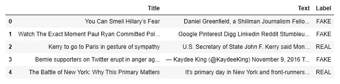
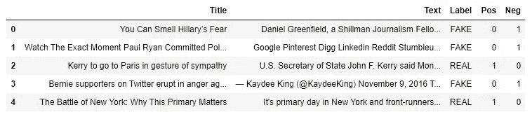
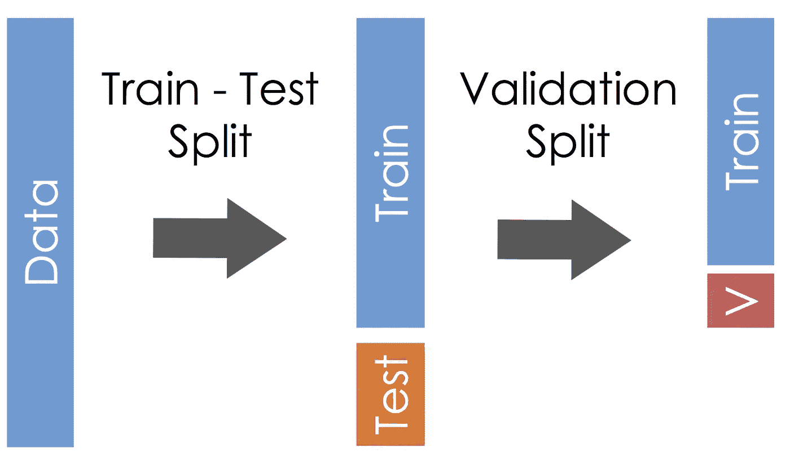
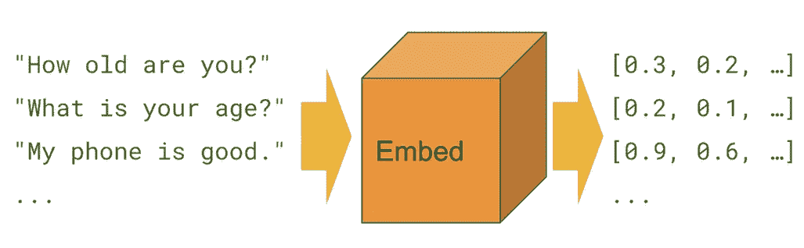
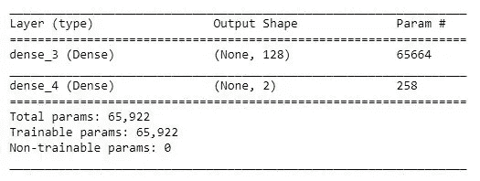
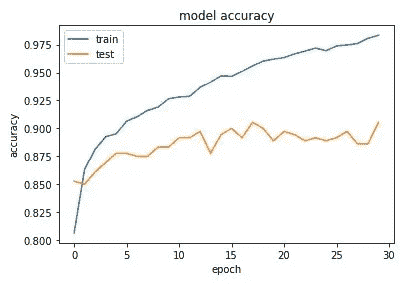
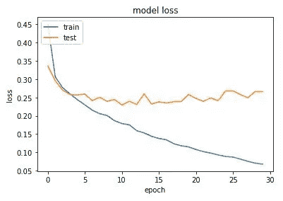

# 使用 USE(通用语句编码器)检测假新闻

> 原文：<https://towardsdatascience.com/using-use-universal-sentence-encoder-to-detect-fake-news-dfc02dc32ae9?source=collection_archive---------26----------------------->


自从引进[通用语句编码器](https://www.aclweb.org/anthology/D18-2029)(使用)以来，它已经成为 [Tensorflow Hub](https://www.tensorflow.org/hub) 中下载量最多的预训练文本模块。通用句子编码器系列包括:

*   [通用语句编码器](https://tfhub.dev/google/universal-sentence-encoder/2)
*   [通用句子编码器大号](https://tfhub.dev/google/universal-sentence-encoder-large/3)
*   [通用语句编码器 lite](https://tfhub.dev/google/universal-sentence-encoder-lite/2)
*   [通用语句编码器多语言](https://tfhub.dev/google/universal-sentence-encoder-multilingual/1)
*   [通用语句编码器多语大号](https://tfhub.dev/google/universal-sentence-encoder-multilingual-large/1)

通用句子编码器具有用于语义相似性和问答检索的不同模块。

我们将使用[通用句子编码器 large](https://tfhub.dev/google/universal-sentence-encoder-large/3) 进行假新闻检测，这是一个文本分类问题。假新闻(也称为垃圾新闻、伪新闻或恶作剧新闻)是一种黄色新闻或宣传，由通过传统新闻媒体(印刷和广播)或在线社交媒体传播的故意虚假信息或骗局组成

我们使用 [Python](https://www.python.org/) 和 [Jupyter Notebook](http://jupyter.org/) 来开发我们的系统，我们将使用的库包括[Keras](https://keras.io/)T6、Numpy、Pandas、 [Sklearn](https://scikit-learn.org/) 、 [Matplotlib](https://matplotlib.org/) 、 [Tensorflow](https://www.tensorflow.org/) 和 [Tensorflow Hub](https://tfhub.dev/) 。完整的代码和数据可以从[这里](https://github.com/saadarshad102/Fake-News-Detection-Universal-Sentence-Encoder)下载。

## 数据探索

首先，我们将看看我们的数据。我们的数据有三列，即标题、文本和标签。

```
data = pd.read_csv('fake_or_real_news.csv')
data = data[['title', 'text', 'label']]
data.columns =  ['Title', 'Text', 'Label']
data.head()
```



现在我们检查标题和文本的最大字数。

最大标题长度:289
最大文本长度:115372

由于新闻文章的文本更重要，而且我们也有内存限制，所以我们将只使用文本进行分类。

```
print("Max title length:", data.Title.str.len().max())
print("Max text length:", data.Text.str.len().max())
```

现在我们看到了阶级分布。我们有 3171 个真的和 3164 个假的例子。

```
data.Label.value_counts()
```

为了得到数据集的形状，我们使用熊猫数据框的形状属性。我们总共有 6335 个例子。

```
data.shape
```

因为我们的问题是二元分类。我们需要给我们的模型传递一个二维输出向量。为此，我们在数据框中添加了两个 one hot 编码列。

```
pos = []
neg = []
for l in data.Label:
    if l == 'FAKE':
        pos.append(0)
        neg.append(1)
    elif l == 'REAL':
        pos.append(1)
        neg.append(0)data['Pos']= pos
data['Neg']= neg
```

现在让我们看看我们的数据框架。

```
data.head()
```



## 将数据分为测试和训练

现在，我们将数据集分为训练集和测试集。我们将使用 90 %的数据进行训练，10 %的数据进行测试。我们使用随机状态，所以每次我们都得到相同的训练和测试数据。

```
data_train, data_test = train_test_split(data, 
                                         test_size=0.10, 
                                         random_state=42)
```



## 加载通用语句编码器

下一步是加载通用句子编码器。使用 tensorflow_hub 很容易做到。这一步可能需要一些时间。

```
module_url = "[https://tfhub.dev/google/universal-sentence-encoder-large/2](https://tfhub.dev/google/universal-sentence-encoder-large/2)" 
embed = hub.Module(module_url)
```

## 获取嵌入

现在我们将把训练句子转换成嵌入。这是通过简单地将整个句子传递给 embed object 来实现的。我们为每个句子得到一个 512 维的向量。

```
with tf.Session() as session:
    session.run([tf.global_variables_initializer(), 
                 tf.tables_initializer()])
    training_embeddings = session.run(embed(data_train.Text.to_list()))
```



## 定义神经网络

我们现在将设计一个总共有两层的浅层神经网络。嵌入被传递到具有“Relu”激活和 128 个单元的密集层。接下来是我们的输出层。这一层有两个单元，因为我们的模型是一个二元分类器。Softmax 用作输出层的激活函数。

```
model = Sequential()
model.add(Dense(128, activation = 'relu'))
model.add(Dense(2, activation = 'softmax'))model.compile(loss='binary_crossentropy', 
              optimizer='adam',
              metrics=['acc'])
```

model.summary()将打印所有图层的摘要以及输出的形状。

```
model.summary()
```



## 培养


历元数是您的模型将循环和学习的数量，批量大小是您的模型在单个时间看到的数据量。

```
num_epochs = 30
batch_size = 32history = model.fit(training_embeddings, 
                    data_train[label_names].values, 
                    epochs=num_epochs, 
                    validation_split=0.1, 
                    shuffle=True, 
                    batch_size=batch_size)
```

## 绘制准确度和损失图

首先，我们将绘制测试和训练精度相对于历元数的曲线。

```
plt.plot(history.history['acc'])
plt.plot(history.history['val_acc'])
plt.title('model accuracy')
plt.ylabel('accuracy')
plt.xlabel('epoch')
plt.legend(['train', 'test'], loc='upper left')
plt.show()
```



现在，我们将绘制测试和训练损失与历元数的关系图。

```
plt.plot(history.history['loss'])
plt.plot(history.history['val_loss'])
plt.title('model loss')
plt.ylabel('loss')
plt.xlabel('epoch')
plt.legend(['train', 'test'], loc='upper left')
plt.show()
```



## 测试

现在我们将把测试例子转换成嵌入。

```
with tf.Session() as session:
    session.run([tf.global_variables_initializer(), 
                 tf.tables_initializer()])
    test_embeddings = session.run(embed(data_test.Text.to_list()))
```

哇！只需三十次迭代和一个小数据集，我们就能获得 90 %的准确率。请记住，我们没有对数据进行预处理，因此这种准确性可以得到认可。

```
predictions = model.predict(test_embeddings, 
                            batch_size=1024, 
                            verbose=1)
labels = ['REAL', 'FAKE']prediction_labels=[]
for p in predictions:
    prediction_labels.append(labels[np.argmax(p)])print("Accuracy:", sum(data_test.Label==prediction_labels)/len(prediction_labels))
```

> 如果你有任何问题或建议，欢迎在下面留言。你也可以在[***Linkedin****上和我联系。*](https://www.linkedin.com/in/saadarshad102/)