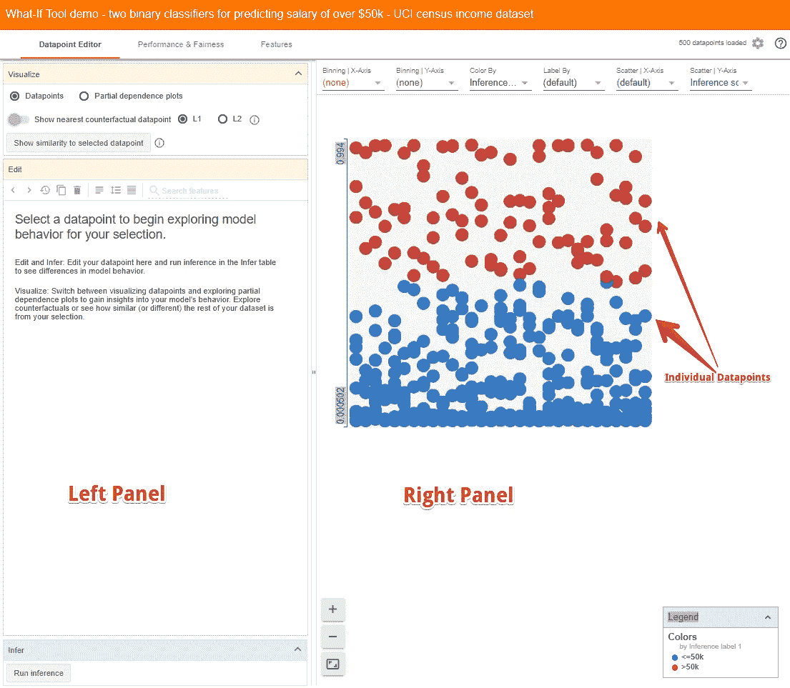

# 使用“假设工具”研究机器学习模型。

> 原文：<https://towardsdatascience.com/using-what-if-tool-to-investigate-machine-learning-models-913c7d4118f?source=collection_archive---------7----------------------->

## Google 的一个开源工具，无需编码就能轻松分析 ML 模型。

Photo by [Pixabay](https://www.pexels.com/@pixabay?utm_content=attributionCopyText&utm_medium=referral&utm_source=pexels) from [Pexels](https://www.pexels.com/photo/ask-blackboard-chalk-board-chalkboard-356079/?utm_content=attributionCopyText&utm_medium=referral&utm_source=pexels)

> 好的从业者扮演侦探的角色，探索以更好地理解他们的模型

在这个可解释和可解释的机器学习时代，人们不能仅仅满足于简单地训练模型并从中获得预测。为了能够真正产生影响并获得好的结果，我们还应该能够探索和研究我们的模型。除此之外，在继续使用模型之前，算法的公平性约束和偏见也应该清楚地记住。

调查一个模型需要问很多问题，并且需要有侦探的敏锐度来探查和寻找模型中的问题和不一致之处。此外，这样的任务通常很复杂，需要编写大量的自定义代码。幸运的是， **What-If 工具**已经被创建来解决这个问题，使得更多的人能够更容易、更容易、更准确地检查、评估和调试 ML 系统。

# 假设工具(WIT)

[Source](https://pair-code.github.io/what-if-tool/index.html)

[**假设工具**](https://pair-code.github.io/what-if-tool) 是一个交互式可视化工具，旨在研究机器学习模型。缩写为 WIT，它使人们能够检查、评估和比较机器学习模型，从而能够理解分类或回归模型。由于其用户友好的界面和对复杂编码的较少依赖，每个人，无论是开发人员、产品经理、研究人员还是学生，都可以出于自己的目的使用它。

**WIT** 是 Google 在[**PAIR**](https://ai.google/research/teams/brain/pair)**(People+AI Research)**倡议下发布的开源可视化工具。PAIR 将谷歌的研究人员聚集在一起，研究并重新设计人们与人工智能系统的交互方式。

该工具可以通过 TensorBoard 访问，或者作为 Jupyter 或 [Colab](https://colab.research.google.com/github/tensorflow/tensorboard/blob/master/tensorboard/plugins/interactive_inference/What_If_Tool_Notebook_Usage.ipynb) 笔记本的扩展。

# 优势

该工具的目的是为人们提供一种简单、直观和强大的方法，仅通过可视化界面在一组数据上使用经过训练的 ML 模型。以下是机智的主要优势。

What can you do with the What-If Tool?

我们将在使用该工具的示例演练中涵盖上述所有要点。

# 民众

为了说明假设工具的功能，PAIR 团队发布了一组使用预训练模型的[演示](https://pair-code.github.io/what-if-tool/index.html#demos)。您可以在笔记本上运行演示，也可以直接通过网络运行。

Take the What-If Tool for a spin!

# 使用

WIT 可以在 [Jupyter](https://jupyter.org/) 或 [Colab](https://colab.research.google.com/) 笔记本内部使用，或者在 [TensorBoard](https://www.tensorflow.org/tensorboard) 网络应用内部使用。这已经在[文档](https://github.com/tensorflow/tensorboard/tree/master/tensorboard/plugins/interactive_inference#what-if-tool)中很好很清楚地解释了，我强烈建议你去读一遍，因为通过这篇短文解释整个过程是不可能的。

> 整个想法是首先训练一个模型，然后使用假设工具可视化训练好的分类器对测试数据的结果。

## [使用 WIT 与 Tensorboard](https://github.com/tensorflow/tensorboard/tree/master/tensorboard/plugins/interactive_inference#what-do-i-need-to-use-it-in-tensorboard)

要在 TensorBoard 中使用 WIT，您的模型需要通过 [TensorFlow 模型服务器](https://www.tensorflow.org/serving)提供服务，并且要分析的数据必须作为 [TFRecords](https://medium.com/mostly-ai/tensorflow-records-what-they-are-and-how-to-use-them-c46bc4bbb564) 文件存在于磁盘上。有关在 TensorBoard 中使用 WIT 的更多详细信息，请参考[文档](https://github.com/tensorflow/tensorboard/tree/master/tensorboard/plugins/interactive_inference#what-do-i-need-to-use-it-in-tensorboard)。

## [在笔记本上使用 WIT](https://github.com/tensorflow/tensorboard/tree/master/tensorboard/plugins/interactive_inference#notebook-mode-details)

为了能够在笔记本中访问 WIT，您需要一个 WitConfigBuilder 对象来指定要分析的数据和模型。这篇[文档](https://github.com/tensorflow/tensorboard/tree/master/tensorboard/plugins/interactive_inference#notebook-mode-details)提供了在笔记本上使用 WIT 的一步一步的概要。

您也可以使用[演示笔记本](https://colab.research.google.com/github/pair-code/what-if-tool/blob/master/WIT_Model_Comparison.ipynb)并编辑代码以包含您的数据集来开始工作。

# 游戏攻略

现在让我们通过一个例子来探索 WIT 工具的功能。这个例子取自网站上提供的演示，叫做**收入分类**，其中我们需要根据一个人的人口普查信息来预测他的年收入是否超过 5 万美元。该数据集属于 [**UCI 人口普查数据集**](http://archive.ics.uci.edu/ml/datasets/Census+Income) ，由年龄、婚姻状况、受教育程度等多个属性组成。

## 概观

让我们从探索数据集开始。这里有一个[链接](https://pair-code.github.io/what-if-tool/uci.html)到网络演示，以便跟进。

假设分析工具包含两个主要面板。**右侧面板**包含您已加载的数据集中各个数据点的可视化。

在这种情况下，**蓝点**是模型推断收入**低于 50k** 的人，而**红点**是模型推断收入**高于 50k 的人。默认情况下，WIT 使用 0.5 的[肯定分类阈值](https://developers.google.com/machine-learning/crash-course/classification/thresholding)。这意味着，如果推断得分为 0.5 或更高，则该数据点被认为处于积极的类别，即高收入。**

> 这里值得注意的是数据集是在 [**Facets Dive**](https://pair-code.github.io/facets/) 中可视化的。Facets Dive 是 PAIR 团队再次开发的 **FACETS** 工具的一部分，帮助我们理解数据的各种特性并探索它们。如果您不熟悉这个工具，您可以参考我不久前写的这篇关于 FACETS 功能的文章。

 [## 用 Google FACETS 可视化机器学习数据集。

### Google 的开源工具，可以轻松地从大量数据中学习模式

towardsdatascience.com](/visualising-machine-learning-datasets-with-googles-facets-462d923251b3) 

您也可以通过简单地从下拉菜单中选择字段，以大量不同的方式组织数据点，包括混淆矩阵、散点图、直方图和小倍数图。下面列举了几个例子。

**左侧面板**包含三个标签`Datapoint Editor,``Performance & Fairness`；还有`Features.`

## 1.数据点编辑器选项卡

数据点编辑器有助于通过以下方式进行数据分析:

*   **查看和编辑数据点的详细信息**

它允许深入到一个选定的数据点，该数据点在右侧面板上以黄色突出显示。让我们尝试将年龄从 53 更改为 58，并单击“运行推理”按钮，看看它对模型的性能有什么影响。

通过简单地改变此人的年龄，模型现在预测此人属于高收入类别。对于这个数据点，早些时候正面(高收入)阶层的推断得分是 0.473，负面(低收入)阶层的得分是 0.529。但是，通过改变年龄，正的班级分数变成了 0.503。

*   **寻找最近的反事实**

了解模型行为的另一种方式是查看哪些小的变化会导致模型改变其决策，这被称为**反事实** s。只需点击一下，我们就可以看到与我们选择的数据点最相似的反事实，以绿色突出显示。在数据点编辑器选项卡中，我们现在还可以在原始数据点的特征值旁边看到反事实的特征值。绿色文本表示两个数据点不同的特征。WIT 使用 [L1 和](https://www.kaggle.com/residentmario/l1-norms-versus-l2-norms)L2 距离来计算数据点之间的相似性。

在这种情况下，最接近的反事实稍老，有不同的职业和资本收益，但在其他方面是相同的。

我们还可以使用“**显示与所选数据点**的相似性”按钮查看所选点和其他点之间的相似性。WIT 测量从选定点到每隔一个数据点的距离。让我们更改 X 轴散点图，以显示到所选数据点的 L1 距离。

*   **分析部分相关图**

部分相关性图(短 PDP 或 PD 图)显示了一个或两个特征对机器学习模型的预测结果的边际效应( [J. H. Friedman 2001](https://statweb.stanford.edu/~jhf/ftp/trebst.pdf) )。

数据点的年龄和教育的 PDP 如下:

上图显示:

*   该模型已经了解到年龄和收入之间的正相关关系
*   更高的学位使模型对更高的收入更有信心。
*   高资本收益是高收入的一个非常强有力的指标，远远超过任何其他单一特征。

## 2.绩效与公平选项卡

该选项卡允许我们使用混淆矩阵和 ROC 曲线来查看整体模型性能。

*   **车型性能分析**

为了测量模型的性能，我们需要告诉工具什么是基本事实特征，即模型试图预测的特征，在这种情况下是“**超过 50K** ”。

我们可以看到，在默认阈值水平为 0.5 时，我们的模型大约有 15%的时间是不正确的，其中大约 5%的时间是假阳性，10%的时间是假阴性。更改阈值以查看其对模型准确性的影响。

还有一个“**成本比率**设置和一个“**优化阈值**按钮，也可以调整。

*   **ML 公平性**

机器学习中的公平性与建模和预测结果一样重要。训练数据中的任何偏差将反映在训练的模型中，并且如果部署这样的模型，则结果输出也将有偏差。WIT 可以以几种不同的方式帮助调查公平问题。我们可以设置一个输入要素(或一组要素)来分割数据。例如，让我们看看性别对模型性能的影响。

Effect of gender on Model’s performance

我们可以看到这个模型对女性比对男性更准确。此外，该模型对女性高收入的预测比男性低得多(女性为 9.3%，男性为 28.6%)。一个可能的原因可能是由于女性在数据集中的代表性不足，我们将在下一节探讨这个问题。

此外，该工具可以最优地设置两个子集的决策阈值，同时考虑与算法公平性相关的多个约束中的任何一个，例如人口统计均等或机会均等。

## 3.功能选项卡

要素选项卡提供数据集中每个要素的汇总统计数据，包括直方图、分位数图、条形图等。该选项卡还允许查看数据集中每个要素的值的分布。例如，让我们探讨性别、资本收益和种族特征。

我们推断 `capital gain`非常不均匀，大多数数据点被设置为 0。

Native Country DIstribution || Sex distribution

类似地，大多数数据点属于美国，而女性在数据集中没有得到很好的代表。由于数据是有偏差的，它的预测只针对一个群体是很自然的。毕竟，一个模型从提供给它的数据中学习，如果数据来源有偏差，结果也会有偏差。机器学习已经在许多应用和领域证明了它的实力。然而，机器学习模型的工业应用的关键障碍之一是确定用于训练模型的原始输入数据是否包含歧视性偏见。

# 结论

这只是一些假设工具特性的快速浏览。WIT 是一个非常方便的工具，它提供了探究模型的能力，并将其传递到最重要的人手中。简单地创建和训练模型不是机器学习的目的，但理解为什么以及如何创建模型才是真正意义上的机器学习。

## 参考资料:

1.  [假设工具:机器学习模型的无代码探测](https://ai.googleblog.com/2018/09/the-what-if-tool-code-free-probing-of.html)
2.  https://pair-code.github.io/what-if-tool/walkthrough.html
3.  [https://github . com/tensor flow/tensor board/tree/master/tensor board/plugins/interactive _ inference](https://github.com/tensorflow/tensorboard/tree/master/tensorboard/plugins/interactive_inference)