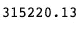

# 使用 word2vec 分析新闻标题并预测文章成功

> 原文：<https://towardsdatascience.com/using-word2vec-to-analyze-news-headlines-and-predict-article-success-cdeda5f14751?source=collection_archive---------2----------------------->

## [深入分析](https://medium.com/towards-data-science/in-depth-analysis/home)

## 文章标题的单词嵌入能预测受欢迎程度吗？关于情绪和股票的关系，我们能了解到什么？word2vec 可以帮助我们回答这些问题，还有更多。


Sentiment distributions for popular news websites

单词嵌入是表示单词以及文档(单词集合)中包含的潜在信息的一种强大方式。使用新闻文章标题的数据集，其中包括来源、情感、主题和受欢迎程度(份额数)的特征，我开始查看我们可以通过文章各自的嵌入来了解它们之间的关系。

该项目的目标是:

*   使用 NLTK 预处理/清理文本数据
*   使用 word2vec 创建单词和标题嵌入，然后使用 t-SNE 将它们可视化为集群
*   形象化标题情绪和文章流行度的关系
*   尝试从嵌入和其他可用特征预测文章流行度
*   使用模型堆叠来提高流行度模型的性能(这一步并不成功，但仍然是一个有价值的实验！)

整个笔记本托管在[这里](https://nbviewer.jupyter.org/github/chambliss/Notebooks/blob/master/Word2Vec_News_Analysis.ipynb)，使用 [nbviewer](https://nbviewer.jupyter.org/) 。

# 导入和预处理

我们将从进口开始:

```
**import** **pandas** **as** **pd**
**import** **gensim**
**import** **seaborn** **as** **sns**
**import** **matplotlib.pyplot** **as** **plt**
**import** **numpy** **as** **np**
**import** **xgboost** **as** **xgb**
```

然后读入数据:

```
main_data = pd.read_csv('News_Final.csv')
main_data.head()
```


```
# Grab all the titles 
article_titles = main_data['Title']*# Create a list of strings, one for each title*
titles_list = [title **for** title **in** article_titles]

*# Collapse the list of strings into a single long string for processing*
big_title_string = ' '.join(titles_list)

**from** **nltk.tokenize** **import** word_tokenize

*# Tokenize the string into words*
tokens = word_tokenize(big_title_string)

*# Remove non-alphabetic tokens, such as punctuation*
words = [word.lower() **for** word **in** tokens **if** word.isalpha()]

*# Filter out stopwords*
**from** **nltk.corpus** **import** stopwords
stop_words = set(stopwords.words('english'))

words = [word **for** word **in** words **if** **not** word **in** stop_words]

*# Print first 10 words*
words[:10]
```


接下来，我们需要加载预先训练好的 word2vec 模型。你可以在这里找到几款这样的[。由于这是一个新闻数据集，所以我使用了谷歌新闻模型，该模型被训练了大约 1000 亿个单词(哇)。](https://github.com/RaRe-Technologies/gensim-data)

```
*# Load word2vec model (trained on an enormous Google corpus)*
model = gensim.models.KeyedVectors.load_word2vec_format('GoogleNews-vectors-negative300.bin', binary = **True**) 

*# Check dimension of word vectors*
model.vector_size
```


所以模型会生成 300 维的词向量，我们要做的就是创建一个向量，让它通过模型。每个向量看起来像这样:

```
economy_vec = model['economy']
economy_vec[:20] *# First 20 components*
```


word2vec(可以理解)不能从一个不在其词汇表中的单词创建向量。正因为如此，我们需要在创建单词向量的完整列表时指定“if word in model.vocab”。

```
*# Filter the list of vectors to include only those that Word2Vec has a vector for*
vector_list = [model[word] **for** word **in** words **if** word **in** model.vocab]

*# Create a list of the words corresponding to these vectors*
words_filtered = [word **for** word **in** words **if** word **in** model.vocab]

*# Zip the words together with their vector representations*
word_vec_zip = zip(words_filtered, vector_list)

*# Cast to a dict so we can turn it into a DataFrame*
word_vec_dict = dict(word_vec_zip)
df = pd.DataFrame.from_dict(word_vec_dict, orient='index')df.head(3)
```


# 基于 t-SNE 的维数约简

接下来，我们将使用 t-SNE 挤压(阅读:对这些单词向量进行降维)，看看是否有任何模式出现。如果你不熟悉 t-SNE 和它的解释，看看[这篇关于 t-SNE 的优秀的、互动的 distill.pub 文章](https://distill.pub/2016/misread-tsne/)。

摆弄 SNE 霸王龙的参数很重要，因为不同的值会产生非常不同的结果。我测试了 0 到 100 之间的几个困惑值，发现每次都产生大致相同的形状。我还测试了几个介于 20 和 400 之间的学习率，并决定保持默认的学习率(200)。

出于可见性(和处理时间)的考虑，我使用了 400 个单词向量，而不是大约 20，000 个单词向量。

```
**from** **sklearn.manifold** **import** TSNE

*# Initialize t-SNE*
tsne = TSNE(n_components = 2, init = 'random', random_state = 10, perplexity = 100)

*# Use only 400 rows to shorten processing time*
tsne_df = tsne.fit_transform(df[:400])
```

现在，我们准备绘制缩减的单词向量数组。我使用`adjust_text`智能地将单词分开，以提高可读性:

```
sns.set()# Initialize figure
fig, ax = plt.subplots(figsize = (11.7, 8.27))
sns.scatterplot(tsne_df[:, 0], tsne_df[:, 1], alpha = 0.5)

*# Import adjustText, initialize list of texts*
**from** **adjustText** **import** adjust_text
texts = []
words_to_plot = list(np.arange(0, 400, 10))

*# Append words to list*
**for** word **in** words_to_plot:
    texts.append(plt.text(tsne_df[word, 0], tsne_df[word, 1], df.index[word], fontsize = 14))

*# Plot text using adjust_text (because overlapping text is hard to read)*
adjust_text(texts, force_points = 0.4, force_text = 0.4, 
            expand_points = (2,1), expand_text = (1,2),
            arrowprops = dict(arrowstyle = "-", color = 'black', lw = 0.5))

plt.show()
```


如果你有兴趣尝试一下`adjust_text`来满足自己的绘图需求，你可以在这里找到它[。一定要用 came case`adjustText`导入，请注意`adjustText`目前不兼容`matplotlib` 3.0 以上版本。](https://github.com/Phlya/adjustText)

令人鼓舞的是，即使向量嵌入已经减少到二维，我们也看到某些项目聚集在一起。例如，我们在左/左上角有**个月**，我们在底部有**个公司财务术语**，我们在中间有更多的**个通用的、非主题性的词**(比如‘full’，‘really’，‘slew’)。

请注意，如果我们用不同的参数再次运行 t-SNE，我们可能会观察到一些类似的结果，但我们不能保证看到完全相同的模式。t-SNE 不是决定性的。相关地，聚类的紧密度和聚类之间的距离并不总是有意义的。它主要是作为一种探索工具，而不是相似性的决定性指标。

# 平均单词嵌入

我们已经了解了单词嵌入如何应用于这个数据集。现在我们可以转移到一些更有趣的 ML 应用程序上:找到聚集在一起的标题，看看会出现什么样的模式。

我们可以使用一个更简单的[(有时甚至更有效)](https://stackoverflow.com/questions/45234310/doc2vec-worse-than-mean-or-sum-of-word2vec-vectors)技巧:对每个文档中单词向量的嵌入进行平均，而不是使用 Doc2Vec，doc 2 vec 没有可用的预训练模型，因此需要漫长的训练过程。在我们的例子中，文档指的是标题。

我们需要重做预处理步骤来保持标题完整——正如我们将看到的，这比拆分单词要复杂一些。谢天谢地，Dimitris Spathis [已经创建了一系列函数](https://github.com/sdimi/average-word2vec/blob/master/notebook.ipynb)，我发现它们非常适合这个用例。谢谢你，迪米特里斯！

```
**def** document_vector(word2vec_model, doc):
    *# remove out-of-vocabulary words*
    doc = [word **for** word **in** doc **if** word **in** model.vocab]
    **return** np.mean(model[doc], axis=0)

*# Our earlier preprocessing was done when we were dealing only with word vectors*
*# Here, we need each document to remain a document* 
**def** preprocess(text):
    text = text.lower()
    doc = word_tokenize(text)
    doc = [word **for** word **in** doc **if** word **not** **in** stop_words]
    doc = [word **for** word **in** doc **if** word.isalpha()] 
    **return** doc

*# Function that will help us drop documents that have no word vectors in word2vec*
**def** has_vector_representation(word2vec_model, doc):
    *"""check if at least one word of the document is in the*
 *word2vec dictionary"""*
    **return** **not** all(word **not** **in** word2vec_model.vocab **for** word **in** doc)

*# Filter out documents*
**def** filter_docs(corpus, texts, condition_on_doc):
    *"""*
 *Filter corpus and texts given the function condition_on_doc which takes a doc. The document doc is kept if condition_on_doc(doc) is true.*
 *"""*
    number_of_docs = len(corpus)

    **if** texts **is** **not** **None**:
        texts = [text **for** (text, doc) **in** zip(texts, corpus)
                 **if** condition_on_doc(doc)]

    corpus = [doc **for** doc **in** corpus **if** condition_on_doc(doc)]

    print("**{}** docs removed".format(number_of_docs - len(corpus)))

    **return** (corpus, texts)
```

现在我们将使用这些来进行处理:

```
*# Preprocess the corpus*
corpus = [preprocess(title) **for** title **in** titles_list]

*# Remove docs that don't include any words in W2V's vocab*
corpus, titles_list = filter_docs(corpus, titles_list, **lambda** doc: has_vector_representation(model, doc))

*# Filter out any empty docs*
corpus, titles_list = filter_docs(corpus, titles_list, **lambda** doc: (len(doc) != 0))x = []
**for** doc **in** corpus: *# append the vector for each document*
    x.append(document_vector(model, doc))

X = np.array(x) *# list to array*
```

# t-SNE，第二轮:文档向量

现在我们已经成功地创建了文档向量数组，让我们看看用 t-SNE 绘制它们时是否能得到类似的有趣结果。

```
*# Initialize t-SNE*
tsne = TSNE(n_components = 2, init = 'random', random_state = 10, perplexity = 100)

*# Again use only 400 rows to shorten processing time*
tsne_df = tsne.fit_transform(X[:400])fig, ax = plt.subplots(figsize = (14, 10))
sns.scatterplot(tsne_df[:, 0], tsne_df[:, 1], alpha = 0.5)

**from** **adjustText** **import** adjust_text
texts = []
titles_to_plot = list(np.arange(0, 400, 40)) *# plots every 40th title in first 400 titles*

*# Append words to list*
**for** title **in** titles_to_plot:
    texts.append(plt.text(tsne_df[title, 0], tsne_df[title, 1], titles_list[title], fontsize = 14))

*# Plot text using adjust_text*
adjust_text(texts, force_points = 0.4, force_text = 0.4, 
            expand_points = (2,1), expand_text = (1,2),
            arrowprops = dict(arrowstyle = "-", color = 'black', lw = 0.5))

plt.show()
```


挺有意思的！我们可以看到，t-SNE 将文档向量折叠到一个维度空间中，在这个空间中，文档根据其内容是与国家、世界领导人和外交事务有关，还是与技术公司有关而展开。

现在让我们来探讨一下文章流行度。人们普遍认为，一篇文章的标题越煽情或越吸引人，它就越有可能被分享，对吗？接下来，我们将看看在这个特定的数据集中是否有这方面的证据。

# 流行度和情感分析

首先，我们需要删除所有没有流行度测量或来源的文章。流行度的零测量在该数据中表示为-1。

```
*# Drop all the rows where the article popularities are unknown (this is only about 11% of the data)*
main_data = main_data.drop(main_data[(main_data.Facebook == -1) | 
                                     (main_data.GooglePlus == -1) | 
                                     (main_data.LinkedIn == -1)].index)

*# Also drop all rows where we don't know the source*
main_data = main_data.drop(main_data[main_data['Source'].isna()].index)

main_data.shape
```


我们仍然有 81，000 篇文章要处理，所以让我们看看是否可以找到情绪和股票数量之间的关联。

```
fig, ax = plt.subplots(1, 3, figsize=(15, 10))

subplots = [a **for** a **in** ax]
platforms = ['Facebook', 'GooglePlus', 'LinkedIn']
colors = list(sns.husl_palette(10, h=.5)[1:4]) 

**for** platform, subplot, color **in** zip(platforms, subplots, colors):
    sns.scatterplot(x = main_data[platform], y = main_data['SentimentTitle'], ax=subplot, color=color)
    subplot.set_title(platform, fontsize=18)
    subplot.set_xlabel('') 

fig.suptitle('Plot of Popularity (Shares) by Title Sentiment', fontsize=24)

plt.show()
```


很难确定这里是否有任何关系，因为一些文章在它们的份额计数方面是显著的异常值。让我们试着对 x 轴进行对数变换，看看我们是否能揭示任何模式。我们还将使用一个 regplot，因此`seaborn`将为每个图覆盖一个线性回归。

```
*# Our data has over 80,000 rows, so let's also subsample it to make the log-transformed scatterplot easier to read*

subsample = main_data.sample(5000)

fig, ax = plt.subplots(1, 3, figsize=(15, 10))

subplots = [a **for** a **in** ax]

**for** platform, subplot, color **in** zip(platforms, subplots, colors):
    *# Regression plot, so we can gauge the linear relationship*
    sns.regplot(x = np.log(subsample[platform] + 1), y = subsample['SentimentTitle'], 
                ax=subplot, 
                color=color,
                *# Pass an alpha value to regplot's scatterplot call*
                scatter_kws={'alpha':0.5})

    *# Set a nice title, get rid of x labels*
    subplot.set_title(platform, fontsize=18)
    subplot.set_xlabel('') 

fig.suptitle('Plot of log(Popularity) by Title Sentiment', fontsize=24)

plt.show()
```


与我们可能预期的相反(来自我们对高度情绪化、点击量大的标题的想法)，在这个数据集中，我们发现标题情绪和文章受欢迎程度(通过分享数量来衡量)之间没有关系。

为了更清楚地了解流行度本身是什么样子，让我们按平台绘制一个最终的 log(流行度)图。

```
fig, ax = plt.subplots(3, 1, figsize=(15, 10))

subplots = [a **for** a **in** ax]

**for** platform, subplot, color **in** zip(platforms, subplots, colors):

    sns.distplot(np.log(main_data[platform] + 1), ax=subplot, color=color, kde_kws={'shade':**True**})

    *# Set a nice title, get rid of x labels*
    subplot.set_title(platform, fontsize=18)
    subplot.set_xlabel('') 

fig.suptitle('Plot of Popularity by Platform', fontsize=24)

plt.show()
```


作为我们探索的最后一部分，让我们看看情绪本身。出版商之间似乎有所不同吗？

```
*# Get the list of top 12 sources by number of articles*
source_names = list(main_data['Source'].value_counts()[:12].index)
source_colors = list(sns.husl_palette(12, h=.5))

fig, ax = plt.subplots(4, 3, figsize=(20, 15), sharex=**True**, sharey=**True**)

ax = ax.flatten()
**for** ax, source, color **in** zip(ax, source_names, source_colors):
    sns.distplot(main_data.loc[main_data['Source'] == source]['SentimentTitle'],
                               ax=ax, color=color, kde_kws={'shade':**True**})
    ax.set_title(source, fontsize=14)
    ax.set_xlabel('')

plt.xlim(-0.75, 0.75)
plt.show()
```


这些分布看起来相当相似，但是当它们都在不同的地块上时，很难说出*和*有多相似。让我们试着把它们都叠加在一个图上。

```
*# Overlay each density curve on the same plot for closer comparison*

fig, ax = plt.subplots(figsize=(12, 8))

**for** source, color **in** zip(source_names, source_colors):
    sns.distplot(main_data.loc[main_data['Source'] == source]['SentimentTitle'],
                               ax=ax, hist=**False**, label=source, color=color)
    ax.set_xlabel('')

plt.xlim(-0.75, 0.75)
plt.show()
```


我们看到，来源对文章标题的情感分布非常相似——就正面或负面标题而言，似乎没有任何一个来源是异常的。相反，所有 12 个最常见的来源都以 0 为中心分布，尾部大小适中。但这能说明全部情况吗？让我们再来看看这些数字:

```
# Group by Source, then get descriptive statistics for title sentiment
source_info = main_data.groupby('Source')['SentimentTitle'].describe()# Recall that `source_names` contains the top 12 sources
# We'll also sort by highest standard deviation
source_info.loc[source_names].sort_values('std', ascending=False)[['std', 'min', 'max']]
```


WSJ has both the highest standard deviation and the largest range.

我们可以一眼看出，与其他任何顶级来源相比,《华尔街日报》的标准差最高，范围最大，最低情绪最低。这表明《华尔街日报》的文章标题可能异常负面。为了严格验证这一点，需要进行假设检验，这超出了本文的范围，但这是一个有趣的潜在发现和未来方向。

# 流行预测

我们为建模准备数据的第一个任务是用各自的标题重新连接文档向量。幸运的是，当我们预处理语料库时，我们同时处理了`corpus`和`titles_list`，所以向量和它们所代表的标题仍然匹配。同时，在`main_df`中，我们已经删除了所有流行度为-1 的文章，所以我们需要删除代表这些文章标题的向量。

在这台计算机上，按原样在这些巨大的向量上训练一个模型是不可能的，但我们会看看我们可以做些什么来降低维度。我还将从发布日开始设计一个新特性:“DaysSinceEpoch”，它基于 Unix 时间(在这里阅读更多)。

```
**import** **datetime**

*# Convert publish date column to make it compatible with other datetime objects*

main_data['PublishDate'] = pd.to_datetime(main_data['PublishDate'])

*# Time since Linux Epoch*
t = datetime.datetime(1970, 1, 1)

*# Subtract this time from each article's publish date*
main_data['TimeSinceEpoch'] = main_data['PublishDate'] - t

*# Create another column for just the days from the timedelta objects* 
main_data['DaysSinceEpoch'] = main_data['TimeSinceEpoch'].astype('timedelta64[D]')

main_data['TimeSinceEpoch'].describe()
```


正如我们所看到的，所有这些文章都是在 250 天之内发表的。

```
**from** **sklearn.decomposition** **import** PCA

pca = PCA(n_components=15, random_state=10)

*# as a reminder, x is the array with our 300-dimensional vectors*
reduced_vecs = pca.fit_transform(x)df_w_vectors = pd.DataFrame(reduced_vecs)

df_w_vectors['Title'] = titles_list# Use pd.concat to match original titles with their vectors
main_w_vectors = pd.concat((df_w_vectors, main_data), axis=1)

*# Get rid of vectors that couldn't be matched with the main_df*
main_w_vectors.dropna(axis=0, inplace=**True**)
```

现在，我们需要删除非数字和非虚拟列，以便将数据输入到模型中。我们还将对`DaysSinceEpoch`特性应用缩放，因为与减少的词向量、情感等相比，它在数量上要大得多。

```
*# Drop all non-numeric, non-dummy columns, for feeding into the models*
cols_to_drop = ['IDLink', 'Title', 'TimeSinceEpoch', 'Headline', 'PublishDate', 'Source'] 

data_only_df = pd.get_dummies(main_w_vectors, columns = ['Topic']).drop(columns=cols_to_drop)

*# Standardize DaysSinceEpoch since the raw numbers are larger in magnitude* 
**from** **sklearn.preprocessing** **import** StandardScaler

scaler = StandardScaler()

*# Reshape so we can feed the column to the scaler*
standardized_days = np.array(data_only_df['DaysSinceEpoch']).reshape(-1, 1)
data_only_df['StandardizedDays'] = scaler.fit_transform(standardized_days)

*# Drop the raw column; we don't need it anymore*
data_only_df.drop(columns=['DaysSinceEpoch'], inplace=**True**)

*# Look at the new range*
data_only_df['StandardizedDays'].describe()
```


```
# Get Facebook data only
fb_data_only_df = data_only_df.drop(columns=['GooglePlus', 'LinkedIn'])# Separate the features and the response
X = fb_data_only_df.drop('Facebook', axis=1)
y = fb_data_only_df['Facebook']

*# 80% of data goes to training*
X_train, X_test, y_train, y_test = train_test_split(X, y, test_size = 0.2, random_state = 10)
```

让我们对数据运行一个非优化的`XGBoost`，看看它是如何开箱即用的。

```
**from** **sklearn.metrics** **import** mean_squared_error

*# Instantiate an XGBRegressor*
xgr = xgb.XGBRegressor(random_state=2)

*# Fit the classifier to the training set*
xgr.fit(X_train, y_train)

y_pred = xgr.predict(X_test)

mean_squared_error(y_test, y_pred)
```


至少可以说，结果平平。我们可以通过超参数调整来提高这种性能吗？我从[这篇 Kaggle 文章](https://www.kaggle.com/jayatou/xgbregressor-with-gridsearchcv)中提取并重新调整了一个超参数调整网格。

```
**from** **sklearn.model_selection** **import** GridSearchCV

*# Various hyper-parameters to tune*
xgb1 = xgb.XGBRegressor()
parameters = {'nthread':[4], 
              'objective':['reg:linear'],
              'learning_rate': [.03, 0.05, .07], 
              'max_depth': [5, 6, 7],
              'min_child_weight': [4],
              'silent': [1],
              'subsample': [0.7],
              'colsample_bytree': [0.7],
              'n_estimators': [250]}

xgb_grid = GridSearchCV(xgb1,
                        parameters,
                        cv = 2,
                        n_jobs = 5,
                        verbose=**True**)

xgb_grid.fit(X_train, y_train)
```

根据`xgb_grid`，我们的最佳参数如下:

```
{'colsample_bytree': 0.7, 'learning_rate': 0.03, 'max_depth': 5, 'min_child_weight': 4, 'n_estimators': 250, 'nthread': 4, 'objective': 'reg:linear', 'silent': 1, 'subsample': 0.7}
```

用新参数再试一次:

```
params = {'colsample_bytree': 0.7, 'learning_rate': 0.03, 'max_depth': 5, 'min_child_weight': 4, 
          'n_estimators': 250, 'nthread': 4, 'objective': 'reg:linear', 'silent': 1, 'subsample': 0.7}

*# Try again with new params*
xgr = xgb.XGBRegressor(random_state=2, **params)

*# Fit the classifier to the training set*
xgr.fit(X_train, y_train)

y_pred = xgr.predict(X_test)

mean_squared_error(y_test, y_pred)
```



大约好了 35，000，但我不确定这说明了很多。在这一点上，我们可以推断，当前状态的数据似乎不足以让这个模型运行。让我们看看我们是否可以用更多的功能工程来改进它:我们将训练一些分类器来区分两个主要的文章组:哑弹(0 或 1 份额)与非哑弹。

这个想法是，如果我们可以给回归变量一个新的特征(文章将具有极低份额的概率)，它可能会在预测高度共享的文章方面表现得更好，从而降低这些文章的残值并减少均方误差。

# 迂回:检测无用的文章

从我们之前制作的对数转换图中，我们可以注意到，一般来说，有 2 个文章块:1 个簇在 0，另一个簇(长尾)从 1 开始。我们可以训练一些分类器来识别文章是否是“无用的”(在 0-1 股票箱中)，然后使用这些模型的预测作为最终回归的特征，这将预测概率。这叫做**模型叠加**。

```
# Define a quick function that will return 1 (true) if the article has 0-1 share(s)
def dud_finder(popularity):
    if popularity <= 1:
        return 1
    else:
        return 0# Create target column using the function
fb_data_only_df['is_dud'] = fb_data_only_df['Facebook'].apply(dud_finder)
fb_data_only_df[['Facebook', 'is_dud']].head()
```


```
# 28% of articles can be classified as "duds"
fb_data_only_df['is_dud'].sum() / len(fb_data_only_df)
```


现在我们已经有了无用的特征，我们将初始化分类器。我们将使用一个随机森林、一个优化的 xgb 分类器和一个 K-最近邻分类器。我将省去调优 XGB 的部分，因为它看起来与我们之前进行的调优基本相同。

```
from sklearn.ensemble import RandomForestClassifier
from sklearn.neighbors import KNeighborsClassifier
from sklearn.model_selection import train_test_splitX = fb_data_only_df.drop(['is_dud', 'Facebook'], axis=1)
y = fb_data_only_df['is_dud']# 80% of data goes to training
X_train, X_test, y_train, y_test = train_test_split(X, y, test_size = 0.2, random_state = 10)# Best params, produced by HP tuning
params = {'colsample_bytree': 0.7, 'learning_rate': 0.03, 'max_depth': 5, 'min_child_weight': 4, 
          'n_estimators': 200, 'nthread': 4, 'silent': 1, 'subsample': 0.7}# Try xgc again with new params
xgc = xgb.XGBClassifier(random_state=10, **params)
rfc = RandomForestClassifier(n_estimators=100, random_state=10)
knn = KNeighborsClassifier()preds = {}
for model_name, model in zip(['XGClassifier', 'RandomForestClassifier', 'KNearestNeighbors'], [xgc, rfc, knn]):
    model.fit(X_train, y_train)
    preds[model_name] = model.predict(X_test)
```

测试模型，获得分类报告:

```
from sklearn.metrics import classification_report, roc_curve, roc_auc_scorefor k in preds:
    print("{} performance:".format(k))
    print()
    print(classification_report(y_test, preds[k]), sep='\n')
```


f1 成绩最好的是 XGC，其次是 RF，最后是 KNN。然而，我们也可以注意到，在召回(成功识别哑弹)方面，KNN 实际上做得最好*。这就是为什么模型堆叠是有价值的——有时，即使是 XGBoost 这样优秀的模型也可能在像这样的任务中表现不佳，显然要识别的函数可以进行局部近似。包括 KNN 的预测应该会增加一些急需的多样性。*

```
*# Plot ROC curves
for model in [xgc, rfc, knn]:
    fpr, tpr, thresholds = roc_curve(y_test, model.predict_proba(X_test)[:,1])
    plt.plot([0, 1], [0, 1], 'k--')
    plt.plot(fpr, tpr)

plt.xlabel('False Positive Rate')
plt.ylabel('True Positive Rate')
plt.title('ROC Curves')
plt.show()*
```

**

# *人气预测:第二轮*

*现在，我们可以对三个分类器的概率预测进行平均，并将其用作回归变量的一个特征。*

```
*averaged_probs = (xgc.predict_proba(X)[:, 1] +
                  knn.predict_proba(X)[:, 1] + 
                  rfc.predict_proba(X)[:, 1]) / 3X['prob_dud'] = averaged_probs
y = fb_data_only_df['Facebook']*
```

*接下来是另一轮惠普调整，包括新的特性，我将不再赘述。让我们看看我们的表现如何:*

```
*xgr = xgb.XGBRegressor(random_state=2, **params)# Fit the classifier to the training set
xgr.fit(X_train, y_train)y_pred = xgr.predict(X_test)mean_squared_error(y_test, y_pred)*
```

**

*啊哦！这种性能本质上与我们进行任何模型堆叠之前是一样的。也就是说，我们可以记住，MSE 作为一种误差度量，往往会加重异常值。事实上，我们还可以计算平均绝对误差(MAE ),它用于评估具有显著异常值的数据的性能。在数学术语中，MAE 计算残差的 [l1 范数](https://en.wikipedia.org/wiki/Norm_(mathematics))，本质上是绝对值，而不是 MSE 使用的 l2 范数。我们可以将 MAE 与 MSE 的平方根进行比较，后者也称为均方根误差(RMSE)。*

```
*mean_absolute_error(y_test, y_pred), np.sqrt(mean_squared_error(y_test, y_pred))*
```

**

*平均绝对误差只有 RMSE 的 1/3 左右！也许我们的模型没有我们最初想象的那么糟糕。*

*作为最后一步，让我们根据 XGRegressor 来看看每个特性的重要性:*

```
*for feature, importance in zip(list(X.columns), xgr.feature_importances_):
    print('Model weight for feature {}: {}'.format(feature, importance))*
```

**

*Aha! prob_dud was found to be the most important feature.*

*整洁！我们的模型发现`prob_dud`是最重要的特性，我们的定制`StandardizedDays`特性是第二重要的特性。(特征 0 到 14 对应于简化的标题嵌入向量。)*

*尽管通过这一轮的模型堆叠，整体性能并没有得到改善，但是我们可以看到，我们确实成功地捕获了数据中可变性的一个重要来源，而模型正是利用了这个来源。*

*如果我继续扩展这个项目以使模型更加准确，我可能会考虑用外部数据增加数据，包括通过宁滨或哈希将 Source 作为变量，在原始的 300 维向量上运行模型，并使用每篇文章在不同时间点的流行度的“时间切片”数据(该数据的配套数据集)来预测最终的流行度。*

*如果您觉得这个分析很有趣，请随意使用代码，并对其进行进一步扩展！笔记本在这里是(注意，一些单元格的顺序可能与这里显示的略有不同)，这个项目使用的原始数据在这里是。*