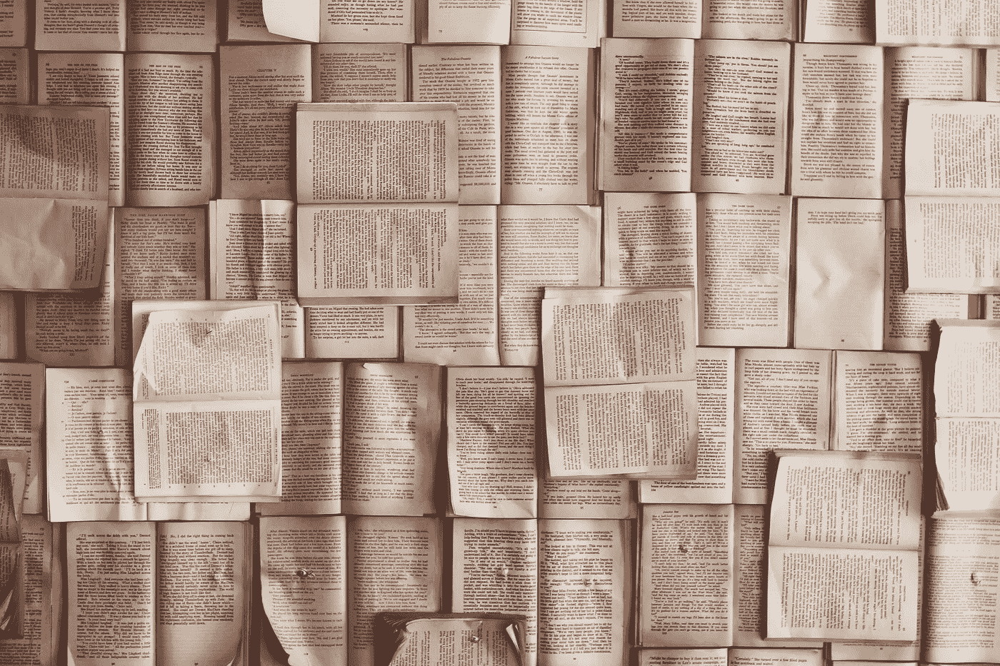
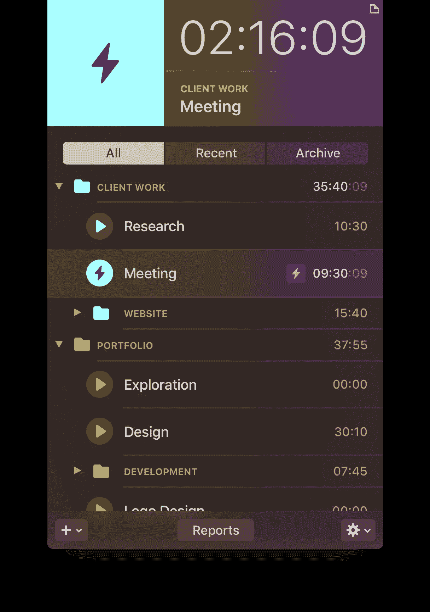
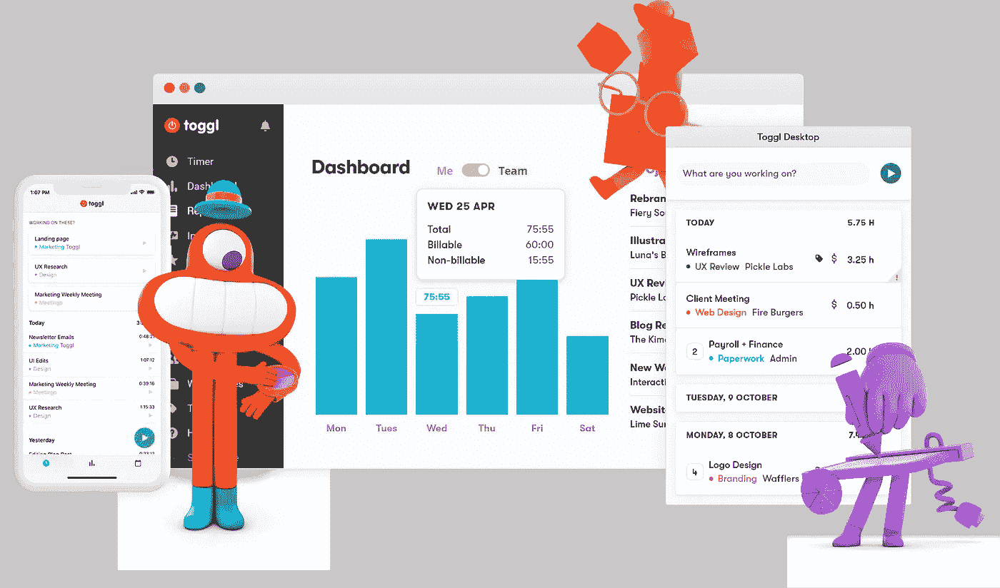
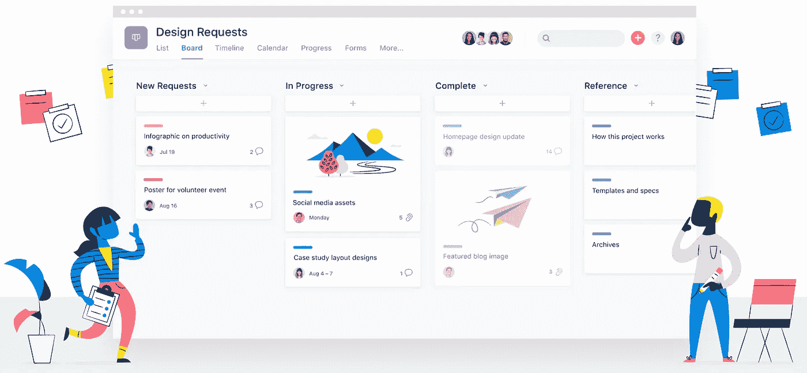

# 利用你自己设定的截止日期|今天就开始吧

> 原文：<https://towardsdatascience.com/utilize-your-self-imposed-deadlines-punch-today-in-the-face-86f6e885164c?source=collection_archive---------28----------------------->

Photo by [Kevin Ku](https://unsplash.com/@ikukevk) at [Unsplash](https://unsplash.com/photos/aiyBwbrWWlo)

为自己设定最后期限的艺术至关重要，不仅是为了超越要求，也是为了让我们在实现大大小小目标的过程中更加顺利。爱他们或者恨他们；它们是令人难以置信的激励期限！然而，在处理截止日期时，有两件事我们应该尽量避免，完美主义或在截止日期前死去，这两件事都会增加压力。

即使是一个项目、一个目标、一次会议等，自我安排的技术也可以实现。没有实际的截止日期。它帮助我们组织我们处理每一个必须完成的任务或我们想要完成的目标的方式。这些自我设定的截止日期应该根据每项工作的优先级进行战略上的**。**

> **为了让未来激励当前的行动，它必须让人感觉迫在眉睫。为了创造这种迫在眉睫的感觉，我们操纵了时间度量——考虑时间的单位(例如，天、年)。——[**小尼尔**](https://journals.sagepub.com/action/doSearch?target=default&ContribAuthorStored=Lewis%2C+Neil+A+Jr)**

**目标是在几个月后取得重大胜利，这很好；然而，我们应该建立小的里程碑，小的成功！在几天内而不是几周或几个月内设定最后期限会在潜意识里激发一种更严肃和优先的意识。**

**无论我们是要写一篇文章，做一个项目，会见一个客户，计划一个营销活动，计划一个重大的变化，还是开始一项新的业务，我们都可以利用一些技巧和工具来避免淹没在焦虑中，因为延长的截止日期会对我们的健康造成严重破坏。**

> **内部强加的期限减少了拖延。所以，自己设定最后期限可能比别人为你设定更好。—[psychreg.com](https://www.psychreg.org/psychology-of-deadlines/)**

****

# **技术**

**在过去的五年里，我每天都在使用的三个技巧是实现许多大大小小的里程碑的关键因素。他们让我明白了如何闯入数据科学和数字营销的世界。**

## **ⓐ专注，提高生产力！**

****

**Photo by [Patrick Tomasso](https://unsplash.com/@impatrickt) at [Unsplash](https://unsplash.com/photos/Oaqk7qqNh_c)**

**为了获得高质量的结果，每天专注于一项任务是至关重要的。记住，**如果你想同时做所有的事情，你最终会一事无成！**自我设定的期限是衡量你的行动是成功还是失败的重要标准。因此，优先考虑什么是最重要的，每天工作 3-4 小时，然后庆祝你的小里程碑！保持动力。**

## **ⓑ建立短期里程碑，并庆祝！**

****

**Photo by [Estée Janssens](https://unsplash.com/@esteejanssens) at [Unsplash](https://unsplash.com/photos/aQfhbxailCs)**

**处理大任务或大项目的一个很好的技巧是把它们分解成小的、小的里程碑。因此，这会让事情变得更加可行，这有助于开始工作并朝着最后期限努力。**

**完成任何一个里程碑后，犒劳或欺骗自己！设定最后期限，利用奖励和结果。**

> ***例如，作为我职业发展计划的一部分，我设定了一个目标，通过参加由 AJ & Smart 担任辅导员的设计冲刺大师班，在两周内阅读、学习和应用* [*设计冲刺*](/solving-big-challenges-in-four-days-using-a-design-sprint-3ad468bf91df) *的力量。我决定，一旦我完成了这个项目，拿到了证书，我就再看一遍《指环王》三部曲！我做到了。***

## ****ⓒ** 早起，今天又打脸了！**

****

**Photo by [Johnson Wang](https://unsplash.com/@jdubs) at [Unsplash](https://unsplash.com/photos/iI4sR_nkkbc)**

**不管你是不是一个早起的人，在早上完成尽可能多的任务会提高你的生产力水平，鼓励你实现短期的里程碑。不过，提前计划是至关重要的！知道你早上要做什么，第二天早上要做什么，等等，将帮助你尽早实现每天的目标，然后，你就可以享受一天的剩余时间。然而，不要超出你的日常任务，除非你还在 3 到 4 个小时的范围内，或者你想为第二天节省一些时间。坚持每天的最后期限，保持专注，不断激励自己。**

****

# **工具**

**他们不是必须的，但是，有时候你需要他们被组织起来，被激励着继续前进。你需要记录你的进展，记录你在每项任务上花费的时间。以下是我经常用来帮助我完成每个项目或任务的工具。**

## **ⓐ时间追踪，用番茄工作法！**

*   **[Klokki for Mac](https://klokki.com) :自动计时，记录我在一项任务或整个项目上花了多少时间。**

****

**Photo Courtesy by Klokki.com**

*   **Toggl :另一个伟大的工具，我用它在我所有的设备上追踪每一个任务的时间。**

****

**Photo Courtesy by Klokki.com**

> ****番茄工作法**:一种时间管理技巧，用来提高你的注意力和工作效率。这项技术应用一个计时器将一项任务分解成多个间隔，传统上是 25 分钟，中间间隔 5 分钟。**

## **ⓑ工作管理**

*   **体位法:它有助于专注于你的工作目标、项目和日常任务。**

****

**Photo Courtesy by asana.com**

> **你利用什么动机、工具、提示和奖励来满足自己设定的期限？**