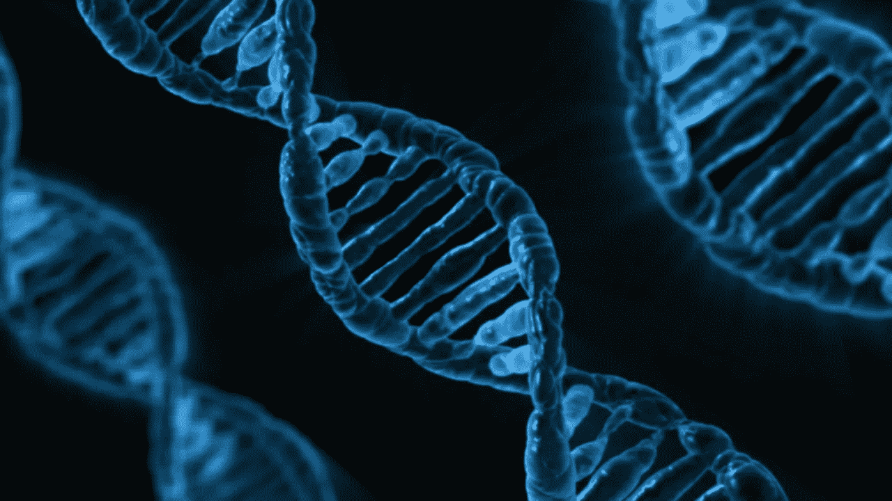
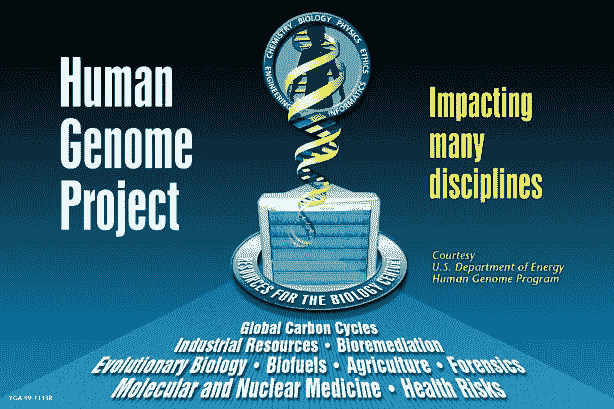
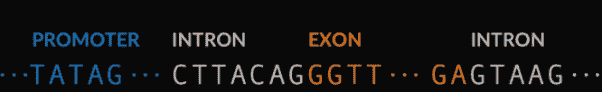
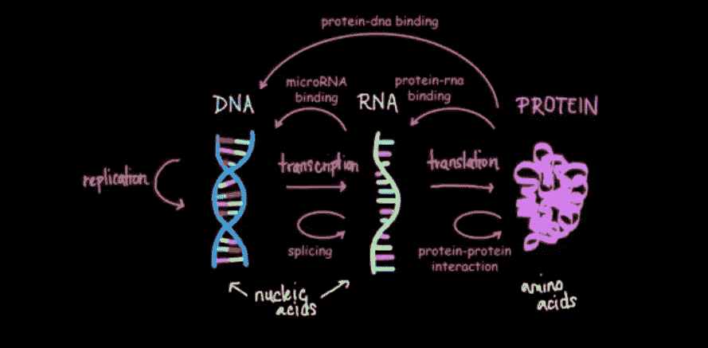
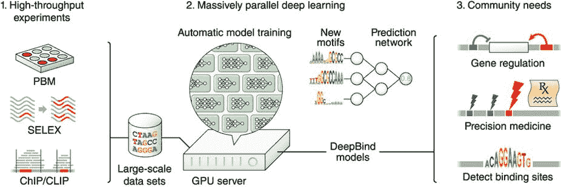
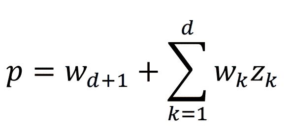
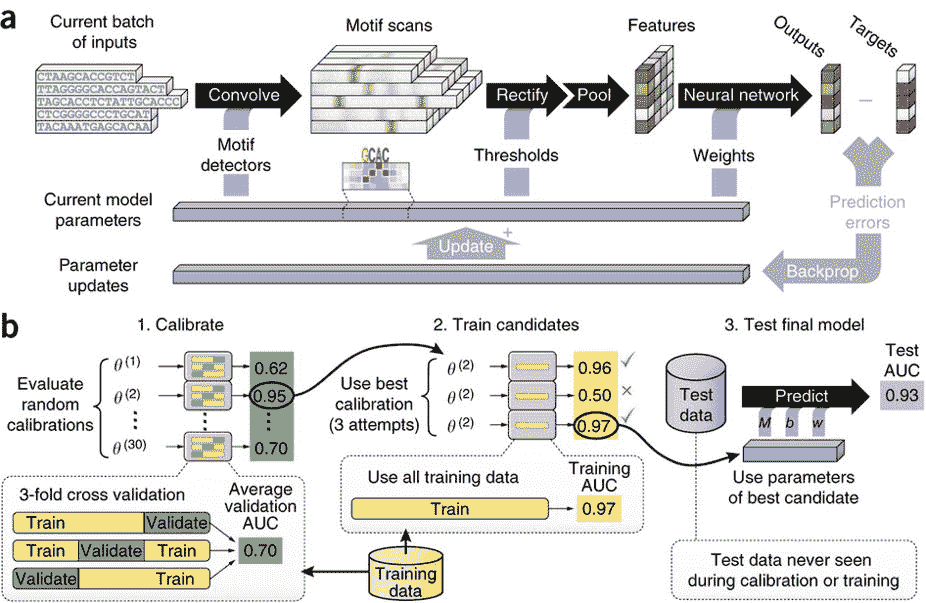
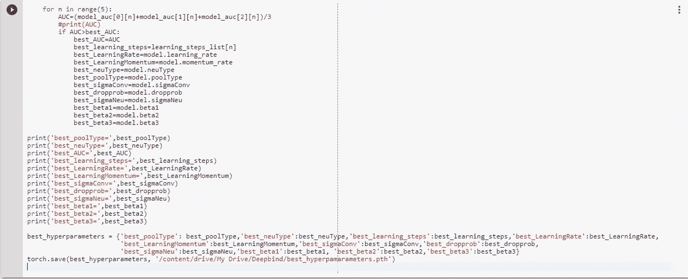
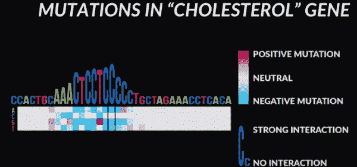

# 使用 CNN 来理解我们基因组的复杂性和预测未来的疾病

> 原文：<https://towardsdatascience.com/utilizing-convolutional-neural-networks-cnns-for-predicting-dna-protein-interactions-and-ee22cf9095c5?source=collection_archive---------20----------------------->

在过去的几年里，机器和深度学习领域的指数级进展已经为解决医疗保健的一些最困扰的问题提供了一种新的方法:**深度学习**。事实上，医疗保健领域的人工智能市场预计到 2025 年将超过**360 亿美元！**从比放射科医生更准确地诊断各种形式的癌症患者，到了解 cfDNA 甲基化模式如何对应癌症诊断，使用 AI 和深度学习的应用层出不穷。我们可以想象这样一个世界，人工智能已经成功地让我们实际上**绘制了我们的整个基因组**，并且**在致病突变发生前几年就预测它们！**像 [Deep Genomics](http://deepgenomics.com) 和 [Freenome](http://freenome.com) 这样的初创公司在这个行业处于领先地位，而像 [Verily](https://verily.com/) 和 [Calico](https://www.calicolabs.com/) 这样的大型生物技术初创公司正在得到谷歌的资助，并开始开发使用人工智能的应用程序。但为什么人工智能在医疗保健领域的应用市场发展如此迅速？

# **基因组数据量和可访问性的增加**

2003 年，人类基因组计划(HGB)花费了 30 亿美元成功测序了第一个人类基因组。现在，领先的基因测序公司之一 Illumina 已经提供了迄今为止最便宜的测序测试，仅售 47 美元。随着 23andMe DNA 测试等服务的普及，以及对个性化医疗的进一步研究，这有助于大幅增加可用数据量，这是训练人工智能模型的必要条件。尽管如此，我们理解基因组的能力几乎只是它实际意义的一小部分。正如来自 Deep Genomics 的 Brendan Frey 所说，我们使用基因测序和基因编辑工具来测量和改变生物学的能力远远超过了我们实际理解生物学的能力。人工智能正在改变这一切。

我发现 Deep Genomics 正在做的工作绝对是疯狂的，我想亲自尝试一下，了解一下这两个快速发展的学科的交集。我决定从事一个涉及生物功能的项目，这个项目已经在许多实验室进行过，从斯坦福到 Deep Genomics 等公司。我想了解**DNA-蛋白质结合相互作用是如何工作的**以及**基因变异如何影响转录因子蛋白质在转录过程中的作用。**

但是等等！等等，这些词是什么意思？让我们退一步，了解什么是**转录因子**蛋白质，以及它们如何影响**转录**。是时候上一点生物学 101 课了！

# **转录因子是如何工作的，为什么会与 DNA 结合？**

我们基因组中的每个基因都由三个主要部分组成:启动子、内含子和外显子。**启动子**本质上是基因中负责**转录的部分，也就是将 DNA 转录成 RNA 的过程。**接下来的部分是**内含子**，将近 10000 个核苷酸长，**包含基因的逻辑。生物学家把它比作计算机程序，或者基因背后的大脑。内含子有助于组织绑定的工作方式。另一方面，外显子只有 100 个核苷酸长，并且**负责执行内含子的逻辑**，或者使用计算机程序模拟的打印语句。**

这个过程是如何工作的，DNA 被转录成 RNA，RNA 被翻译成蛋白质。蛋白质对于身体组织和器官的结构、功能和调节是必不可少的，因此这一过程是必不可少的。这个过程通过转录因子结合来调节，转录因子结合控制转录和翻译发生的频率。这听起来可能很简单，但这三个组成部分之间的关系有许多复杂之处，通常情况下，我们的基因突变不会导致结合。影响一个核苷酸**的小突变**会导致疾病和病症，如家族性高胆固醇血症，并可能导致某些形式的癌症！

为了解决理解这一过程如何工作以及检测基因变异的问题，我一直在致力于一个项目，以在 PyTorch 和 Tensorflow 等现代机器学习框架上实现由 UofT 的研究人员在 2015 年创建的工具[**【Deep bind】**](https://www.nature.com/articles/nbt.3300)**，**。这个模型是用 Matlab 编写的，我想看看我是否可以借助现在用于开发模型的更好的软件包和工具来提高或达到类似的精度。

**deep bind 如何工作**

DeepBind 是一种卷积神经网络架构，它接受有噪声的实验数据并输出结合亲和力，即转录因子蛋白质结合或粘附到序列上的可能性。虽然 CNN 通常用于图像数据，但该网络在基因组数据上工作得非常好，随机选择输入序列通过网络输出得分预测。根据我从 ENCODE 获得的实验数据，序列可以有不同的长度，从大约 15-100 个核苷酸。对于任何序列 s，该模型使用四个阶段计算结合分数 f(s)。

**卷积阶段**在整个序列中用参数 M 扫描一组模体检测器(4 x m 矩阵)。这使得系数不必是概率或对数奇数比(这是表达概率的另一种方式)，不像位置权重矩阵(PWMs)，其通常用于理解这些相互作用的序列特异性。

接下来，**整流级**将通过移动 motif 检测器的响应并使用整流线性单位函数(ReLU)将任何负值箝位至零来隔离任何模式。然后，它经过**汇集阶段，**其中模型计算每个基序检测器的最大值和平均值， *M-k.* 通过最大化，模型可以识别任何较长基序或模式的存在，而平均有助于增加或累积较短模式的效果。这两种汇集方法的贡献是由学习决定的。

Neural Network Produces Binding Score

最后，将神经网络输入到一个非线性神经网络中，权重为 W，结合基序检测器的响应产生一个分数。它采用维度为 *d* 的特征向量 *z* ，这是汇集到该输出分数中的输出，简单地使用可调权重的 *(d+1)* 维度向量，其中权重基于其对输出的贡献应用于向量中的每个值，并最终使用附加的偏置项来获得输出。然而，根据不同的网络配置，这是不同的。例如，如果我们实现 dropout，我们偶尔会忽略向量 *z* 的中间值，这具有很强的正则化效果。要了解这方面的更多信息，我建议查看他们发表在《自然》杂志上的论文的[补充说明](https://media.nature.com/original/nature-assets/nbt/journal/v33/n8/extref/nbt.3300-S2.pdf)，这在我实现这个模型时对我非常有用。

然后，该模型将使用损失函数来比较模型的输出与结合相互作用的目标值，然后使用反向传播和随机梯度下降(sgd)来更新不同的参数，例如学习率。

DeepBind 运行良好的一个独特特性是**自动训练管道**。深度学习的最大障碍之一是模型对**校准参数或超参数非常敏感。**这些参数包括与训练算法相关的参数，如辍学、学习率、批量，而其他参数则与模型架构相关(层数和隐藏单元数)，甚至更多！熟练地校准这些参数是提高模型准确性的关键。DeepBind 通过评估超参数的随机校准来自动化这一点，其中精度最高的模型根据训练数据进行训练。基于具有最佳准确度的候选，在新数据上测试超参数的校准，并且保存超参数校准用于在新数据上的进一步训练和测试。PyTorch 实现中保存超参数的代码如下所示:

**deep bind 在基因组学研究中的应用**

虽然这真的很酷，很迷人，但我们如何应用它来帮助解决医学和基因组学领域的问题呢？使用 DeepBind，我们可以通过计算机模拟来改变基因中某些结合位点的核苷酸，并确定它在结合上是积极还是消极的相互作用。例如，看看胆固醇基因的突变，我们可以看到某些突变可以通过影响结合亲和力来破坏结合位点。有时，这些突变对基因有积极的影响或没有影响，而其他突变会导致消极的原因，如胆固醇水平异常。

Source: NIPS 2017 Talk by Brendan Frey, CEO of Deep Genomics

# **结论**

总之，人工智能在医疗保健领域的应用和可能性是无限的。从早期诊断，到了解疾病机制以开发治疗方法，人工智能以如此多的方式让我们以如此多的不同方式进一步解释基因组。使用 DeepBind，我们可以了解 DNA-蛋白质相互作用是如何工作的，并识别遗传变异和突变的影响。使用人工智能和深度学习，我们有机会了解隐藏在基因组内的许多秘密，并了解更多有关基本过程的信息。让我们确保我们理解生物学**的能力与我们测量和改变生物学的能力相匹配，这样我们就能在治疗和研究方面做出最好的决定。**

## 关键要点

1.  人工智能和基因组学是两个快速发展的学科；将它们结合起来给了我们很多机会来改善医疗保健治疗和我们对基因组的理解。
2.  使用 DeepBind，我们可以了解转录因子(TF)结合是如何工作的，并预测蛋白质是否会与基因结合。
3.  通过计算机模拟，我们可以测试突变对基因的影响，以及它们是导致正突变还是负突变。
4.  人工智能为我们提供了最好的机会，让我们理解生物学的能力与我们目前改变(想想 CRISPR-CAS9 和基因编辑)和测量生物学的能力相提并论。

## 后续步骤

如果您喜欢这篇文章，请务必遵循这些步骤，与我未来的项目和文章保持联系！

1.  看看我在这个项目上发表的[演讲](https://www.youtube.com/watch?v=EGo8iw2Ohas)！
2.  在 Linkedin[上与我联系，了解我未来的发展和项目。我目前正在研究 NVIDIA 在 2018 年 12 月创建的 StyleGAN，每天都在阅读更多的论文！](https://www.linkedin.com/in/seyone-chithrananda-a5974915b/)
3.  请务必[订阅](https://www.subscribepage.com/e8v5s6)我的每月简讯，以查看我参加的新项目、会议和发表的文章！
4.  随时给我发电子邮件在 seyonec@gmail.com 谈论这个项目和更多！