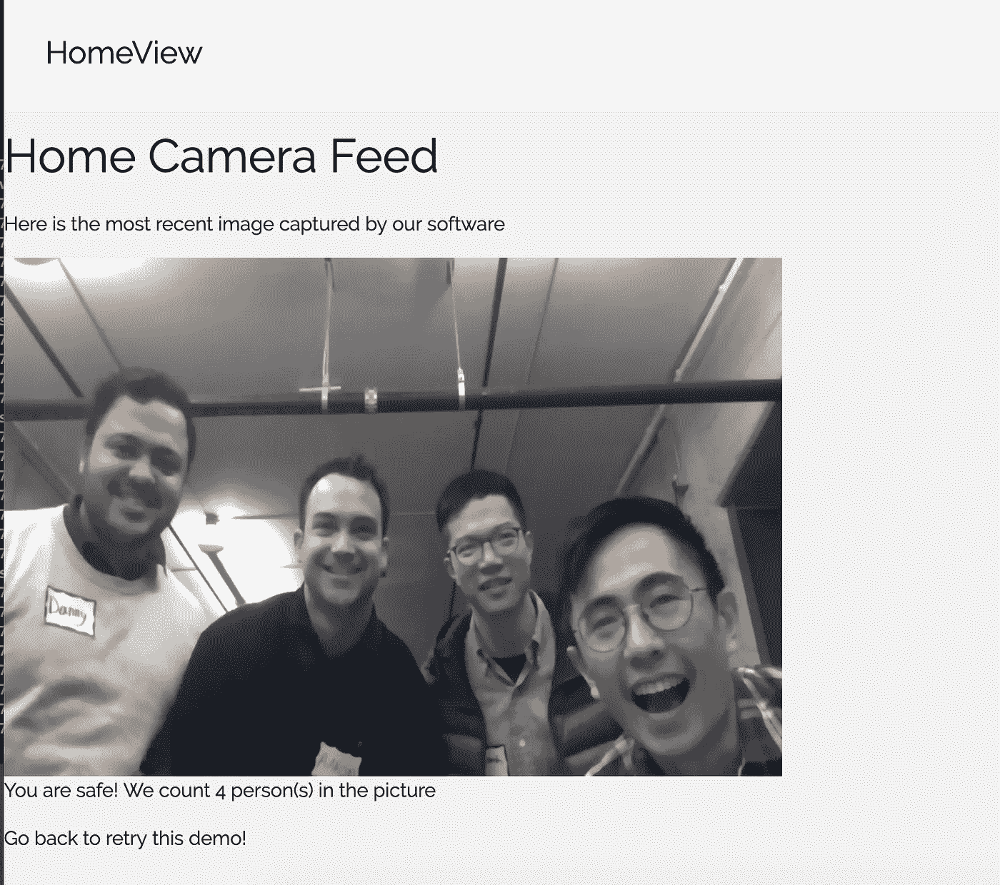
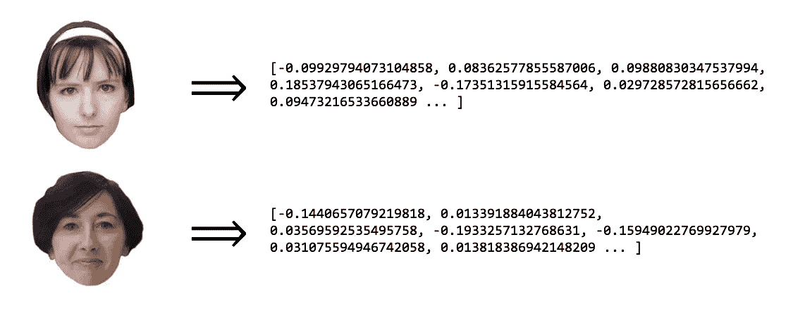
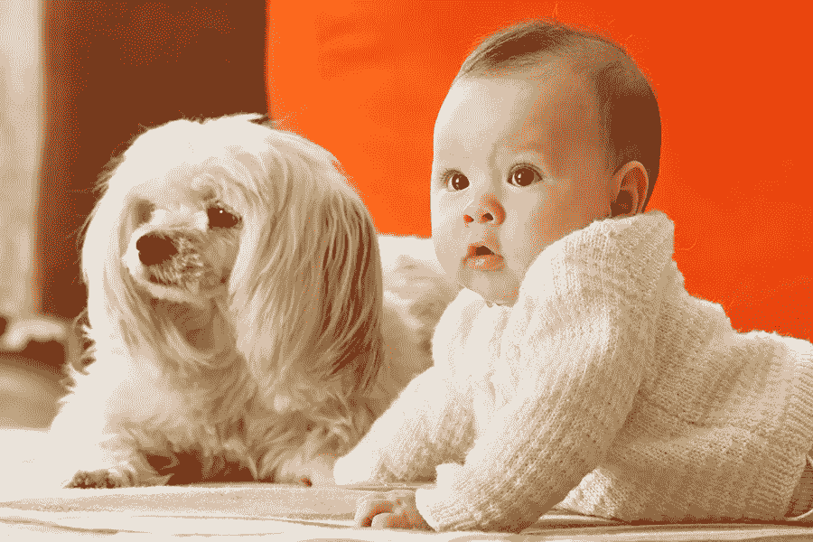

# 利用免费图像工具实现家庭安全

> 原文：<https://towardsdatascience.com/utilizing-free-image-tools-for-home-security-fd4a6630181c?source=collection_archive---------18----------------------->



## 为 2019 年开发者周黑客马拉松创建的 Webapp

[在之前的一篇文章](/the-data-driven-partier-movie-mustache-25b078c7e72d)中，我展示了开箱即用的图像识别软件如何让面部检测变得几乎微不足道，但在这篇博客中，我将分享其他免费使用的 API 与图像应用的不同应用。我最近和[丹尼·门多萨](https://medium.com/u/e6d41c732514?source=post_page-----fd4a6630181c--------------------------------)、[本杰明·梁](https://medium.com/u/e6a272482d37?source=post_page-----fd4a6630181c--------------------------------)和[史蒂文·欧洋](https://medium.com/u/9f024c654ec7?source=post_page-----fd4a6630181c--------------------------------)一起参加了[三藩市的开发者周黑客马拉松](https://www.developerweek.com/hackathon)，在那里我们制作了一个名为 HomeView 的家庭安全网络应用的演示。这款应用背后的前提是，我们将使用 Clariai 的图像分类 API 来实现家庭安全目的，1)检测家庭入侵，2)更智能地监控婴儿。在最高级别上，我们的家庭入侵探测器拍摄图像(来自生产环境中的实时视频)，并对人脸进行计数，以确保其中至少有一个人住在房子里。婴儿监视器检测图片中是否有婴儿，或者婴儿是否处于危险状态，即图片中有刀或火。在任何危险情况下，我们都会向用户发送短信，提醒他们家中存在不安全情况。如果你想使用 [Flask](http://flask.pocoo.org/) 构建一个类似的 webapp，这个项目的代码在 [my GitHub](https://github.com/aaronfrederick/Dev-Week-Hackathon-2019) 上。



[Source](https://logicalgenetics.com/face-clustering-with-neural-networks-and-k-means/)

该项目的家庭入侵部分利用了 Clarifai 的[人脸嵌入](https://clarifai.com/models/face-embedding-image-recognition-model-d02b4508df58432fbb84e800597b8959)和[人脸检测](https://clarifai.com/models/face-detection-image-recognition-model-a403429f2ddf4b49b307e318f00e528b-detection)模型。人脸嵌入模型将图片作为输入，并输出描述该人脸的 1024 维向量。使用我和队友的照片，我们将我们的面部向量存储为与任何新面孔进行比较的向量。为了比较我们的脸，我们使用了余弦相似度，一种与两个向量的角度而不是大小相关的距离度量。这是稀疏向量的常见比较度量，因为当许多维度通常为 0 时，它们会删除可以测量角度的自由度，从而限制我们的比较空间。因此，我们可以用一种比评估欧几里得距离稍微更敏感的方法来测量人脸之间的距离。在评估高维稀疏向量时，这种更大的粒度使我们在断言新面孔是或不是项目成员时更有信心。下面的代码显示了我们使用的函数:

一旦我们存储了地面真实人脸向量，我们将运行人脸检测模型来计算新图片中的人脸数量。然后，我们将新图片中的每张脸与我们的地面真实脸进行比较，并确保至少有一个余弦相似度高于设定的阈值。如果没有一个比较高于这个阈值，我们可以断言没有一个面部足够接近我们的地面真实面部来被认为是“安全的”,因此，存在入侵者。



我们 webapp 的婴儿监视器部分使用了不同的 Clarifai 产品:[通用模型](https://clarifai.com/models/general-image-recognition-model-aaa03c23b3724a16a56b629203edc62c)。Clarifai 的通用模型是一个卷积神经网络，经过训练，可以对具有数千个标签的图片中的对象进行分类。给定左边的图片，模型将分配标签“婴儿”和“狗”，估计图片中既有婴儿也有狗。知道我们可以把图像标签看作一个二元分类问题，我们简单地从一个视频中输入一系列图片给模型，并问它“图片中有没有婴儿？”。如果没有，我们会发短信给父母或任何安装 webapp 的人。由于通用模型被训练的标签过多，我们可以增加婴儿监视器的“智能”,也可以检查危险情况。我们添加了一个危险阈值来确定婴儿是否在玩玩具(这是不应该的)，房间里是否有火，或者婴儿是否有刀。如果根据框架中的项目，婴儿被认为处于危险之中，我们将向父母发送短信。

我们使用 [Twilio](https://www.twilio.com/) API 来发送短信。在安装、获得 API 密钥并导入包之后，我们将他们的 create message 函数插入到我们的逻辑中。下面的代码显示了一个示例:

```
from twilio.rest import Clientbody = "Text for your message"
client.messages.create(to="YOUR PHONE NUMBER", 
                       from_="ORIGIN PHONE NUMBER",
                       body=body)
```

使用 if/else 逻辑，我们可以为不同的情况创建定制的文本消息，使用独特的文本和图像来描述情况，这可以在我们的存储库中的 app.py 文件中找到。

为了构建这项技术的演示，我们需要创建一个用户界面。Flask 是一个很好的工具，允许我们使用 Python 函数来影响网页，以显示我们编写的函数的效果。它太棒了，以至于有必要再写一篇博文来介绍所有这些伟大的特性。因为我是个老好人，我就把你联系到三个:[烧瓶](https://medium.freecodecamp.org/how-to-build-a-web-app-using-pythons-flask-and-google-app-engine-52b1bb82b221) [是](https://hackernoon.com/topic-modeling-and-data-visualization-with-python-flask-b93c236e22c6) [伟大的](https://medium.com/@brennash/python-flask-dashboards-6c4ba0df9dd4)。

在许多层面上都有大量优秀的图像识别工具——从为图片中的对象调用 API 到[整个训练好的神经网络架构](https://github.com/huanzhang12/tensorflow-alexnet-model)。像大多数编码领域一样(尤其是在 Python 中)，您通常不需要重新创建轮子来创建优秀的图像处理应用程序。由于这些可用的工具，可能需要几个小时、几天或几周训练的东西现在可以成为黑客马拉松挑战中进展最快的部分之一，所以使用它们吧！