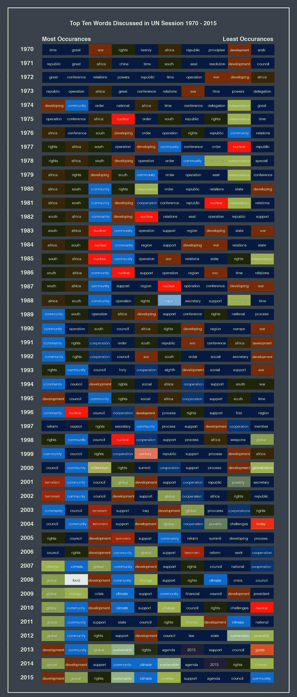

# 联合国会议数据，以更好地了解全球趋势

> 原文：<https://towardsdatascience.com/utilizing-un-session-data-to-better-understand-global-trends-c2dc3d1a46f3?source=collection_archive---------14----------------------->

## 探索文本分类的应用

## 介绍

第二次世界大战后成立的联合国，是建立和维护全球社会的最重要步骤之一。自 1945 年成立以来，联合国年度会议一直是解决紧迫全球问题的平台，因此记录了一段时间以来的主要问题和趋势。

通过这个项目，我想利用一个名为“[联合国一般性辩论](https://www.kaggle.com/unitednations/un-general-debates)”的 Kaggle 数据集来探索这些全球趋势。

# 了解数据集

这个数据集有一些有意义的特征。每个实例都包含年份、会议编号、发言国家和会议记录。该数据集包含 1970 年至 2015 年的会话数据，时间范围为 46 年。我的第一步是汇总每年的会议，并为每年生成一个文本文件。然后，我使用 Sklearn 的 CountVectorizer 类来执行单词包，并输出每年排名前 10 的单词。有了这些信息，我用 Illustrator 生成了每年更常见单词的可视化描述。

# 生成数据可视化的思维过程

对于视觉效果，我心中有几个要点

1.  **可读的时间线—** 观众应该能够直观地理解时间年表
2.  **关注趋势—** 数据可视化的主要收获是快速流畅地理解数据中存在的主要趋势和异常。
3.  **访问数据—** 虽然我想关注趋势，但我仍然希望浏览者能够看到数据(每年最常出现的词)，并可能根据世界历史的先验知识或通过数据中有趣实例引发的研究得出自己的结论。

我想出了两个模型:

1.  一种是按十年来划分数据——更容易理解，允许观众挑选他们想关注的细节
2.  一个包含 1970 年至 2015 年间每年的数据，虽然需要考虑更多内容，但不会直观地将趋势划分为任意类别，而实际上，每年的数据趋势在本质上是连续的。

下面是第二个数据可视化，它记录了 1970 年到 2015 年之间的每年实例。



# 设计和数据表示

## 用色彩传达趋势

有些术语多年来一直出现，而有些只出现一两次。某些术语出现在数据集的中间，并且一直持续到最后。为了突出这些主要趋势和异常值，我给每个术语分配了颜色来标记它们。这样，观众可以在视觉上跟踪一个术语的存在和随时间变化的流行度。在整个数据集中一致的术语被分配较深的颜色，这提供了足够的但与背景(社区、权利、发展)几乎没有对比。被认为值得注意但不太重要的术语也被赋予较深的颜色(reform，2015)。在数据集时间线中间出现的术语，然后仍然是一个流行词，被赋予稍微明亮的颜色值(全球，气候)。此外，与世界危机和人类苦难原因相关的术语被赋予了明亮和不和谐的色彩(恐怖主义、核)。最后，那些只被提及几次的强有力的词被赋予了明亮柔和的颜色(千禧年，希望)。最后两个类别被指定为上述颜色类型，以便它们在浏览者看来最为突出。

## 关于主观数据分析的注记

我想简要说明一下我在这个数据表示中所做的主观选择。

清理文字稿:在清理文字稿时，我首先删除了一般的英语停用词。然而，在计算每年的前十个词时，我发现前十个词中的大多数词在过去的 46 年中保持一致。这些术语都是特定领域的术语。为了能够更深入地挖掘会议的内容，我删除了许多特定领域的术语。我想指出的是，我这样做是基于哪些术语出现得非常频繁，但设置了一个任意的阈值，即哪些术语出现得足够频繁，可以删除，哪些可以保留。改变阈值无疑会改变来自单词袋的结果。回顾已完成的工作，也许较低的去除单词的阈值会给出更具体和独特的逐年数据集。较低的门槛将消除诸如“社区”、“权利”和“发展”等术语。

*删除了一些词语:国际、国家、联合、我们、世界、和平、国家、人民、组织、会议、安全、经济、政府*

**类别分配:**我分配术语类别的过程本质上是非常定性的。像决定“合作”是相关的和有意义的，“支持”这样的选择是经过深思熟虑的，但仍然是主观的决定。

**词根和词类:**在我当前的项目实现中，为了简单和直接，像“开发”和“发展”这样的术语被视为同一术语。但是，需要注意的是，两者的区别中有加密的有意义的信息。有了语言学背景，人们可以根据单词的名词或动词形式所暗示的句子结构，潜在地得出关于时间段的结论(即，动词形式的频率可能暗示更有可能采取行动)。

# 有趣的数据发现

*   1989 年— **环境:**第一次提到前 15 名中的环境。
*   1990-1991—**希望:**当我们在 1988 年看到“希望”的时候，这个词在 1990 年和 1991 年的前 15 名中再次出现。
*   1991 年— **民主党:‘**民主党’出现在前 15 名。
*   1996 — **武器:‘**武器’出现在前 15 名。
*   2001—**9 月:**这个词出现在 2001 年的前 15 名中，表明 9/11 和恐怖主义是主要话题之一
*   2004 年— **今天:**“今天”一词进入了 2004 年的前十名。在那之后,“今天”这个词开始频繁出现在前 15 名中，这可能暗示了观点的转变
*   **气候和可持续性—** 这些术语在 2000 年代开始频繁出现
*   **2015—**“2015”在 2013 年和 2014 年出现的次数比 2015 年多。这可能意味着 2015 年将出台一项政策或在 2015 年实现一个目标。2015 年可能讨论了 2015 年议程的影响或发现。
*   **社区—** 历年来使用频率最高的词，其次是“权利”

虽然我将这一部分作为有趣的数据发现包括在内，但看到许多有趣的收获都在前 15 名中，这表明也许删除一些更多的流行语会每年显示一个更独特的故事。与此同时，有趣的是，人权和社区等永恒的讨论仍然非常重要，但在优先级别上有所波动。

# 反思项目

我使用 Sklearn 的计数矢量器来生成每年的热门词汇。TF-IDF(术语频率-逆文档频率)可能会提供关于逐年趋势的更有见地的信息，因为它会突出显示逐年的异常，而不是强调所有会话数据中常见的术语。

# 有趣的扩展

我对年复一年的会议数据运行了一个主题生成算法(潜在的狄利克雷分配),只是为了看看该算法每年输出的头号主题是什么。以下是一些亮点:

```
1977: new rights africa south nuclear relations time situation independence east struggle that disarmament great israel
 — — — — — — — — — 
1990: new south africa rights region europe war time hope state end crisis relations kuwait east
 — — — — — — — — — 
1995: new rights nuclear social cooperation war time work process many important member region year weapons
 — — — — — — — — — 
2000: new millennium rights summit cooperation process global state globalization time work first role poverty social
 — — — — — — — — — 
2001: terrorism new global cooperation year poverty terrorist secretary september many process work africa state rights
— — — — — — — — — 
2009: global change crisis climate new financial that president challenges cooperation nuclear 09 time year rights
 — — — — — — — — — 
2014: global new that climate sustainable agenda 2015 rights change state year today goals post many
```