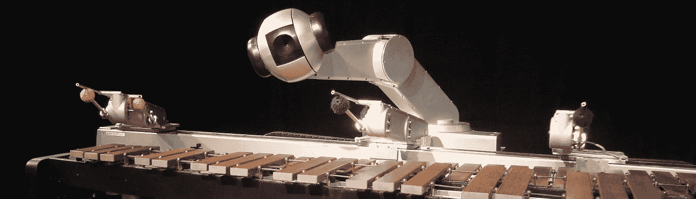
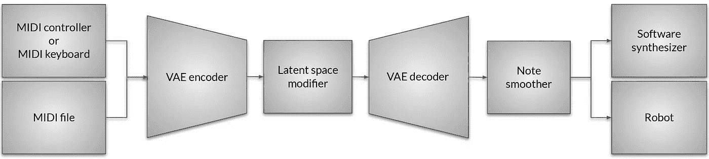
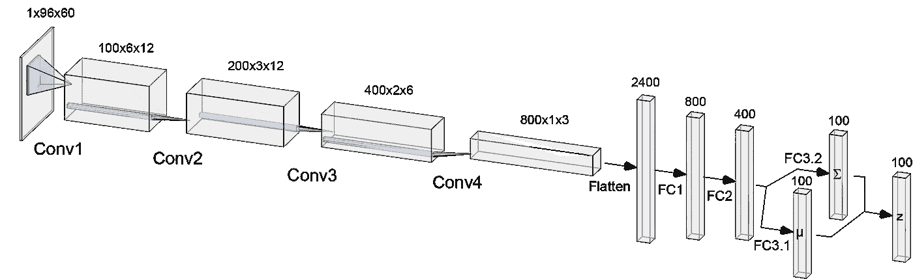
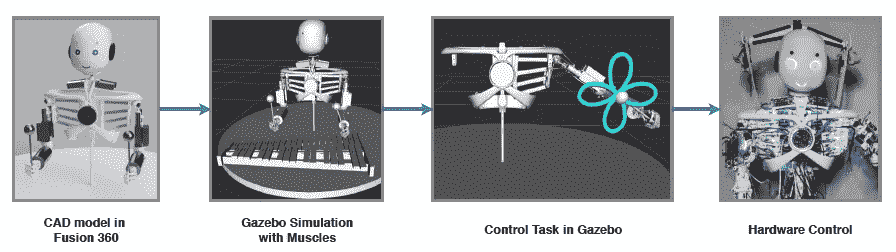
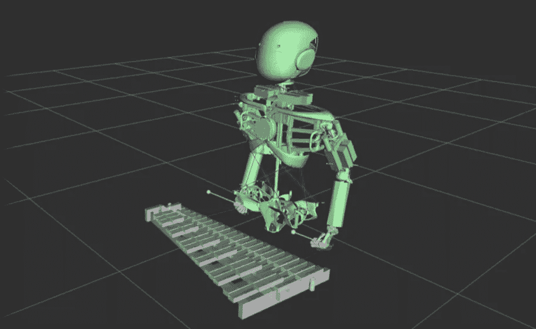
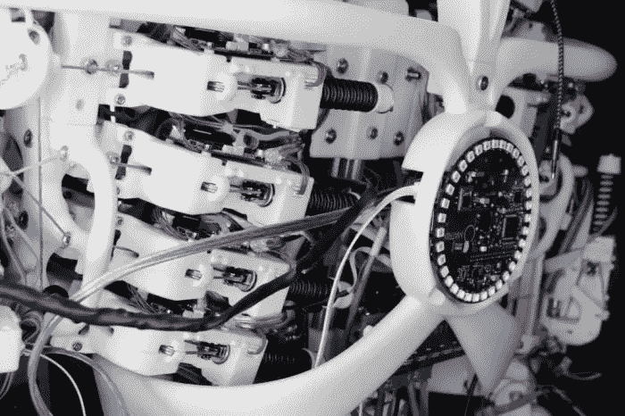

# VAEsemane——一种用于音乐人机交互的可变自动编码器

> 原文：<https://towardsdatascience.com/vaesemane-a-variational-autoencoder-for-musical-human-robot-interaction-b588ca7b9d12?source=collection_archive---------21----------------------->

类人机器人解决越来越困难的任务，因为它们稳步提高了与环境智能互动的技能。这个项目的目标是用软件合成器或人形机器人[**【Roboy】**](https://roboy.org/)**交互式播放音乐。**音乐即兴创作是对当前呈现的音乐序列产生自发反应的行为，要求对乐器和呈现的音乐序列在音调、节奏和和声方面有很高的理解，这使得将这一系统付诸实践尤为困难。

**Google Magenta**([music vae](https://arxiv.org/abs/1803.05428))和**ETH Zurich**([MIDI-VAE](https://arxiv.org/pdf/1809.07600.pdf))的研究人员最近一直在研究用软件生成音乐的[可变自动编码器(VAEs)](https://arxiv.org/abs/1312.6114) 。乔治亚理工大学展示了一个软硬件结合的系统，名为[“西蒙机器人】](https://www.shimonrobot.com/)。

Fig. 1: Shimon robot developed at Georgia Tech University [Source: [https://www.shimonrobot.com/](https://www.shimonrobot.com/)]

对于这个项目，VAEs 被选为即兴创作的基础。VAEs 有一个很大的好处，那就是它们产生了一个连续的潜在空间，允许重建和解释数据。在 VAE 被训练之后，VAE 的解码器可以用来随机生成数据，该数据类似于它通过从单位高斯采样而被训练的数据。这种随机生成过程显示在下面的一个视频示例中。

# 该系统

Fig. 2: A full framework for robotic improvisation in real time

系统等待音乐序列的输入，以即兴序列来响应。它被分成所示的模块(见图 2)。任何 **MIDI 控制器、键盘或合成器**都可以用来播放音乐序列，为系统提供现场输入。该序列由 VAE 的**编码器处理，将其嵌入潜在空间。音乐序列的潜在表示也称为嵌入，可以使用称为**潜在空间修改器**的图形用户界面(GUI)来重建或修改。GUI 允许修改 100 维潜在向量的值，创建由 **VAE 解码器**解码的新潜在向量，以形成新的音乐序列。可选地，序列可以被音符平滑器模块平滑，该模块将短 MIDI 音符视为噪声，并根据用户定义的阈值删除它们。即兴序列可以由**软件合成器**演奏，或者通过机器人操作系统(ROS)发送给模拟的**机器人 Roboy** ，以便机器人在木琴上演奏。**

该系统使用卷积 VAE，而不是使用递归 VAE(如 Google Magenta 和 ETH Zurich 所示)。图 3 显示了 VAE 的**编码器。**解码器由编码器的逆映射组成。

Fig. 3: Architecture of the VAE encoder (adapted from [Bretan et al. 2017](https://arxiv.org/abs/1706.04486)). The decoder consists of the inverse mapping without the reparametrization step. The figure was created using [NN-SVG](http://alexlenail.me/NN-SVG/).

使用 [**PyTorch**](https://pytorch.org/) 实现 VAE，并用 [**MAESTRO 数据集**](https://arxiv.org/abs/1810.12247) 进行训练。图 3 显示了所有的卷积运算。在一个音乐序列被嵌入到一个 **100 维潜在向量之前有 4 个密集层。**解码器由编码器的逆映射组成，没有重新参数化步骤。此外，批处理标准化和 ELU 激活函数适用于每一层。描述这个框架核心的 VAE 模型的代码如下所示。你可以在这里 **找到** [**项目的**完整源代码。****](https://github.com/roboy/tss18-robotsinmusicalimprovisation)

模拟使用 [**CARDSFlow 框架**](https://roboy.org/cardsflow/)(cards flow 的源代码[这里](https://github.com/CARDSflow/CARDSflow)，论文[这里](https://roboy.org/wp-content/uploads/2018/11/C__1807_Gazebo_Cable_Driven_Rob.pdf))这是 Roboy 项目(与香港中文大学合作)开发的肌肉骨骼机器人的设计、模拟和控制的工作流。图 4 显示了从 Autodesk Fusion 360 中的机器人设计到实际硬件控制的流程。

Fig. 4: CARDSFlow pipeline. It consists of (from left to right): 1) Robot design in Autodesk Fusion 360, 2) Simulation in Gazebo, 3) Muscle control through CASPR in Gazebo and 4) Control of the real robot.

下图(图 5)展示了在 ROS 的可视化工具 RVIZ 中模拟 Roboy 机器人的设置。

Fig. 5: Setup of Simulation in RVIZ.

# 例子

有五个典型的视频。其中三个展示了 VAE 模型在软件中生成音乐**，而两个视频**展示了机器人进行即兴创作**。GUI，也称为潜在空间修改器，有 100 个数字电位计来修改当前嵌入序列的潜在向量。修改潜在向量导致解释或即兴创作，因为它略微改变了当前嵌入序列的高斯分布。在包括模拟 Roboy 机器人的示例中，绿色轮廓显示了机器人击打木琴球杆时的目标姿势。注:模拟机器人在演奏木琴时会跳过 MIDI 音符。这就是为什么它播放的音符比软件中生成的音符少的原因。**

# 生成模式

第一个示例显示了 VAE 模型在“生成模式”下的性能。在这种模式下，从单位高斯分布中随机采样一个潜在向量**，然后由 VAE 解码器**解码以生成看不见的音乐序列**。**

Variational Autoencoder — “Generate Mode” (Software Generation)

# **交互模式**

下面的例子使用了“交互模式”,它允许人机交互。软件/机器人等待人类输入，并基于当前输入序列产生音乐响应。

Variational Autoencoder — “Interact Mode” (Software Improvisation)

Variational Autoencoder and Roboy robot — “Interact Mode” (Robotic Improvisation)

# 无尽模式

下面的例子显示了**“无休止模式”**，它等待人工输入，然后根据顺序开始播放音乐，直到你停止它。当前生成的序列(从 VAE 解码器输出)被馈送到输入端以产生解释。除了为软件/机器人即兴创作提供指导的第一个序列之外，没有其他互动。通过改变数字电位计的值，您可以遍历已学习的潜在空间，从而听到 VAE 模型学习了什么。

Variational Autoencoder — “Endless Mode” (Software Improvisation)

Variational Autoencoder and Roboy robot — “Endless Mode” (Robotic Improvisation)

# 机器人项目

Roboy 项目是一个用于肌肉骨骼机器人开发的**开源平台**，其目标是将人形机器人推进到机器人和人体一样好的状态。 **Roboy** 从其他机器人中脱颖而出，因为它是由模仿人类肌肉和肌腱的电机和肌腱驱动的，而不是每个关节中的电机。查看机器人项目[网站](https://roboy.org)或 [Github 账户](https://github.com/Roboy)以获得更多信息。

Chest of Roboy 2.0 [Source: [https://roboy.org](https://roboy.org)]