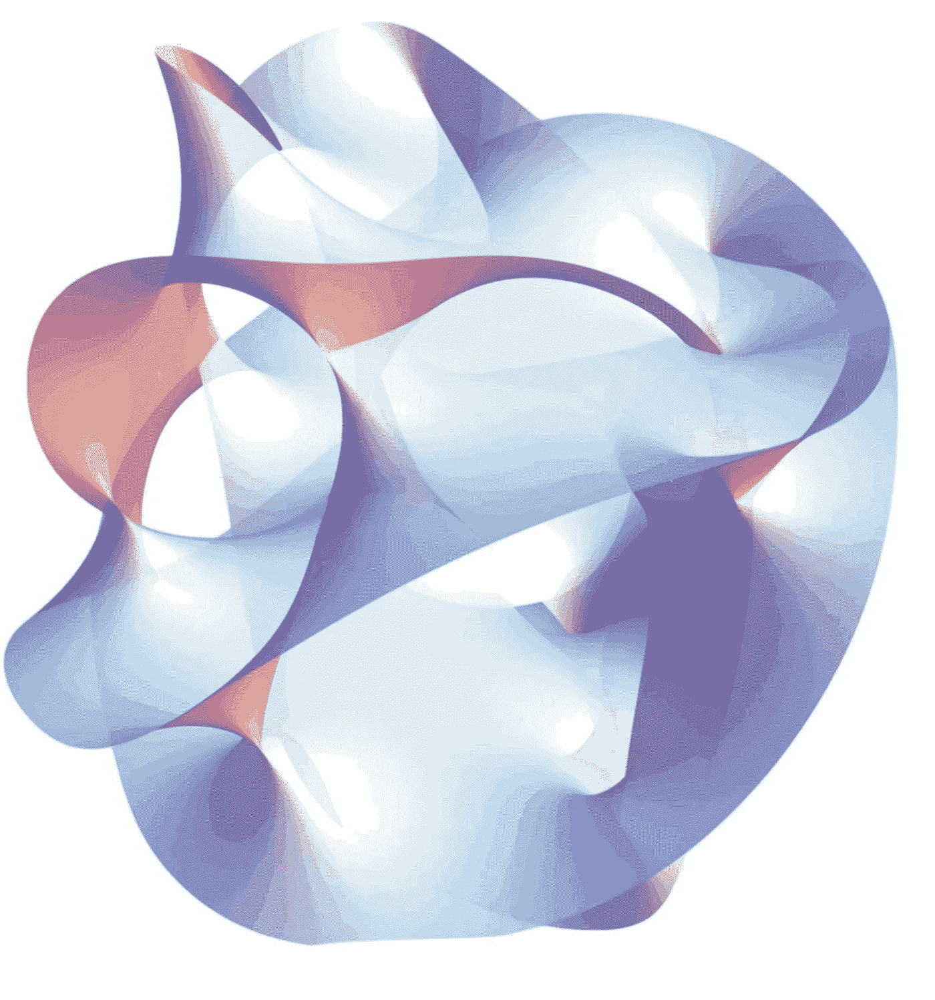
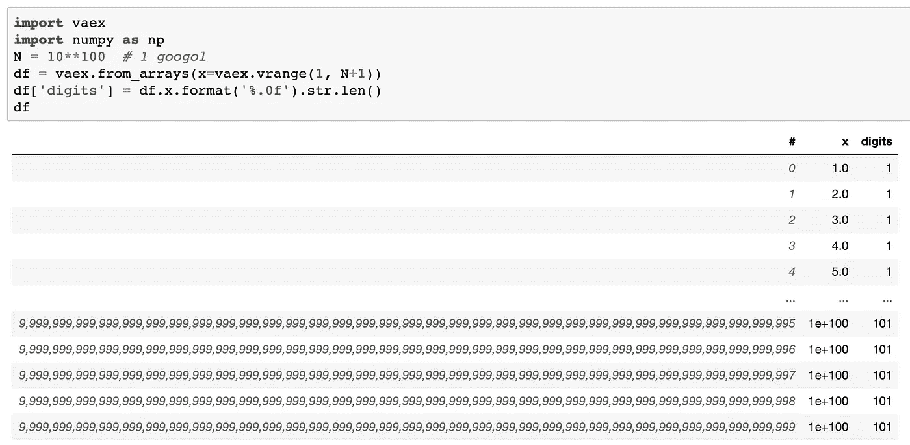
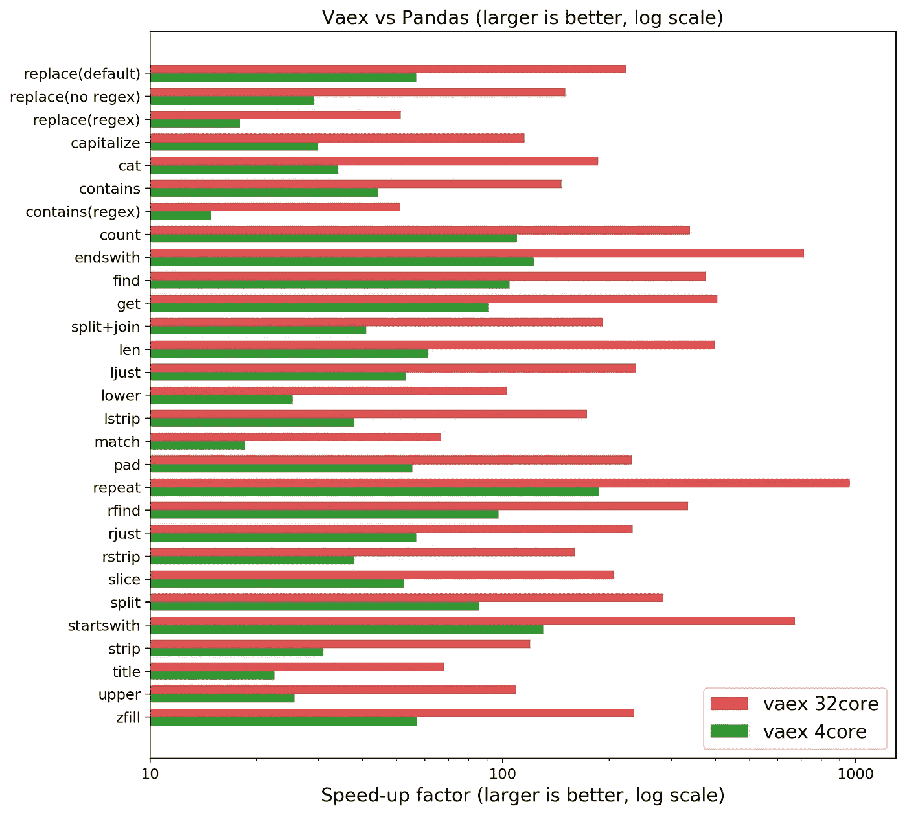
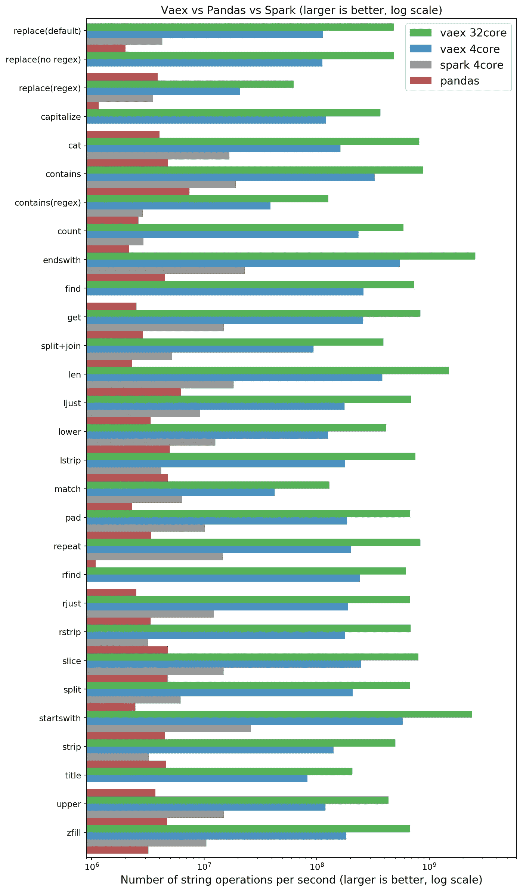

# Vaex:具有超级字符串的数据帧

> 原文：<https://towardsdatascience.com/vaex-a-dataframe-with-super-strings-789b92e8d861?source=collection_archive---------3----------------------->

[Vaex](https://github.com/vaexio/vaex/)’ strings are super fast, not related to [M-theory yet](https://en.wikipedia.org/wiki/M-theory)

字符串操作是数据科学的重要组成部分。Vaex 的最新版本为所有常见的字符串操作增加了令人难以置信的速度和内存效率支持。与 Pandas(Python 生态系统中最受欢迎的数据帧库)相比，字符串操作在四核笔记本电脑上快 30-100 倍，在 32 核计算机上快 1000 倍。

虽然 Pandas 对 Python 在数据科学中的流行负有很大责任，但它渴望内存。随着数据变得越来越大，你必须小心不要有记忆或者毁了你的一天。切换到更强大的机器可能会解决一些内存问题，但现在您的 31 个核心处于闲置状态。熊猫只会用你花里胡哨的机器 32 个核心中的一个。有了 Vaex，所有的字符串操作都在核心之外，并行执行，延迟评估，使您可以毫不费力地处理十亿行数据集。

> "字符串处理速度几乎快了 1000 倍，相当于 1 分钟对 15 个小时！"

# Vaex 和超弦

[Vaex 现在正在超越快速数字处理](/vaex-out-of-core-dataframes-for-python-and-fast-visualization-12c102db044a)，扩展到(超级)字符串领域。最新发布的包括了几乎所有熊猫的串串操作。现在，您可以轻松地执行所有的字符串操作，通过计算包含一个 googol (1 后跟 **100 个零**)行的数据帧中的字符串长度就可以证明这一点。

一个 googol 长度的数据帧展示了惰性评估的优势。当在严重畸形的输入数据上试验正则表达式时，您不必等一分钟就能看到您的所有操作是否正常。相反，您应用您的操作，打印出数据帧，并直接看到预览(头部和尾部)，没有任何延迟。仅评估您看到的值。

# 性能基准

最终，你必须处理所有的数据。惰性评估不会加速操作，只会推迟操作。如果你需要导出数据或者把它传递给机器学习库，这需要最终发生，对吗？那么 vaex 表现如何呢？让我们拿一个有 1 亿行的人工数据集(详见附录)，用 Pandas 和 Vaex (Spark 随后)进行同样的操作:

**NOTE: Larger is better, x is logarithmic.** Speedup of Vaex compared to Pandas on a quadcore laptop or 32 core machine. On your laptop you may expect 30–100x, on an AWS h1.8xlarge (32 core) we measured close to a 1000x speedup!

Vaex 在我的四核笔记本电脑上的运行速度提高了约 190 倍，在 AWS h1 . x8 大型计算机上甚至提高了约 1000 倍！最慢的操作是正则表达式，这是意料之中的。正则表达式是 CPU 密集型的，这意味着大部分时间花在运算上，而不是所有的簿记工作。简而言之，Python 的开销很低，而且 Python 的正则表达式引擎已经很快了，所以我们“仅仅”获得了 10-60 倍的加速。

# 如何:GIL、C++和 ApacheArrow

这怎么可能呢？涉及到三个要素:C++、 [Apache Arrow](https://arrow.apache.org/) 和全局解释器 Lock GIL (GIL)。在 Python 中，多线程受到 GIL 的阻碍，使得所有纯 Python 指令实际上都是单线程的。当迁移到 C++时，GIL 可以被释放，机器的所有内核都将被使用。为了利用这一优势，Vaex 在 C++中执行所有的字符串操作。

下一个要素是定义一个内存和磁盘上的数据结构，该数据结构能够有效地使用内存，这就是 Apache Arrow 发挥作用的地方。Apache Arrow 定义了一个经过深思熟虑的 StringArray，可以存储在磁盘上，对 CPU 友好，甚至支持屏蔽/空值。最重要的是，这意味着所有支持 Apache Arrow 格式的项目将能够使用相同的数据结构，而无需任何内存复制。

# 达斯克怎么办？

人们经常问 Dask 和 Vaex 相比如何。 [Dask](https://dask.org/) 是一个神奇的库，允许 Python 并行计算。事实上，我们希望将来在 dask 的基础上构建 Vaex，但是它们不能相提并论。然而，Vaex *可以*与 dask.dataframe 相比较，dask . data frame 是一个使用 Dask 并行熊猫的库。对于我们运行的基准测试，dask.dataframe 实际上比纯熊猫慢(~ 2 倍)。由于 Pandas 字符串操作不释放 GIL，Dask 不能有效地使用多线程，因为它使用 numpy 进行计算时会释放 GIL。绕过 GIL 的一个方法是使用 Dask 中的进程。然而，与 Pandas 相比，它的运行速度慢了 40 倍，Pandas 慢了 1300 倍。)相比 Vaex。大部分时间都花在酸洗和拆线上。

虽然 Dask 是一个神奇的库，但 dask.dataframe 无法在字符串领域施展魔法。它继承了 Pandas 的一些问题，并且由于酸洗，使用进程会产生很大的开销。尽管可能有方法可以加快速度，但开箱即用的性能对于字符串来说并不太好。

# 火花呢？

Apache Spark 是 JVM/Java 生态系统中处理数据科学的大型数据集的库。如果 Pandas 不能处理特定的数据集，人们通常会求助于 PySpark，即 Spark 的 Python 包装器/绑定。如果你的工作是产生结果，而不是在本地或甚至在一个集群中产生火花，这是一个额外的障碍。因此，我们还针对相同的操作对 Spark 进行了基准测试:

**NOTE: Larger is better, x is logarithmic.** Comparing Vaex, Pandas and Spark.

Spark 的表现比熊猫更好，这是多线程的缘故。我们惊讶地看到 vaex 比 Spark 做得好得多。总的来说，如果你想在笔记本电脑上进行交互式工作:

*   熊猫每秒可以处理数百万条字符串(并且不可扩展)
*   Spark 每秒可以处理 1000 万个字符串(并且会随着内核数量和机器数量的增加而增加)。
*   Vaex 每秒可以处理 1 亿个字符串，并且会随着内核数量的增加而增加。在一台 32 核的机器上，我们每秒可以处理十亿个字符串。

*注意:有些操作会随字符串长度缩放，因此根据问题的不同，绝对数可能会有所不同。*

# 今后

熊猫将永远存在，它的灵活性是无与伦比的，这在很大程度上是 Python 在数据科学中流行的原因。然而，当数据集变得太大而无法处理时，Python 社区应该有很好的答案。[达斯克](https://dask.org)。dataframe 试图通过在熊猫[的基础上构建来攻击大型数据集，但继承了它的问题](http://wesmckinney.com/blog/apache-arrow-pandas-internals/)。或者，nVidia 的 cuDF(RAPIDS 的一部分)通过使用 GPU 来解决性能问题，但需要现代 nVidia 显卡，内存限制更多。

Vaex 不仅试图通过使用更多的 CPU 内核和高效的 C++代码进行扩展，而且还通过其表达式系统/惰性评估采取了不同的方法。计算和操作仅在需要时进行，并以块的形式执行，因此不会浪费内存。更有趣的是，导致您的结果的表达式被存储。这是 vaex-ml 的基础，vaex-ml 是一种进行机器学习的新方法，其中管道成为您探索的人工产物。敬请关注。

# 结论

[Vaex](https://github.com/vaexio/vaex/) 使用 ApacheArrow 数据结构和 C++将字符串操作的速度在四核笔记本电脑上提高了大约 30-100 倍，在 32 核计算机上提高了 1000 倍。Pandas 几乎支持所有的字符串操作，内存使用几乎为零，因为惰性计算是分块进行的。

*   为这篇文章鼓掌[或者一个⭐on GitHub 被赞赏](https://github.com/vaexio/vaex)。
*   Vaex 拥有和熊猫一样的 [API。](https://vaex.readthedocs.io/en/latest/api.html#string-operations)
*   的用法参见[教程。](https://vaex.readthedocs.io/en/docs/tutorial.html#String-processing)
*   [提交问题](https://github.com/vaexio/vaex/)如果你发现了一个缺失的特性或者 bug。
*   pip install vaex/conda install-c conda-forge vaex 或[阅读文档](https://vaex.readthedocs.io/en/latest/installing.html)

# 附录

基准测试从来都不公平，有时可能是人为的，并且与真实世界的性能不完全相同。每个人都知道或者应该知道这一点。基准测试给你一个预期的印象，但是特别是对于像正则表达式这样的操作，比较就变得很棘手。有基准总比没有好。在任何情况下，如果您想要重现这些结果，您可以通过使用这个脚本通过[来实现。火花基准可以在这个位置](https://github.com/vaexio/vaex/blob/master/benchmarks/strings.py)找到[。](https://gist.github.com/byaminov/7a4b356771e389bd9c873dd63ca52b6f)

# 关于作者

[*Maarten Breddels 是一名企业家*](https://maartenbreddels.com) *和自由职业的开发人员/顾问/数据科学家，主要在 Jupyter 生态系统中使用 Python、C++和 Javascript。*[*vaex . io*](https://vaex.io/)*创始人。他的专业领域从快速数值计算、API 设计到 3d 可视化。他拥有 ICT 学士学位，天文学硕士和博士学位，喜欢编码和解决问题。*

这项工作是在约万·韦利亚诺斯基*[*帕特里克·博斯*](https://medium.com/u/1382ec3ac71f?source=post_page-----789b92e8d861--------------------------------) *和* [*布拉特·亚米诺夫*](https://medium.com/u/3d3d9c60c104?source=post_page-----789b92e8d861--------------------------------) 的帮助下完成的*