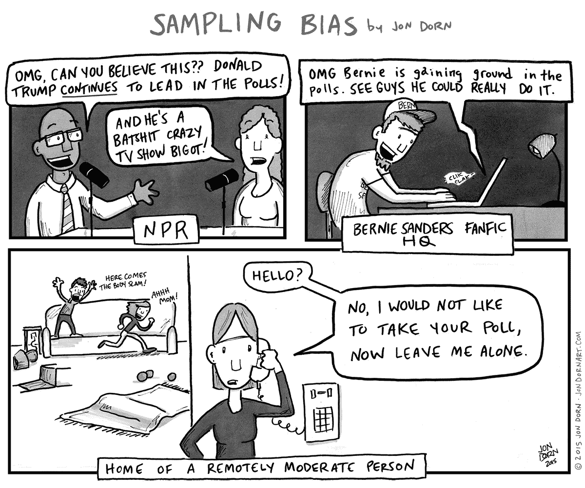
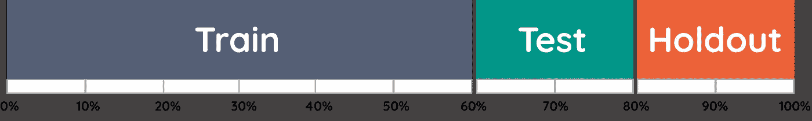
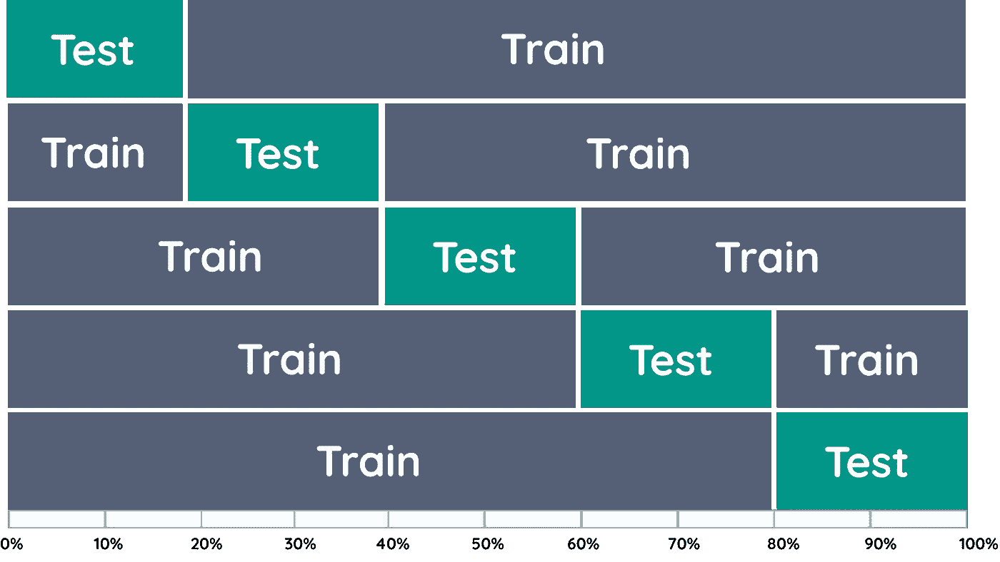
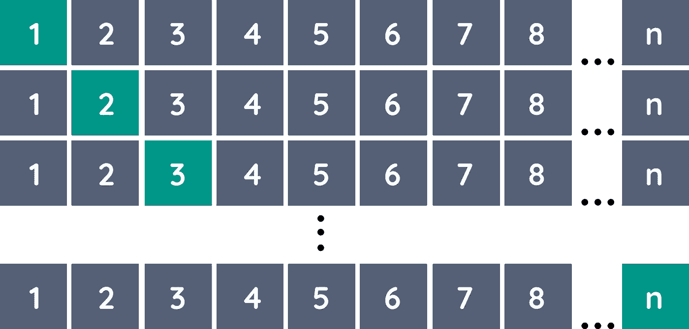
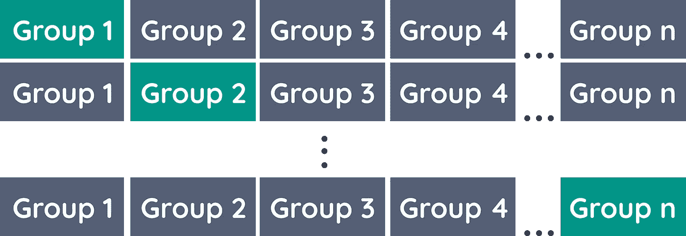
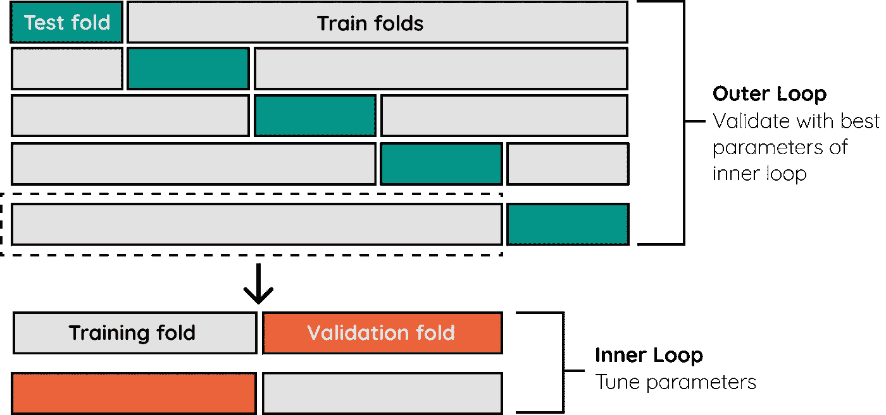
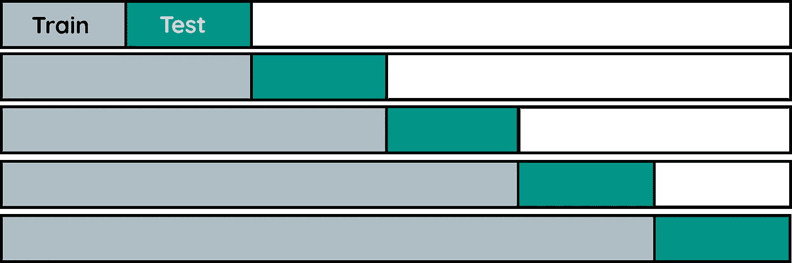
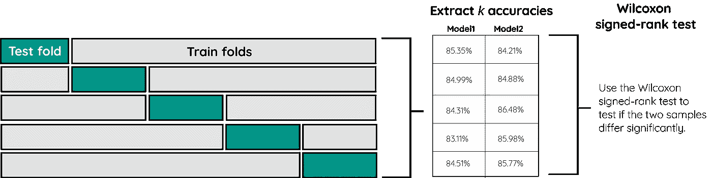
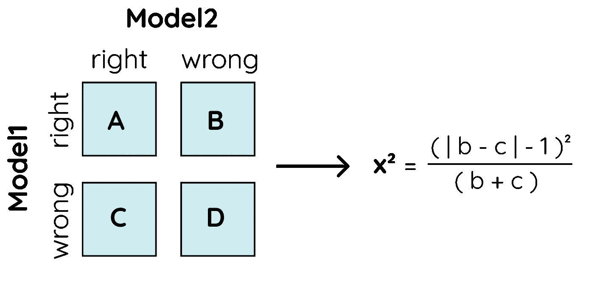

# 验证你的机器学习模型

> 原文：<https://towardsdatascience.com/validating-your-machine-learning-model-25b4c8643fb7?source=collection_archive---------1----------------------->

## 机器学习

## 超越 k 倍交叉验证

Photo by [NeONBRAND](https://unsplash.com/@neonbrand?utm_source=unsplash&utm_medium=referral&utm_content=creditCopyText) on [Unsplash](https://unsplash.com/s/photos/wrong?utm_source=unsplash&utm_medium=referral&utm_content=creditCopyText)

我认为创建你的机器学习模型最被低估的一个方面是**彻底的验证**。使用适当的验证技术有助于您理解您的模型，但最重要的是，估计一个无偏的泛化性能。

没有适用于所有场景的单一验证方法。了解您是在处理组、时间索引数据，还是在验证过程中泄漏数据是很重要的。

> 哪种验证方法适合我的用例？

在研究这些方面时，我发现了大量描述评估技术的文章，但是验证技术通常停留在 **k 倍**交叉验证。

我将向您展示使用 k-Fold CV 的世界，并进一步深入到*嵌套 CV* 、 *LOOCV* ，以及**模型选择**技术。

将演示以下验证方法:

*   训练/测试分割
*   k 倍交叉验证
*   留一交叉验证
*   留一组交叉验证
*   嵌套交叉验证
*   时间序列交叉验证
*   Wilcoxon 符号秩检验
*   麦克内马试验
*   5x2CV 配对 t 检验
*   5x2CV 组合 F 测试

# 1.拆分您的数据

所有验证技术的基础是在训练模型时拆分数据。这样做的原因是为了理解如果你的模型面对**之前**没有见过的数据会发生什么。

## 训练/测试分割

最基本的方法是训练/测试分离。原理很简单，您只需将数据随机分成大约 70%用于训练模型，30%用于测试模型。

Creating a train/test split with X being your features and y the target

这种方法的好处是，我们可以看到模型如何对以前看不到的数据做出反应。

然而，如果我们数据的一个子集只有特定年龄或收入水平的人呢？这通常被称为**采样偏差**:

> 抽样偏倚是由于人口中的非随机样本引起的系统误差，导致人口中的一些成员比其他成员更不可能被包括在内，从而导致有偏倚的样本。

A great illustration of sampling bias by [http://www.jondornart.com/](http://www.jondornart.com/)

在讨论有助于解决采样偏差的方法(如 k 倍交叉验证)之前，我想先讨论一下额外的维持集。

## 维持集

当优化您的模型的超参数时，如果您使用训练/测试分割进行优化，您可能会**过度拟合**您的模型。

为什么？因为模型会搜索符合您所做的特定训练/测试的超参数。

要解决这个问题，您可以创建一个额外的**保持**集。这通常是您在任何处理/验证步骤中没有使用的数据的 10%。

在训练/测试分割上优化您的模型之后，您可以通过验证维持集来检查您是否没有过度拟合。

**提示**:如果只使用训练/测试分割，那么我建议比较你的训练和测试集的分布。如果它们差别很大，那么你可能会遇到泛化的问题。使用[刻面](https://github.com/PAIR-code/facets)轻松比较它们的分布。

# 2.k 倍交叉验证(k 倍 CV)

为了最小化抽样偏差，我们可以考虑稍微不同的方法验证。如果我们不是进行一次拆分，而是进行多次拆分，并对这些拆分的所有组合进行验证，会怎么样呢？

这就是 *k* 折叠交叉验证的用武之地。它将数据分成 *k* 个折叠，然后在 *k* -1 个折叠上训练数据，并在被遗漏的一个折叠上进行测试。它对所有组合执行此操作，并对每个实例的结果进行平均。

5-Fold Cross-Validation

优点是所有的观察值都用于训练和验证，并且每个观察值只用于一次验证。我们通常选择 i=5 或 k =10，因为它们在计算复杂性和验证准确性之间找到了一个很好的平衡:

**提示**:交叉验证技术得出的每个折叠的分数比人们想象的更有洞察力。它们主要用于简单地提取平均性能。然而，人们也可以查看结果折叠的**方差**或**标准偏差**，因为它将给出关于不同数据输入的模型稳定性的信息。

# 3.留一法交叉验证(LOOCV)

k 折叠 CV 的一个变体是留一交叉验证(LOOCV)。LOOCV 使用数据中的每个样本作为单独的测试集，而所有剩余的样本形成训练集。此变体与 *k* 相同——当 *k = n* (观察次数)时折叠 CV。

Leave-one-out Cross-Validation

使用 sklearn 可以轻松实现:

Leave-one-out Cross-Validation

**注意:**由于模型需要训练 *n* 次，LOOCV 的计算成本非常高。只有当数据很小或者你能处理那么多计算时才这样做。

## 留一组交叉验证

k 文件夹 CV 的问题是，你可能希望每个文件夹只包含一个组。例如，假设您有一个包含 20 家公司及其客户的数据集，您希望预测这些公司的成功。

Leave-one-group-out Cross-Validation

为了保持文件夹的“纯粹性”并且只包含一个公司，您可以为每个公司创建一个文件夹。这样，你就创建了一个 k 倍简历和 LOOCV 的版本，其中你漏掉了一家公司/集团。

同样，可以使用 sklearn 实现:

Leave-one-group Out Cross-Validation

# 4.嵌套交叉验证

当您优化模型的超参数，并使用相同的 k-Fold CV 策略来调整模型和评估性能时，您会面临**过度拟合**的风险。您不希望在找到最佳超参数的同一分割上评估模型的准确性。

相反，我们使用嵌套交叉验证策略，允许将超参数调整步骤与误差估计步骤分开。为此，我们嵌套了两个 k 重交叉验证循环:

*   超参数调谐的内循环和
*   估算精确度的外环。

Nested Cross-Validation (Outer loop: 5-Fold CV, Inner loop: 2-Fold CV)

下面的示例显示了一个对内部和外部循环都使用 k-Fold CV 的实现。

您可以自由选择在内部和外部循环中使用的交叉验证方法。例如，如果要按特定的组进行分割，可以对内部循环和外部循环都使用 Leave-one-group-out。

# 5.时间序列 CV

现在，如果你对时间序列数据使用 *k* -Fold CV 会发生什么？过度拟合将是一个主要问题，因为你的训练数据可能包含来自未来的信息。重要的是，所有的训练数据都发生在测试数据之前。

验证时间序列数据的一种方法是使用 *k* -fold CV，并确保在每个 fold 中，训练数据发生在测试数据之前。

5-Fold Time Series CV

幸运的是，sklearn 再次伸出了援手，它有一个内置的时间序列 CV:

**注意**:确保根据您使用的时间索引对数据进行排序，因为您没有为时间序列片段提供时间索引。因此，它将简单地根据记录出现的顺序创建拆分。

# 6.比较模型

什么时候你认为一个模型比另一个更好？如果一个模型的准确性比另一个高得不明显，这是选择最佳模型的充分理由吗？

作为一名数据科学家，我想确保我了解一个模型是否真的比另一个模型更准确。幸运的是，有许多方法将统计学应用于机器学习模型的选择。

## Wilcoxon 符号秩检验

其中一种方法是 Wilcoxon 符号等级测试，这是配对学生的 *t* 测试的非参数版本。当样本量很小并且数据不符合正态分布时，可以使用它。

我们可以应用这个显著性测试来比较两个机器学习模型。使用 *k* 折叠交叉验证，我们可以为每个模型创建 *k* 个准确度分数。这将产生两个样本，每个模型一个。

然后，我们可以使用 Wilcoxon 符号秩检验来检验这两个样本是否存在显著差异。如果是的话，那么一个比另一个更准确。

Wilcoxon signed-rank test procedure for comparing two Machine Learning models

下面，您可以看到这个过程的实现。

Application of the Wilcoxon signed-rank test

结果将是一个 *p-* 值。如果该值低于 0.05，我们可以拒绝模型之间没有显著差异的无效假设。

**注意**:在模型之间保持相同的折叠是很重要的，以确保样本来自相同的人群。这可以通过在交叉验证过程中简单地设置相同的 random_state 来实现。

## 麦克内马试验

McNemar 检验用于检查一个模型和另一个模型之间的预测匹配程度。这被称为列联表的同质性。从该表中，我们可以计算出 **x** ，该值可用于计算*p*-值:

McNemar’s test for comparing two Machine Learning models

同样，如果*p*-值低于 0.05，我们可以拒绝零假设，并看到一个模型明显优于另一个。

我们可以使用`[mlxtend](http://rasbt.github.io/mlxtend/installation/)`包创建表格并计算相应的*p*-值:

McNemar’s test

## 5x2CV 成对*t*-测试

5x2CV 配对*t*-测试由于其强大的统计学基础，是一种常用于比较机器学习模型的方法。

该方法工作如下。假设我们有两个分类器，A 和 b。我们随机地将数据分成 50%的训练和 50%的测试。然后，我们根据训练数据训练每个模型，并计算来自测试集的模型之间的精确度差异，称为*。然后，在 ***DiffB*** 中反转训练和测试分割并再次计算差异。*

*这重复五次，之后计算差异的平均方差( ***S*** )。然后，用于计算*t*-统计量:*

**

*其中 ***DiffA₁*** 为第一次迭代的均值方差。*

**

*5x2CV paired t-test procedure for comparing two Machine Learning models*

*同样，我们可以使用`[mlxtend](http://rasbt.github.io/mlxtend/installation/)`包来计算相应的*p*-值:*

***注**:你可以使用组合的 5x2CV F 检验来代替，它被证明是稍微更稳健的( [Alpaydin，1999](http://rasbt.github.io/mlxtend/user_guide/evaluate/combined_ftest_5x2cv/) )。该方法在`mlxtend`中实现为
`from mlxtend.evluate import combined_ftest_5x2cv`。*

# *结论*

*验证可能是一个棘手的问题，因为它需要对数据有深刻的理解，以便选择正确的程序。希望这能帮助你对经常用于验证的方法有所了解。*

*所有的**代码**都可以在这里找到:*

* [## MaartenGr/验证

### 这个报告包含了验证博客的代码。

github.com](https://github.com/MaartenGr/validation)* 

# *感谢您的阅读！*

*如果你像我一样，对人工智能、数据科学或心理学充满热情，请随时在 [LinkedIn](https://www.linkedin.com/in/mgrootendorst/) 上添加我，或者在 [Twitter](https://twitter.com/MaartenGr) 上关注我。*