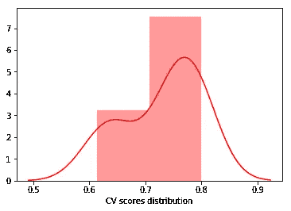
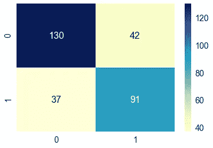
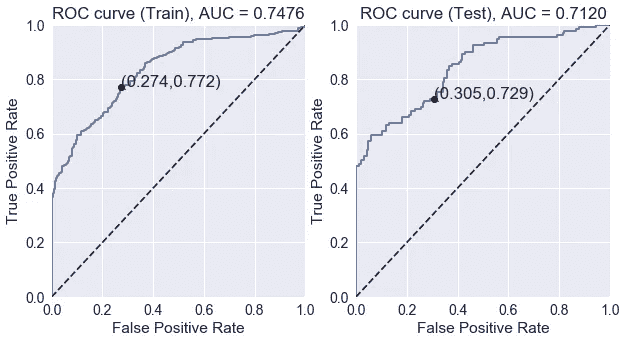

# 验证方法

> 原文：<https://towardsdatascience.com/validation-methods-e4eefcbee720?source=collection_archive---------17----------------------->

在本帖中，我们将讨论以下概念，它们都旨在评估分类模型的性能:

1.  模型的交叉验证。
2.  混乱矩阵。
3.  ROC 曲线。
4.  科恩的 *κ* 分数。

```
import numpy as np
import pandas as pd
import seaborn as sns
import matplotlib.pyplot as plt
import warningswarnings.filterwarnings('ignore')
```

我们首先创建一些具有三个特征和二进制标签的简单数据集。

```
from sklearn.model_selection import train_test_split# Creating the dataset
N = 1000 # number of samples
data = {'A': np.random.normal(100, 8, N),
        'B': np.random.normal(60, 5, N),
        'C': np.random.choice([1, 2, 3], size=N, p=[0.2, 0.3, 0.5])}
df = pd.DataFrame(data=data)# Labeling 
def get_label(A, B, C):
    if A < 95:
        return 1
    elif C == 1:
        return 1
    elif B > 68 or B < 52:
        return 1
    return 0df['label'] = df.apply(lambda row: get_label(row['A'],row['B'],row['C']),axis=1)# Dividing to train and test set
X = np.asarray(df[['A', 'B', 'C']])
y = np.asarray(df['label'])
X_train, X_test, y_train, y_test = train_test_split(X, y, test_size=0.3)
```

为了演示的目的，让我们尝试使用一个简单的逻辑回归。

```
from sklearn import linear_model
from sklearn.model_selection import cross_val_scoreclf = linear_model.LogisticRegression()
clf.fit(X_train, y_train)print(">> Score of the classifier on the train set is: ", round(clf.score(X_test, y_test),2))>> Score of the classifier on the train set is:  0.74
```

**交叉验证**

交叉验证背后的想法很简单——我们选择某个数字 *k* ，通常是 *k* =5 或者 *k* =10 (5 是 sklearn 中的默认值，参见[1])。我们将数据分成 *k* 个大小相等的部分，在这些部分的*k*1 上训练模型，并在剩余部分上检查其性能。我们这样做 *k* 次，我们可以对分数进行平均以获得一个 CV 分数。

优点:使用交叉验证可以给你一个暗示，告诉你你的模型做得有多好，它的优点是非常健壮(与简单的训练-测试分割相反)。它还可以用于参数的超调:对于给定的参数，使用 CV 分数以稳健的方式优化其值。

让我们看看我们的例子的 CV 分数:

```
scores = cross_val_score(clf, X_train, y_train, cv=10)
print('>> Mean CV score is: ', round(np.mean(scores),3))
pltt = sns.distplot(pd.Series(scores,name='CV scores distribution'), color='r')>> Mean CV score is:  0.729
```



还可以使用 CV 分数的值来导出置信区间，在该置信区间中，我们可以确保找到实际分数的概率很高。

**混淆矩阵**

这个想法相当简单。我们希望显示真阳性(TP)，真阴性(TN)，假阳性(FP)和假阴性(FN)。更一般地，当有几个标签时，我们显示属于标签 *i* 但被归类为 *j* 的数据点的数量。这个数字被定义为混淆矩阵的( *i* ， *j* )条目。

```
from sklearn.metrics import confusion_matrix
C = confusion_matrix(clf.predict(X_test),y_test)
df_cm = pd.DataFrame(C, range(2),range(2))
sns.set(font_scale=1.4)
pltt = sns.heatmap(df_cm, annot=True,annot_kws={"size": 16}, cmap="YlGnBu",  fmt='g')
```



**ROC 曲线**

让我们仔细看看混淆矩阵。我们讨论了真阳性(TP)和假阳性(FP)的概念。很明显，如果我们允许 FP 为 1，那么 TP 也将等于 1；一般来说，如果 TP 和 FP 相等，我们的预测和随机猜测一样好。

ROC 曲线被定义为 TP 作为 FP 的函数的图。因此，根据以上讨论，ROC 曲线将位于直线 *y* = *x* 上方。

ROC 曲线的构建来自我们的分类器分配给每个点的概率；对于用标签 *li* ∈{0，1}预测的每个数据点 *xi* ，我们有一个概率 *pi* ∈[0，1】使得 *yi* = *li* 。

```
from sklearn.metrics import confusion_matrix, accuracy_score, roc_auc_score, roc_curve
pltt = plot_ROC(y_train, clf.predict_proba(X_train)[:,1], y_test, clf.predict_proba(X_test)[:,1])
```



考虑到 ROC 曲线，有几个重要的概念:

(ROC 曲线下面积(AUC)，是分类器质量的重要度量。对于一个随机的猜测，我们有 AUC=∫ *x* d *x* =1/2，所以我们排除了一个知情分类器的分数> 1/2。概率解释如下:随机正数比均匀抽取的随机负数排在前面(根据模型的概率)的概率。ROC AUC 是机器学习中常用的一种([3])。

(2)图上标记的点是 TP 和 FP 的比率，正如我们前面在混淆矩阵中看到的。

(3)如果 ROC 曲线位于线 *y* = *x* 之下，这意味着通过反演分类器的结果，我们可以得到一个信息性的分类器。拥有一个总是给出错误答案的算法和拥有一个好的算法一样好！下面是绘制 ROC 曲线的代码(摘自[2])。

```
def plot_ROC(y_train_true, y_train_prob, y_test_true, y_test_prob):
    '''
    a funciton to plot the ROC curve for train labels and test labels.
    Use the best threshold found in train set to classify items in test set.
    '''
    fpr_train, tpr_train, thresholds_train = roc_curve(y_train_true, y_train_prob, pos_label =True)
    sum_sensitivity_specificity_train = tpr_train + (1-fpr_train)
    best_threshold_id_train = np.argmax(sum_sensitivity_specificity_train)
    best_threshold = thresholds_train[best_threshold_id_train]
    best_fpr_train = fpr_train[best_threshold_id_train]
    best_tpr_train = tpr_train[best_threshold_id_train]
    y_train = y_train_prob > best_threshold cm_train = confusion_matrix(y_train_true, y_train)
    acc_train = accuracy_score(y_train_true, y_train)
    auc_train = roc_auc_score(y_train_true, y_train) fig = plt.figure(figsize=(10,5))
    ax = fig.add_subplot(121)
    curve1 = ax.plot(fpr_train, tpr_train)
    curve2 = ax.plot([0, 1], [0, 1], color='navy', linestyle='--')
    dot = ax.plot(best_fpr_train, best_tpr_train, marker='o', color='black')
    ax.text(best_fpr_train, best_tpr_train, s = '(%.3f,%.3f)' %(best_fpr_train, best_tpr_train))
    plt.xlim([0.0, 1.0])
    plt.ylim([0.0, 1.0])
    plt.xlabel('False Positive Rate')
    plt.ylabel('True Positive Rate')
    plt.title('ROC curve (Train), AUC = %.4f'%auc_train) fpr_test, tpr_test, thresholds_test = roc_curve(y_test_true, y_test_prob, pos_label =True) y_test = y_test_prob > best_threshold cm_test = confusion_matrix(y_test_true, y_test)
    acc_test = accuracy_score(y_test_true, y_test)
    auc_test = roc_auc_score(y_test_true, y_test) tpr_score = float(cm_test[1][1])/(cm_test[1][1] + cm_test[1][0])
    fpr_score = float(cm_test[0][1])/(cm_test[0][0]+ cm_test[0][1]) ax2 = fig.add_subplot(122)
    curve1 = ax2.plot(fpr_test, tpr_test)
    curve2 = ax2.plot([0, 1], [0, 1], color='navy', linestyle='--')
    dot = ax2.plot(fpr_score, tpr_score, marker='o', color='black')
    ax2.text(fpr_score, tpr_score, s = '(%.3f,%.3f)' %(fpr_score, tpr_score))
    plt.xlim([0.0, 1.0])
    plt.ylim([0.0, 1.0])
    plt.xlabel('False Positive Rate')
    plt.ylabel('True Positive Rate')
    plt.title('ROC curve (Test), AUC = %.4f'%auc_test)
    plt.savefig('ROC', dpi = 500)
    plt.show() return best_threshold
```

**科恩的 *κ* 得分**

Cohen 的 *κ* 分数给出了两个分类器对相同数据的一致性。定义为*κ*= 1(1-*po)*/(1-*PE)*，其中 *po* 为观察到的符合概率， *pe* 为符合的随机概率。

让我们看一个例子。我们需要再使用一个分类器。

```
from sklearn import svmclf2 = svm.SVC()
clf2.fit(X_train, y_train)print(">> Score of the classifier on the train set is: ", round(clf2.score(X_test, y_test),2))>> Score of the classifier on the train set is:  0.74
```

我们计算列车组上的 *κ* 。

```
y = clf.predict(X_test)
y2 = clf2.predict(X_test)
n = len(y)p_o = sum(y==y2)/n # observed agreementp_e = sum(y)*sum(y2)/(n**2)+sum(1-y)*sum(1-y2)/(n**2) # random agreement: both 1 or both 0kappa = 1-(1-p_o)/(1-p_e)print(">> Cohen's Kappa score is: ", round(kappa,2))>> Cohen's Kappa score is:  0.4
```

这表明两个分类器之间存在某种一致性。 *κ* =0 表示不一致，而 *κ* < 0 也可以发生在两个分类器不一致的时候。

**结论**

我们讨论了对您的模型进行评分并将其与其他模型进行比较的几种基本策略。在应用机器学习算法和比较它们的性能时，记住这些概念很重要。

**参考文献**

[1][https://sci kit-learn . org/stable/modules/cross _ validation . html](https://scikit-learn.org/stable/modules/cross_validation.html)

[2]此处提供评估 ROC 曲线的函数:[https://github.com/bc123456/ROC](https://github.com/bc123456/ROC)

[3][https://en . Wikipedia . org/wiki/Receiver _ operating _ character istic](https://en.wikipedia.org/wiki/Receiver_operating_characteristic)

[https://en.wikipedia.org/wiki/Cohen%27s_kappa](https://en.wikipedia.org/wiki/Cohen%27s_kappa)