# 价值投资仪表盘，配有 Python Beautiful Soup 和 Dash Python

> 原文：<https://towardsdatascience.com/value-investing-dashboard-with-python-beautiful-soup-and-dash-python-43002f6a97ca?source=collection_archive---------7----------------------->

## 价值投资的 Web 抓取与快速 Dash 可视化概述

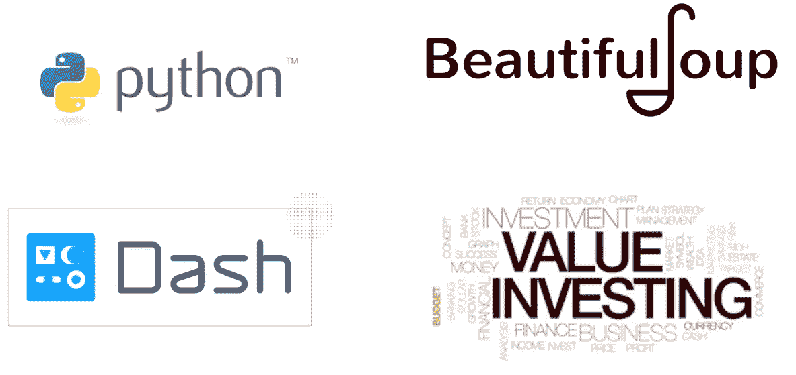

Creating Python Value Investing Dashboard for data extractions

# 问题陈述

> 所以我通常在 SGX 或雅虎财经等交易网站上搜索股票，并将相关数据一个一个复制粘贴到我的电子表格中
> 
> “应该可以快速访问最相关的股票信息，以便我做出买入/卖出决定”

我仍然记得我的朋友如何吹嘘他从 SGX(新加坡证券交易所)复制粘贴的不同股票比率的辛苦工作的工作表。出于纯粹的决心，他一个接一个地复制数据，通过数百次查看和点击来检索股票信息，并将其转储到 excelsheet，在那里他手动保存所有公式。

整个过程看起来很滑稽，因为有很多手动滚动和点击来提取看起来很大的数字，以做出买/卖决定。这个问题启发我构建自己的工具来自动提取和快速处理相关的财务比率。

**免责声明:本免责声明告知读者，文中表达的观点、想法和意见仅属于作者，不一定属于作者的雇主、组织、委员会或其他团体或个人**。**参考文献是从列表中挑选的，与其他作品的任何相似之处纯属巧合**

**这篇文章纯粹是作者的个人项目，绝无任何其他不可告人的目的。**

# 解决方案:Web 抓取和仪表板可视化

在这个项目中，我将向您展示一个仪表板，您可以使用它快速获得重要的财务反馈。用户只需输入股票代码(如谷歌或 MSFT)，应用程序将处理所有必要的关键比率和未来价格的计算。从 MarketWatch 检索到信息后，应用程序会将数字处理成预定义的值子集。最终结果将显示用户是否应该根据用户定义的边际价值和市场价格来购买/出售某些股票

该应用程序旨在消除用户访问股票市场网站的需求，如 SGX，雅虎/谷歌金融，他们可以使用我们的应用程序作为所有关键股票信息，基本分析和警告信号的一站式用户学习。

下面是应用程序演示，请注意屏幕将如何根据用户输入更新股票代码:


Value Investing Application Dashboard. This will help you screen and extract relevant financial ratio quickly (from Google to GameStop Stocks)

## 更新:6 月 27 日

我已经清理并部署了应用程序。请在这里尝试一下！

 [## 破折号

### 编辑描述

value-investing.herokuapp.com](https://value-investing.herokuapp.com) 

# 用途和 Github 代码

本概念证明(POC)是作为我目前管理的投资方项目的一部分而创建的。毕业后不久，肖恩·西的书《和沃伦·巴菲特一起去钓鱼》启发了我投资的想法。这本书启发我创造了自己的价值投资工具。这个应用程序的目标是帮助您快速检索和显示关于某个公司股票的正确的财务信息。

在 POC 中，我使用 Beautiful Soup 作为 Web 抓取工具，使用 Pandas data-reader API 获取金融股票价格，最后使用 Python 和 Flask/Dask 作为 Web 应用程序框架。Github 代码位于下面。

[](https://github.com/VincentTatan/ValueInvesting) [## 文森特/价值投资

### 价值投资仪表板。通过在 GitHub 上创建帐户，为 VincentTatan/ValueInvesting 的发展做出贡献。

github.com](https://github.com/VincentTatan/ValueInvesting) 

随时克隆回购，有空随时贡献。

# 项目范围

对于这一应用，我想强调 5 个过程:

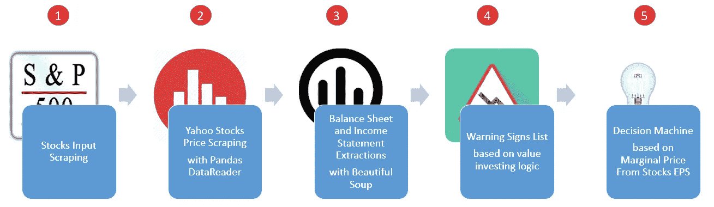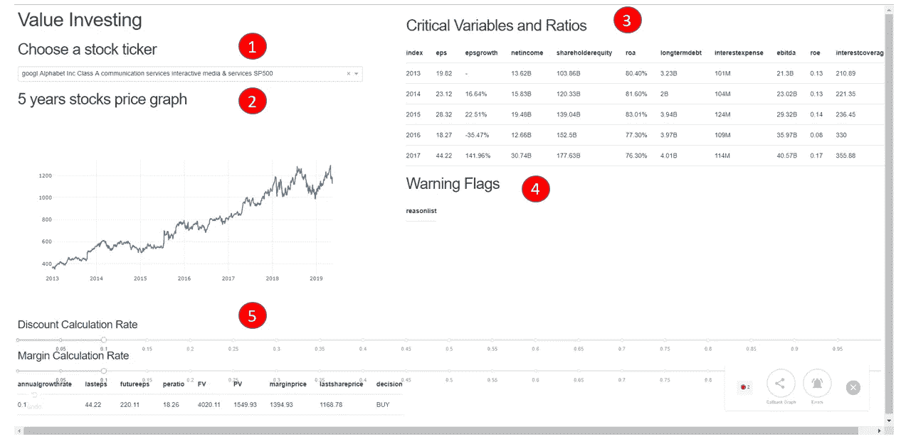

Workflows on the Python Stocks Dashboard

# 让我们试着一个一个地分解它

# 股票输入刮削

在这个列表中，我们将提取股票列表及其代码，例如:谷歌(Google)或微软(MSFT)。我们将从 3 个来源提取这些信息:

## **从维基百科获取 SP500 股票信息**

> 由 [S & P 道琼斯指数](https://en.wikipedia.org/wiki/S%26P_Dow_Jones_Indices)维护的 **S & P 500** 股票市场指数，由 **500** [大盘股](https://en.wikipedia.org/wiki/Market_capitalization)公司发行的 **505** [普通股](https://en.wikipedia.org/wiki/Common_stock)组成，并在美国证券交易所交易(包括构成[道琼斯工业平均指数](https://en.wikipedia.org/wiki/Dow_Jones_Industrial_Average)的 30 家公司)，按市值计算覆盖了美国股票市场的 80%左右。—维基百科

为了提取这些信息，我们将使用股票指数的链接。

 [## 标准普尔 500 公司列表-维基百科

### 由 S&P 道琼斯指数维护的标准普尔 500 股票市场指数由 500 家公司发行的 505 种普通股组成

en.wikipedia.org](https://en.wikipedia.org/wiki/List_of_S%26P_500_companies) 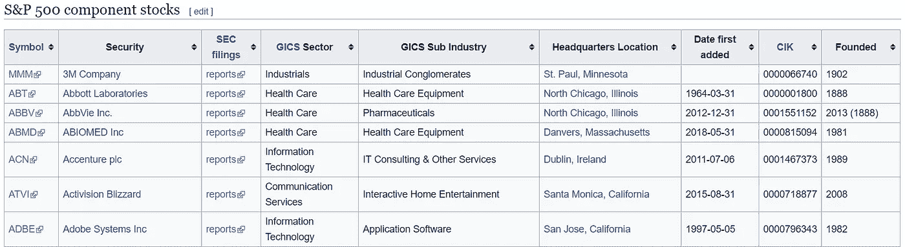

SP500 Stocks Table from Wikipedia

可以用美汤 4 之类的网页抓取库提取这个表。请随意参考这里的文章。

 [## 美丽的汤 4 蟒蛇

### 概述本文是对 Python 中 BeautifulSoup 4 的介绍。如果你想知道更多，我推荐你...

www.pythonforbeginners.com](https://www.pythonforbeginners.com/beautifulsoup/beautifulsoup-4-python) 

首先，我们将创建到美丽的汤传递 URL 链接。这将提取一些值作为汤

```
import requestsresp = requests.get('http://en.wikipedia.org/wiki/List_of_S%26P_500_companies')
soup = BeautifulSoup(resp.text, 'lxml')
```

这个 soup 对象将保存 HTML 文本，您可以通过运行以下命令提取这些文本。

```
for row in table.findAll('tr')[1:]:
        ticker = row.findAll('td')[0].text
        security = row.findAll('td')[1].text
        gics_industry = row.findAll('td')[3].text
        gics_sub_industry = row.findAll('td')[4].text

        tickers.append(ticker.lower().replace(r"\n", " "))
        securities.append(security)
        gics_industries.append(gics_industry.lower())
        gics_sub_industries.append(gics_sub_industry.lower())
```

该命令将查找表，然后迭代每一行以检索每一列的数据。提取出来的内容将被放入一个列表中，这个列表稍后将被转储到一个键和值对的字典列表中。

```
# Create a list of dict based on tickers and labels
dictlist = []
for index, row in stocks_info_df.iterrows():
     dictlist.append({'value':row['tickers'], 'label':row['labels']}) 
return dictlist
```

## **获取罗素股票信息**

获取罗素股票信息甚至更简单，因为数据是公开的。请随意参考[现有的](https://www.elitetrader.com/et/threads/russel-3k-company-list-in-csv-free.304983/) Russel 股票库。我们可以使用 pandas readcsv 方法来读取它。

```
dfrussel=pd.read_csv('C:/Users/vintatan/Desktop/Investment/RussellandData.csv',index_col='Symbol')
```

## **添加自己的股票信息列表**

对于 SP200 或 Russell 列表中不存在的任何报价器，我们可以手动将我们的股票价值和标签传递到字典列表中。

```
# self append
def save_self_stocks_info():
    print("Adding own list of stocks info")

    dictlist = []

    dictlist.append({'value':'sq', 'label':'SQ Square SA'})
    dictlist.append({'value':'kbsty', 'label':'Kobe steel'})
    dictlist.append({'value':'NESN', 'label':'Nestle'})
    dictlist.append({'value':'BN', 'label':'Danone'})
```

## 结论

从这些提取 3 个不同来源的方法中，你可能意识到我正在传递一个字典对象的列表。这是因为破折号组合框输入需要格式化。请参考此处的 Dash 可视化工具

```
dcc.Dropdown(
    id='my-dropdown',
    options=save_sp500_stocks_info()+save_self_stocks_info(),
    value='coke'
),
```

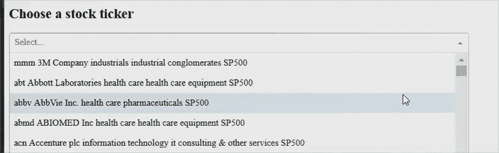

Stock Ticker Dash Combo Box Inputs

# 雅虎股票价格与熊猫数据阅读器刮

我们将使用熊猫-数据阅读器生成基于雅虎的股票价格。在这里，我们向 web 传递了 4 个参数。DataReader

> 自动收报机，在这种情况下，它会把 MSFT，谷歌等
> 
> 数据来源是雅虎
> 
> 开始时间，从 2013 年 1 月 1 日开始。
> 
> 结束时间，也就是现在。

一旦我们生成了 stockpricedf，我们就返回一个带有关键字“data”的字典，并返回 x 轴上的日期和 y 轴上的收盘价。

```
 stockpricedf = web.DataReader(
        selected_dropdown_value.strip(), data_source='yahoo',
        start=dt(2013, 1, 1), end=dt.now())
```

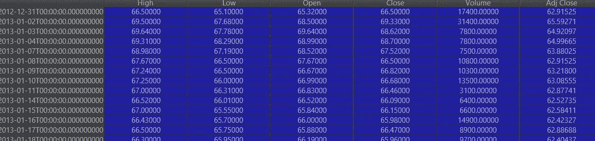

This is the Stocks Price DataFrame Retrieved from Web.DataReader

这将转化为你在这里看到的价格图表

```
 return {
        'data': [{
            'x': stockpricedf.index,
            'y': stockpricedf.Close
        }]
    }
```

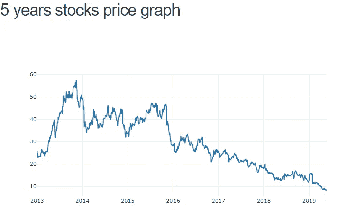

Price Chart over 5 years

# 资产负债表和损益表摘录与美丽的汤

在这个子主题中，我们将尝试提取重要的比率，并将其显示为 Dash 表。以下是我们感兴趣的比率:

> 每股收益是公司利润分配给每股普通股的部分
> 
> ROE(股本回报率)是对财务绩效的一种衡量，计算方法是将[净收入](https://www.investopedia.com/terms/n/netincome.asp)除以[股东权益](https://www.investopedia.com/terms/s/shareholdersequity.asp)
> 
> ROA(资产回报率)是一个公司相对于其总资产盈利程度的指标
> 
> 长期债务将包括公司债券发行或长期租赁，它们已经在公司的资产负债表上资本化
> 
> 总收入象征着公司的收入
> 
> 债转股用于评估公司的财务杠杆
> 
> 利息保障率用于确定公司支付未偿债务利息支出的难易程度

这些定义来自 Investopedia。请在下面找到更多详细信息

[](https://www.investopedia.com/) [## 更敏锐的洞察力。更明智的投资。

### 股市基础想知道股市到底是怎么运作的？这本指南将教你一些基本知识。最佳经纪人…

www.investopedia.com](https://www.investopedia.com/) 

我们将使用市场观察资产负债表和损益表链接，并将它们分配给变量。注意这里的股票代号指的是公司的股票代号。因此，苹果损益表的链接是[https://www.marketwatch.com/investing/stock/AAPL/financials](https://www.marketwatch.com/investing/stock/'+ticker+'/financials)，苹果资产负债表的链接是[https://www.marketwatch.com/investing/stock/AAPL/financials](https://www.marketwatch.com/investing/stock/'+ticker+'/financials)/资产负债表

```
urlfinancials = 'https://www.marketwatch.com/investing/stock/'+ticker+'/financials'
urlbalancesheet = 'https://www.marketwatch.com/investing/stock/'+ticker+'/financials/balance-sheet'text_soup_financials = BeautifulSoup(requests.get(urlfinancials).text,"lxml")
text_soup_balancesheet = BeautifulSoup(requests.get(urlbalancesheet).text,"lxml")
```

类似于提取公司代码，我们还使用 Beautiful Soup 从财务和资产负债表 url 中识别比率。我们将通过使用标签文本作为指示符遍历所有的同级属性来提取它们。

```
# Income Statement
for title in titlesfinancials:
    if 'EPS (Basic)' in title.text:
        epslist.append ([td.text for td in title.findNextSiblings(attrs={'class': 'valueCell'}) if td.text])
    if 'Net Income' in title.text:
        netincomelist.append ([td.text for td in title.findNextSiblings(attrs={'class': 'valueCell'}) if td.text])
    if 'Interest Expense' in title.text:
        interestexpenselist.append ([td.text for td in title.findNextSiblings(attrs={'class': 'valueCell'}) if td.text])
    if 'EBITDA' in title.text:
        ebitdalist.append ([td.text for td in title.findNextSiblings(attrs={'class': 'valueCell'}) if td.text])

# Balance sheet
titlesbalancesheet = text_soup_balancesheet.findAll('td', {'class': 'rowTitle'})
equitylist=[]
for title in titlesbalancesheet:
    if 'Total Shareholders\' Equity' in title.text:
        equitylist.append( [td.text for td in title.findNextSiblings(attrs={'class': 'valueCell'}) if td.text])
    if 'Long-Term Debt' in title.text:
        longtermdebtlist.append( [td.text for td in title.findNextSiblings(attrs={'class': 'valueCell'}) if td.text])
```

我们将提取的值填充到单独的数据框中。

```
df= pd.DataFrame({'eps': eps,'epsgrowth': epsgrowth,'netincome': netincome,'shareholderequity': shareholderequity,'roa': 
              roa,'longtermdebt': longtermdebt,'interestexpense': interestexpense,'ebitda': ebitda},index=[2013,2014,2015,2016,2017])
```

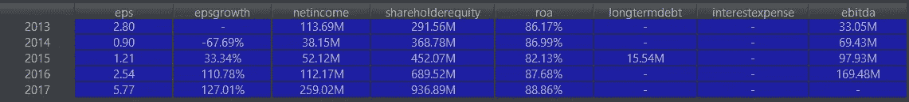

Result of the extractions

该数据帧将被转储到 dash 表对象中，如下所示

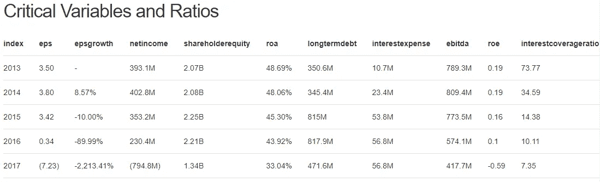

Critical Variables and Ratios Table

# 基于价值投资逻辑的警示信号列表

然后，我们将创建 eligibilitycheck.py 来遍历这些规则，并根据提取的比率识别一些可能的风险。

> 给定公司列表，找出投资的可行性
> 进入市场至少 10 年
> 有跟踪记录(每年 EPS)
> 有效率(ROE > 15%) —净收入/股东权益
> 确定操纵(ROA > 7%) —净收入/总资产
> 有小额长期债务(长期债务< 5*总收入)
> 低负债权益比
> 支付利息的能力:(利息保障比率> 3) — EBIT /利息支出

使用上面生成的数据帧，我们将检索一个警告列表

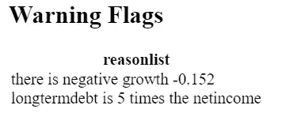

Warning Flags

# 基于股票每股收益边际价格的决策机

然后，我们将通过从用户定义的参数中推导出用户是否应该从预期未来值和边际值中购买来创建我们的最后一个步骤。以下是在 futurepricing.py 中实施的步骤

> 根据给定的价值投资方法，每家公司根据回报率做出决策
> 找出每股收益的年复合增长率
> 估计 10 年后的每股收益
> 估计 10 年后的股价(股价每股收益*平均每股收益)
> 根据回报率确定今天的目标价格(贴现率 15%/20%)
> 增加安全边际(安全网 15%)
> 如果市场价格低于边际价格，则买入
> 如果市场价格高于边际价格，则卖出

从这里，我们将从 Sean Seah 的书的逻辑中生成以下参数。

在此功能中，我们将允许用户输入诸如折扣率和边际率。贴现率表示 5 年期间的预测通货膨胀率，差额计算率是误差容限。在计算错误的情况下，你增加了额外的安全网。保证金计算率越高，你越厌恶风险，反之亦然。


Discount and Margin Calculation Rate at 15% for both

```
dfprice['peratio'] = findMinimumEPS(stockpricedf,financialreportingdf)

dfprice['FV'] = dfprice['futureeps']*dfprice['peratio']

dfprice['PV'] = abs(np.pv(discountrate,years,0,fv=dfprice['FV']))
dfprice['marginprice'] = dfprice['PV']*(1-marginrate)
dfprice['lastshareprice']=stockpricedf.Close.tail(1).values[0]

dfprice['decision'] = np.where((dfprice['lastshareprice']<dfprice['marginprice']),'BUY','SELL')
```

这将生成包含以下数据和决策(买入/卖出)的数据框架

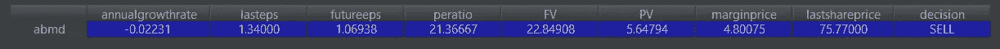

Future Price and Decision Making Calculation

在这种情况下，基于每股收益增长和市盈率，你可以找到未来价格和当前价格的估值。加上折扣率和利润率，你会得到边际价格。由于保证金价格低于上一次股价，我们可以假设股票目前被高估，即使给定容许误差率。因此*做出了卖出*的决定。相反的还为*购买*的决定效力

这是一个非常简单的逻辑，但却是你购买股票的有力杠杆。当然，需要注意的是，在购买股票之前，你应该对定性分析进行尽职调查。

# 结果

开发完这个工具后，我觉得有必要测试一下。因此，在 2017 年，我决定利用这个工具的筛选来购买一些股票。

## 购买斯凯奇

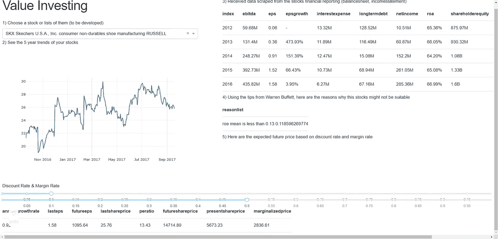

Skechers View from Value Investing Dashboard

正如您在此处看到的，该应用程序将 Skechers 标记为异常高的边缘化价格。这意味着给定 10%的贴现率假设(来自经济不稳定或通货膨胀)和 50%的边际利率假设(来自潜在误差程度)，我们仍然认为边际股价非常高——我们的估价。

对每股收益增长的进一步了解显示了斯凯奇从 2012 年到 2016 年的快速增长。然而，与此同时，如果你查看长期债务比率，斯凯奇的债务已经减少或稳定。总的来说，增加收入、高增长和低长期债务是我购买斯凯奇的最大原因之一。在一年半的时间里，我的股票价格上涨了 34.55%

## 购买高通

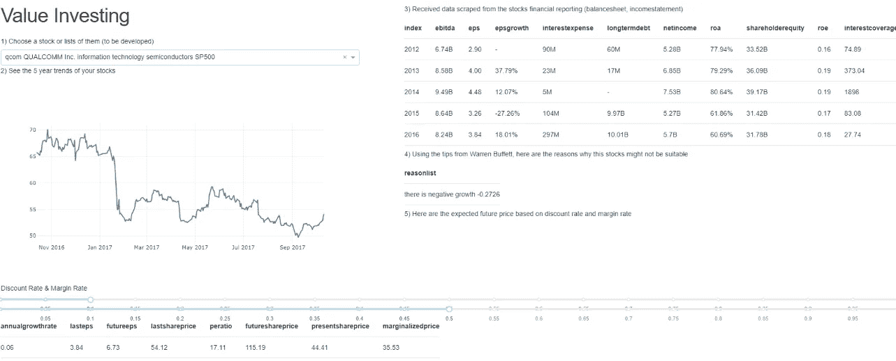

2017 年，我收到了高通与苹果公司发生纠纷的消息。这使得股票下跌到 44。因此，我尝试使用这个工具来看看我是否能快速提取信息并进行定量分析。快速看了一眼后，我意识到，考虑到市盈率和年增长率，高通给了我很高的未来价值 115 美元。即使我把 50%作为利润率(我是一个非常厌恶风险的人)，我可以看到边际价格仍然远远高于目前的股价。由于除了一年的负增长，没有太多的预警信号和长期债务的增加，我买了高通。在一年半的时间里，我的股票价格上涨了 62.87%。

## 购买 Gamestop

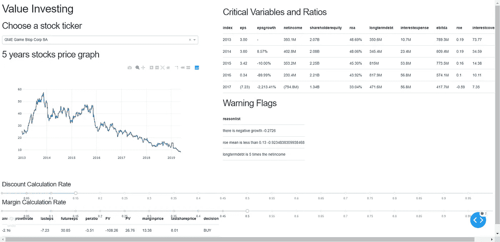

Gamestop 是我用价值投资仪表板做的最新投资。这被认为是一种烟头投资，因为这是一种没有投资者想要的增长下降的股票，因此，烟头(明白吗？！哈哈)。在警告信号中，出现了三个警告:负增长，长期债务高，净资产收益率低。然而，如果你看一看底部的决定:应用程序将它标注为*购买*。原因是尽管股票随着负增长而下跌，但市场对股票的估价太低:人们太害怕投资 GameStop。生意下降的速度低于市场情绪下降的速度。正如你所看到的，即使当我把利润率设为 50%时，我仍然看到利润价格(13 美元)高于股价(8 美元)。出于这个原因，我买了 Gamestop，希望投资者能意识到这一差距，同时也希望收购。到现在为止，我亏了 7.58%。

## 持有 18%的投资组合回报

使用这个应用程序，我首先筛选、购买和持有股票。目前，我成功购买的公司包括:DC 吉宝房地产投资信托公司、CSE 全球有限公司、高通和斯凯奇。一些经过筛选的股票，如斯凯奇和高通是迄今为止表现最好的股票。

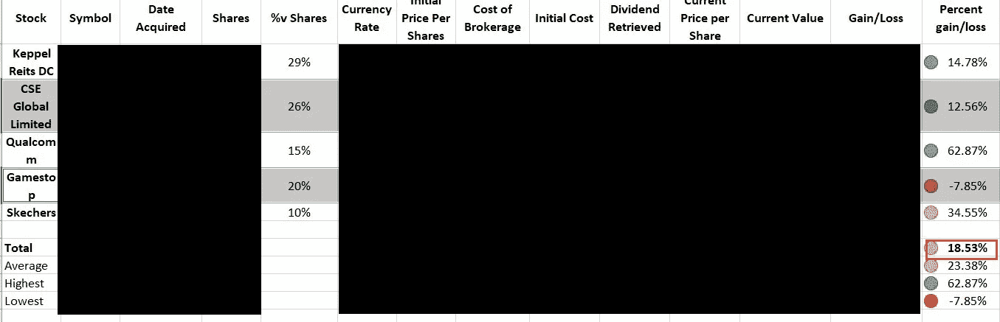

Results: Stocks Portfolio Gain by 18.53% since 2017

正如你所看到的，我目前管理的工作投资组合在持有一年半后产生了 18%的最新回报率。如果包括股息，那么回报率估计为 22%。虽然这是一年后的巨大回报，但这仍然不足以证明这款应用的有用性。请随意尝试，并在下面发表评论。

此外，我想进一步强调重要的警告:做你的尽职调查。

> 你仍然应该通过询问以下定性评估来评估你的股票:
> 
> 业务优势(产品差异化、品牌、低价生产商、高转换成本、法律准入壁垒)
> 
> 有勇无谋的管理能力(即使傻瓜也会跑)
> 
> 避免价格竞争的业务。了解企业如何创收。

最后，我希望这个应用程序或者至少是我投资旅程中的一小段能激发你的创新。请随意查阅这些代码，以便更好地理解我是如何处理这些数字来得出买入/卖出行为的。然后，如果您想进一步改进，请随意发表意见。

一切都是免费的！！请做出贡献，使其成为最好的开源价值投资工具。

# 结论和未来工作

这个项目给了我解决一个实际相关问题的机会，我的许多金融朋友似乎都面临着这个问题。我们可以添加许多功能来改善用户体验，但目前，该应用程序已经成功地处理了前面提到的核心问题，即提取相关的财务比率和信息以进行初步的股票筛选。

从这个项目中，我还学到了许多基本的金融理论，我可以用这些理论来评估股票。我不是金融专家，我打赌你可能比我更清楚。因此，请随意改进您认为合适的解决方案。如果你想打个招呼或者进行一次轻松的讨论，我的联系方式如下:)

## 感谢

我想感谢我的会计和金融同行朋友们，是他们启发我开发了这个工具。我真的很喜欢从他们那里学到一堆金融术语，并用它们来解决他们遇到的现实生活中的问题。

## 最后…

咻…就是这样，关于我的想法，我把它写成了文字。我真的希望这对你们来说是一个伟大的阅读。因此，我希望我的想法可以成为你发展和创新的灵感来源。

请通过我的 [LinkedIn](http://www.linkedin.com/in/vincenttatan/) 联系我，并订阅我的 [Youtube 频道](https://www.youtube.com/user/vincelance1/videos)

请在下面留言，寻求建议和反馈。

快乐编码:)