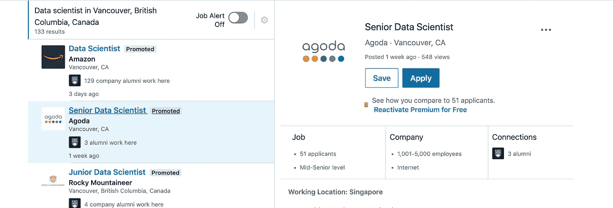
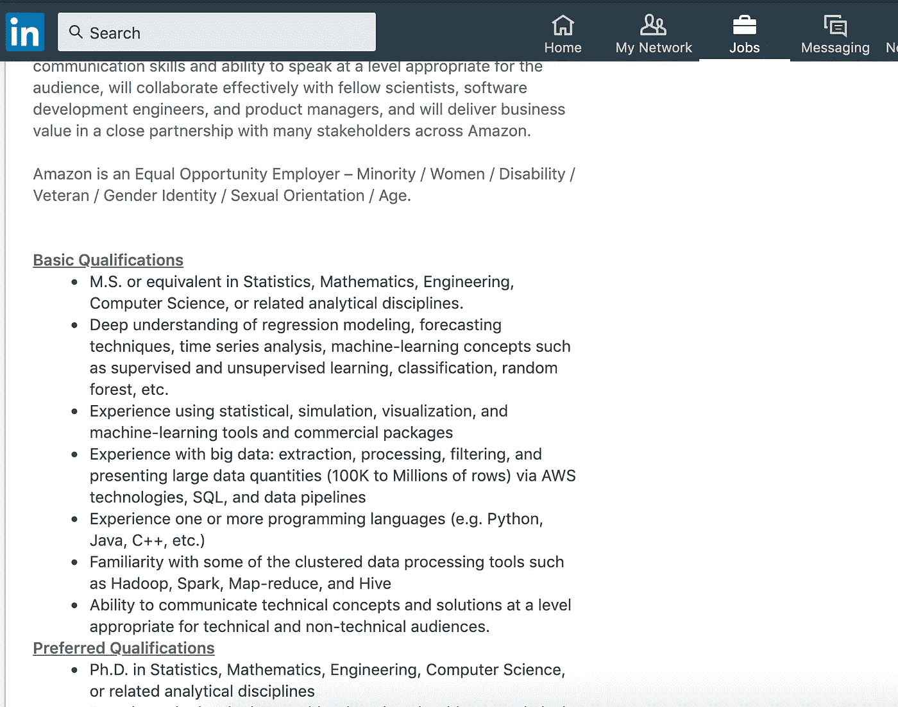
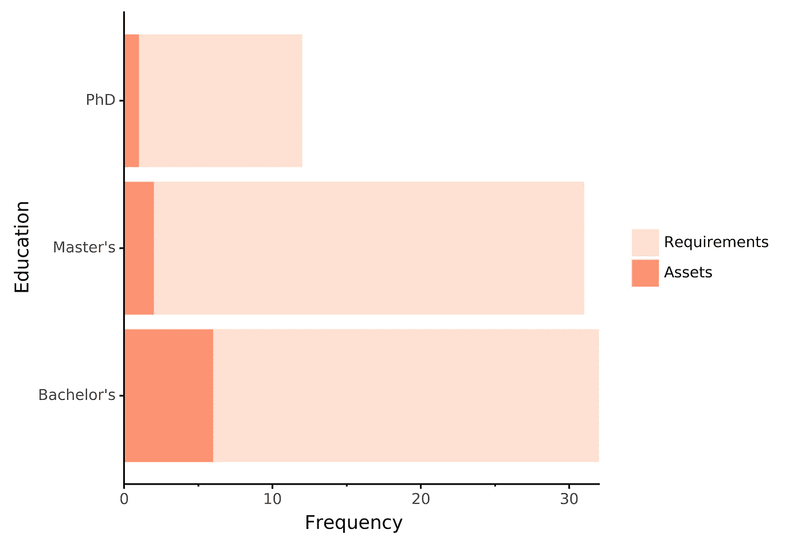
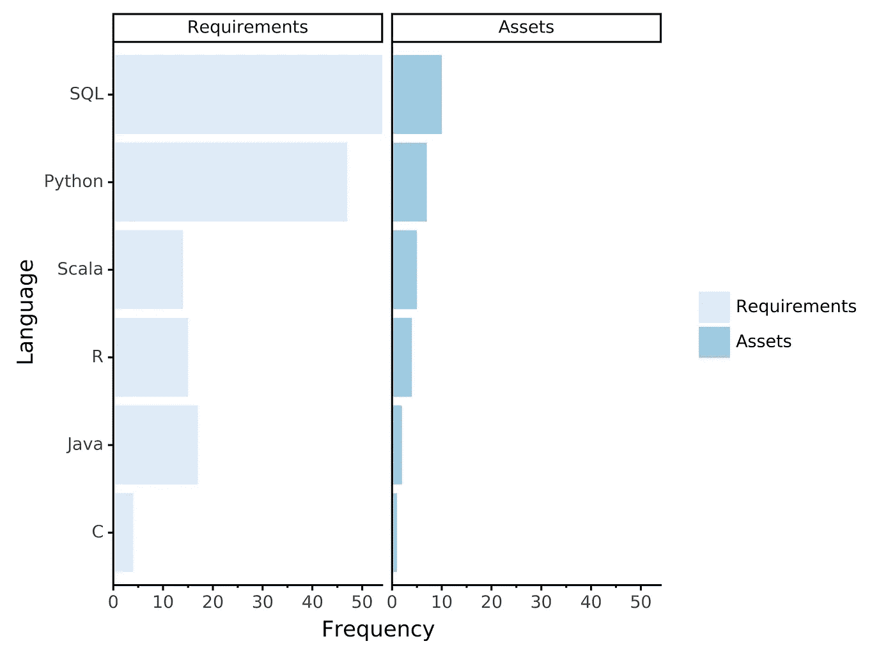
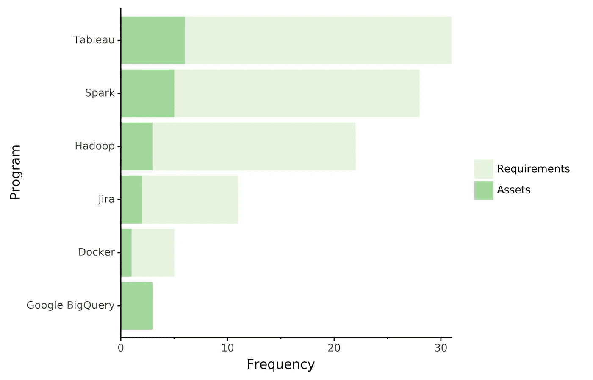
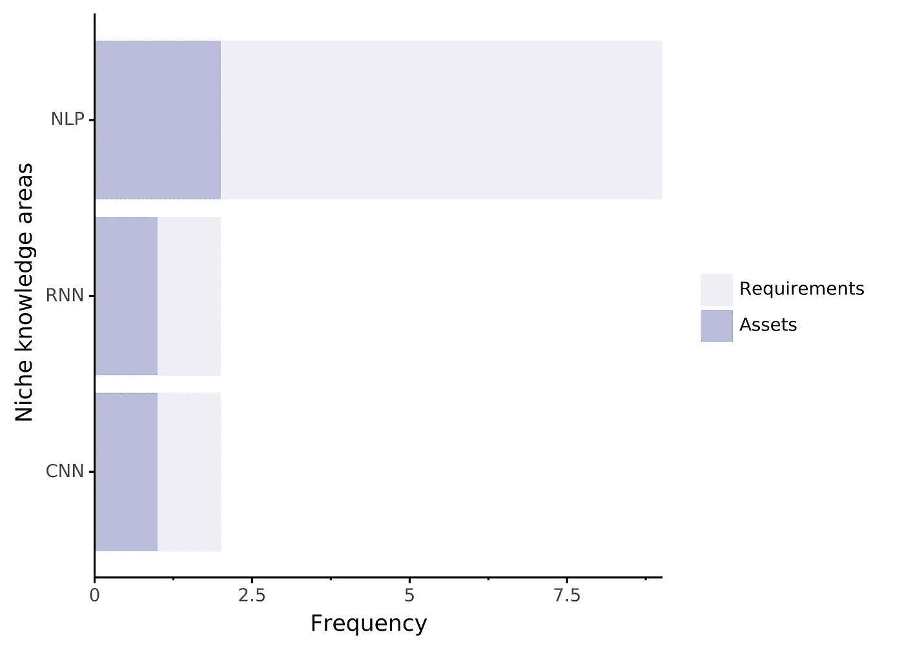
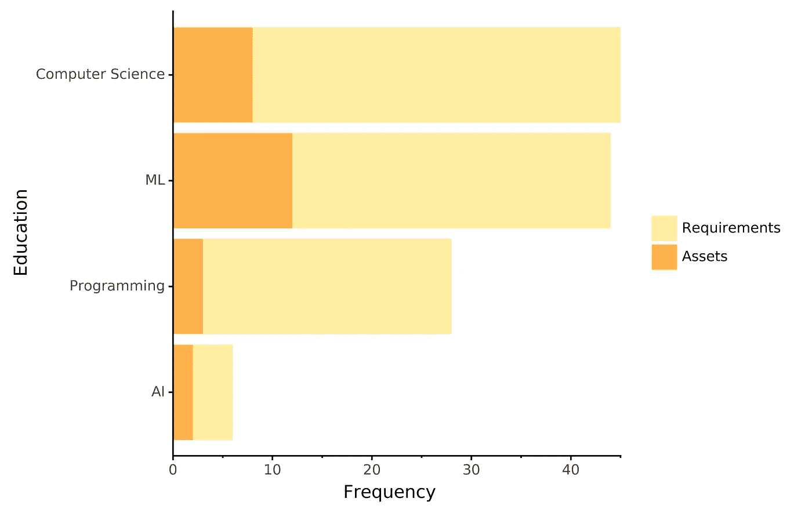

# 温哥华的数据科学家市场

> 原文：<https://towardsdatascience.com/vancouvers-data-scientist-market-24c43307d784?source=collection_archive---------10----------------------->

## 在温哥华做一名数据科学家需要什么？

Credit: [David G Gordon](https://bit.ly/2SmudKm) (2015)

我最近读了哈尼夫·萨马德的一篇文章，他在文章中颠倒了他的招聘问题。他想知道新加坡的数据科学家在被聘用到目前的职位之前做了什么，而不是寻找公司在招聘信息中想要的内容？作为一个希望进入这一领域的人，我有兴趣回到我居住的城市温哥华的公司今天正在寻找他们的数据科学家的基本情况。

我有两个原因:1)我将很快在温哥华寻找数据科学家的职位(自私的原因)；2)我目前是 UBC 数据科学硕士项目(利他主义原因)的助教。因此，我想看看哪些职位最符合我目前的知识和技能，以及基于*平均水平*的数据科学家工作，我目前的差距是什么？而且，我想帮助这些学生准备他们的项目，为他们毕业时找到一份好工作做好准备。

为此，我求助于 LinkedIn。我想查看温哥华的所有职位，而不是单独查看每个职位或其中的一个样本。所以，我转向了 LinkedIn 的网页抓取。

# **网页抓取 LinkedIn**

正如 Hanif [提到的](/i-wasnt-getting-hired-as-a-data-scientist-so-i-sought-data-on-who-is-c59afd7d56f5)，LinkedIn 抓取网页的合法性目前还没有得到证实(尽管这可能只是[改变了](https://arstechnica.com/tech-policy/2019/09/web-scraping-doesnt-violate-anti-hacking-law-appeals-court-rules/)！).招聘启事都是公开的(毕竟他们正在试图雇佣某人)，但是在他们的网站上使用抓取程序会让你违反他们的服务条款。如果您试图修改或复制此代码，请谨慎操作。为此，我同时使用了硒和 BeautifulSoup。完整代码见 [Github 库](https://github.com/timcashion/DS_Jobs_Vancouver)。

**1。编制所有相关公告的列表**

截至发稿时，有 133 个帖子符合我的标准。LinkedIn 实际上会根据浏览器显示不同的网页设置。Chrome 有一个无限滚动的按钮，可以显示更多帖子。加载页面后，我设置它多次点击那个按钮，直到它不出现。然后，所有的链接都在边上

**2。刮掉每张帖子**

这一部分包括检查一个示例工作发布的 html，以获得正确的 HTML 标签。职位存储在 *h1* 下，公司存储在 class _ name*top card _ _ org-name-link*下，大部分信息存储在 class _ name“*description*下。我将这些都存储在一个字典中，并在访问下一页之前将其添加到一个列表中。

**3。一起清理和编译数据**

这是一个痛苦的部分，需要大量的试验和错误。最后，我通过搜索下一个文本元素是列表开头的字符串，让它工作起来，这在招聘信息中很常见。大多数都有 1-3 个部分，我将其归类为“需求”、“资产”和“责任”。需求和资产之间的分离对于填补您需要的空白以及看到什么可以让您与众不同是很重要的。

然后，我在每个职位描述部分搜索关键词。我基于我以前的知识会很重要，或者通过浏览一些帖子(例如，我最初不打算包括 C++，但它出现在亚马逊的一份工作的摘录中，所以我想知道这有多普遍)。我还必须对一些关键词进行创新，以获得正确的用法(例如，“MS”通常被用作科学硕士的简写，但也是许多复数词的结尾，如“programs”、“aims”和“teams”)。).

Example of Amazon job posting with two sections (‘requirements’ and ‘assets’).

现在数据已经清理完毕，我们可以看看我们发现了什么。

**发现 1:研究生教育很普遍**

在近 50 个帖子中出现了某种形式的大学教育，其中 33 个提到了研究生教育的要求(硕士或博士)。这些教育要求中的大部分都列在“要求”部分，专业或专业通常作为资产包括在内。

这些数字确实显示了这种教育在数据科学这样一个新领域的负面影响。大学和学院中的数据科学学位课程开始越来越多，显然有大量涵盖类似内容的训练营和在线课程。许多工作甚至没有将学士学位列为要求，这可能表明他们对你在这个特定领域的知识更感兴趣，而不需要学位来支持。

**发现 2: SQL 至高无上**

SQL 是所有招聘信息中最常被提及的语言(64；需求和资产一起)。Python 紧随其后(54)，R 远远落后(19)。其他编程语言也出现了，但可能是在需要高性能 C++代码的更特殊的位置。

Jim Halpert obviously saw the dominance of SQL coming.

除了一些主要的编程语言，一些软件和服务也出现在很多帖子中。Spark 位居榜首，Tableau 紧随其后，两者都出现了两次以上。

**发现 3:利基工作的利基知识**

数据科学家训练营和课程强调的一些事情只出现在少数帖子中。神经网络(包括 CNN 和 RNN)只在 4 篇文章中明确列出。自然语言处理(NLP)只在 9 中列出。如果这些是你真正想进入的领域，这些专业的数据科学家职位显然需要它们，但似乎大多数职位招聘的是更“通才”的数据科学家职位。(有关这方面的更多信息，请查看我喜欢的关于数据科学中专家与通才辩论主题的[播客片段](http://lineardigressions.com/episodes/2019/4/14/the-great-data-science-specialist-vs-generalist-debate)。

Definitions: RNN: NLP: Natural language processing; Recurrent neural network; CNN: Convolutional neural network.

虽然这并不是贬低这些方法的有用性，也不是说它们可能会在面试中出现，但这并不是公司在发布大部分帖子时的首选。

**发现 4:不仅仅是技术**

知识就是力量。数据科学家的工作也不例外。虽然你可能需要进行分析，但很多工作也希望你了解分析背后的理论，以确保你在适当的时候应用了正确的方法和技术。

**整体**

我很有兴趣看看数据科学工作(在温哥华，BC)的总体情况。这些发现可能并不太令人惊讶，但它确实展示了整体情况，以及你可能需要填补知识空白的地方，以便为就业市场做好准备。

我错过了什么你感兴趣的吗？下面评论，给我发消息或者随意自己探索[这里](https://github.com/timcashion/DS_Jobs_Vancouver)。

# **注意事项**

1.  代码可以在另一个城市复制，或者在这里深入研究。