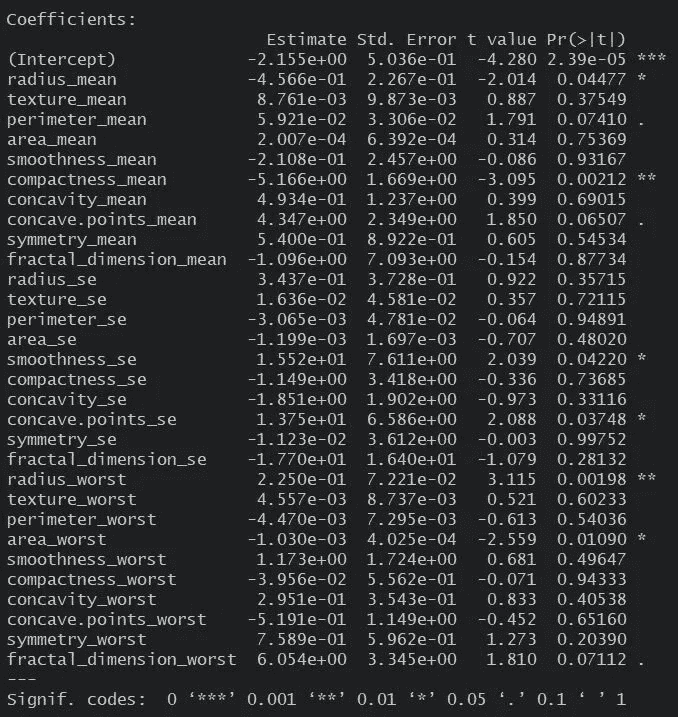
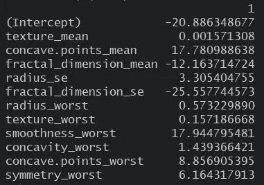

# 使用套索的可变选择

> 原文：<https://towardsdatascience.com/variable-selection-using-lasso-493ac2e5660d?source=collection_archive---------14----------------------->

Photo by [Priscilla Du Preez](https://unsplash.com/@priscilladupreez?utm_source=medium&utm_medium=referral) on [Unsplash](https://unsplash.com?utm_source=medium&utm_medium=referral)

这是套索；它被用来挑选和捕捉动物。作为一个非英语母语的人，我第一次接触这个词是在监督学习中。在本 Lasso 数据科学教程中，我们将通过逐步介绍如何将这种有用的统计方法应用于 R 中的分类问题，以及 Lasso 如何“类似地”用于挑选和选择与当前分类问题相关的输入变量，来讨论 LASSO 逻辑回归的优势。

数据分析师和数据科学家针对不同类型的分析问题使用不同的回归方法。从最简单的到最复杂的。人们谈论最多的方法之一是套索。Lasso 经常被描述为最有用的线性回归工具之一，我们即将找到原因。

Lasso 其实是“最小绝对收缩与选择算子”的缩写，基本概括了 LASSO 回归的工作原理。Lasso 使用收缩参数“数据收缩到某个中心点”[1](https://www.statisticshowto.datasciencecentral.com/lasso-regression/)进行回归分析，并通过惩罚强制“不太重要”变量的系数变为零来执行变量选择。

现在，为了更好地了解这个强大的工具，我们将把这个例子应用到一个现实世界的问题中。

我们从 Kaggle.com[[2](https://www.kaggle.com/uciml/breast-cancer-wisconsin-data)获得了一些乳腺癌诊断病例的数据。这将用于整个演示过程。该数据集包含乳腺肿块的细针抽吸(FNA)的数字化图像中存在的细胞核的特征。我们正在解决的问题是确定乳房肿块的物理特征，这些特征显著地告诉我们它是良性的还是恶性的。

**准备数据**

我们将数据分为训练集和测试集。

**训练模型**

在训练训练集之后，我们使用交叉验证来确定最佳的 lambda。

**预测**

我们预测测试集的响应变量，然后，查看混淆矩阵。

**检查性能**

我们比较了响应集的实际值和预测值。

为了比较，我们也将使用普通的最小二乘法来解决相同的问题，然后比较它们的结果。

**训练模型**

**预测**

**检查性能**

现在，比较两种方法的准确性，Lasso 得到 166/171 的正确预测，给出 97.01%的准确性，而普通最小二乘法得到 162/171 的正确预测，给出 94.74%。然而，由于良性到恶性病例的分布，我们期待这种性能，让我们看看两个模型的 F1。这是为了同等重视假阳性(或非恶性病例被归类为恶性)和假阴性(或恶性病例被归类为非恶性)的数量，因为它们在我们的癌症问题中都很重要。我们希望尽可能地减少错误分类，因为分类决定了应该为患者提供什么样的具体护理或健康措施。看看 F1，Lasso 给出了 97.70%，而普通最小二乘法给出了 95.90%。同样，套索优于最小二乘法。

看起来这两者的性能几乎相同，我们可以使用其中任何一个来解决这个特定的问题。然而，如果我们深入研究模型的样子以及它们是如何形成的，我们可以很容易地看出这两种方法之间的显著差异。

检查 OLS 模型时，数据集中的所有输入变量都在模型中考虑。系数请参考下图。

现在，看看套索模型，我们会注意到模型中考虑的变量很少(只有 11/30 的自变量)。其余的被忽略或被模型视为在因变量的结果中不重要。然而，该模型的准确性在 97%左右，高于考虑所有自变量的模型。请参考该型号的下图。

我们发现，平均纹理、平均凹点、平均分形维数、半径的标准误差、分形维数的标准误差、最差半径、最差纹理、最差平滑度、最差凹度、最差凹点和最差对称性共同强烈地识别乳房块中的细胞核是良性还是恶性。

以上告诉我们的是，有时，有必要放弃使模型不稳定的其他变量。因为这些有噪声的/不相关的变量促使模型去适应噪声，也称为过适应。

让我们看看套索的显著特征，为什么它在这个特定的案例中比 OLS 更好。正如一开始提到的，LASSO 的一个重要特征是可变选择。Lasso 只选择模型中的重要变量。如果我们仔细观察现有的数据，我们会注意到有很多预测因素，一些独立变量实际上是相互关联的，或者我们可以将它们分组。这实际上已经给了我们一个暗示，可能有必要删除一些变量。

因此，获得预测更容易，因为我们在推断过程中需要准备的特征更少。不像在 OLS，我们必须输入数据集中的所有值才能获得响应值。

最后，让我们概括一下套索的重要特征。Lasso 是一种监督算法，其中该过程识别与响应变量密切相关的变量。这叫做变量选择。然后，Lasso 迫使变量的系数趋向于零。这就是现在收缩的过程。这是为了使模型对新数据集不那么敏感。由于选择的输入变量较少，这些过程有助于缓解人类认知的局限性。

如果你想了解更多关于 Lasso 回归的知识，我推荐你参加 Coursera [ [3](https://www.coursera.org/lecture/machine-learning-data-analysis/what-is-lasso-regression-0KIy7) ]的课程，或者通读一下这篇[ [4](/ridge-and-lasso-regression-a-complete-guide-with-python-scikit-learn-e20e34bcbf0b) 。

帖子到此为止。我们很想听听你对这些文章和其他相关数据的看法。SpectData 是一家精品数据科学咨询公司，擅长人工智能和自然语言处理。本文由我们的数据科学家 Marriane M。

*原载于 2019 年 8 月 7 日*[*http://www.spectdata.com*](http://www.spectdata.com/index.php/2019/08/08/variable-selection-using-lasso/)*。*