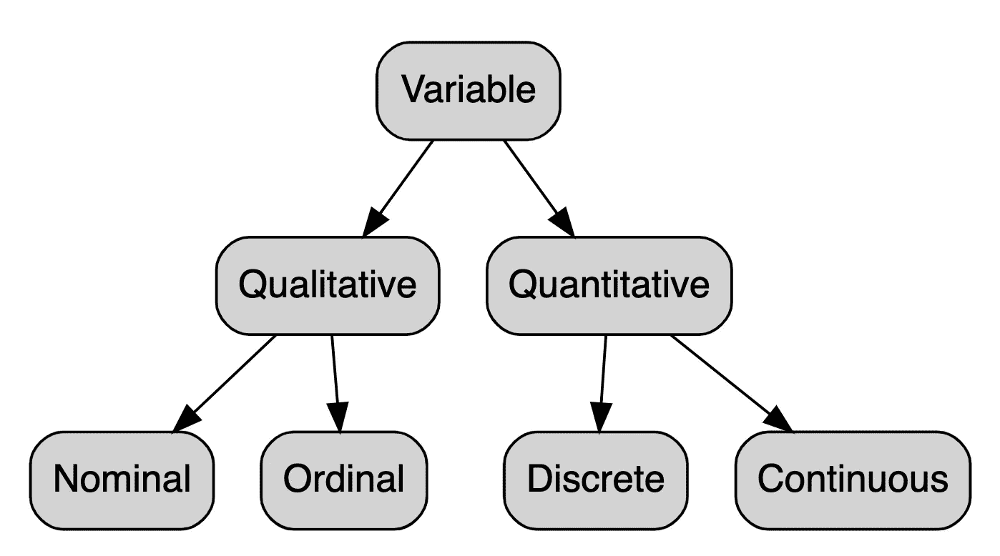

# 变量类型和示例

> 原文：<https://towardsdatascience.com/variable-types-and-examples-cf436acaf769?source=collection_archive---------24----------------------->

## 通过具体的例子学习定量连续变量、定量离散变量、定性序数变量和定性名义变量之间的区别

# 特种宽银幕电影

在统计学中，变量分为 4 种不同的类型:

Types of variables

# 数量的

一个**数量**变量是一个反映**大小**概念的变量，也就是说，如果它可以取的值是**数字**。因此，数量变量代表一种度量，并且是数字的。

定量变量分为两种:**离散**和**连续**。这种差异将在以下两节中解释。

# 分离的

**定量离散**变量是其取值为**可数**且有**有限个可能性**的变量。这些值通常(但不总是)是整数。以下是一些离散变量的例子:

*   每个家庭的孩子数量
*   一个班的学生人数
*   一个国家的公民人数

即使统计一个大国的公民人数需要很长时间，但在技术上还是可行的。而且，对于所有的例子，可能性的数量都是**有限的**。无论一个家庭有多少个孩子，都不会是 3.58 或 7.912，所以可能性的数量是有限的，因此是可数的。

# 连续的

另一方面，**定量连续**变量是其值**不可数**并具有**无限种可能性**的变量。例如:

*   年龄
*   重量
*   高度

为了简单起见，我们通常用年、千克(或磅)和厘米(或英尺和英寸)分别代表年龄、体重和身高。然而，一个 28 岁的男人实际上可能是 28 岁 7 个月 16 天 3 小时 4 分 5 秒 31 毫秒 9 纳秒。

对于所有的测量，我们通常在一个标准的粒度级别停止，但是没有什么(除了我们的测量工具)阻止我们更深入，导致无限数量的潜在值。事实上，值可以采取无限多的可能性，使它不可数。

# 定性的

与定量变量相反，**定性**变量(也称为分类变量或 R 中的[因子](https://www.statsandr.com/blog/data-types-in-r/#factor))是**而非数值**的变量，其**值属于类别**。

换句话说，一个**定性**变量是一个以模态、**类别**甚至水平为其取值的变量，与测量每个个体的**数量**的**定量**变量相反。

定性变量分为两种:**标称**和**序数**。

# 名义上的

**定性标称**变量是一个定性变量，其中**不可能排序**或在等级中没有暗示。例如，变量性别是名义上的，因为在女性/男性级别中没有顺序。眼睛颜色是名义变量的另一个例子，因为蓝色、棕色或绿色眼睛之间没有顺序。

一个名义变量可以有两个级别(例如，你吸烟吗？是/否或者你的性别是什么？女/男)和一大批水平(你大学专业是什么？每个专业在那种情况下都是一个级别)。

# 序数

另一方面，**定性序数**变量是具有隐含在等级中的**顺序的定性变量。例如，如果道路交通事故的严重程度是按轻度、中度和致命事故的等级来衡量的，那么这个变量就是一个定性的顺序变量，因为在等级中有一个明确的顺序。**

另一个很好的例子是健康，它可以取值为差、合理、好或优秀。同样，这些级别有明确的顺序，所以在这种情况下，健康是一个定性的序数变量。

# 变量转换

有两种主要的变量转换:

1.  从连续变量到离散变量
2.  从量变到质变

# 从连续到离散

假设我们对婴儿的年龄感兴趣。收集的数据是婴儿的年龄，因此是一个定量的连续变量。然而，我们可能只处理出生后的周数，从而将年龄转换为离散变量。年龄变量仍然是一个定量的连续变量，但我们正在研究的变量(即出生后的周数)是一个定量的离散变量。

# 从量变到质变

假设我们对身体质量指数(身体质量指数)感兴趣。为此，研究人员收集了个人身高和体重的数据，并计算出身体质量指数。身体质量指数是一个定量的连续变量，但研究人员可能希望将其转化为定性变量，方法是将低于某个阈值的人归类为体重不足，高于某个阈值的人归类为超重，其余的人归类为正常体重。原始身体质量指数是一个定量的连续变量，但身体质量指数的分类使转换变量成为一个定性(顺序)变量，在这种情况下，其水平为体重不足

当年龄被转换成一个定性的顺序变量时，年龄也是如此，包括未成年人、成年人和老年人。通常情况下(尤其是在调查中),可变工资(定量连续)被转换为具有不同工资范围的定性有序变量(例如，< 1000€, 1000–2000€, > 2000€)。

# 附加注释

## 不同类型的变量用于不同类型的统计分析

我们经常将变量分为不同类型的原因是因为不是所有的统计分析都可以在所有的变量类型上进行。例如，不可能计算变量“头发颜色”的[平均值](https://www.statsandr.com/blog/descriptive-statistics-in-r/#mean)，因为你不能将棕色和金色头发相加。

另一方面，寻找连续变量的[模式](https://www.statsandr.com/blog/descriptive-statistics-in-r/#mode)实际上没有任何意义，因为大多数时候不会有两个完全相同的值，所以没有模式。即使在有一个模式的情况下，这个值的观测值也很少。举个例子，试着找出你们班学生身高的模式。如果你幸运的话，几个学生会有同样的尺寸。然而，大多数时候，每个学生都有不同的尺寸(特别是如果身高是以毫米为单位的话)，因此没有模式。要查看每种类型变量的可能分析，请参阅文章“[手工描述性统计](https://www.statsandr.com/blog/descriptive-statistics-by-hand/)”和“[R](https://www.statsandr.com/blog/descriptive-statistics-in-r/)中的描述性统计”中的更多详细信息。

类似地，一些统计测试只能在特定类型的变量上进行。例如，[相关性](https://www.statsandr.com/blog/correlation-coefficient-and-correlation-test-in-r/)只能对定量变量进行计算，而[独立性卡方检验](https://www.statsandr.com/blog/chi-square-test-of-independence-in-r/)是对定性变量进行的，而[学生 t 检验](https://www.statsandr.com/blog/student-s-t-test-in-r-and-by-hand-how-to-compare-two-groups-under-different-scenarios/)或[方差分析](https://www.statsandr.com/blog/anova-in-r/)需要混合定量和定性变量。

## 误导性数据编码

最后但并非最不重要的是，在数据集中，数字经常用于定性变量。例如，研究人员可能会将数字“1”分配给女性，将数字“2”分配给男性(或者将答案“否”分配为“0”，将答案“是”分配为“1”)。尽管进行了数字分类，性别变量仍然是一个定性变量，而不是看上去的离散变量。数字分类仅用于方便数据收集和数据管理。写数字“1”或“2”确实比写“女性”或“男性”更容易，因此不容易出现编码错误。

如果您面临这种设置，不要忘记在执行任何统计分析之前将变量转换成正确的类型。通常，在主要统计分析之前，一个基本的[描述性分析](https://www.statsandr.com/blog/descriptive-statistics-in-r/)(以及关于已测量变量的知识)足以检查所有变量类型是否正确。

感谢阅读。我希望这篇文章能帮助你理解不同类型的变量。如果您想了解 R 中不同数据类型的更多信息，请阅读文章“[R](https://www.statsandr.com/blog/data-types-in-r/)中的数据类型”。

和往常一样，如果您有与本文主题相关的问题或建议，请将其添加为评论，以便其他读者可以从讨论中受益。

# 相关文章

*   我的数据符合正态分布吗？关于最广泛使用的分布以及如何检验 R 中的正态性的注释
*   [手工卡方独立性检验](https://www.statsandr.com/blog/chi-square-test-of-independence-by-hand/)
*   [R 中的描述性统计](https://www.statsandr.com/blog/descriptive-statistics-in-r/)
*   [手工描述性统计](https://www.statsandr.com/blog/descriptive-statistics-by-hand/)
*   [总体和样本有什么区别？](https://www.statsandr.com/blog/what-is-the-difference-between-population-and-sample/)

*原载于 2019 年 12 月 30 日*[*【https://statsandr.com】*](https://statsandr.com/blog/variable-types-and-examples/)*。*