# 金融中的变分自动编码器

> 原文：<https://towardsdatascience.com/variational-autoencoder-in-finance-53ee5eb9ed98?source=collection_archive---------7----------------------->

## 金融时间序列的降维与指数构建

本文通过 Keras 和 Python 探讨了使用可变自动编码器来降低金融时间序列的维数。我们将进一步检测不同市场中金融工具之间的相似性，并将使用获得的结果来构建自定义指数。

**免责声明:**本文介绍的研究来自我们在多伦多大学继续教育学院的[深度学习课程](https://learn.utoronto.ca/programs-courses/courses/3546-deep-learning)的 2019 年冬季学期项目。这是与[温贝托·里贝罗·德·索萨](https://www.linkedin.com/in/humbertors)合作完成的。概念和想法是我们自己的。我们绝不代表我们现在或以前的雇主。

## 第 1 部分:使用变分自动编码器降维

在本节中，我们将讨论:

*   创建几何移动平均数据集
*   用随机模拟扩充数据
*   建立变分自动编码器模型
*   获得预测。

**创建几何移动平均数据集**

为了比较不同价格范围的时间序列，我们选择计算收益的几何移动平均时间序列，定义如下:

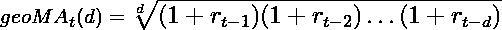

我们选择了 **d=5** ，因为它代表了 5 个工作日的典型交易周。

本文使用的数据集包含 2016 年 1 月 4 日至 2019 年 3 月 1 日期间的 423 个几何移动平均时间序列。

读者可以按照[数据处理笔记本](https://github.com/MarieImokoyende/vae-dimRedFinance/blob/master/3546%20Deep%20Learning%20Project%20-%20Data%20Treatment.ipynb)中描述的步骤构建自己的数据集。应该和这个差不多:

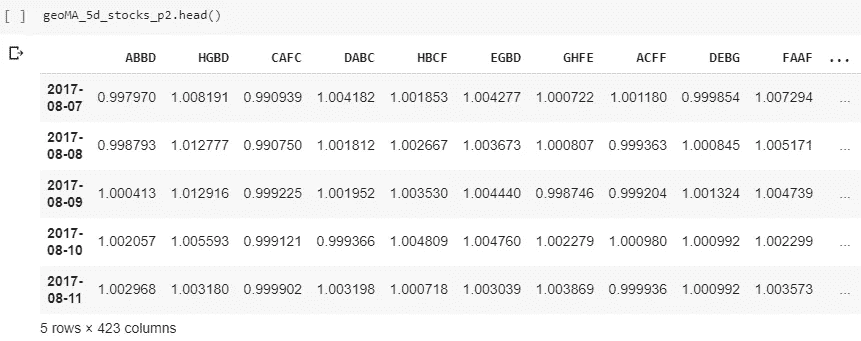

可以通过绘制一些样本股票价格时间序列及其几何移动平均线来验证结果:

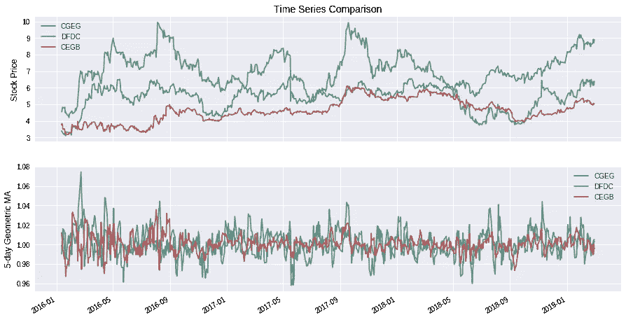

然后，可以将刚刚构建的数据帧分成两个长度相等的时间段，只将第一个时间段的数据帧进行置换。周期 1 从 2016 年 1 月 12 日到 2017 年 8 月 4 日。周期 2，从 2017 年 8 月 7 日至 2019 年 3 月 1 日。

我们将仅使用周期 1 的数据来获得预测。

```
# Divide in two
geoMA_5d_stocks_p1 = geoMA_5d_stocks.head(int(len(geoMA_5d_stocks)/2))
geoMA_5d_stocks_p2 = geoMA_5d_stocks.tail(int(len(geoMA_5d_stocks)/2))# Transpose the dataframe for period 1
geoMA_5d_stocks_p1_T = geoMA_5d_stocks_p1.T
```

我们转置数据帧，以便每行代表给定股票的时间序列:

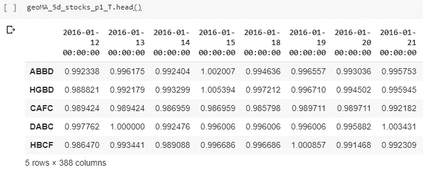

**用随机模拟增加数据**

我们将使用随机模拟来生成合成的几何移动平均线。目标不是精确地模拟回报，而是获得与真实数据行为相似的曲线。通过仅用模拟曲线训练模型，我们可以保留真实数据来获得预测。

使用几何布朗运动生成合成曲线。我们遵循以下步骤:

*   使用第一期数据框架，随机选择 100 个分笔成交点
*   对于每个选定的报价器，计算一个对数回报向量，如下所示:

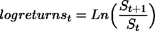

*   然后，对于选择的每个股票，我们将生成 100 条路径，这样:

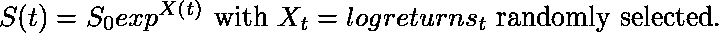

以下是模拟曲线和真实曲线的示例:

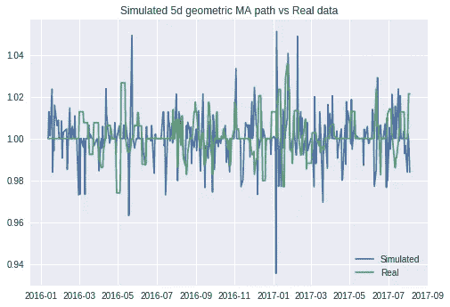

我们将 423 个时间序列的数据集扩展为 100*100 = 10，000 个与股票数据集相似(但不相等)的新时间序列。

这将允许我们保留实际的股票数据集用于预测，甚至不必使用它进行验证。

在建立 VAE 模型之前，创建训练集和测试集(使用 80%-20%的比率):

```
# Shuffle the generated curves
shuffled_array = np.random.permutation(sim_paths_matrix)# Split the simulated time series into a training and test set
x_train = shuffled_array[0:8000]
x_test = shuffled_array[8000:]
```

读者还应该注意，在训练模型之前，不需要删除时间序列的季节性和趋势。

**建立变分自动编码器(VAE)模型**

我们将使用变分自动编码器将具有 388 个项目的时间序列向量的维度降低到二维点。

自动编码器是用于压缩数据的无监督算法。它们由一个编码器、一个解码器和一个损失函数构成，以测量压缩和解压缩数据表示之间的信息损失。

我们的目标不是再写一篇关于 autoencoder 的文章。不熟悉自动编码器的读者可以在 [Keras 博客](https://blog.keras.io/building-autoencoders-in-keras.html)和 [*自动编码变分贝叶斯*论文](https://arxiv.org/abs/1312.6114)上阅读更多，作者是 Diederik Kingma 和 Max Welling。

我们将使用一个简单的 VAE 架构，类似于 Keras 博客[中描述的架构。](https://blog.keras.io/building-autoencoders-in-keras.html)

编码器型号具有:

1.  一个长度为 388 的输入向量
2.  一个长度为 300 的中间层，具有整流线性单元(ReLu)激活功能
3.  一个二维编码器。

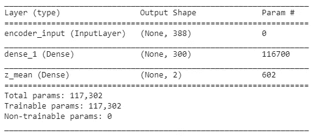

Encoder Model Summary

解码后的模型具有:

1.  一个二维输入向量(从潜在变量中取样)
2.  一个长度为 300 的中间层，具有整流线性单元(ReLu)激活功能
3.  具有 sigmoid 激活函数的长度为 388 的解码向量。

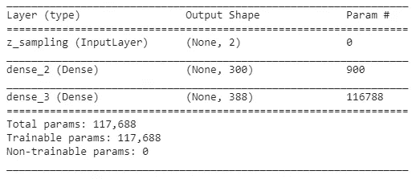

Decoder Model Summary

以下代码改编自 Keras team Github 上的[variable _ auto encoder . py](https://github.com/keras-team/keras/blob/master/examples/variational_autoencoder.py)。它用于构建和训练 VAE 模型。

训练后，我们绘制训练和验证损失曲线:

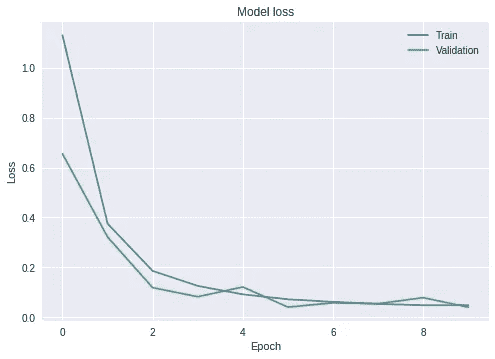

**获得预测**

我们将只使用编码器来获得预测。我们将使用一个实值矩阵，包括股票数据集和一个或多个感兴趣的时间序列。

在我们的项目中，我们针对在另一个国家以不同货币上市的近月期货合约测试了一个股票数据集。

```
# Obtaining the predictions:
encoded_p1 = encoder.predict(matrix_to_test_p1, batch_size=batch_size)# Convert the predictions into a dataframe
encoded_p1_df = pd.DataFrame(data = encoded_p1, columns = ['x','y'], index = dataframe_to_test_p1.T.index)
```

我们获得了以下结果:

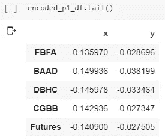

在绘制结果之前，我们必须:

1.  计算期货合约点和数据框架中所有其他股票之间的距离
2.  选择最接近期货合约的 50 品脱

```
# Calculate the distances between the futures contract point and all other points in the stocks datasetref_point = encoded_p1_df.loc['Futures'].values
encoded_p1_df['Distance'] = scipy.spatial.distance.cdist([ref_point], encoded_p1_df, metric='euclidean')[0]# Get the 50 closest points:
closest_points = encoded_p1_df.sort_values('Distance', ascending = True)
closest_points_top50 = closest_points.head(51)[1:] #We take head(51), because the Futures reference point is the first entry
closest_points_top50['Ticker'] = closest_points_top50.index
```

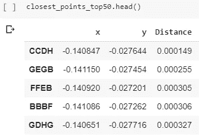

现在，我们可以绘制所获得的结果，以直观显示最接近的 50 只股票:

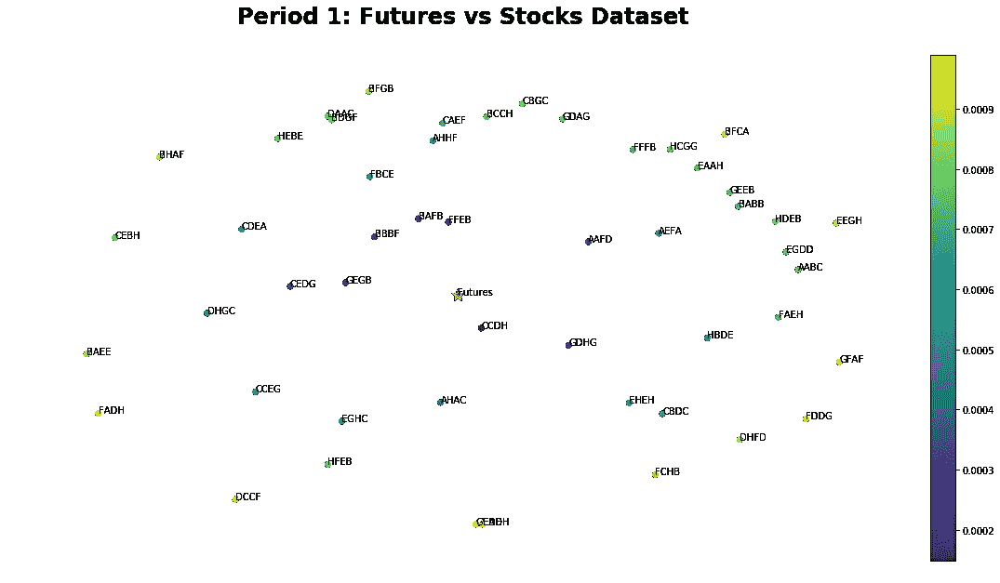

我们已经对另一个国家上市的期货合约进行了分析。然而，对于来自同一交易所的股票，可以遵循第 1 部分中的相同步骤。

## 第 2 部分:索引构建

让我们使用第 1 部分中获得的结果来创建一个索引。

由于 VAE 模型的随机性，我们不会在每次运行中获得相同的前 50 名股票的精确列表。为了获得最接近的 50 个点的公平表示，我们将运行 VAE 模型 10 次(每次运行时重新初始化和重新训练它)。然后，我们将采用每次运行中找到的 50 个最近点来创建长度为 500 的数据帧***closest _ points _ df***。

一旦建立了 ***最近点 _df*** 数据帧:

1.  按距离对点进行排序
2.  丢弃重复的代码，只保留第一个出现的代码

```
sorted_by_dist = results_df.sort_values('Distance', ascending = True)sorted_by_dist.drop_duplicates(subset='Ticker', keep='first', inplace = True)
```

删除重复的点后，我们将只保留 50 个最接近的点。

**计算每只股票的权重**

在指数构建中，股票权重是通过使用不同的方法计算的，如市场资本总额或股票价格。

相反，我们将计算每只股票的权重，这样最接近期货合约点的点将比远离期货合约点的点获得更高的权重。

**对于非匿名的股票数据，在计算股票权重之前过滤** **获得的结果非常重要。**离群值应剔除，市值范围应细化。

```
# Calculate the weights
top50 = sorted_by_dist.head(50).copy() # Keep the closest 50 points
top50['Weight'] = (1/top50['Distance'])/np.sum(1/top50['Distance'])
```

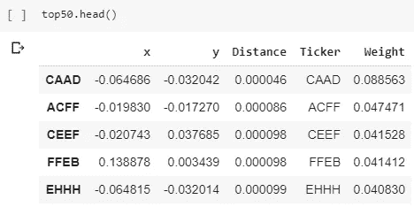

Sample of weights calculated

**计算每只股票的股数**

计算完权重后，我们计算每只股票在我们的自定义指数中的股份数。我们需要:

*   获取每只股票在 2016 年 1 月 4 日(周期 1 的第一天)的价格
*   定义净资产金额
*   计算股份的数量

```
#Get the stock prices on January 4th 2016jan4_2016_stockPrice = np.zeros(len(stock_data_top50.columns))
for i in range(len(jan4_2016_stockPrice)):
  if stock_data_top50.columns[i] == top50['Ticker'].iloc[i]:
    jan4_2016_stockPrice[i] = stock_data_top50[stock_data_top50.columns[i]].iloc[0]top50['Price Jan4_2016'] = jan4_2016_stockPrice
```

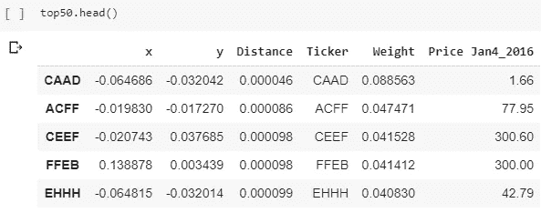

We add a column for the stock prices on January 4th, 2016

```
# We compute the number of sharesnet_assets = 10000000 # We chose net assets = 10 million (in the currency of the stock market)numShares = np.zeros(len(stock_data_top50.columns))
for i in range(len(jan4_2016_stockPrice)):
  if stock_data_top50.columns[i] == top50['Ticker'].iloc[i]:
    numShares[i] = int(net_assets*top50['Weight'].iloc[i]/top50['Price Jan4_2016'].iloc[i])

top50['numShares'] = numShares
```

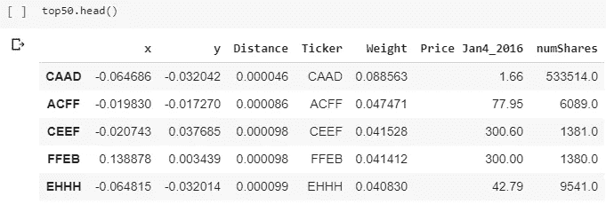

We add a column for the number of shares

**构建索引**

为了构建该指数，我们将使用[拉斯派尔斯指数](https://en.wikipedia.org/wiki/Price_index#Paasche_and_Laspeyres_price_indices)计算如下:

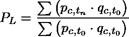

```
stock_index = np.zeros(len(stock_data_top50))for i in range(len(stock_data_top50)):
  sum_num = 0
  sum_denom = 0
  for j in range(len(stock_data_top50.columns)):
    sum_num = sum_num + stock_data_top50[stock_data_top50.columns[j]].iloc[i]*top50['numShares'].iloc[j]
    sum_denom = sum_denom + stock_data_top50[stock_data_top50.columns[j]].iloc[0]*top50['numShares'].iloc[j]
  stock_index[i] = sum_num /sum_denom# We arbitrarily start the index at 100
stock_index_df = pd.DataFrame(stock_index*100, columns =  ['stock_index'], index = stock_data_top50.index)
```

我们绘制了自定义索引:

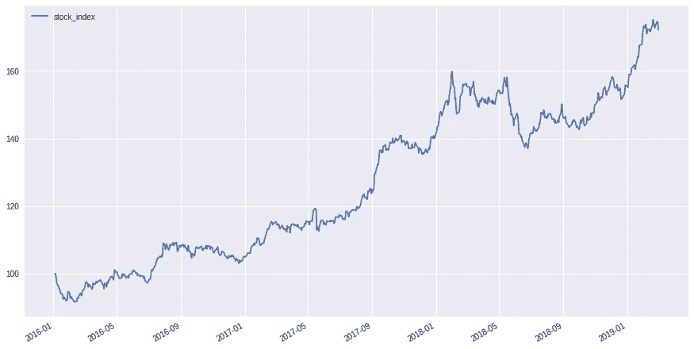

**比较我们的定制指数和期货时间序列**

我们必须缩放期货价格数据，以便将其绘制在与自定义指数相同的图表中。为此，我们必须:

*   计算期货价格数据的每日百分比变化
*   设置 S_0 = 100

```
# Calculate the percentage change
futures_data_stock_data_pct_change = futures_data_stock_data.pct_change()
futures_data_stock_data_pct_change.dropna(inplace = True)# Scale the time series
futures_theoretical = np.zeros(len(stock_index_df))
futures_theoretical[0] = stock_index_df.iloc[0]
for i in range(len(futures_theoretical)-1):
  futures_theoretical[i+1] = (1+futures_data_stock_data_pct_change.iloc[i])*futures_theoretical[i]
```

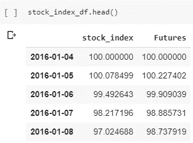

我们现在在同一张图中绘制两条曲线:

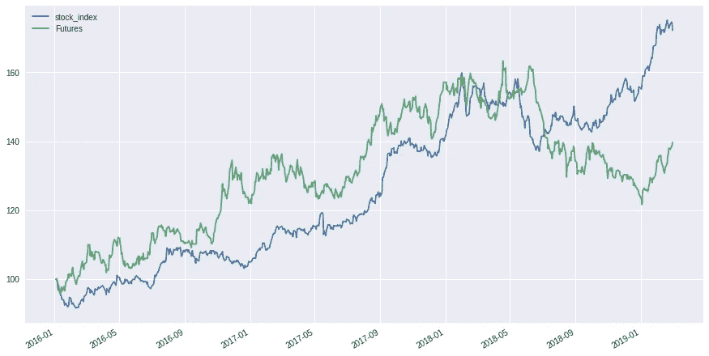

我们的指数除了 2018 年下半年之外，大部分趋势与参考期货时间序列相同。因为我们使用匿名数据，我们没有过滤股票的异常值和市值限制。此外，在观察到的两个时间段内没有重新平衡，我们忽略了分布。

如果识别出报价器并剔除异常值，自定义指数完全有可能跑赢期货指数。

我们鼓励我们的读者利用在线免费的 GPU 实例来创建他们自己的索引。这对我们来说是一个有趣的实验，我们发现了一些有趣的股票模式。

请随意下载 GitHub 上的两款笔记本:

1.  [3546 深度学习项目—数据处理. ipynb](https://github.com/MarieImokoyende/vae-dimRedFinance/blob/master/3546%20Deep%20Learning%20Project%20-%20Data%20Treatment.ipynb)
2.  [3546 深度学习项目— VAE &索引构建. ipynb](https://github.com/MarieImokoyende/vae-dimRedFinance/blob/master/3546%20Deep%20Learning%20Project%20-%20VAE%20_%20Index%20Construction.ipynb)

**结论**

使用可变自动编码器可以加快外国股票市场新指数的开发，即使分析师对它们并不熟悉。此外，可以创建利基指数或投资组合来满足客户的兴趣。

虽然这种方法可以用来创建 ETF，但我们相信它也可以为全球的直接指数和 Robo Advisors 公司创造新的投资机会。