# 具有生成重放的变分连续学习

> 原文：<https://towardsdatascience.com/variational-continual-learning-with-generative-replay-bfd43464d250?source=collection_archive---------24----------------------->

## *利用生成重放记忆进行持续学习的贝叶斯方法*

# 介绍

这篇博客文章解释了由 Cuong V. Nguyen，Yingzhen Li，Thang D. Bui，Richard E. Turner 在 2018 年 ICLR 会议上发表的论文“不断变化的学习”中提出的方法。本文使用变分推理的贝叶斯方法来解决连续学习问题。在第二部分中，我们提出了 Y. Gal 和 S. Farquhar 提出的“变分生成重放”方法，扩展了第一篇文章。

1.持续学习模型旨在从输入的数据流中学习。数据不断到达，并且数据分布随时间而变化(非平稳性)。成功的持续学习可以处理两件事:

*   应该从根据先前数据训练的先前模型执行迁移学习，以训练最新的模型
*   避免灾难性的遗忘。即最终的模型在旧的任务上应该仍然表现良好。

2.贝叶斯方法是一种机器学习的概率方法，它将关于模型参数的先验知识形式化，并对模型权重的分布进行建模。

# 变分连续学习理论

一般来说，在机器学习中，根据概率将判别模型定义为:

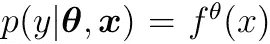

其中 f 属于由θ参数化的一类函数。例如，前馈神经网络执行分类(softmax 作为最后一层，θ作为权重和偏差)。

经典的贝叶斯方法通过权重值的分布来对权重建模。它还使用贝叶斯规则来利用θ分布的先验信念。

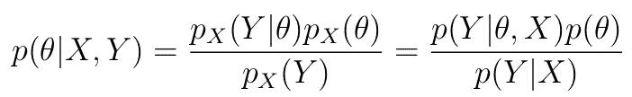

在持续学习的框架中，一个自然的想法是将最后的后验概率视为新任务的θ的最佳先验分布(来自新分布的新一批数据)。事实上，我们注意到:

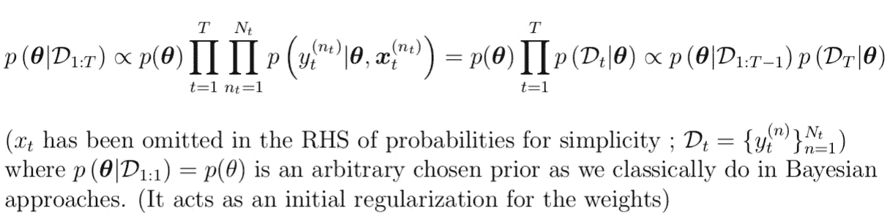

这是随时间推移的后验分布的递归公式。在前面的公式中，我们不关心通常难以处理的归一化因子的计算，因为我们要执行后验分布的近似。(因此有了比例符号)

在大多数情况下，后验分布是难以处理的。为了克服这个问题，我们可以用更简单的变分分布来近似后验分布

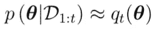

为了进行这种近似，我们考虑:

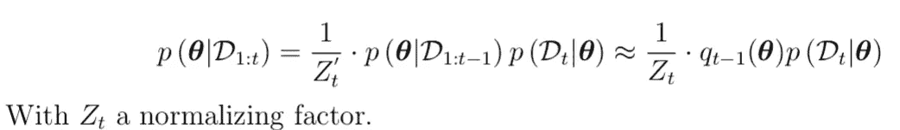

我们将通过一个更简单的分布来递归地近似后验概率:给定时间步长 t-1 的近似值，我们可以按照前面的公式计算时间步长 t 的近似值。这种方法叫做变分推理。我们正在寻找由一组参数(μVI，σVI)定义的近似分布(此处为高斯平均场),该分布与目标分布相匹配。通过拟合，我们意味着最小化两个分布之间的差异。通常，Kullback-Leibler 散度用于定义两个分布之间的差异。

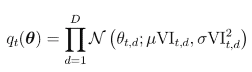

Gaussian mean-field approximation

因此，为了找到近似的变分后验概率，我们最小化下面的 Kullback-Leibler 散度。

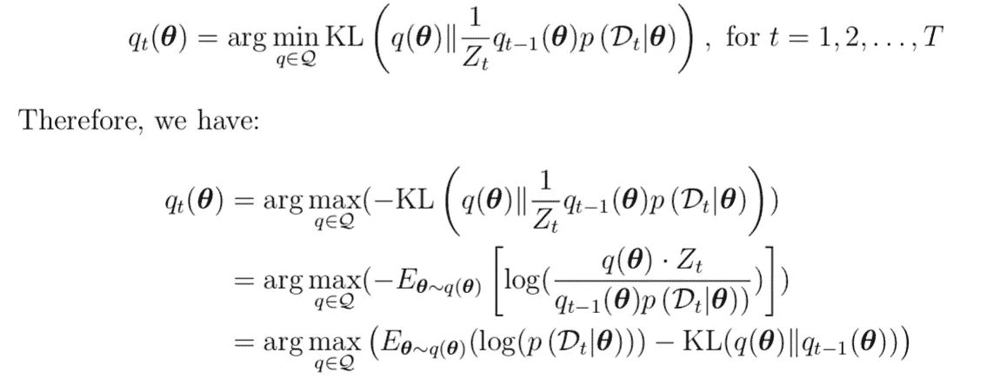

因此，我们将损失定义为:

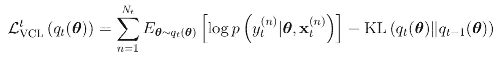

KL 项可以解析地计算为两个高斯函数之间的 Kullback-Leibler 散度。利用蒙特卡罗方法和重新参数化技巧，我们可以很容易地估计出期望的对数似然性:

*   假设很难评估期望值 E =**E***x∾p***【f(x)】**人们可以通过采样 x1，x2，..xN∞p 并得到 E 的近似值:

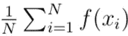

This estimator is unbiased but to reduce variance, it is better to use high N

*   从高斯分布中提取的θ的重新参数化技巧是独立于分布参数(μVI，σVI)重写θ的简单方法

因此，可以为可学习参数(μVI，σVI)计算损失函数的梯度，并且可以执行随机梯度下降。

为了在连续设置中改进学习，我们可以考虑多头架构。事实上，单头架构非常适合 i.i.d 实例或只有输入分布随时间变化的实例。多头架构能够利用任务之间的共享参数和为每个任务训练的特定头。

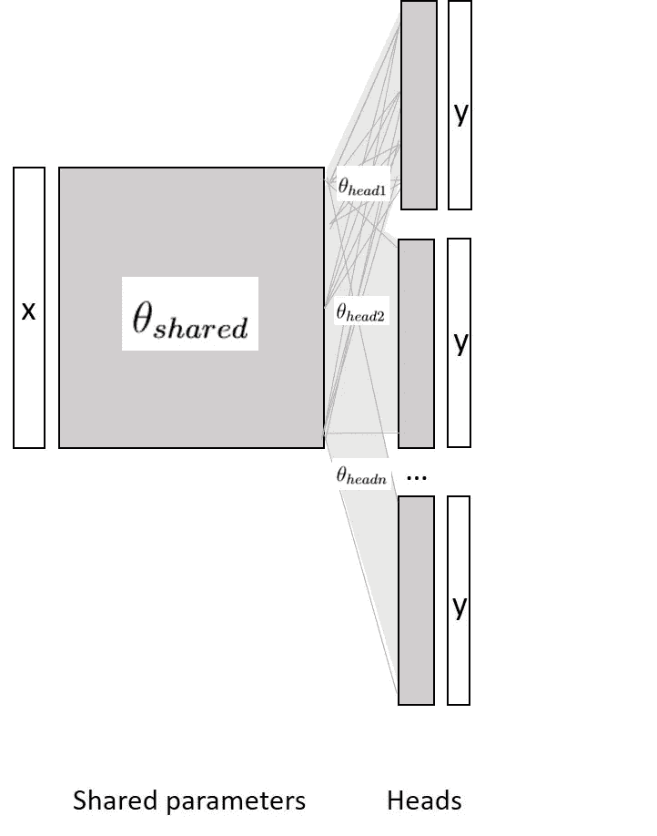

变分分布的递归近似可能影响模型性能，并触发灾难性遗忘。为了避免这种灾难性的遗忘，引入了核心集:训练数据的样本存储在核心集中(并从训练数据中移除)，并用于在预测之前改进后验近似。可以选择不同的技术来选择训练批次的子集。随机抽样是最简单的选择。可以执行 k-均值聚类来保持训练数据的有意义的子集:质心被选择放入核心集中。理论上，我们注意到:

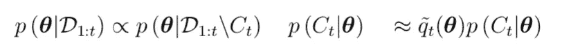

我们现在关注这个新的变分分布，它只在非核心集数据上训练。我们可以用类似的方式计算这些变分分布的递归公式:

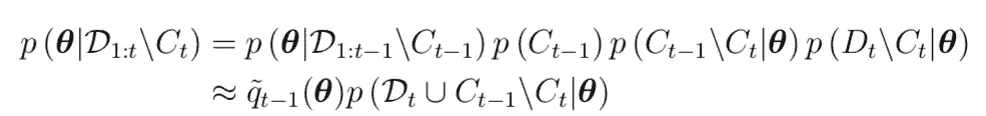

事实上，在实现中，他们从不从核心集中删除任何点。因此，公式变得更简单:

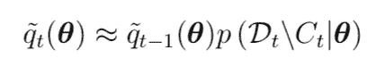

有趣的是，与本文提出的理论相反，与本文相关的原始实现并不是在进行预测之前对整个核心集进行训练，而是只对与测试任务相对应的核心集子集进行训练。因此，这是一种最后一分钟的培训，在持续学习的框架内并不真正令人满意。

我们总结了变分连续学习算法:

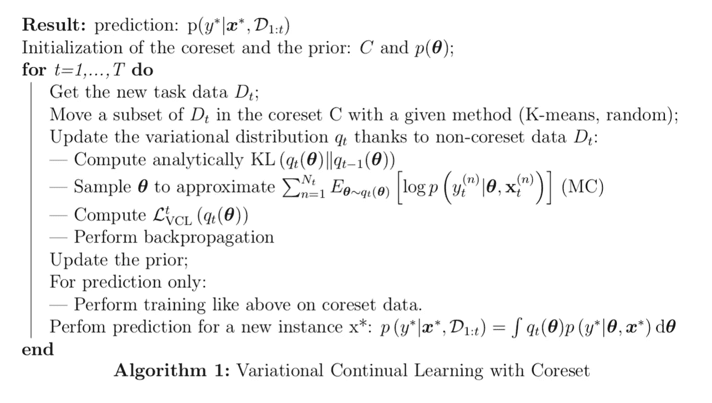

# 变分生成重放

在之前的一篇论文《深度生成重放(DGR)》(Shin et al .，2017)中，作者以一种完全不同的方式解决了持续学习的问题。他们在每项任务上训练生成对抗网络(GAN ),以便能够使用生成的 GAN 输出来确保后一项符合前一项任务的对数似然性。这种思想，在接下来的段落中称为似然聚焦连续学习，可以集成到称为先验聚焦连续学习的变分连续学习中(因为它聚焦于先验变分近似)。这种混合方法在 S. Farquhar 和 Y. Gal 最近撰写的论文《连续学习的统一贝叶斯观点》[2019]中被称为变分生成重放。让我们回顾一下这些方法背后的理论:

## 以前为重点的持续学习:

这是在《不断变化的学习》一文中提出的方法。这种方法侧重于任务间的迁移学习，这要归功于先前对从先前任务中学习到的权重的信念。

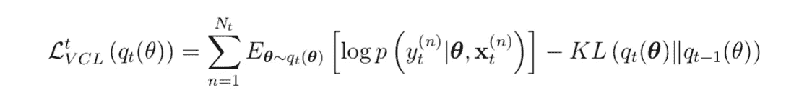

它可以被解释为用概率分布加权的模型集合，该概率分布是从关于它的先验信念正则化的。时间步长 t 的先验置信是在时间步长 t-1 计算的后验置信。

## 注重可能性的持续学习:

这是深度生成重放(DGR)一文中提出的方法。这种方法试图确保后验概率符合所有以前看到的数据的可能性，使用以前任务中训练的 GANs 生成的数据。实际上，这个想法是要符合以下棘手的损失函数(因为我们不能直接访问以前看到的数据):

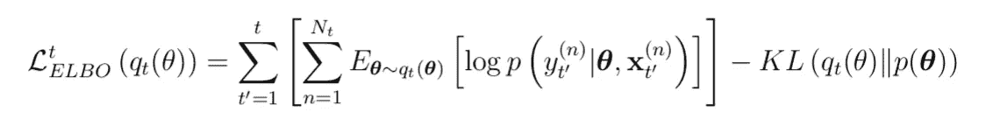

因此，进行了以下近似，为先前的任务引入了生成模型 pt′(x，y)

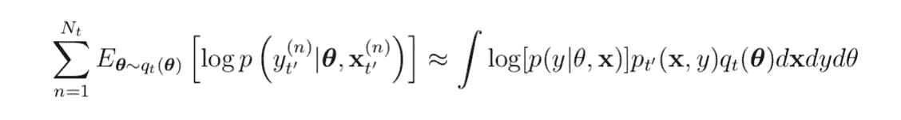

## 变化生成重放的连续学习；

这种方法是在《持续学习的统一贝叶斯观点》一文中发展起来的。它混合了以先验为重点的持续学习方法和以可能性为重点的持续学习方法:

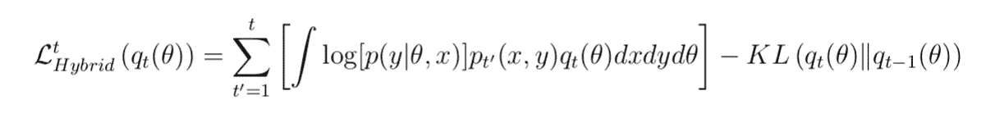

基本上，变分生成重放在实现中取代了核心集，是一种新的记忆形式。

# 结论

总之，具有生成重放的变分连续学习是一种使用来自贝叶斯深度学习和生成对抗网络的工具来实现连续学习的新途径。它可以被看作是一种人类启发的方法，我们在以前的任务基础上建立的先验知识被用来执行新的任务。此外，深度生殖重播有时被比作梦，当人类提醒自己过去的行为以进一步学习时。然而，使用这种新方法，所需的内存随着任务的数量而线性增长，这对于一般的连续学习模型来说可能是不令人满意的。

代码可在[https://github.com/pihey1995/VariationalContinualLearning](https://github.com/pihey1995/VariationalContinualLearning.git)获得

C.阮，李，裴东光，特纳。不断变化的学习。ICLR (2018 年)。

南法夸尔和 y .高尔。持续学习的统一贝叶斯观点(2019)。

韩 ul Shin、Jung Kwon Lee、Jaehong Kim、Jiwon Kim 深度生殖重播(DGR) (2017 年)