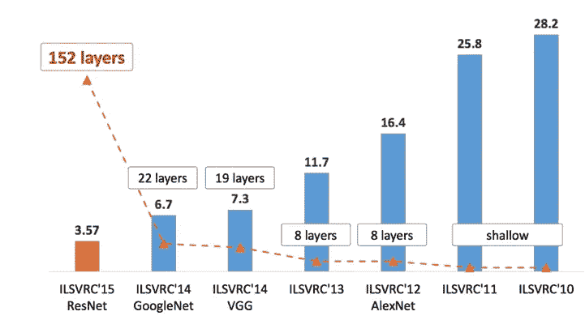
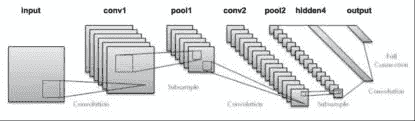
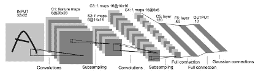
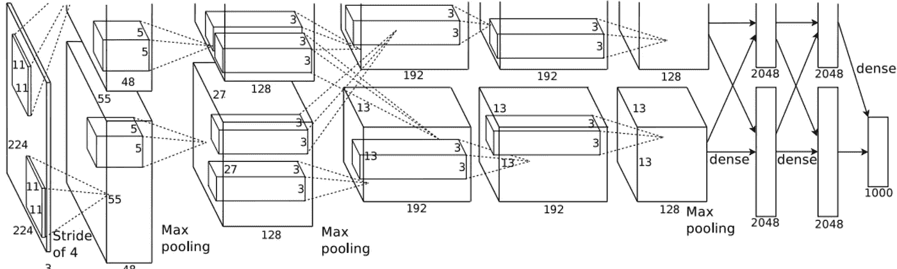
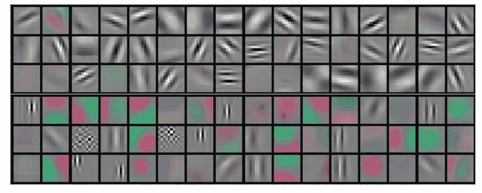
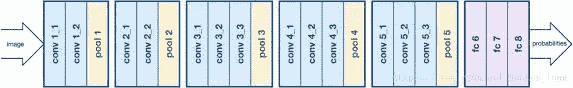
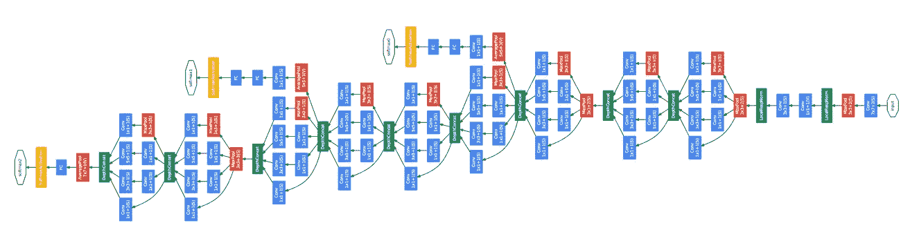
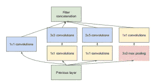
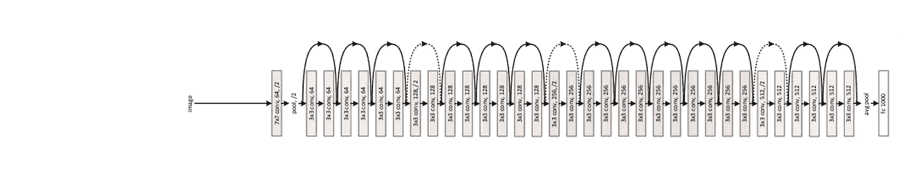
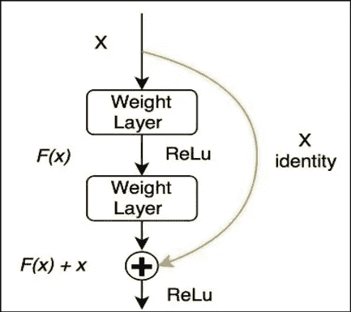

# 各种类型的卷积神经网络

> 原文：<https://towardsdatascience.com/various-types-of-convolutional-neural-network-8b00c9a08a1b?source=collection_archive---------7----------------------->

该帖子将出现在 CNN 的各种**类型**上，在图像处理和物体识别的各个领域中成功设计并实现。如果你对卷积神经网络有所了解会更好。
你可能听说过 [**ImageNet**](http://www.image-net.org/) 。这是一个大型的有组织的视觉图像数据库，供研究人员和开发人员用来训练他们的模型。现在，他们主办了一年一度的竞赛，名为 [ImageNet 大规模视觉识别挑战赛(ILSVRC)](http://www.image-net.org/challenges/LSVRC/)——一场与大规模物体检测和图像分类相关的竞赛。一般来说，这场比赛中表现最好的选手能够在物体分类领域设定一个基准。这份各种建筑的列表，在他们的设计中是独一无二的，在这场竞赛中获得了最高的位置，并且正在成功地应用于各种任务中。
**注意:除非另有说明，这些网络都实现了*同填充*，实质上保留了图像卷积后的原始大小。**
让我们看看它们:

# LeNet:

LeNet Architecture.

没有这一点，就不能开始讨论有线电视新闻网的架构。就对象分类而言，这是一个开创性的算法，是同类算法中的第一个，也是有能力的。**最初接受 MNIST 数据集 0-9 手写数字分类的训练**。它由 7 层组成，均由可训练参数组成。它采用 32 X 32 像素的图像，相对于训练网络的数据集内的图像，其尺寸相对较大。应用的激活功能为 **RELU** 功能。这些层按以下方式排列:

LeNet Architecture, but with more details.

1.  **第一卷积层**由 **6 个尺寸为**5 X 5**的滤波器**和 1 个的**步长组成。**
2.  **第二层**为**尺寸 2×2**的**亚取样**或**平均汇集**层，2 的**步距。**
3.  **第三层**也是**卷积层**，由 **16 个 5×5**尺寸的滤波器和**1 步长的滤波器组成。**
4.  **第四层**同样是**平均汇集层**的**尺寸为 2×2**和**跨距为 2。**
5.  **第五层**将*第四层* ( **400 参数**)的输出连接到 **120 节点的**全连接层**。**
6.  **第六层**是一个类似的**全连接层，由 **84 个节点**组成**，从*第五层的 120 个节点的输出中导出。*
7.  **第七层(，或最后一层)**包括**将最后一层的输出分类成 10 类，与它最初被训练分类的 10 位数字**相关。

它是当时实现的对手写数字进行分类的成功的数字识别算法之一。今天，在数据集上实现这种架构，使用各种库，可以获得大约 98.9 %的准确率。然而，当涉及到处理大尺寸图像和在大量类别的对象中进行分类时，该网络在计算成本或准确性方面不能有效地工作。

[链接到论文。](http://yann.lecun.com/exdb/publis/pdf/lecun-01a.pdf)

# AlexNet:

AlexNet Architecture

ImageNet ILSVRC-2012 竞赛的**获胜者 AlexNet 由 **Alex Krizhevsky、Ilya Sutskever 和 Geoffery E. Hinton** 设计。它能够将**前五名的错误率降低到 15.3 %** ，而该比赛亚军的错误率为 26.2%。该网络类似于 LeNet 架构，但与原始 LeNet 相比具有大量过滤器，因此能够在一大类对象中进行分类。此外，它使用“退出”而不是正则化来处理过度拟合。(退出实质上减少了在训练/学习过程中要考虑的参数数量的大小)。简而言之，让我们来定义这些层。**

它输入一个尺寸为 **224 X 224** 的颜色 **(RGB)** 图像。

1.  首先，尺寸为 11×11 且步距为 4 的 **96 个滤波器的**卷积层(CL)** 。**
2.  接下来，一个 **Max-Pooling Layer (M-PL)** 的**过滤器大小为 3 X 3，跨距= 2。**
3.  同样，256 的一个 **CL 过滤**大小为 5×5 且跨距= 4 的**。**
4.  然后，一个 **M-PL 的滤镜大小为 3×3，步幅= 2。**
5.  同样，384 个尺寸为 3×3 且跨距= 4 的滤波器的 **CL。**
6.  同样，384 个尺寸为 3×3 且跨距= 4 的滤波器的 **CL。**
7.  同样，256 个大小为 3×3 且跨距= 4 的滤波器的 **CL。**
8.  然后，滤波器大小为 3×3 并且跨距= 2 的一个 **M-Pl。**
9.  当最后一层的输出被转换成输入层时，像对于由 9261 个节点组成的全连接块一样， ***全连接*到具有 4096 个节点的隐藏层。**
10.  第一隐藏层再次 ***完全连接*到由 4096 个节点组成的另一隐藏层。**
11.  最后一个隐藏层 ***完全连接*到输出层，实现 1000 个节点的“softmax 回归”。**

现在，我所写的可能看起来与第一张图片(原始图片)中所示的架构大相径庭。仔细查看，对于两个管道(或两个部分)，**在每个块输出中添加**它们的通道号，并查看它是否与描述相匹配。造成这种差异的原因是 AlexNet 同时在**两个 Nvidia GeForce GTX 580 GPU**上进行训练，导致了架构的这两条流水线。
这个网络有**6230 万个参数**，需要**十亿个计算单元**。这种巨大的计算成本导致在多个 GPU 上同时训练该架构以加速该过程。最初的网络只在两个 GPU 上训练。
**他们从网络中获得的一个有趣的结果**是在分析了来自两个 GPU 的第一个卷积块的滤波器之后。他们发现，一个生成高频灰度特征，另一个生成低频颜色特征。

Visualization of few layers at the beginning of the AlexNet model.

[链接到论文。](https://papers.nips.cc/paper/4824-imagenet-classification-with-deep-convolutional-neural-networks.pdf)

# VGGNet 16:

这个特殊的网络架构是由 **Simonyan 和 Zisserman** 设计的 **ILSVRC-2014** 竞赛的**亚军**。很容易达到 5.1% 的**前五名错误率。虽然这看起来很复杂，需要考虑一大堆参数，但实际上非常简单。当谈到特征提取时，开发人员非常喜欢它，因为它遵循简单的模式。关于卷积层和汇集层的过滤器尺寸和步距的基本*超参数*是恒定的:**卷积层**具有尺寸为 3×3**的**过滤器和**步距= 1** ，而**最大汇集层**具有尺寸为 2×2**的**过滤器和**步距= 2** 。这些层以特定的顺序应用于整个网络。只有为每个*卷积块*定义的滤波器数量不同。让我们来看看:**

The VGG16 Network Architecture.

它接收 224 X 224 尺寸的彩色(RGB)图像。

1.  **64 个滤波器的卷积层(CL)。**
2.  **CL 64 的再次过滤。**
3.  **最大池层(M-PL)**
4.  **128 个过滤器的 CL。**
5.  **CL 128 的再次过滤。**
6.  M-PL。
7.  **256 个过滤器的 CL。**
8.  **CL 256 的再次过滤。**
9.  **CL 256 的再次过滤。**
10.  **M-PL。**
11.  **CL 512 过滤器。**
12.  **CL 512 的再次过滤。**
13.  **CL 512 的再次过滤。**
14.  **M-PL。**
15.  **CL 512 过滤器。**
16.  **CL 512 的再次过滤。**
17.  **CL 512 的再次过滤。**
18.  **M-PL。**
19.  最后一个池层的输出被送入由 4096 个节点组成的 ***全连接*隐藏层。**
20.  这是**再次*完全连接*到另一个同样由 4096 个节点组成的隐藏层。**
21.  这是 *f* ***完全连接*到实现“softmax 回归”的输出层，在 1000 类对象中分类。**

那有很多层。因此，它有将近 1 . 4 亿个参数需要处理，这使得实现这个网络的任务充满挑战。然而，预先训练的 VGGNet 的权重很容易获得，并且可以由开发人员在他们的项目中使用。

[链接到论文。](https://arxiv.org/pdf/1409.1556)

# GoogleNet / Inception:

Inception Network Architecture

**GoogleNet 或盗梦空间网络**是 ILSVRC 2014 竞赛的**冠军，取得了 6.67%** 的**前五名错误率，几乎等同于人类水平的表现，太棒了！该模型由谷歌开发，包括原始 LeNet 架构的一个更智能的实现。这是基于先启模块的思想。
这些模块背后的基本思想是，我们不是在不同的层中实现各种超参数的卷积层，而是一起进行所有的卷积，以输出包含来自所有滤波器操作的矩阵的结果。这是一个简单 inception 模块的图像，其中各种卷积层一起实现:**

The Inception module.

级联输出由所有卷积运算的结果组成。请注意，实现了一个包含大小为 1 X 1 的滤波器的卷积层。这减小了图像的大小，在该图像上应用了包含大小为 5×5 的滤波器的另一个卷积层。这背后的原因是，计算单元的总数**在很大程度上减少了**。
比如，当一只 **Conv。32 层大小为 5×5 的滤波器**被应用于某层**的输出矩阵，其尺寸为 28×28×192**。因此，总计算次数为**28×28×32(输出矩阵大小)* 5×5×192(权重矩阵大小)****= 1.2 亿(接近)**。
而若一个 **Conv。在实施 Conv 之前，首先应用大小为 1 X 1** 的 16 个过滤器层。大小为 5×5 的 32 个滤波器的层，矩阵的**大小减小到**28×28×16**，然后进行第二次卷积。
因此总计算次数= {**28×28×16(第一 conv 层的输出)* 1×1×192(第一 conv 层的权重矩阵的大小)**}+{**28×28×32(第二 conv 层的输出)* 5×5×16(第二 conv 层的权重矩阵的大小)**}
=**240 万+1000 万(接近)**因此，总成本降低了。
上面显示的 inception 模块(图片很难查看，但是相信我，我没有发现更好的图片可以有更清晰的细节)，是这个网络的**构建模块**。仔细看看盗梦空间网络图像。这是一个由许多块*开始块*组成的堆栈，在一些块之间有一些 Max-Pooling 层来改变图像的尺寸。**最后一层是*全连接*网络层**，后面是**“soft max 回归”，用于输出层**中的分类。**

[链接到论文。](https://arxiv.org/pdf/1409.4842)

# ResNets:

A 34-layer deep ResNet Architecture

大概是在 AlexNet 之后，CNN 架构开发领域最具开创性的发展发生在 **ResNet 或者残余网络**身上。这是基于“*跳过连接*”的**思想，并实现了**重批量标准化**，这有助于它有效地训练数千层，而不会降低长期性能。随着对更深层次网络的训练，问题出现了。**“消失梯度”**的问题，当梯度被反向传播时，重复的乘法操作使得梯度无限小。这导致性能下降。(看一看反向传播和梯度下降，以便清楚地了解在训练阶段实际发生了什么。)
这个架构中注入的思想是“*身份快捷连接*”，这意味着将一些层的结果转移到一些更深的层，跳过中间的一些其他层。这张图片可能有助于你理解这个想法:**

The skip-connection in ResNet models.

**其背后的直觉是，较深的层不应该比其较浅的对应层产生更高的训练错误。跳过连接就是为了实现这个想法。该网络的开发人员实现了残差块的预激活变体，其中梯度可以通过快捷方式连接到早期层，从而减少“消失梯度”问题。希望这个图像能够解释它自己。这个 **1001 层深度 ResNet** 实现了**3.57%**的前 5 名错误率，在数据集上实际上击败了人类水平的性能。尽管它有很深的网络，但它提供了比大多数 VGGNet 架构更好的性能。它**囊括了 2015 年 ILSVRC 在分类、检测和定位领域的所有奖项**。**

希望你喜欢读它。请评论，如果有任何错误或错误的信息从我这边提供。欢迎任何形式的建议。

[链接到论文。](https://arxiv.org/abs/1512.03385)

长命百岁，编码。