# 基于 VAR & VECM 的时间序列分析:统计方法

> 原文：<https://towardsdatascience.com/vector-autoregressions-vector-error-correction-multivariate-model-a69daf6ab618?source=collection_archive---------0----------------------->

## 股票市场数据的案例研究

## 时间序列随机数据建模

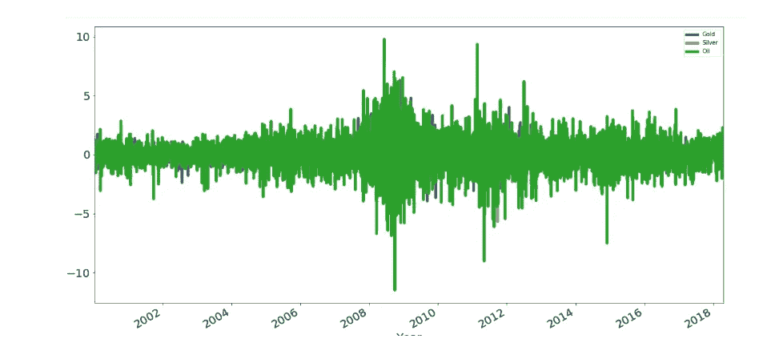

Image by author

[https://sarit-maitra.medium.com/membership](https://sarit-maitra.medium.com/membership)

V **ECTOR** 自回归(VAR)集成模型包含多个时间序列，是一种非常有用的预测工具。它可以被认为是自回归(ARIMA 的 AR 部分)模型的延伸。VAR 模型涉及多个独立变量，因此有多个方程。每个方程使用所有变量的滞后和可能的确定性趋势作为解释变量。VAR 的时间序列模型通常是基于将 VAR 应用于平稳序列，并对原始序列进行一阶差分，因此，总有可能丢失关于积分序列之间关系的信息。

因此，对序列进行差分以使其稳定是一种解决方案，但代价是忽略了级别之间可能重要的(*“长期”*)关系。一个更好的解决方案是检验回归水平是否可信。)通常的做法是用 Johansen 的方法来检验是否存在协整。如果答案为“是”，则可以估计结合了级别和差异的***【VECM】***向量误差校正模型，而不是级别中的 VAR。因此，我们将检查 VECM 是否能够超越我们现有系列的 VAR。

*这是我以前发表的* [*文章*](/granger-causality-and-vector-auto-regressive-model-for-time-series-forecasting-3226a64889a6?source=friends_link&sk=af3ee87ac5cac7dc52bcf551d9fcaa88) *的延伸。*

## 加载所有数据集(黄金、白银和原油)

经过必要的清理和预处理(用以前的值填充丢失的值)，我们最终有了三个时间序列用于必要的分析。

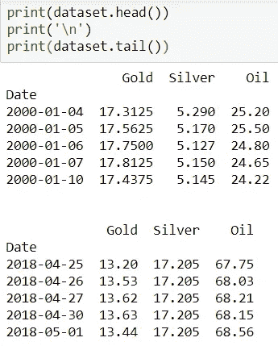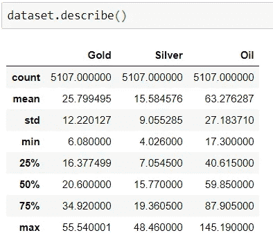

快速测试是检查数据是否是随机的。随机数据在滞后图上不会显示出结构。

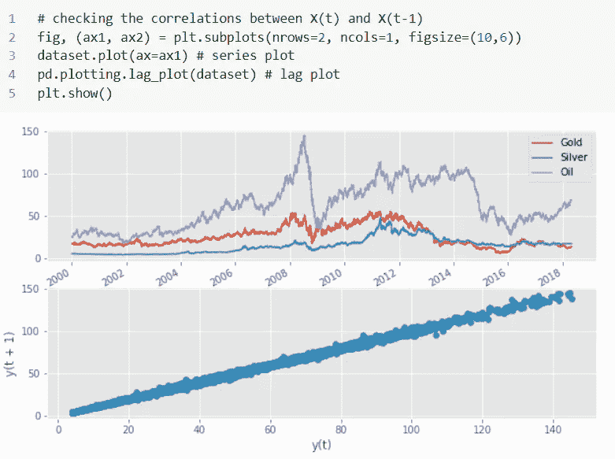

时间序列图清楚地表明了序列之间的某种关系。滞后曲线的线性形状表明 ar 模型是更好的选择。我们也没有在数据中看到任何异常值。这里的数据显示线性模式，表明正自相关的存在。

> 经济数据的时间序列通常是随机的，或者具有不稳定的趋势，这意味着数据有一个根单位

```
# plots the autocorrelation plots at 75 lags
for i in dataset:
 plot_acf(dataset[i], lags = 50)
 plt.title(‘ACF for %s’ % i) 
 plt.show()
```


## 平稳性检查

```
def augmented_dickey_fuller_statistics(time_series):
  result = adfuller(time_series.values)
  print('ADF Statistic: %f' % result[0])
  print('p-value: %f' % result[1])
  print('Critical Values:')
for key, value in result[4].items():
  print('\t%s: %.3f' % (key, value))
```

通过上面的函数，我们可以对所有列进行增广的 Dickey Fuller (ADF)检验，这清楚地表明原始序列是非平稳的并且包含单位根。

```
print('Augmented Dickey-Fuller Test: Gold Price Time Series')
augmented_dickey_fuller_statistics(X_train['Gold'])
print('Augmented Dickey-Fuller Test: Silver Price Time Series')
augmented_dickey_fuller_statistics(X_train['Silver'])print('Augmente
d Dickey-Fuller Test: Oil Price Time Series')
augmented_dickey_fuller_statistics(X_train['Oil'])
```


# 向量自回归模型

VAR 模型还可以用来分析使用格兰杰因果关系检验所涉及的变量之间的关系。格兰杰因果关系表明，如果 y1t 中的信息有助于改善 y2t 的预测，则变量 y1t 是变量 y2t 的因果关系。

格兰杰因果检验试图确定一个变量(x1)是否可以作为另一个变量(x2)的预测值，而另一个变量的过去值可能有帮助，也可能没有帮助。这意味着 x1 的解释超越了 x2 过去的值。这里有两个重要的假设-

*   x1 和 x2 都是静止的
*   它们的当前值和过去值之间存在线性关系。

这意味着，如果 x1 和 x2 是非平稳的，我们必须在检验格兰杰因果关系之前使它们平稳。

## 将序列拆分为训练和测试数据

我们将在 X_train 上拟合 VAR 模型，以预测接下来的 10 个观测值。这些预测将与测试数据(X_test)中的实际值进行比较。我们将使用多种预测准确性指标。

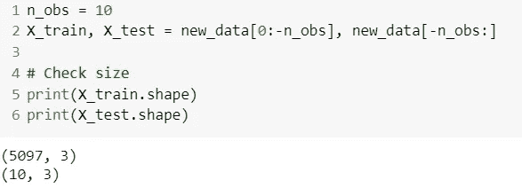

## 级数变换

差分变换是从时间序列中去除系统结构的一种简单方法。我们将通过从序列中的每个值减去前一个值来移除趋势，这是一阶差分。为了简单起见，我们将做一阶差分或季节差分。

如果我们对 n 个时间序列进行积分排序，并且如果我们对差值和时间进行一次排序，我们将得到 0 个序列积分排序。

```
X_train_log = np.log(X_train)
X_train_log_diff =(X_train_log).diff().dropna()
X_train_log_diff.describe()
```

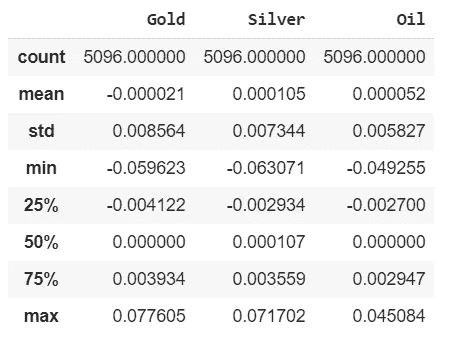

查看该图，我们可以发现数据集看起来是标准化的

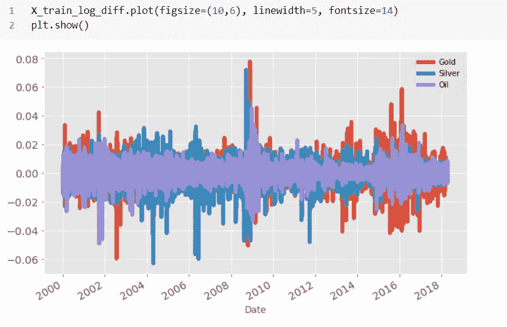

## 变换序列的自相关函数分析

下面的函数绘制了每只股票的价格与前一个交易日的价格相差 75°的自相关图。

```
fig, ax = plt.subplots(1,2, figsize=(10,5)) 
ax[0] = plot_acf(X_train_log_diff['Gold'], ax=ax[0])
ax[1] = plot_pacf(X_train_log_diff['Gold'], ax=ax[1])
```

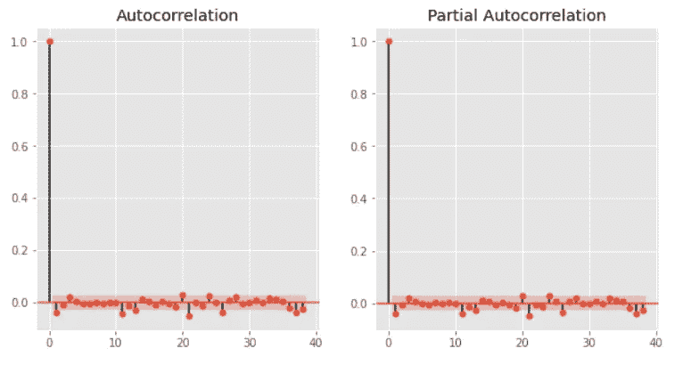

我们已经展示了 ACF & PACF 的变形金系列；同样，也可以绘制其他系列。

## ADF 测试转换系列

```
print('Augmented Dickey-Fuller Test: Gold Price Time Series')
augmented_dickey_fuller_statistics(X_train_log_diff['Gold'])
print('Augmented Dickey-Fuller Test: Silver Price Time Series')
augmented_dickey_fuller_statistics(X_train_log_diff['Silver'])
print('Augmented Dickey-Fuller Test: Oil Price Time Series')
augmented_dickey_fuller_statistics(X_train_log_diff['Oil'])
Augmented Dickey-Fuller Test on "Oil" 
```


# 格兰杰因果检验

格兰杰因果检验用于确定一个时间序列是否有助于预测另一个时间序列。如果通常通过对 *X* 的滞后值(也包括 *Y* 的滞后值)的一系列 t-检验和 f 检验可以表明，那些 *X* 值提供了关于 *Y* 的未来值的统计上有意义的信息，则称时间序列 *X* 为格兰杰原因 *Y* 。

## 多变量分析

这里，对于多变量格兰杰因果关系分析，通过对时间序列拟合一个 VAR 来进行。考虑下面是一个 d 维多元时间序列—


格兰杰因果关系是通过拟合具有 L 个时滞的风险值模型来实现的，如下所示:


其中ε ( t)是白高斯随机向量，τ是每个τ的矩阵。一个时间序列 X i 称为另一个时间序列 Xi 的格兰杰原因，如果τ = 1，…，L 中至少有一个元素 A τ ( j，I)显著大于零。

```
print(grangercausalitytests(X_train_log_diff[['Gold','Silver']], maxlag=15, addconst=True, verbose=True))
print(grangercausalitytests(X_train_log_diff[['Gold','Oil']], maxlag=15, addconst=True, verbose=True))
print(grangercausalitytests(X_train_log_diff[['Oil','Silver']], maxlag=15, addconst=True, verbose=True))
```

下面显示了黄金和石油的产量，这与滞后 4 之前的测试假设不同。

VAR(p)过程的基本形式是:


这里 yt 表示一个向量中收集的一组变量，c 表示一个常数向量，a 是自回归系数矩阵， *e* *t* 是白噪声。由于 a 的参数是未知的，我们必须估计这些参数。模型中的每个变量都有一个方程。每个变量的当前(时间 *t* )观察值取决于其自身的滞后值以及 VAR 中每个其他变量的滞后值。

# 滞后订单选择

我已经通过 VAR (p)实现了 Akaike 的信息标准(AIC ),以确定滞后订单值。在 fit 函数中，我已经传递了最大数量的滞后和用于订单选择的订单标准。

```
#Initiate VAR model
model = VAR(endog=X_train_log_diff)
res = model.select_order(15)
res.summary()
```

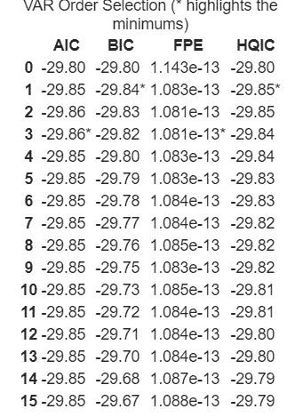

```
#Fit to a VAR model
model_fit = model.fit(maxlags=3)
#Print a summary of the model results
model_fit.summary()
```

## 预测 VAR 模型

预测是根据模型使用的训练数据生成的。

```
# Get the lag order
lag_order = model_fit.k_ar
print(lag_order)# Input data for forecasting
input_data = X_train_log_diff.values[-lag_order:]
print(input_data)# forecasting
pred = model_fit.forecast(y=input_data, steps=nobs)
pred = (pd.DataFrame(pred, index=X_test.index, columns=X_test.columns + '_pred'))
print(pred)
```

## 逆变换

因此，要将其恢复到原始比例，我们需要对原始输入数据进行去差分。我们的数据是第一次对数转换，然后差分。因此，为了求逆，我们必须首先使用累积和去微分，然后使用指数。自然对数是 exp()的倒数。

```
# inverting transformation
def invert_transformation(X_train, pred_df):
  forecast = pred.copy()
  columns = X_train.columns
for col in columns:
  forecast[str(col)+'_pred'] = X_train[col].iloc[-1] + forecast[str(col) +'_pred'].cumsum()
  return forecastoutput = invert_transformation(X_train, pred)
print(output)output_original = np.exp(output)
print(output_original)
```

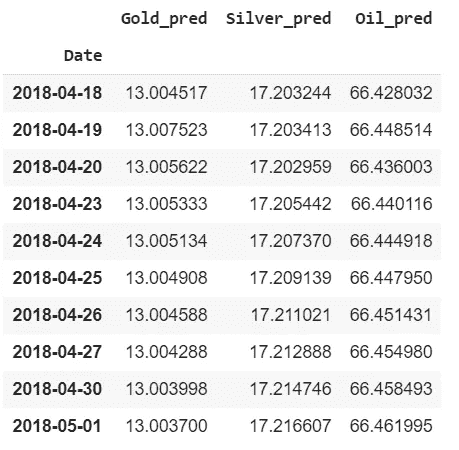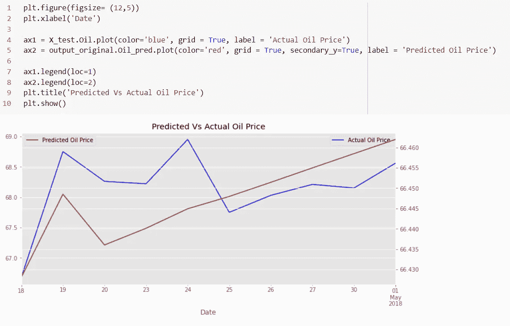

## VAR 预测评估

```
#Calculate forecast bias
forecast_errors = [X_test['Oil'][i]- output_original['Oil_pred'][i] for i in range(len(X_test['Oil']))]
bias = sum(forecast_errors) * 1.0/len(X_test['Oil'])
print('Bias: %f' % bias)#Calculate mean absolute error
mae = mean_absolute_error(X_test['Oil'],output_original['Oil_pred'])
print('MAE: %f' % mae)#Calculate mean squared error and root mean squared error
mse = mean_squared_error(X_test['Oil'], output_original['Oil_pred'])
print('MSE: %f' % mse)
rmse = sqrt(mse)
print('RMSE: %f' % rmse)
```


> “众所周知，当数据相当持久时，动态回归模型的最小二乘参数估计在小样本中会表现出相当大的偏差”

# VECM 估计和分析

由于存在非平稳但协整的数据形式，VECM 施加了额外的限制。它将协整限制信息应用到其规范中。在协整已知后，下一步的检验过程是通过使用误差修正方法来完成的。通过向量误差修正模型，我们可以解释长期和短期方程。我们需要确定协整关系的数量。VECM 相对于 VAR 的优势在于，从 VECM 表示得到的 VAR 具有更有效的系数估计。

## Johansen 协整

为了拟合向量误差修正模型，我们需要使用 VEC 秩检验来确定协整关系的数量。

```
vec_rank1 = vecm.select_coint_rank(X_train, det_order = 1, k_ar_diff = 1, method = 'trace', signif=0.01)
print(vec_rank.summary())
```


我们在第三列中找到λtrace 统计数据，以及相应的临界值。测试统计值 38.25 低于临界值(41.08)，因此至多一个协整合向量的零不能被拒绝。

让我们采用另一种统计，最大特征值统计(λmax)。

```
vec_rank2 = vecm.select_coint_rank(X_train, det_order = 1, k_ar_diff = 1, method = 'maxeig', signif=0.01)
print(vec_rank2.summary())
```


测试输出报告了λmax 统计信息的结果，该统计信息与 trace 统计信息相差不大；临界值(29.28)仍然高于测试统计值。

我们仍将继续估计 VECM，因为在缺乏协整的情况下，它对短期动态仍有价值。让我们用 9 个滞后、1 个协整关系和协整关系中的一个常数来估计价格的向量误差修正模型。我使用了*【慈利】**【ci】——协整关系*中的常数和*【李】——协整关系*中的线性趋势的组合

```
vecm = VECM(endog = X_train, k_ar_diff = 9, coint_rank = 3, deterministic = ‘ci’)
vecm_fit = vecm.fit()
vecm_fit.predict(steps=10)
```

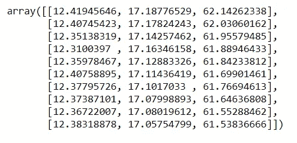

```
forecast, lower, upper = vecm_fit.predict(10, 0.05)
print(“lower bounds of confidence intervals:”)
print(lower.round(3))
print(“\npoint forecasts:”)
print(forecast.round(3))
print(“\nupper bounds of confidence intervals:”)
print(upper.round(3))
```

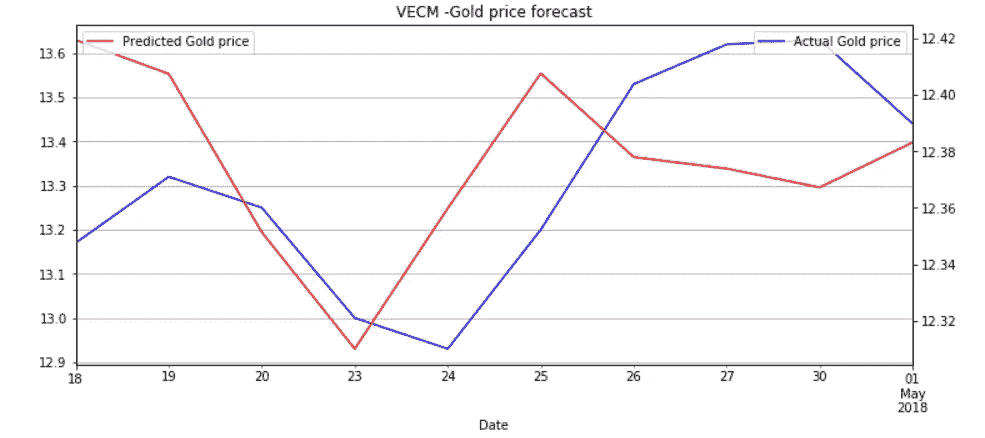

## VECM 预测评估

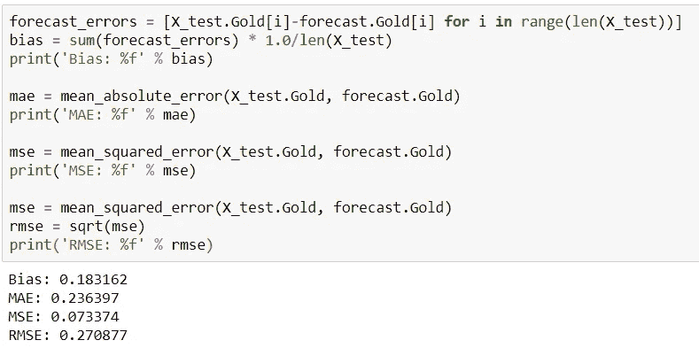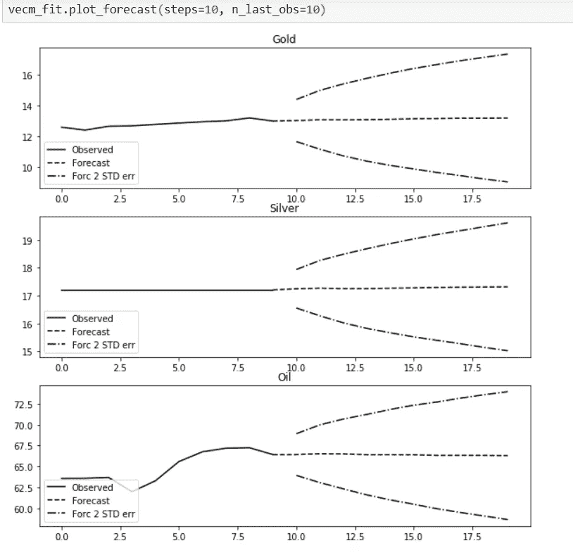

虽然我们有迹象表明，VAR 将是我们的价格预测数据集的最佳选择；然而，我们出于实验和说明目的展示了 VECM。这是一个解释 VAR 的简单程序。然而，如果我们能够看到一个变量的冲击如何在随后的时期影响其他变量，也可以将脉冲响应分析和方差分解等其他程序引入实验。

# 关键要点

经济数据的时间序列通常是随机的，或者具有不稳定的趋势，这意味着数据有一个根单位。能够用数据来估计一个模型-

VAR-的步骤

1.  测试数据的平稳性和整合程度
2.  滞后长度的确定
3.  检验格兰杰因果关系
4.  风险值估计
5.  方差分解

VECM 的预测步骤-

1.  滞后长度的确定
2.  检验格兰杰因果关系
3.  协整度检验
4.  向量误差修正模型估计
5.  方差分解

**我这里可以到达**[](https://www.linkedin.com/in/saritmaitra/)**。**

***注意:此处描述的程序是实验性的，应谨慎使用。所有此类使用风险自负。***

***参考文献:***

***(1)饶，B. (2007)。协整:应用经济学家斯普林格。***

***(2) Ashley，r . a .&Verbrugge，R. J. (2009)。差异还是不差异:向量自回归模型中推断的蒙特卡罗研究。国际数据分析技术和策略杂志，1(3)，242–274。***

**(3)吕特克波尔，H. (2011 年)。向量自回归模型。《国际统计科学百科全书》(第 1645-1647 页)。施普林格柏林海德堡。**

***(4)郭春英(2016)。向量误差修正模型在预测股价上比其他模型表现更好吗？剩余收益评估理论的一个应用。经济模型，52，772–789。***