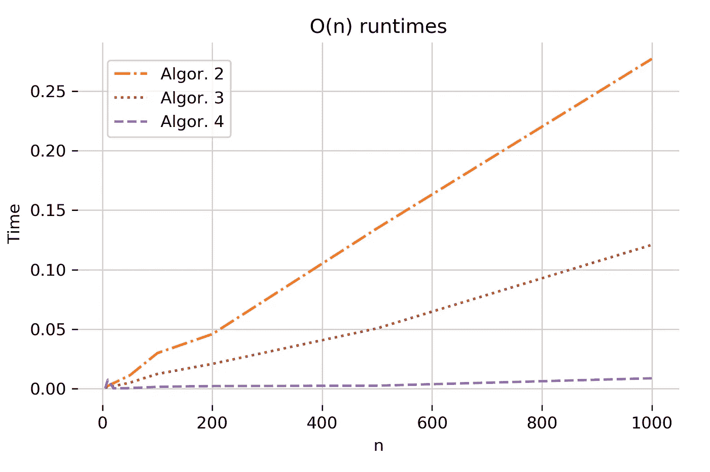
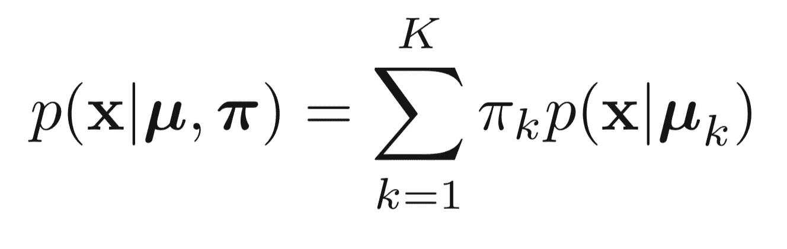
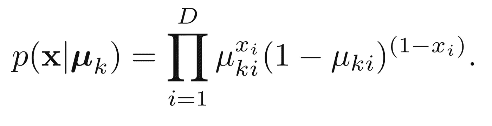
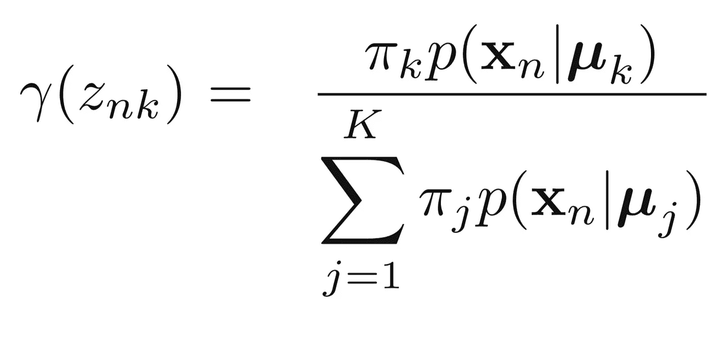
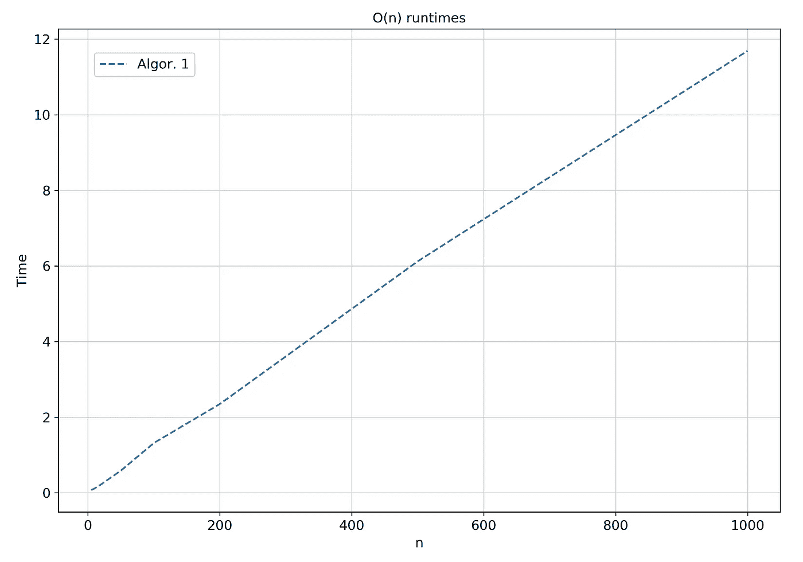
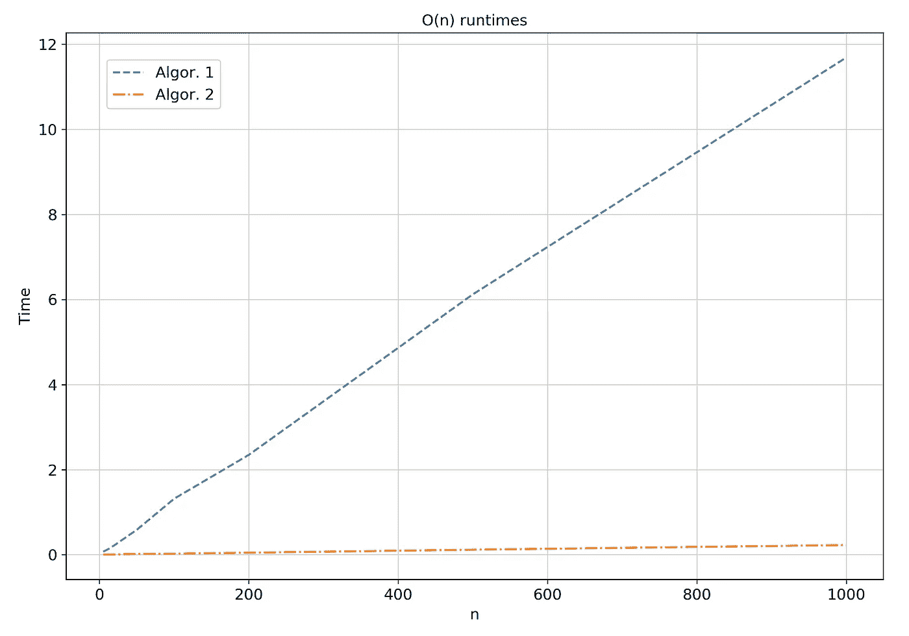
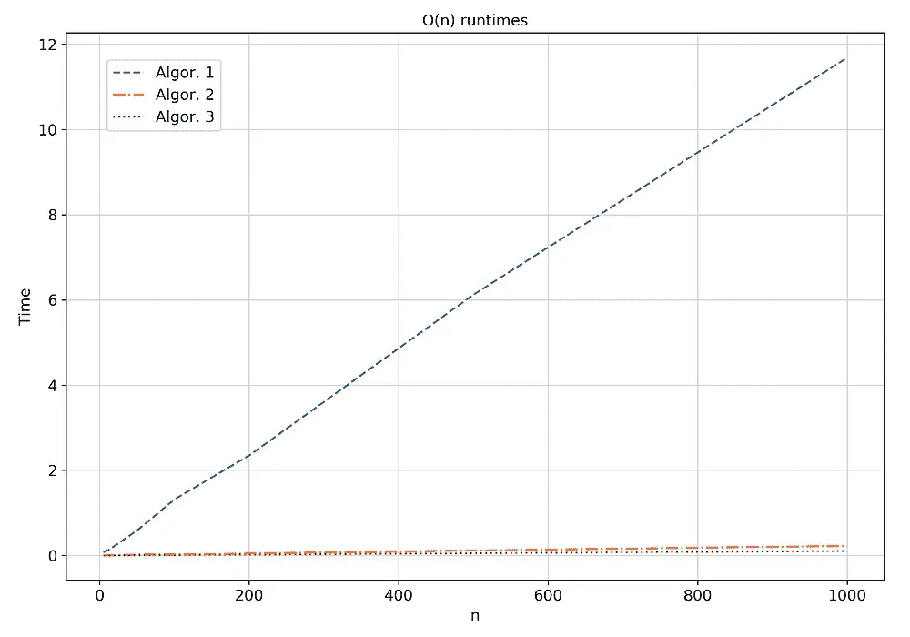
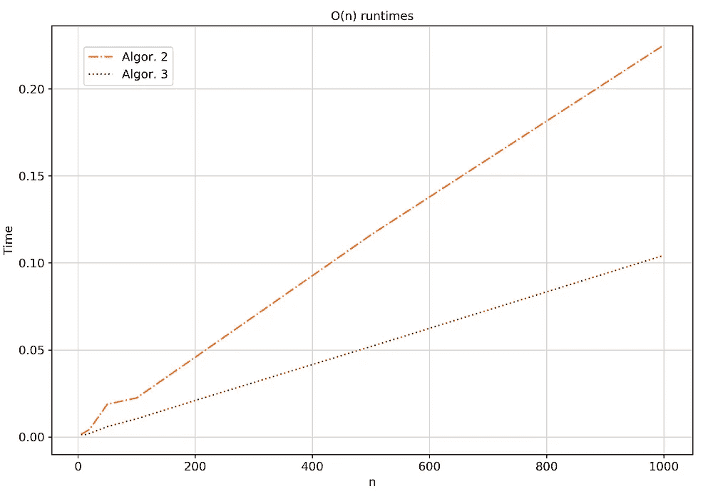
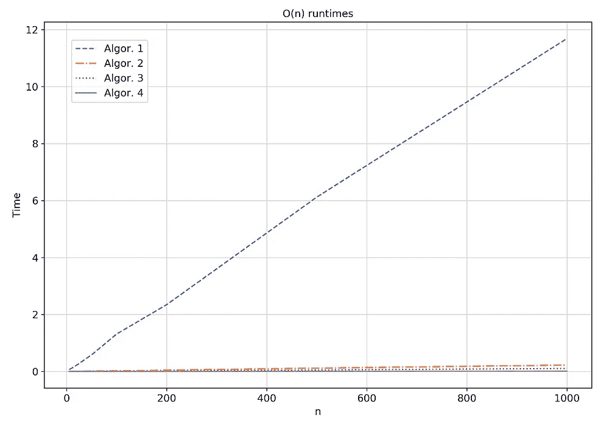
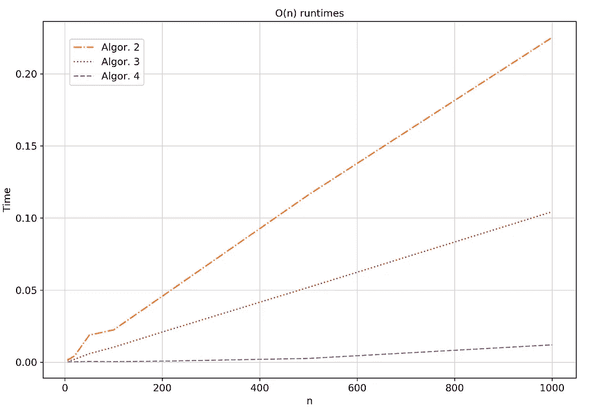

# 矢量化:如何用 x78 加速你的机器学习算法

> 原文：<https://towardsdatascience.com/vectorisation-how-to-speed-up-your-machine-learning-algorithm-by-x78-times-faster-e330df8c9b27?source=collection_archive---------13----------------------->



## 给定一个等式，我们将看到 step by step 如何不仅在速度方面实现 x78 倍的更高效代码，而且仅使用 3 行代码！让我们深入了解一下…

# 介绍

作为一种**解释语言，** Python `for` loops 天生就比 C 语言慢。这对臭名昭著的编程语言来说是一个很大的瓶颈，因为深度学习和机器学习算法严重依赖于矩阵运算，它们通过`for`循环来执行。

这就是开发人员开发包的原因，比如`numpy`，他们在`numpy`数组上提供**矢量化**动作。这意味着它将通常在 Python 中完成的`for`循环推到了更快的 **C 层**。

> Python + C 级速度=天堂

# 问题是

*(如果你能理解 EM 算法，你可以跳过解释部分)*

我们希望将**期望最大化** (EM)算法用于无监督学习任务(例如，识别 MNIST 数据集中的手写数字)，并且我们的数据是二进制的(例如二进制图像)。一个自然的方法是将我们的数据建模为一个伯努利混合模型。伯努利分布的加权和，其中每个分布具有其自己的标量权重`**π**`和其自己的均值向量`**μ**` ，并且表示数据的聚类(例如，如果我们的数据是数字 2、3 & 4 的图像，并且我们使用 3 个伯努利来对它们建模，一个伯努利将是数字 2，另一个是数字 4，等等)。总的来说，前者是一个向量，后者是一个矩阵。



Bernoulli mixture model **(1)**



Distribution of one observation x given the cluster k **(2)**

设 N =观察值的数量，D =一个观察值的维数，K =聚类的数量。因为这对我们的问题很重要，所以我们的随机变量类型有:
`**X**`；我们的数据 a NxD 矩阵
(N 是图像的数量，D 是图像的维数→ 5 张 28*28 的图像会组成一个 5x784 的矩阵 X)
`π`；一个向量 K，一个代表权重的标量。
(例如三个伯努利可以有π=[0.2，0.75，0.05]加权向量)
`**μ**`；每个聚类的平均 KxD 矩阵。
(一幅图像的维数为 D=28*28=784，其中每一幅图像代表一个像素值。对属于同一聚类的图像的每个像素取平均值，比如数字 2，我们得到 784 的平均向量。因此，`**μ**`将是 KxD 的矩阵)

在 **E 步骤**中，我们特别感兴趣的是潜在变量后验的期望值，或者所谓的责任



E-step of EM algorithm **(3)**

`γ`实际返回期望值的观测值(图像)`n`属于聚类`k`。
`γ` 是一个 **NxK 矩阵**；对于每个观察值，我们分配一个属于每个聚类的概率。具有最大值的是我们分配给。

我为什么要说这些？

> "矢量化中最重要的事情是理解变量的维数."

责任的计算是我们要向量化的内容

总结一下:
`**X**`:NxD 矩阵
`**π**`:1xK 向量
`**μ**`:KxD 矩阵
`**γ**`**:**NxK 矩阵****

# ****管道****

****我们将创建一个函数`E_step`来运行计算上面的表达式，并用下面的代码测试它****

```
**observations = [5, 10, 20, 50, 100, 200, 500, 1000]
for n in observations:
    X_test = bin_train_data[:n]
    D_test, K_test = X_test.shape[1], 10 mu_test = np.random.uniform(low=.25, high=.75, 
                                size=(K_test,D_test))
    pi_test = np.ones(K_test) / K_test t0 = time.time()
    gamma_test = E_step_1(X_test, mu_test, pi_test)
    runtime = time.time() - t0
    **assert** gamma_test.shape == (n, K_test)**
```

****放心先自己试一试吧！****

# ****尝试№1****

****在我们的第一次尝试中，我们将使用 for 循环编写所有内容；在向量/矩阵运算中，只有标量。****

****通过看方程，我们可以看到有 3 个循环；每个例子一个`N`，每个集群一个`K`，每个物体的每个维度一个`D`，我们将按这个顺序循环。所以我们要一次用一个元素填充矩阵`γ`。****

```
**def E_step(X, mu, pi):
    N, D = X.shape
    K = pi.shape[0]
    gamma = np.zeros((N, K))
    for n in range(N):
        for k in range(K):
            m = 1
            for i in range(D):
                m *= mu[k][i]**X[n][i] * (1-mu[k][i])**(1-X[n][i])
            gamma[n][k] = m * pi[k]
        gamma[n] /= gamma[n].sum()
    return gamma**
```

****我们的结果可以在下图中看到。****

********

****我们肯定能做得更好！****

# ****尝试 2****

****最好从内部循环开始，然后向外部循环推进。这正是我们要做的！****

****我们想摆脱 for 循环`D`。因此，依赖于`D`的每一项现在都应该变成一个向量。在这个 for 循环中，我们有两个变量；`μ`和`x`(见等式。`(2)`)。因此`x`和`μ` →矢量。问题；这是`μ**x`，向量到另一个向量的幂，很难计算。如果我们能绕过这个…****

****有一个函数可以将乘幂运算转化为乘法运算。没错，就是**对数**！让我们对表达式取对数，然后取结果的指数！****

> ****对数概率上的运算是优选的，因为它们提供了数值稳定性****

****尽管在我们的例子中它没有任何影响，但是每次使用 log 时，在表达式中使用一个常量`epsilon`以保持稳定性(为了不归零，使用 is `-inf`)。****

****因此，我们将不得不进行逐元素的向量乘法。容易；)****

```
**def E_step(X, mu, pi):
    N, D = X.shape
    K = pi.shape[0]
    gamma = np.zeros((N, K))
    for n in range(N):
        for k in range(K):
            log_gamma = np.log(pi[k]) + (X[n] * np.log(mu[k]) \
                        + (1 - X[n])*np.log(1 - mu[k])).sum()
            gamma[n][k] = np.exp(log_gamma)
        gamma[n] /= gamma[n].sum()
    return gamma**
```

****我们的结果是…****

********

****这是一个巨大的胜利！似乎 x 轴比得上`Algor. 1`！但是，我们可以做得更好；)****

# ****尝试№3****

****一次一圈:轮到`K`了！****

****在矢量化过程中，我们的移动如下:****

> ****标量→矢量→矩阵****

****随着我们用`numpy`数组替换越来越多的循环，越来越多的代码将在 **C 上运行→更快的&更干净的代码。******

****我们采用之前的实现，希望移除循环的`K`。因此，每一个依赖于`K`的标量都会变成一个`vector`，而每一个`vector`都会变成一个`matrix`。这意味着`X`将保持不变，而`μ`将变成矩阵，而`π`和`γ`将变成向量。注意最后一条；随着`γ`字段的一行一行，我们表达式的结果现在必须是一个向量！所以`μ`和`X`的操作必须产生一个`1xK`向量，快速指示器是(I)它们必须与向量`π`相加，向量也是`1xK` (ii)结果是矩阵`γ`的一行，向量也是`1xK`。****

****将我们的结果编码成:****

```
**def E_step(X, mu, pi):
    N, D = X.shape
    K = pi.shape[0]
    gamma = np.zeros((N, K))
    for n in range(N):
        log_gamma = np.log(pi) + np.log(mu) @ X[n] \
                    + np.log(1 - mu) @ (1 - X[n])
        gamma[n] = np.exp(log_gamma)
        gamma[n] /= gamma[n].sum()
    return gamma**
```

****结果是:****

****************

****太神奇了！我们已经为`n=1000`争取到了一半的时间！跟`Algor. 1`真的没法比。但是，我们能做得更好吗？****

# ****尝试№4****

****我们还有一个循环。我们能有一个计算*循环-python-free* 吗？`N`，你的时间到了！****

****由于我们要将一个`matrix * vector`运算转化为一个`matrix @ matrix`运算，我们需要取前者的传输矩阵(`@`是正则矩阵乘法)。请记住，现在我们的输出必须是整个γ矩阵。我想现在你已经知道它是怎么回事了；).****

****所以我们的代码应该是****

```
**def E_step(X, mu, pi):
    gamma = np.exp(np.log(pi) + X @ np.log(mu.T) \
            + (1 - X) @ np.log(1 - mu.T))    
    gamma /= gamma.sum(axis=1)[:, np.newaxis]
    return gamma**
```

****没有一个循环！代码看起来很优雅，而且只有三行长！现在是结果，鼓声…****

****************

****就是这样，不能再好了！对于`n=1000`，我们只用了三行代码就从运行时的`11.688` → `0.012`！****

# ****摘要****

****那么，当你想对一个表达式进行矢量化时，你需要做什么呢？****

******了解矩阵的尺寸**。
**纸笔**:记下公式，从求和到求和，化为等价矩阵运算
**数学是你的朋友**；总是考虑任何表达式必须返回的维数；观察邻居求和运算，因为它们具有相同的维数
逐循环、逐步进行:**标量→向量→矩阵** 取**对数**并确保引入归一化常数ε
**代码**您的方法的矢量化版本并闪耀:D****