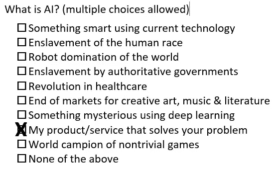

# 供应商—定义您对#AI 的使用

> 原文：<https://towardsdatascience.com/vendors-define-your-usage-of-ai-9495b30ebd28?source=collection_archive---------15----------------------->

Photo by [Lukas](https://unsplash.com/photos/hND1OG3q67k?utm_source=unsplash&utm_medium=referral&utm_content=creditCopyText) on [Unsplash](https://unsplash.com/search/photos/artificial-intelligence?utm_source=unsplash&utm_medium=referral&utm_content=creditCopyText). Used with permission.

作为一名行业分析师，我听取了许多供应商的简报。在这些简报中越来越常见的是，厂商频繁而随意地使用缩写***【AI】***来描述他们产品或服务的各种功能。

在最近的一次简报中，这种做法在一家大型供应商那里尤为明显。他们的短语是:*AI+BI；用 AI…的力量去探索他们的数据；有了 AI……变得更聪明；AI 让数据可访问；人工智能…从根本上改变了分析的使用方式；由 AI 驱动；注入了人工智能。*所有这些都在前 13 张幻灯片中！

> **注**:这是我的一面大红旗！我完全避免在我的文章中使用 AI 这个缩写词，因为它经常含糊不清，并且分散了我想要传达的信息。

我问了这个问题，“**你们公司是怎么定义 AI 的？**”

这个首字母缩略词是指…描述性分析之外的任何分析吗？预测未来事件的分析？因果关系的发现？模仿人类的思维过程？超过人类专家水平的分析？深度神经网络的使用？业务流程自动化？或者，仅仅是又一个分析技术时代？

> 更新 2019–03–13:文章 [*AI 已经变得毫无意义*](https://www.theatlantic.com/technology/archive/2017/03/what-is-artificial-intelligence/518547/) 作者 Ian Bogost 在《大西洋月刊》中有许多明确的例子和一些有用的替代方法。

厂商的回答很简单……AI 的意思是*增强智能*，不是*人工智能*。这个回答让我很惊讶。

# 但是 AI =人工智能

对大多数专业人士来说，AI 这个缩写意味着人工智能。如果供应商暗示了一个替代概念，比如增强智能，他们就不应该使用这个缩写。

此外，我想知道为什么这个短语没有明确地出现在他们的幻灯片中，所以我继续问定义他们的 AI 用法的问题。

> **外卖**:厂商应该把 AI 这个缩写词限制在描述一般的技术趋势，避免把 AI 这个缩写词和产品/服务特性联系起来。

# 强调增加

我说这是一个*好的*回答，因为它强调了**自动化(取代人类)与增强(增强人类)**的关键问题。增强智能意味着人类的智能正在增强，而不是被更好、更便宜或更快的东西取代。这是一个微妙但关键的转变，它承认人类的价值，特别是他们的直觉、创造力、经验和判断力。

然后，我建议他们应该在营销信息中强调这一点，因为对其增强的准确陈述将是一个实质性的营销点。换句话说，他们已经错过了与现有观众交流的大好机会。

> 外卖:供应商应该总是强调增加，而不是取代人类的智慧。此外，清楚地展示如何利用和增强个人的独特能力。

# 强调学习

人工智能系统的一个关键方面是它能够让 T2 学习 T3。不幸的是，这个主题不是这个供应商的简报的一部分，这意味着他们的“人工智能”能力是创造性的静态算法。这应该被认为是“人工智能”吗？

重要的一点不是人工智能系统学习，而是系统通过展示良好的行为范例被*教授*令人满意的行为。这是从静态逻辑到学习逻辑的范式转变，随着更多例子的使用，这种转变会得到改善。参见[这篇关于新价值观的文章](/how-managers-should-prepare-for-deep-learning-new-values-f29a98b70bd8) [1]

因此，重要的是要知道…谁在教学？又是怎么做到的？

在传统的机器学习中，这种教学是由人类对示例数据集的管理来驱动的，这些示例数据集是从原始数据中精心制作的显著特征。如今人工智能系统的核心——神经网络——正在通过投掷原始数据，通过从其他模型转移训练，或者通过与其他神经网络竞争来学习。可以更有效地进行学习逻辑的教学。因此，教授这个学习人工智能系统的机制是一个关键的方面，需要一个清楚的解释。

> **外卖**:厂商应该定义他们的人工智能产品如何学习。AI 模型的教学(训练)是如何进行的？

# 定义价值

供应商关于增强智能的回答暗示了一个明显的下一个问题:通过学习型人工智能系统增强人类智能如何给组织带来**价值**？

几十年来，IT 行业一直在追求增强智能，当我在 20 世纪 60 年代末参与进来时，它被贴上了“决策支持系统”的标签。我立刻想到了约翰·图基在 20 世纪 70 年代早期在一辆瓦里安 620 上演示 PRIM-9。这里有一篇关于这一历史瑰宝的简短博客(和视频)！[2]

面临的挑战是如何通过提高个人的效率和/或效力来确定具体的增强对组织的价值。

彼得·德鲁克(Peter Drucker)那句臭名昭著的名言与此相关:“*效率就是把事情做对；有效性就是做正确的事情。*【③】

增强人类的智力，让人们能够更快、更便宜、更可靠地完成特定的任务(*做正确的事情*)是件好事。然而，如果这个人能够**定制任务以满足特定情况的需要** ( *做正确的事情*)，那就更好了。这一点在[这篇关于新价值观](/how-managers-should-prepare-for-deep-learning-new-values-f29a98b70bd8)的文章中解释为 ***智能效能*** 。[4]

> **要点**:供应商应该精确地了解人类的智能是如何增强的。并且，展示这种增强如何为组织增加价值，尤其是智能效率。

# 术语 AI 的随意使用是欺骗性的

首字母缩写词 AI 的随意使用充其量是含糊不清的，而且经常具有欺骗性，尤其是在营销信息中！

对于一些观众来说，不幸的是，它的使用传达了产品/服务的一种神奇的品质，暗示着“来买这个吧，你所有的商业问题都会很快消失。”这就是首字母缩写 AI 背后微妙但误导人的魅力！

任何了解深度神经网络当前研究和实践的人都意识到，企业中的实际人工智能应用范围有限，难以开发，部署麻烦，难以实现价值……尽管大型技术供应商进行了迷人的演示！没有魔法，只有一个关于一百万个简单数字的群集如何能够模拟现实的复杂性的秘密。

许多专家得出结论，人工智能技术仍然处于“炼金术”阶段，作为一门原始科学，就像中世纪的化学一样……关于“什么-如何-为什么”的问题比理论更多。详见本文。[1]

我同意，从长远来看，这项技术有巨大的潜力。与此同时，早期采用者(和他们的供应商)应该预料到背后会有很多箭！

> 外卖:厂商应抵制利用人工智能的空洞营销炒作。那些日子已经过去了。相反，深入思考并清楚地解释你的产品为增强某人的能力和学习提高其能力所带来的价值。

# 用人工智能处理伦理问题

这是随意使用 AI 首字母缩写词的积极一面。准备好面对黑暗面了吗？

越来越多的人认为，人工智能意味着业务流程的自动化，导致人类的替代，以及失业、技能灭绝、管理集中化、财富集中和政治控制等令人讨厌的影响。

将未来押在人工智能上的厂商应该非常谨慎，并对道德含义有政治头脑。在汤姆·达文波特(Tom Davenport)和比尔·弗兰克斯(Bill Franks)的 2019 年 IIA 预测和分析优先事项中，他们的第一个预测是: ***将越来越强烈地关注分析的道德*** ，并敦促他们的客户 ***今天就开始正式解决分析道德问题*** ！[5]

你的公司是否明确批准并热情鼓励公开和诚实的讨论，以及政策的形成，关于你的产品/服务在人工智能旗帜下营销的道德含义？

几十年来，我经历了许多技术浪潮。对我来说，现在的深度神经网络浪潮，特别刺激，特别有挑战性。然而，我必须承认，我越来越觉得自己像一个 1940 年代开发核能的科学家。这是一个巨大的好的潜力…也是一个悲剧！

忘记人工智能机器人奴役人类的威胁吧。真正的威胁是人工智能系统正在被武器化以对抗其他系统，这是有意的，尤其是天真的。像核能一样，这个大国必须得到明智的管理。[6, 7, 8]

> **要点**:供应商应该公开诚实地面对道德问题。帮助他们的客户理解和管理这些道德问题。

如果你有类似的动机，请与我合作。作为 Bolder 技术的一部分，请查看我目前在 [BizSmartAnalytics](http://BizSmartAnalytics/) 的工作。[9]一些掌声将不胜感激；)

© Bolder Technology — CC BY 3.0 US

**更新 2019–06–29**:[发了这个 JPEG](https://twitter.com/hackathorn/status/1145001279984406528) 来强调以上几点。请在与同事讨论时使用。

## 参考

1.  Hackathorn，*管理者应该如何准备深度学习:新范式*，
    [https://towards data science . com/How-Managers-Should-Prepare-for-Deep-Learning-New-Paradigms-28de 63054 ea 6](/how-managers-should-prepare-for-deep-learning-new-paradigms-28de63054ea6)
2.  黑客马拉松，*交互式三维数据可视化的开端，*
    [https://www . immersiveanalytics . com/2015/11/Beginning-of-Interactive-3D-Data-Visualization/](https://www.immersiveanalytics.com/2015/11/beginning-of-interactive-3d-data-visualization/)
3.  [彼得·德鲁克，](https://en.wikiquote.org/wiki/Peter_Drucker) *经营效益管理*。第 53-60 页。
4.  黑客马拉松，*管理者应该如何准备深度学习:新价值观*，
    [https://towardsdatascience . com/How-Managers-Should-Prepare-for-Deep-Learning-New-Values-f 29 a 98 b 70 BD 8](/how-managers-should-prepare-for-deep-learning-new-values-f29a98b70bd8)
5.  达文波特和弗兰克斯，*关于 2019 年分析预测&优先事项*的网络研讨会，由国际分析研究所于 2018 年 12 月 6 日举办，[https://www . ii Analytics . com/2019-Analytics-Predictions-Priorities-Webinar/](https://www.iianalytics.com/2019-analytics-predictions-priorities-webinar/)
6.  Chollet，*我担心什么 AI，*
    [https://medium . com/@ Francois . chollet/What-Worries-Me-About-AI-ed 9df 072 b 704](https://medium.com/@francois.chollet/what-worries-me-about-ai-ed9df072b704)
7.  *入伙上艾，*
    【https://www.partnershiponai.org/】T21
8.  骑士，*AI 的父亲之一担心它的未来，*
    [https://medium . com/MIT-technology-review/One-of-the-Fathers-of-AI-is-Future-a 7996 cddce 72](https://medium.com/mit-technology-review/one-of-the-fathers-of-ai-is-worried-about-its-future-a7996cddce72)
9.  黑客马拉松，深度学习系统的管理挑战，
    [https://BizSmartAnalytics.com/](https://bolder.com/BizSmartAnalytics/)