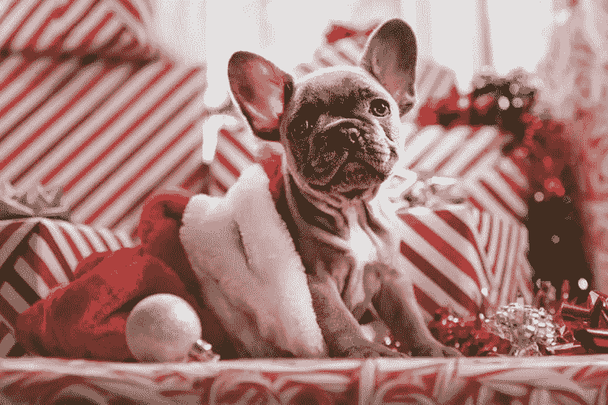
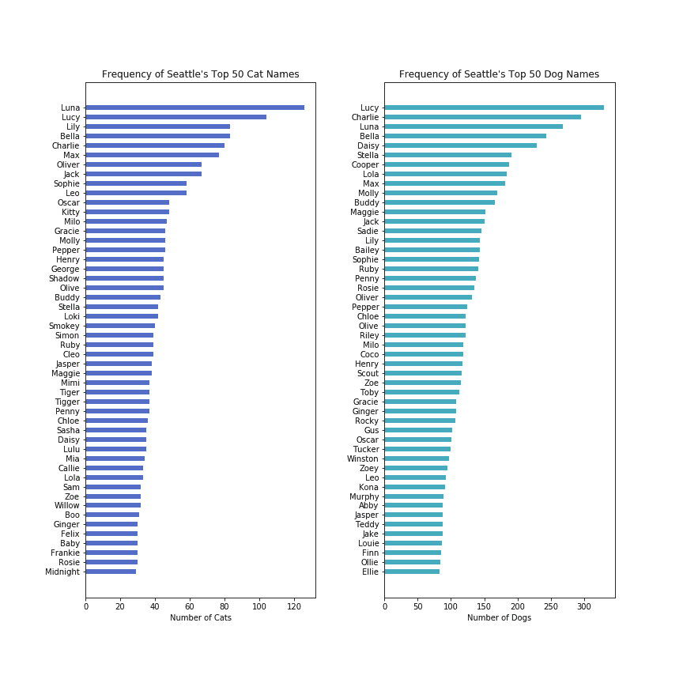
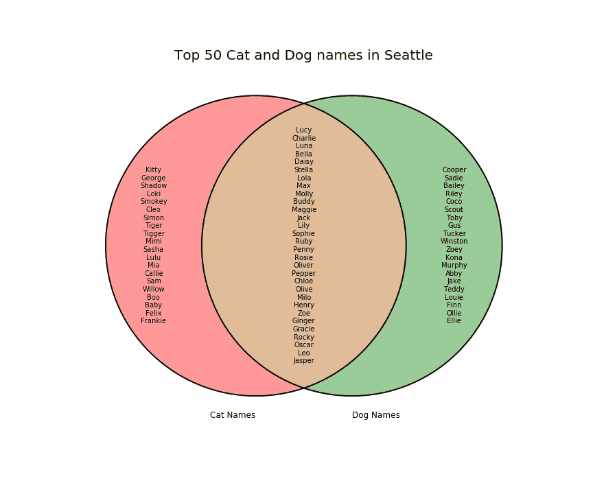
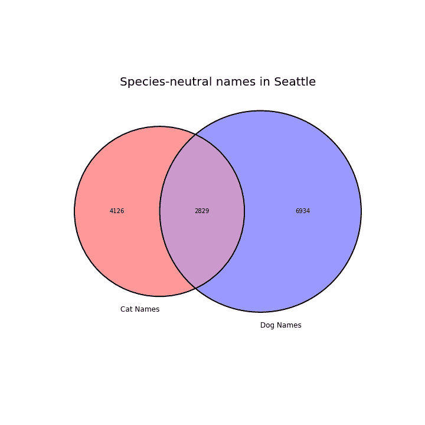
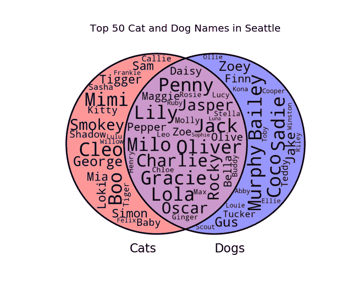
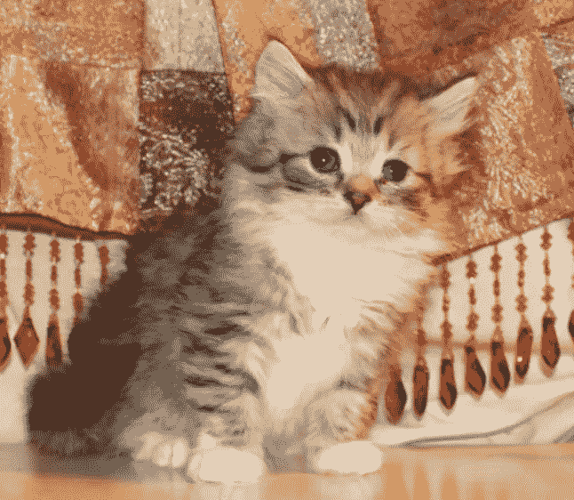
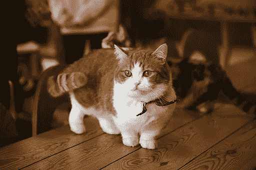
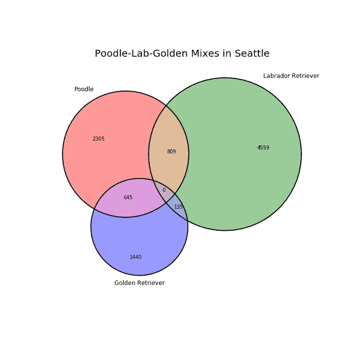
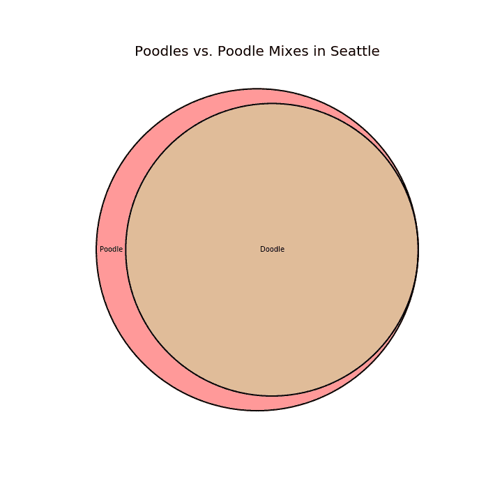
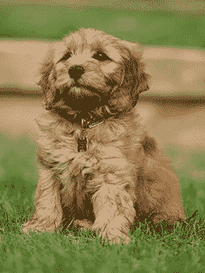

# Python 中的维恩图和单词云

> 原文：<https://towardsdatascience.com/venn-diagrams-and-word-clouds-in-python-1012373b38ed?source=collection_archive---------12----------------------->

## 所有你不需要知道的西雅图宠物名称和品种



Photo by [Jakob Owens](https://unsplash.com/@jakobowens1?utm_source=unsplash&utm_medium=referral&utm_content=creditCopyText) on [Unsplash](https://unsplash.com/?utm_source=unsplash&utm_medium=referral&utm_content=creditCopyText)

在我对西雅图宠物的调查中，我发现自己很想知道宠物的名字——最流行的宠物名字是什么？猫的名字和狗的名字是不同的吗，就像猫和狗是不同的一样(平均来说，我们都有这样一个朋友，当你来到门口的时候，他会跑过来迎接你，当你叫他的时候，他会过来，玩捡东西的游戏。或者当它的家人举行聚会时，那只藏在椽子里的狗…)？还有宠物品种——西雅图的每只狗都是狮子狗混种吗？这些经常出现在我家后院的奇特的猫有多常见(还没有被我的小狗贝克汉姆注意到，它以前从来没有在一楼住过)？

还有其他心怀不满的纽约巨人队球迷，他们用小奥德尔·贝克汉姆的名字给他们的狗命名，但当他搬到克利夫兰·布朗(NFL 历史上统计数据最差的球队之一)时，他们感到非常失望，在那里他迅速开始了他最糟糕的一年。我本人是一个骄傲的西雅图和海鹰队的球迷，但我嫁给了一个[新泽西](https://www.linkedin.com/in/kevinhonold/)巨人队的球迷(他慷慨地编辑了这篇文章，并利用他的编辑控制权表达了他对巨人队的失望——迄今为止只有 3 胜 11 负——和小奥黛尔·贝克汉姆)。

不管怎样…在这个过程中，我意识到了一个维恩图的绝佳机会，甚至维恩图单词云可以帮助回答这些问题。

## 顶级猫狗名

我从横条图开始，查看西雅图最常见的 50 个猫狗名。

```
fig, axes = plt.subplots(ncols=2, figsize=(12,12))
plt.subplots_adjust(wspace=.3)axes[0].barh(cat_t50['name'], cat_t50['count'], .5, color='#294AB9', 
             alpha=0.8)
axes[0].invert_yaxis()
axes[0].set_title("Frequency of Seattle's Top 50 Cat Names", 
                  fontsize=12)
axes[0].set_xlabel("Number of Cats")axes[1].barh(dog_t50['name'], dog_t50['count'], .5, color='#1896ac', 
             alpha=0.8)
axes[1].invert_yaxis()
axes[1].set_title("Frequency of Seattle's Top 50 Dog Names", 
                  fontsize=12)
axes[1].set_xlabel("Number of Dogs");
```

注意这里使用的一些`matplotlib`工具:

*   使用`plt.subplots_adjust(hspace=.3)`水平分隔支线剧情，这样名字就不会出现在其他剧情中。在[文档](https://matplotlib.org/3.1.1/api/_as_gen/matplotlib.pyplot.subplots_adjust.html)中找到更多关于调整支线剧情的信息。
*   `ax.invert_yaxis()`将翻转 y 轴，使数据集中的第一项出现在顶部。



我马上注意到的一件事是，前 50 名狗名单和前 50 名猫名单上的名字有很多重叠:我称之为“物种中性名字”。为了形象化这一点，我做了一个文氏图。

注意:根据 PyPI [文档](https://pypi.org/project/matplotlib-venn/)，您需要`pip install`或`easy-install` `matplotlib-venn`，并确保您拥有依赖关系:`numpy`、`scipy`和`matplotlib`。

```
from matplotlib_venn import venn2, venn2_circles
from matplotlib import pyplot as plt# setup the figure
fig, ax = plt.subplots(figsize = (12,10)
ax.set_title(‘Top 50 Cat and Dog names in Seattle’, fontsize=20)# make the venn diagram
v = venn2([set(cat_t50[“name”]), set(dog_t50[“name”])],
set_labels=[‘Cat Names’, ‘Dog Names’])# adjust labels from counts to names
v.get_label_by_id(‘10’).set_text(‘\n’.join(cat_only_names))
v.get_label_by_id(‘01’).set_text(‘\n’.join(dog_only_names))
v.get_label_by_id(‘11’).set_text(‘\n’.join(overlap_names))# add circle outlines
c = venn2_circles([set(cat_t50[“name”]), set(dog_t50[“name”])],
                  linestyle=’solid’)
```

使用`matplotlib-venn`的一些注意事项:

*   `venn2`(两个圆圈)的参数编号如下:“10”=仅左侧项目，“01”=仅右侧项目，“11”=左侧和右侧项目。相同的框架适用于`venn3`(三个圆圈):‘100’=仅第一组项目，‘010’=仅第二组项目，‘110’=第一和第二组的交集，但不在第三组中，等等。
*   `Get_label_by_id()`允许您`.set_text()`
*   `get_patch_by_id()`允许您`.set_alpha()`和`.set_color()`
*   `venn2_circles`添加轮廓，并允许您为不同的圆设置不同的轮廓，使用索引指示哪个圆，`set_lw(*width*)`指示线宽，`.set_ls(*linestyle*)`指示线型。`c[0].set_ls(‘dotted’)`例。记住`matplotlib`有多种内置的[线条样式](https://matplotlib.org/3.1.0/gallery/lines_bars_and_markers/linestyles.html)，包括‘实线’、‘虚线’、‘虚线’，以及定制功能。



注意猫专用名(Shadow、Loki、Smokey)和狗专用名(Cooper、Sadie、Bailey)的区别。狗更有可能被赋予“人类”的名字吗？改天的问题…

作为调整颜色的一个例子，我决定看看猫和狗的名字通常是如何重叠的。

```
from matplotlib_venn import venn2, venn2_circles
from matplotlib import pyplot as pltfig, ax = plt.subplots(figsize = (10,10))
ax.set_title(‘Species-neutral names in Seattle’, fontsize=20)v = venn2([set(cat_names[“name”]), set(dog_names[“name”])],
          set_labels=[‘Cat Names’, ‘Dog Names’])
v.get_patch_by_id(‘10’).set_color(‘red’)
v.get_patch_by_id(‘10’).set_alpha(0.4)
v.get_patch_by_id(‘01’).set_color(‘blue’)
v.get_patch_by_id(‘01’).set_alpha(0.4)
v.get_patch_by_id(‘11’).set_color(‘purple’)
v.get_patch_by_id(‘11’).set_alpha(0.4)c = venn2_circles([set(cat_names[“name”]),set(dog_names[“name”])],
                  linestyle=’solid’)
```

请注意，圆圈内的标签和大小是基于猫/狗名称的数量，而不是数量，尽管注册的狗数量比西雅图注册的猫数量多。



在我寻找显示维恩图中名字的方法时，我看到了 Paul Broaderson 的这个可爱的包，它在你的维恩图中创建了一个单词云。你所需要做的就是安装`matplotlib-venn-wordcloud`，然后你就可以使用与上面相同的语法开始比赛了。默认的配色方案是黑色和白色，但是您可以按照`matplotlib-venn`中使用的相同策略添加背景色。注意，单词的大小并不自动反映单词的频率。查看[文档](https://github.com/paulbrodersen/matplotlib_venn_wordcloud)添加该功能。

```
from matplotlib_venn_wordcloud import venn2_wordcloud
fig, ax = plt.subplots(figsize=(10,10))
ax.set_title(‘Top 50 Cat and Dog Names in Seattle’, fontsize=20)v = venn2_wordcloud([set(cat_t50[‘name’]), set(dog_t50[‘name’])],
                    ax=ax, set_labels=[‘Cats’, ‘Dogs’])# add color
v.get_patch_by_id(‘10’).set_color(‘red’)
v.get_patch_by_id(‘10’).set_alpha(0.4)
v.get_patch_by_id(‘01’).set_color(‘blue’)
v.get_patch_by_id(‘01’).set_alpha(0.4)
v.get_patch_by_id(‘11’).set_color(‘purple’)
v.get_patch_by_id(‘11’).set_alpha(0.4)
```



Ragamuffin Kitten from Togle1 [CC BY-SA [4.0](https://creativecommons.org/licenses/by-sa/4.0) ] on [wikimedia commons](https://commons.wikimedia.org/wiki/File:RagaMuffin_Kitten.png)

## 猫和狗的品种

接下来看看品种，猫似乎在完全不科学的最佳品种名称( [Ragamuffin](https://en.wikipedia.org/wiki/Ragamuffin_cat) )和最可爱品种名称( [Munchkin](https://en.wikipedia.org/wiki/Munchkin_cat) )奖项中拔得头筹。与此同时，令人惊讶的是，这些狗并不都是涂鸦狗。不管走在街上看起来如何，他们实际上只占 9%左右。



Munchkin Cat (inspired by the Wizard of Oz) from Tasy Hong [CC0] on [Wikimedia Commons](https://commons.wikimedia.org/wiki/File:Munchkin_cat_2.jpg)

仔细看看最常见的涂鸦:[拉布拉多涂鸦](https://en.wikipedia.org/wiki/Labradoodle)和[金毛涂鸦](https://en.wikipedia.org/wiki/Goldendoodle)，我们看到在 34，882 只注册狗中，大约有 10，000 只或 28%的西雅图注册狗将其中一只(拉布拉多或金毛)作为它们的主要或次要品种。大约四分之一具有金毛血统的狗是金杜，而接近 15%具有拉布拉多血统的狗是拉布拉多。然后还有 135 个[金达多](https://en.wikipedia.org/wiki/Goldador)。我们的数据集中没有双涂鸦(拉布拉多金毛狗混种)，尽管这可能受到宠物注册数据收集过程的限制，该过程只允许主人识别主要和次要品种。这指出了维恩图中不精确的地方，但总的来说，这是一个非常棒的工具。

```
from matplotlib_venn import venn3, venn3_circles
fig, ax = plt.subplots(figsize = (10,10))
ax.set_title(‘Poodle-Lab-Golden Mixes in Seattle’, fontsize=20)v = venn3([set(poodle_dogs), set(labs), set(goldens)],
          set_labels=[‘Poodle’, ‘Labrador Retriever’, 
                      ‘Golden Retriever’], 
          ax=ax)
c = venn3_circles([set(poodle_dogs), set(labs), set(goldens)],
                  linestyle=’solid’, ax=ax)
```



A certain Labradoodle puppy

最后，我想知道，在西雅图的贵宾犬中，有多少是涂鸦？



答案是:很多。而`matplotlib-venn`像 champ 一样处理这种情况，为了美观，只要求最右边补丁的标签设置为" "。

```
from matplotlib_venn import venn2, venn2_circles
fig, ax = plt.subplots(figsize = (10,10))
ax.set_title(‘Poodles vs. Poodle Mixes in Seattle’, fontsize=20)v = venn2([set(poodle_dogs), set(doodle_dogs)], set_labels=[“”,””], 
          ax=ax)
v.get_label_by_id(‘10’).set_text(‘Poodle’)
v.get_label_by_id(‘11’).set_text(‘Doodle’)
v.get_label_by_id(‘01’).set_text(‘’)c = venn2_circles([set(poodle_dogs), set(doodle_dogs)], 
                  linestyle=’solid’, ax=ax)
```

和往常一样，查看 GitHub [repo](https://github.com/allisonhonold/seattle-pet-names) 了解更多细节。

**临别赠言:**作为一个养狗名为小奥戴尔·贝克汉姆(O'dell Beckham Jr. Honold)(注册名为‘Beckham’)的人，我对西雅图只有一只注册名为‘Ichiro’的宠物感到震惊和错愕。但振奋地发现有 39 个威尔逊 39 个格里菲斯 29 个埃德加 22 个谢尔曼，21 个拉塞尔，以及 6 个马肖恩，佩顿，邓普西。其中 22%是猫，78%是狗，相比之下，32%是猫，67%是狗。这句话是在说猫和狗的本性，猫和狗的主人，还是两者都是？

对凯文来说，原来还有另外两只小贝夫妇*，一只金毛寻回犬，另一只短毛吉娃娃。*



Goldendoodle puppy by William Warby [[CC BY 2.0](https://creativecommons.org/licenses/by/2.0)] on [Wikimedia Commons](https://commons.wikimedia.org/wiki/File:Goldendoodle_puppy_Marty.jpg)