# 在 Python 和 R 中验证线性回归的假设

> 原文：<https://towardsdatascience.com/verifying-the-assumptions-of-linear-regression-in-python-and-r-f4cd2907d4c0?source=collection_archive---------2----------------------->


[Source](https://www.pexels.com/photo/turned-on-macbook-pro-and-brown-leather-file-case-1483938/)

## 深入探究高斯-马尔可夫定理和线性回归的其他假设！

线性回归是最基本的机器学习算法之一，经常被用作更高级模型的基准。我假设读者知道线性回归是如何工作的，以及一般来说回归问题是什么。这就是为什么在这篇短文中，我想重点介绍算法的假设——它们是什么，以及我们如何使用 Python 和 r 来验证它们。我并不试图在这里应用解决方案，而是指出它们可能是什么。

在本文中，我主要使用 Python(在 Jupyter Notebook 中)，但我也展示了如何使用`rpy2`——一种“两种语言之间的接口，以便在使用另一种语言时受益于一种语言的库”。它使我们能够在同一个笔记本中运行 R 和 Python，甚至在两者之间传输对象。直觉上，我们也需要在我们的计算机上安装 R。

声明:一些使用`rpy2`的单元格不工作，我不得不“欺骗”在 R 中运行它们来显示结果。使用`ggplot2`的细胞大多如此。尽管如此，我还是把代码留在了这个单元里。如果这对你有用，请在评论中告诉我:)

开始吧！

# 1.数据

在本文中，我使用了一个经典的回归数据集——波士顿房价。为了简单起见，我只取数值变量。这就是为什么我放弃了唯一的布尔特征——CHAS。我不打算深究这些特性的含义，但这总是可以通过运行`print(boston.DESCR)`来检查。

# 2.运行线性回归

大多数读者可能会估计这样的线性回归模型:

```
Coefficients: [-1.13139078e-01  4.70524578e-02  4.03114536e-02 -1.73669994e+01
  3.85049169e+00  2.78375651e-03 -1.48537390e+00  3.28311011e-01
 -1.37558288e-02 -9.90958031e-01  9.74145094e-03 -5.34157620e-01]
Intercept: 36.89195979693238
R^2 score: 0.7355165089722999
```

这当然不是错误的方法。然而，从 R 到 Python，我对默认接收的信息量有更高的期望。要在我们的笔记本中运行 R，我们首先需要运行这个神奇的命令:

```
%load_ext rpy2.ipython
```

随后，使用另一个神奇的命令表明该单元包含 R 代码。在这一步，我还使用了输入命令`-i`来指示我正在将一个对象从 Python 传递到 R。要将 R 的输出检索到 Python，我们可以使用`-o`。运行这两行会产生更多的信息，包括统计显著性和一些指标，如 R。

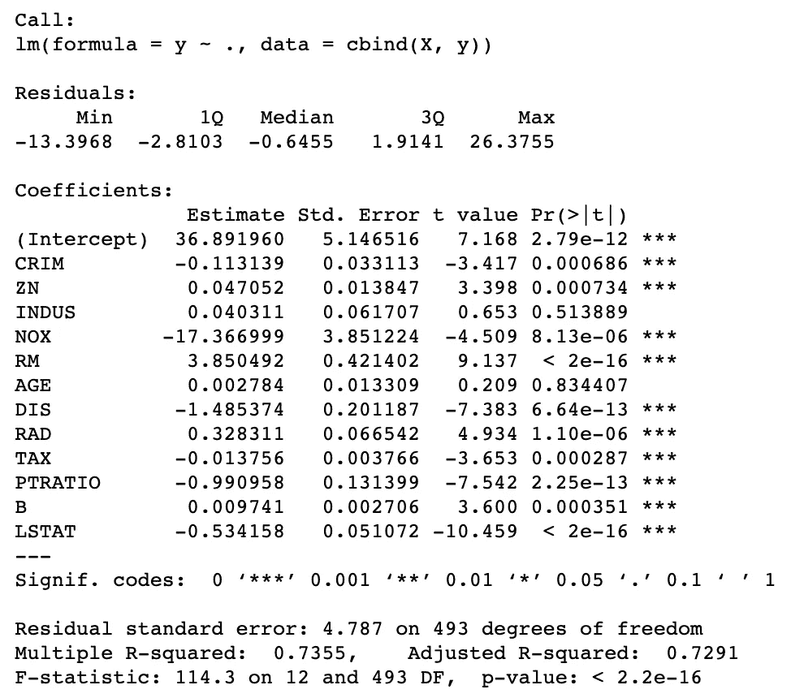

当然，Python 不会落后，我们可以使用另一个流行的库— `statsmodels`获得类似级别的细节。需要记住的一点是，当在`statsmodels`中使用线性回归时，我们需要添加一列 1 作为截距。为此我使用了`add_constant`。结果比来自`sklearn`的默认结果信息丰富得多。

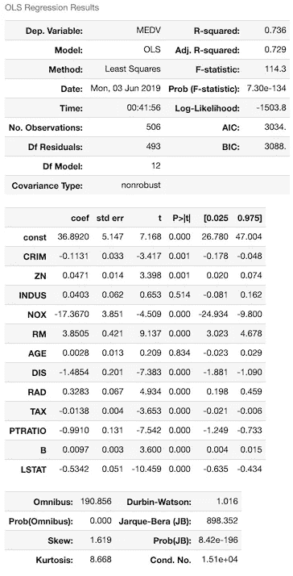

所以现在我们来看看如何在 R 和 Python 中运行线性回归。让我们继续假设。我把这些分成两部分:

*   高斯-马尔可夫定理的假设
*   其余的假设

# 3.高斯-马尔可夫定理

在您的统计学或计量经济学课程中，您可能听说过线性回归中的缩写词 BLUE。这是什么意思？根据[高斯-马尔可夫定理](https://en.wikipedia.org/wiki/Gauss%E2%80%93Markov_theorem)，在线性回归模型中，普通最小二乘(OLS)估计器给出系数的最佳线性无偏估计器(蓝色)，前提是:

*   误差(残差)的期望值是 0
*   误差是不相关的
*   误差具有相等的方差——误差的同方差

此外，蓝色的“最佳”表示与其他无偏线性估计相比，导致估计的最低方差。

对于蓝色的估计器，残差不需要遵循正态(高斯)分布，也不需要[独立且同分布](https://en.wikipedia.org/wiki/Independent_and_identically_distributed_random_variables)。

## 模型的线性

因变量(y)被假定为模型中指定的自变量(X，特征)的线性函数。规格参数必须是线性的。将线性模型拟合到具有非线性模式的数据会导致严重的预测错误，尤其是样本外(未用于训练模型的数据)。

为了检测非线性，可以检查观察值与预测值或残差与预测值的关系图。期望的结果是，在前一个图中，点对称地分布在对角线周围，或者在后一个图中，点对称地分布在水平线周围。在两种情况下都有大致恒定的方差。

观察到“弓形”模式表明，每当该模型做出异常大或小的预测时，它都会犯系统性错误。当模型包含许多特征时，非线性也可以通过残差与单个特征的关系图中的系统模式来揭示。

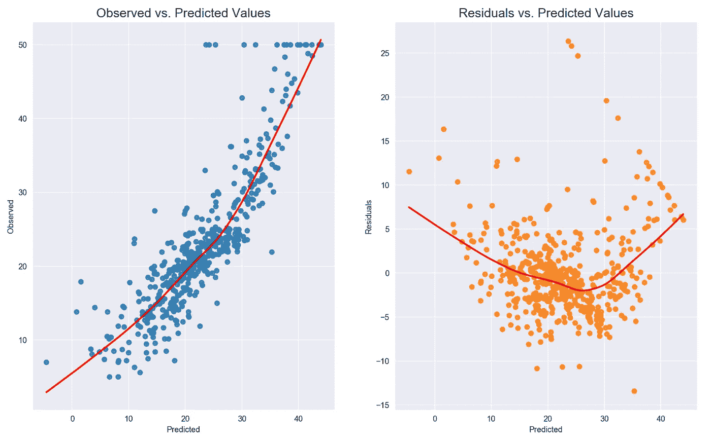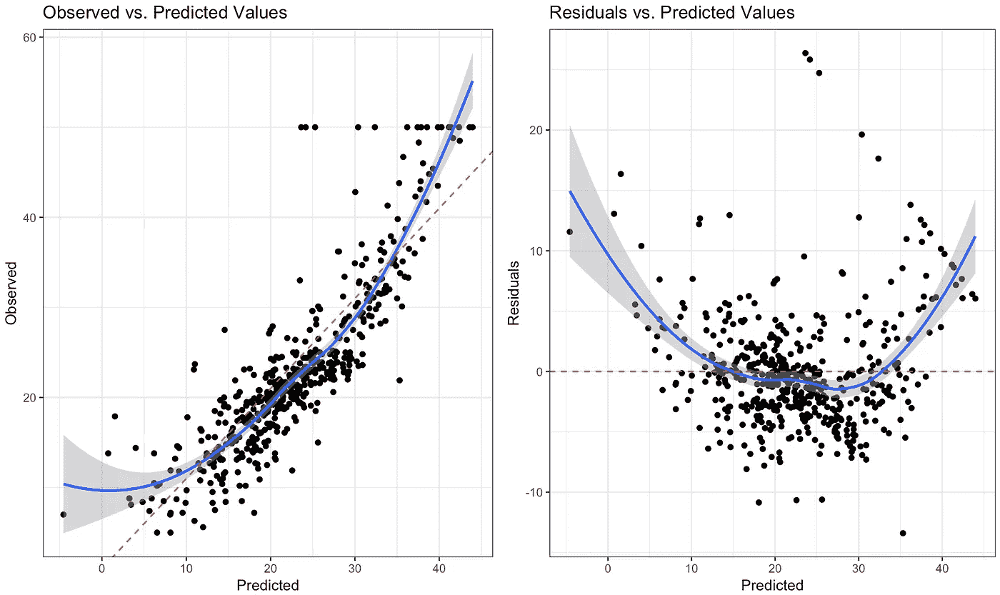

对图的检查表明，线性假设不满足。

潜在解决方案:

*   因变量/自变量的非线性变换
*   添加额外的功能，这些功能是已经使用的功能的转换(例如方形版本)
*   添加以前没有考虑到的功能

## 残差的期望值(均值)为零

这个很容易检查。在 Python 中:

```
lin_reg.resid.mean()
# -1.0012544153465325e-13
```

而在 R:

```
%%R
mean(lin_reg$resid)
# 2.018759e-17
```

结果有点不同，据我所知，这是一个数值近似值问题。但是，我们可以假设残差的期望值确实是 0。

## 无(完全)多重共线性

换句话说，这些特征应该是线性独立的。这在实践中意味着什么？我们不应该能够使用一个线性模型来准确地预测一个特征使用另一个特征。让我们以 X1 和 X2 作为特征的例子。有可能发生 X1 = 2 + 3 * X2，这违背了假设。

需要注意的一个场景是“虚拟变量陷阱”——当我们使用虚拟变量对分类特征进行编码时，不要忽略模型中的基线水平。这导致虚拟变量和常数项之间的完美关联。

多重共线性可以存在于模型中，只要它不是“完美”的。在前一种情况下，估计效率较低，但仍然是无偏的。估计会不太精确，对特定的数据集高度敏感。

我们可以使用[方差膨胀因子](https://en.wikipedia.org/wiki/Variance_inflation_factor) (VIF)来检测多重共线性。在不涉及太多细节的情况下，VIF 的解释如下:给定变量的 VIF 的平方根显示了与该预测因子与模型中的其他要素不相关的情况相比，标准误差要大多少。如果没有相关的要素，则 VIF 的所有值都将为 1。

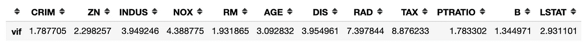

```
%%R
library(car)
vif(lin_reg)
```

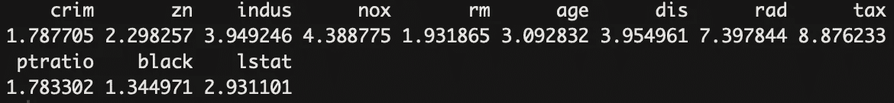

为了处理多重共线性，我们应该反复移除具有高 VIF 值的要素。移除的经验法则可能是 VIF 大于 10 (5 也是常见的)。另一种可能的解决方案是使用 PCA 将特征减少到一个更小的不相关组件集。

提示:我们还可以查看特性的相关性矩阵，以确定它们之间的依赖关系。

## 残差的同方差(等方差)

当残差不具有恒定方差时(它们表现出异方差)，很难确定预测误差的真实标准差，通常会导致置信区间过宽/过窄。例如，如果残差的方差随着时间的推移而增加，样本外预测的置信区间将变得非常窄。异方差的另一个影响也可能是在估计系数时对数据子集(误差方差最大的子集)赋予过多的权重。

为了研究残差是否是同方差的，我们可以查看残差(或标准化残差)与预测值(拟合值)的关系图。我们应该警惕残差作为预测值或时间的函数增长的情况(在时间序列的情况下)。

我们也可以使用两种统计检验:Breusch-Pagan 和 Goldfeld-Quandt。在这两种情况下，零假设假设假设同异方差，而低于某一水平(如 0.05)的 p 值表明我们应该拒绝零假设而支持异方差。

在下面的片段中，我绘制了残差(和标准化值)与拟合值的关系，并进行两个提到的测试。为了确定图中的同方差，点的放置应该是随机的，并且不应该有可见的模式(残差值的增加/减少)- R 图中的红线应该是平的。我们可以看到，对于我们的数据集，情况并非如此。

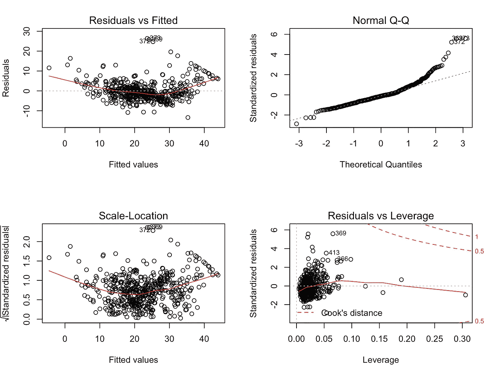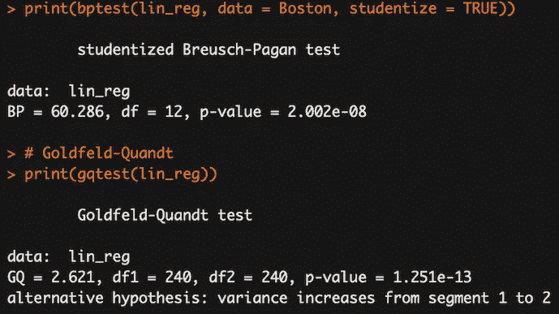

结果表明，假设不成立，我们应该拒绝同异方差假设。

潜在解决方案:

*   因变量的对数变换
*   在时间序列的情况下，如果它涉及货币价值，则对序列进行缩减
*   使用 ARCH(自回归条件异方差)模型来模拟误差方差。一个例子可能是股票市场，其中的数据可以显示随着时间的推移波动性增加或减少的周期(波动性聚类，参见[本文](/introduction-to-quantitative-finance-part-i-stylised-facts-of-asset-returns-5190581e40ea)了解更多信息)

## 无残差自相关

这种假设在时间序列模型中尤其危险，因为残差中的序列相关性意味着模型还有改进的空间。极端的序列相关性通常是模型严重错误的标志。残差中序列相关的另一个原因可能是违反了线性假设，或者是由于可以用省略变量(可识别条件的交互项或虚拟变量)解释的偏差。前一种情况的一个例子可能是对数据拟合一条(直线),该数据随时间呈指数增长。

这个假设在非时间序列模型的情况下也有意义。如果残差在特定条件下总是具有相同的符号，这意味着当预测者具有特定配置时，模型系统地低估/高估了发生的情况。

为了研究自相关是否存在，我使用了 ACF(自相关函数)图和 Durbin-Watson 检验。

在前一种情况下，我们希望了解 ACF 的值对于任何滞后是否显著(如果没有时间序列数据，则使用行号)。在调用该函数时，我们指出我们感兴趣的显著性水平(更多细节见[本文](/introduction-to-power-analysis-in-python-e7b748dfa26)),并在图上标出关键区域。显著的相关性不在这个范围之内。

注意:当处理没有时间维度的数据时，我们可以选择绘制残差与行号的关系。在这种情况下，应以(仅)取决于要素值的方式对行进行排序。

第二种方法是使用德宾-沃森测试。我不会详细介绍它是如何构造的，但会提供一个高层次的概述。检验统计提供了对滞后 1 处的显著残差自相关的检验。DW 统计大约等于`2(1-a)`，其中`a`是滞后 1 残差自相关。DW 测试统计位于`statsmodels`回归的默认汇总输出中。

关于德宾-沃森测试的一些注释:

*   测试统计值总是介于 0 和 4 之间
*   值为 2 表示样本中没有自相关
*   数值< 2 indicate positive autocorrelation, values > 2 负一。

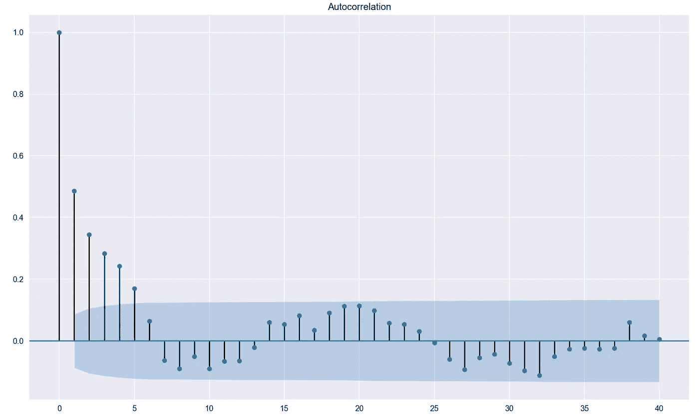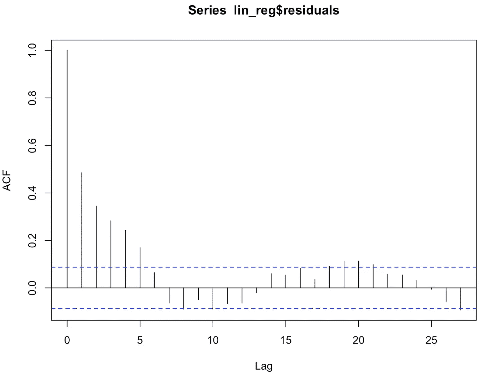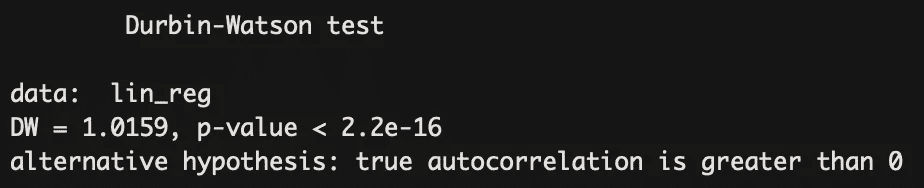

潜在解决方案:

*   在轻微正自相关的情况下，可能有一些微调模型的空间，例如，添加因变量/自变量的滞后
*   模型可能无法捕捉到某些季节性因素，请使用虚拟变量或季节性调整变量来解释这些因素
*   如果 DW < 1，则可能表明模型规范中可能存在问题，考虑通过差分、记录和/或缩减(在货币值的情况下)对时间序列变量进行平稳化
*   在显著负相关的情况下，一些变量可能被过度区分
*   使用广义最小二乘法
*   包括线性(趋势)项，以防残差中出现一致的增加/减少模式

# 4.其他假设

下面我介绍一些其他的线性回归的普遍验证的假设。

## 特征和残差是不相关的

为了研究这个假设，我检查了每个特征和残差之间的皮尔逊相关系数。然后报告 p 值，以测试两个考虑系列之间缺乏相关性。

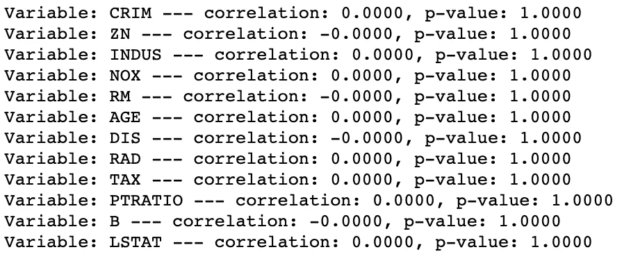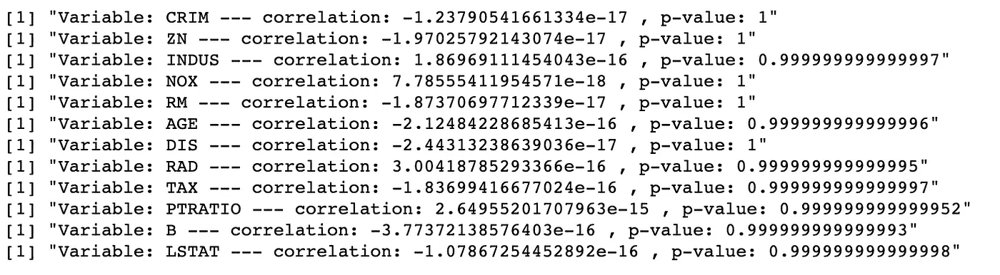

我不能拒绝任何一对的零假设(缺乏相关性)。

## 观察的数量必须大于特征的数量

这个很简单。我们可以通过使用 Python 中的`shape`方法或 r 中的`dim`函数来检查数据的形状。此外，根据经验，我们应该在数据集中有 30 个以上的观察值。这取自中心极限定理，该定理指出，当样本大小大于 30 时，即使随机变量本身不是高斯型的，添加 IID 随机变量也会导致归一化分布。

## 特征上肯定有一些可变性

这种假设表明特征中一定存在一些差异，因为对于所有或大多数观察值具有恒定值的特征可能不是一个好的预测器。我们可以通过简单地检查所有特征的方差来检验这个假设。

```
X.apply(np.var, axis=0)
```

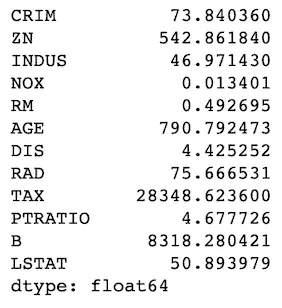

在 R 的`caret`包中有一个名为`nearZeroVar`的函数，用于识别方差为零或接近零的特性。

```
%%R
library(caret)apply(X, 2, var)
nearZeroVar(X, saveMetrics= TRUE)
```

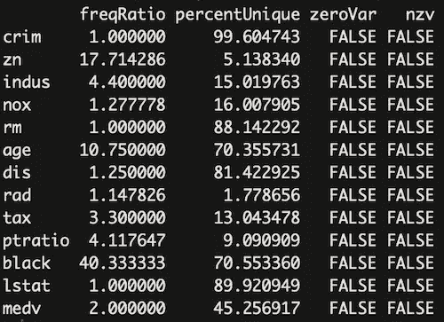

## 残差正态性

当这个假设被违反时，它会导致计算置信区间和系数的各种显著性测试的问题。当误差分布明显偏离高斯分布时，置信区间可能太宽或太窄。

导致非正态残差的一些潜在原因:

*   数据中存在一些大的异常值
*   模型假设可能存在一些其他问题(违规)
*   另一个更好的模型规范可能更适合这个问题

从技术上讲，如果我们假设模型方程是正确的，并且我们的目标是估计系数并生成预测(在最小化均方误差的意义上)，我们可以忽略这个假设。

然而，通常我们感兴趣的是从模型中做出有效的推断，或者估计给定预测误差在特定方向上超过某个阈值的概率。为此，必须满足关于残差正态性的假设。

为了研究这个假设，我们可以看看:

*   残差的 QQ 图(详细描述可以在[这里找到](/explaining-probability-plots-9e5c5d304703))。例如，偏离对角线的弓形模式意味着残差具有过度的偏斜度(即，分布是不对称的，在一个方向上有太多的大残差)。s 形偏差模式意味着残差的峰度过大——在两个方向上都有太多或两个大误差。
*   使用统计检验，如科尔莫戈罗夫-斯米尔诺夫检验、夏皮罗-维尔克检验、贾尔克-贝拉检验和安德森-达林检验

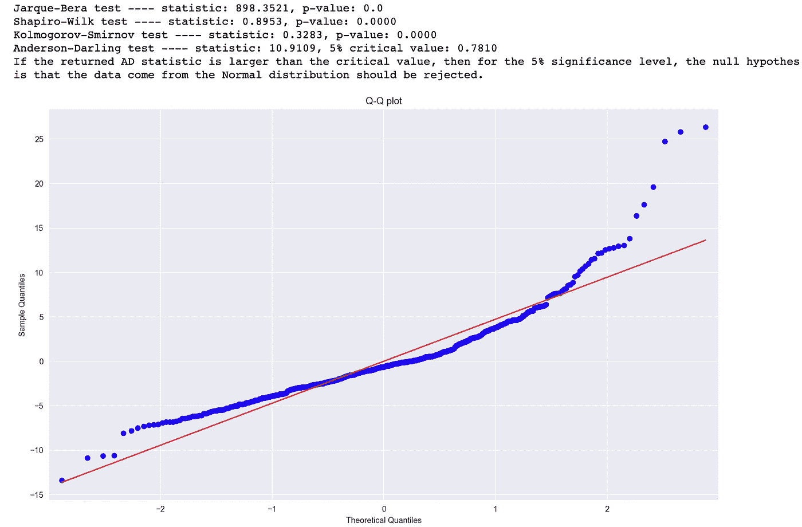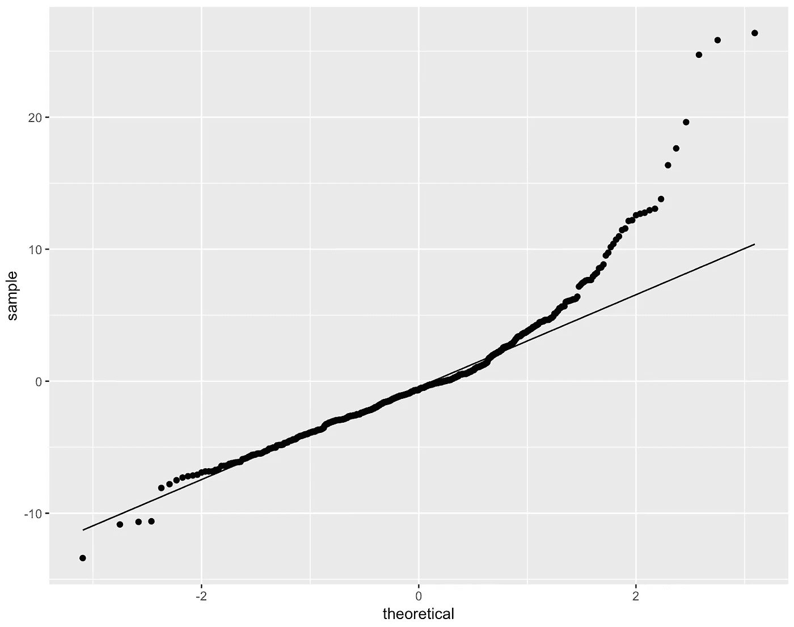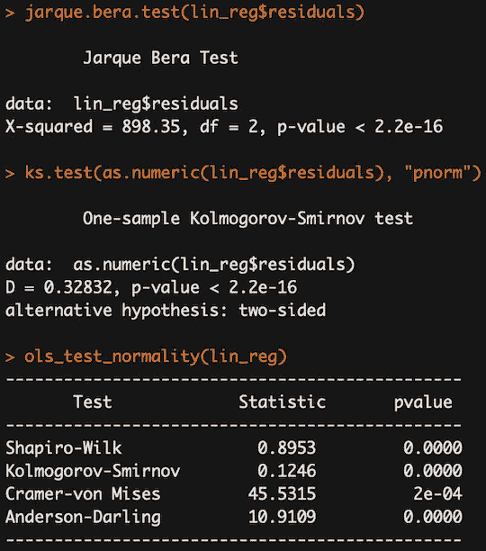

根据上述结果，我们可以推断残差不遵循高斯分布——根据 QQ 图的形状，以及在所有统计测试中拒绝零假设。来自`ols_test_normality`的 Kolmogorov-Smirnov 显示不同结果的原因是它没有运行“双边”版本的测试。

潜在解决方案:

*   目标变量或特征非线性变换
*   移除/处理潜在的异常值
*   可能会出现两个或两个以上的数据子集具有不同的统计特性，在这种情况下，可以考虑单独的模型

# *5。奖金:异常值*

这不是一个真正的假设，然而，在我们的数据中异常值的存在会导致违反上述一些假设。这就是为什么我们应该调查数据，并核实一些极端的观察是否有效，对我们的研究是否重要，或者仅仅是一些我们可以消除的错误。

我不会深究离群点检测方法，因为已经有很多关于它们的文章了。一些可能的方法:

*   z 分数
*   箱形图
*   杠杆-衡量一个点的特征值与不同观测值之间的距离。高杠杆点是变量的极值点，在该点附近缺少观测值使得拟合的回归模型接近该特定点。
*   库克距离-衡量删除观察如何影响回归模型的一种方法。调查具有高库克距离的点是有意义的。
*   隔离森林——更多详情见[这篇文章](/outlier-detection-with-isolation-forest-3d190448d45e)

# 6.结论

在本文中，我展示了线性回归的假设是什么，如何验证它们是否满足，以及我们可以采取哪些潜在的步骤来解决模型的潜在问题。本文使用的代码可以在 [GitHub](https://github.com/erykml/medium_articles/blob/master/Statistics/linear_regression_assumptions.ipynb) 上找到。

一如既往，我们欢迎任何建设性的反馈。你可以在推特上或者评论里联系我。

喜欢这篇文章吗？成为一个媒介成员，通过无限制的阅读继续学习。如果你使用[这个链接](https://eryk-lewinson.medium.com/membership)成为会员，你将支持我，而不需要额外的费用。提前感谢，再见！

# 参考

1.  [http://people.duke.edu/~rnau/testing.htm](http://people.duke.edu/~rnau/testing.htm)