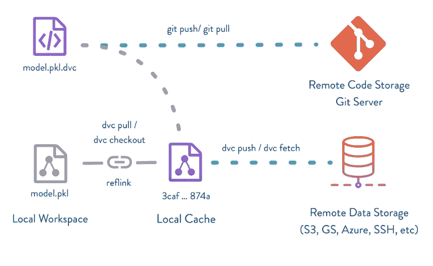
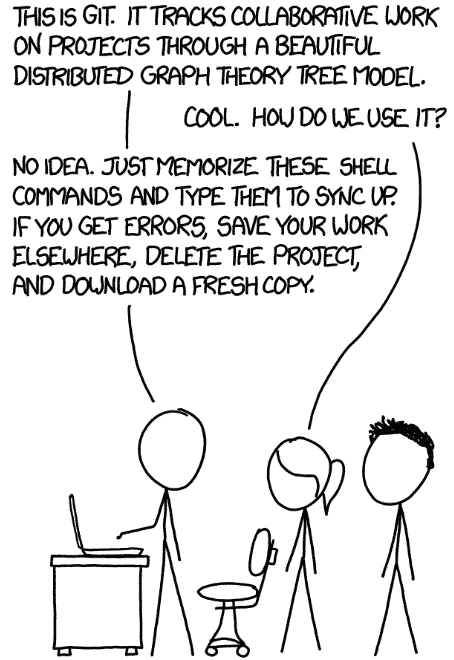
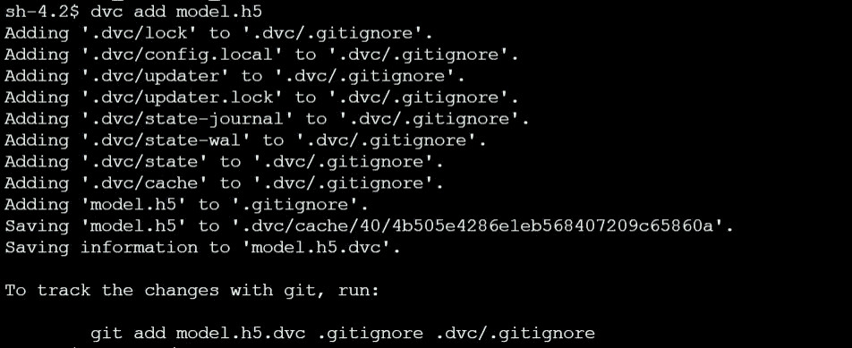
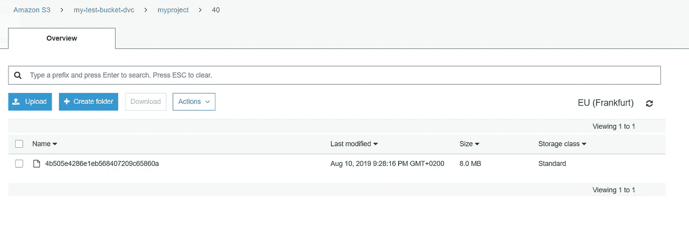
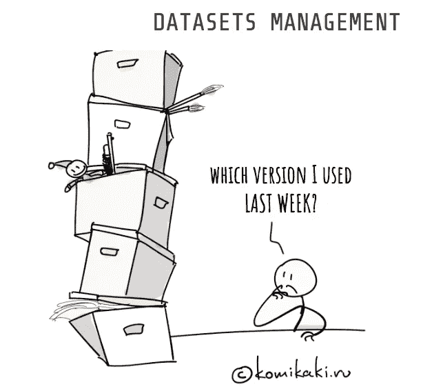

# 版本控制 ML 模型

> 原文：<https://towardsdatascience.com/version-control-ml-model-4adb2db5f87c?source=collection_archive---------1----------------------->



dvc workflow from [https://dvc.org](https://dvc.org/)

机器学习操作(姑且称之为 ***mlOps*** 在当前的流行语格局 xxOps 下)与传统的软件开发操作( ***devOps*** )有很大的不同。原因之一是 ML 实验除了代码(小的纯文本文件)之外，还需要大的数据集和模型工件。

这篇帖子提出了一个用 git 和 dvc ( [数据版本控制](https://dvc.org/doc/tutorial))对机器学习模型进行版本控制的解决方案。

此解决方案将提供以下功能:

1.  ML 模型具有可伸缩性、安全性、可用性和几乎无限的存储空间
2.  ML 模型受版本控制，即它的任何特定版本都可以被方便地标记和访问
3.  ML 模型的可审计性、透明性和可再现性可以通过版本控制数据集和分析代码来保证
4.  基于现有的模型设置，新的实验可以被快速和协作地初始化

# 吉特和 DVC



该解决方案包括两层版本控制:

1.  ***git*** :处理代码和元数据(数据集和模型工件的)
2.  ***dvc*** :处理大型数据集和模型工件

首先，我们准备好项目文件夹并安装好工具。

```
# Download code
git clone [https://github.com/iterative/example-versioning.git](https://github.com/iterative/example-versioning.git)
cd example-versioning# install and initialize git
# install and initialize dvc ([https://dvc.org/doc/get-started/install](https://dvc.org/doc/get-started/install))
```

然后将 dvc 连接到后端存储，数据集和模型工件将实际存储在这里(在本例中为 ***AWS S3*** )。

```
dvc remote add -d s3remote s3://[my-test-bucket-dvc](https://console.aws.amazon.com/s3/#)/myproject 
```

现在，在我们将进行 ML 实验的示例版本化文件夹中，应该包含两个元数据子文件夹。

```
.dvc/
.git/
```

# 工作流程

下一步，我们使用来自 dvc.org 的数据和脚本训练一个模型

```
cd example-versioning# Install dependencies
pip install -r requirements.txt# Download data
cd example-versioning
wget [https://dvc.org/s3/examples/versioning/data.zip](https://dvc.org/s3/examples/versioning/data.zip)
unzip data.zip
rm -f data.zip# Build the ML model
python train.py
```

获得模型(model.h5)后，使用 dvc + git 工作流将其置于版本控制之下。

**步骤 1:向 dvc 添加模型元数据**

```
dvc add model.h5
```

输出:



可以观察到:

*   “真实”模型存储在。dvc/cache/40
*   模型元数据 model.h5.dvc 记录它在哪里


**步骤 2:通过将模型推送到后端存储来持久化模型**

```
dvc push model.h5.dvc
```

在 s3 中，我们可以在模型元数据的指导下检查模型是否被正确存储



**步骤 3:用 git 持久化模型元数据**

模型元数据可以引导我们找到存储在后端存储中的真正的模型对象。为了防止丢失元数据，应该使用 git 将它添加到版本控制中。

```
git add .gitignore model.h5.dvc data.dvc metrics.json
git commit -m "model first version, 1000 images"
git tag -a "v1.0" -m "model v1.0, 1000 images"
```

这里可以使用“git 标签”来记录模型的版本。

**第四步:随时访问模型**

通过搜索 git branch 上的标签，很容易获取模型的特定版本。从 git 中，我们可以检查模型元数据。

```
git checkout tags/<tag_name> -b <branch_name>
```

根据元数据，我们可以找到模型对象，并使用命令将其下载到当前工作区

```
dvc pull model.h5.dvc
```



# 结论

同理，也可以解决机器学习实验的大数据集版本控制问题。解决 ML 管道挑战的其他类似工具例如有[***ML flow***](https://mlflow.org/)[***datanami***](https://www.datanami.com/)和 [***神圣***](https://github.com/IDSIA/sacred) 。