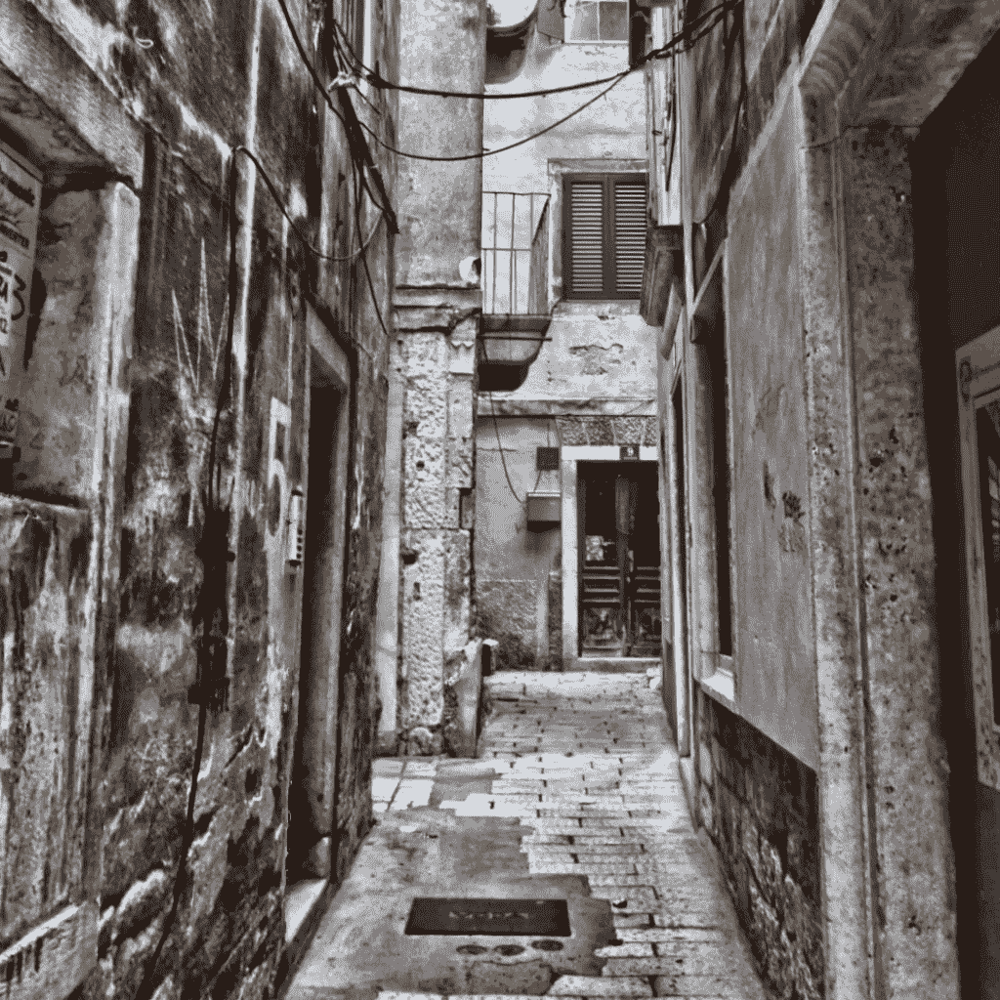
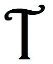
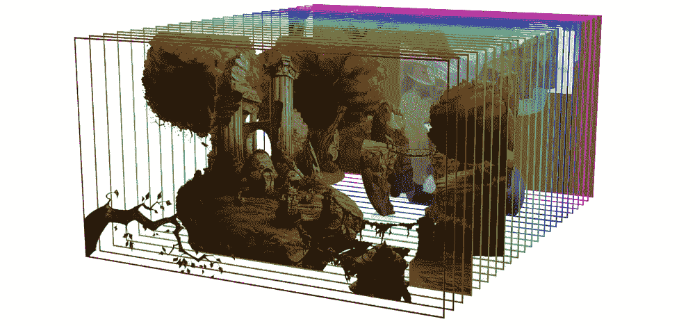
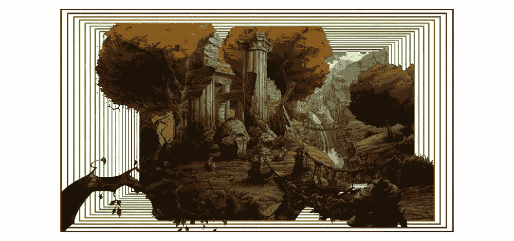
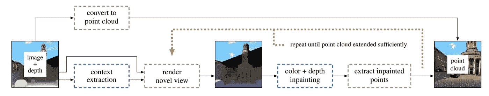

# 很有空间感！基于人工智能的视差 3D 视频。

> 原文：<https://towardsdatascience.com/very-spatial-507aa847179d?source=collection_archive---------14----------------------->

## 三维本·伯恩斯效应



  T 以下是我热爱 AI 开发的几个原因。新**技术途径**、**意想不到的可能性**、**令人惊喜的品质**。并且:**团队工作**。每个模型背后都有人，他们编写、测试、增强、审查模型。

> 人的因素是人工智能背后最重要的因素。

在这个 **3D 本·伯恩斯**模型的情况下也是如此。

# 本·伯恩斯效应。

[**本·伯恩斯效应**](https://en.wikipedia.org/wiki/Ken_Burns_effect) 得名于电影纪录片导演**本·伯恩斯**，他用变焦和相机移动曝光静态照片来模拟视频镜头。

后来，这种效果通过**视差效果**得到了增强，静止图像被分成几层，类似于*剧院舞台装饰*。来模拟深度。并且虚拟摄像机在第三维中移动。它有各种各样的用途——用于视频游戏(*模仿第三维*)，用于网站(*沉浸式体验*)，用于电影(*重复使用照片作为动态镜头*)。



Layered scene — from a computer game The Whispered World ([source](https://en.wikipedia.org/wiki/Parallax_scrolling)).

这种方法早在 20 世纪 20-30 年代就已经被德国动画师洛塔·赖尼格采用了。这里你也可以看到这样的分层背景是如何在没有任何 CGI 的情况下实现的:

对于视频，您可以手动使用 Photoshop+Adobe After effects，或者像“Photomotion”这样的特殊解决方案来制作视差视频。就像我曾经做过的多语言项目一样。

但是——人工智能提供了新的可能性！

因此，一个研究团队:西蒙·尼克劳斯(波特兰州立大学)、龙脉(Adobe Research)、杨笈每(Adobe Research)和刘峰(波特兰州立大学)致力于基于深度学习的解决方案:

> 3D 本·伯恩斯效应。
> 论文:《单幅图像的 3D 本·伯恩斯效应》[https://arxiv.org/abs/1909.05483](https://arxiv.org/abs/1909.05483)

上下文感知修复和深度估计是关键词。



Source: Paper “[3D Ken Burns Effect from a Single Image](https://arxiv.org/abs/1909.05483)”

该模型可以识别背景，模拟深度，用内容敏感的填充来填充缺失的区域，添加新的角度——简而言之:用一张图像就可以制作一个空间 3D 视频镜头。

观看由[撰写的 2 分钟的论文**卡罗利·佐尔奈-费希尔**视频解释这一模式(一如既往地提供大量信息):](https://twitter.com/karoly_zsolnai)

本周，**西蒙·尼克劳斯**可能会从 **Adobe** 获得公开代码的批准(= > [GitHub](https://github.com/sniklaus/3d-ken-burns) )。

从现在开始，每个人都可以尝试这个解决方案，比如人工智能研究员兼艺术家乔纳森·弗莱:

或者博客作者兼技术专家安迪·拜奥:

或者我自己:

它可以完美地处理街道的透视图像，也可以处理室内。

Andy Baio 在他的 Waxy.org 博客中发布了一个历史照片平行排列的图库(如果你想的话，也可以是 3d 立体图)。在这篇博文中，他还发布了他的 Colab 笔记本，并配有 3D 本·伯恩斯模型以供试用。电脑工程师**马努·罗梅罗**对笔记本进行了一些改进，包括**多张图片上传**。

这就是:一个 3D 本·伯恩斯效果的 Colab 笔记本。

这里是我的一些结果。请注意深度和 3D 尺寸的显著识别。

在评论中发布你自己视差照片的结果。

## 更新 1(2020 年 1 月 22 日)。

通过使用 [#DeOldify](/deoldify-gan-based-image-colorization-d9592704a57d?source=friends_link&sk=925195b692f4922b90814ff8cc537e1b) 和 3D 本·伯恩斯效果，我们可以让一条古老的纽约街道重现生机:

[](/re-animated-history-6b5eb1a85efa) [## 重现历史

### 正在使用的深度学习模型

towardsdatascience.com](/re-animated-history-6b5eb1a85efa) 

## 更新 2(2020 年 1 月 22 日)

如果对“autozoom.py”中的参数进行微调，可以得到有趣的结果。例如，这些值

```
objectTo = process_autozoom({'dblShift': 10.0,'dblZoom': 10000000000000000000000000000000000000000000000000000000,'objectFrom': objectFrom})numpyResult = process_kenburns({'dblSteps': numpy.linspace(0.0, 8.0, 400).tolist(),'objectFrom': objectFrom,'objectTo': objectTo,'boolInpaint': True})
```

产生更长的摄像机飞行时间:

# 因为团队合作仍在继续——现在用创造性的方法！