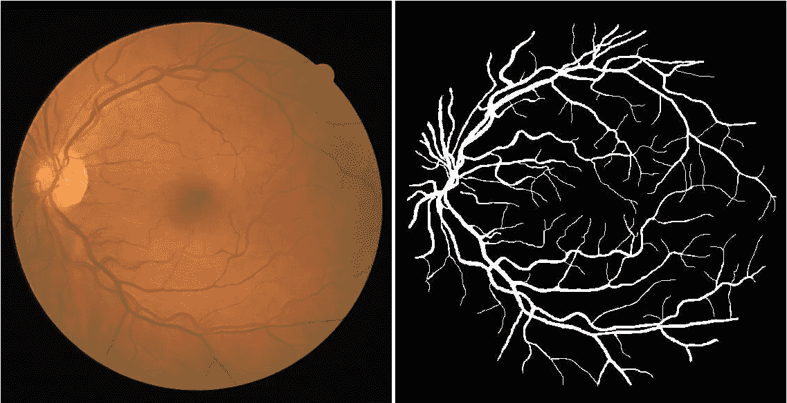
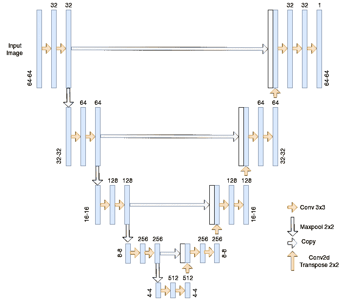
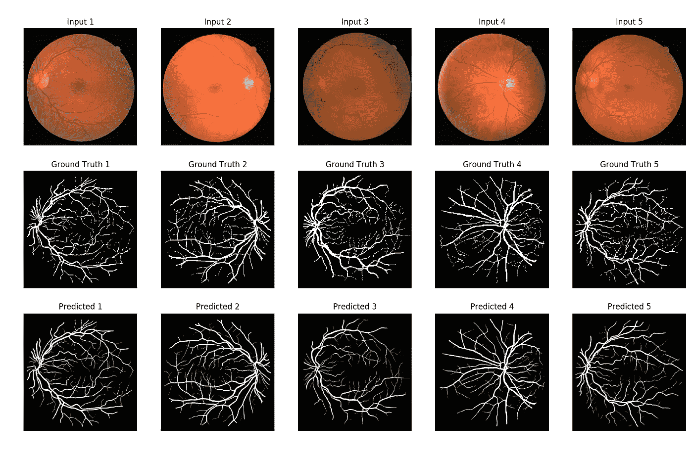
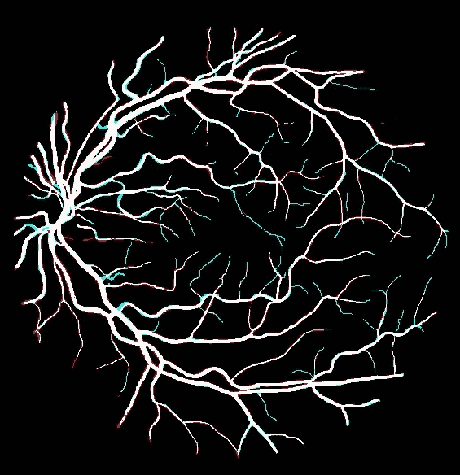

# 基于 Python 和 Keras 的血管分割

> 原文：<https://towardsdatascience.com/vessel-segmentation-with-python-and-keras-722f9fb71b21?source=collection_archive---------3----------------------->

Photo by [Erica Leong](https://unsplash.com/photos/_FoHMYYlatI?utm_source=unsplash&utm_medium=referral&utm_content=creditCopyText) on [Unsplash](https://unsplash.com/search/photos/eyes?utm_source=unsplash&utm_medium=referral&utm_content=creditCopyText)

# 动机:

医学图像的自动分割是提取有用信息帮助医生做出诊断的重要步骤。例如，它可以用于分割视网膜血管，以便我们可以表示它们的结构并测量它们的宽度，这反过来可以帮助诊断视网膜疾病。

在这篇文章中，我们将实现一个神经基线，对视网膜血管图像进行图像分割。

# 数据集:

[http://www.isi.uu.nl/Research/Databases/DRIVE/browser.php](http://www.isi.uu.nl/Research/Databases/DRIVE/browser.php)

我们使用 [DRIVE(用于血管提取的数字视网膜图像)](http://www.isi.uu.nl/Research/Databases/DRIVE/)数据集进行所有实验。它是 40 个视网膜图像(20 个用于训练，20 个用于测试)的数据集，其中在像素级(参见上面的例子)对血管进行注释，以在图像的每个像素(I，j)处标记血管的存在(1)或不存在(0)。

# 问题设置:

**问题**:我们想给每个像素分配一个“1”标签，如果它是图像中血管的一部分，否则为“0”。
**直觉** / **假设**:相邻像素值对于对每个像素(I，j)进行预测很重要，所以我们应该考虑上下文。预测不依赖于图像上的特定位置，因此分类器应该具有某种平移不变性。
**解决方案**:用 CNN！我们将使用 [U-net](https://duckduckgo.com/?q=U-net&t=canonical&atb=v134-5__&ia=web) 架构来进行血管分割。它是一种广泛用于语义分割任务的架构，尤其是在医学领域。

# 型号:

U-net

U-net 架构是一个编码器-解码器，在编码器和解码器之间有一些跳跃连接。这种架构的主要优点是在对像素进行预测时能够考虑更广泛的背景。这得益于上采样操作中使用的大量通道。

## **输入图像处理:**

我们在把它传送给 CNN 之前应用了这一系列的处理步骤。

*   标准化:我们将像素强度除以 255，因此它们在 0-1 的范围内。
*   裁剪:由于汇集操作，网络希望输入图像的每个维度都能被 2⁴整除，因此我们从每个图像中随机裁剪 64*64。
*   数据扩充:随机翻转(水平或垂直或两者)、随机剪切、随机平移(水平或垂直或两者)、随机缩放。仅在培训期间执行。

我们训练模型的三个变体:

*   预先接受过 ImageNet VGG 编码器+数据增强的培训。
*   从零开始训练+数据扩充。
*   在没有数据扩充的情况下从头开始训练。

我们将使用 AUC ROC 指标来比较这三个模型，并且我们将在评估中仅考虑视网膜掩膜内的像素(这意味着图像圆圈周围的黑边将不计算在内)。

## 结果:

*   从零开始训练+数据增强 AUC ROC : **0.9820**
*   从零开始训练，没有增加 AUC ROC : 0.9806
*   预训练编码器+数据增强 AUC ROC : *0.9811*

这三种变体的性能很接近，但在这种情况下，预训练似乎没有帮助，而数据扩充有一点帮助。

Best model predictions

上图中的预测看起来相当酷！😄

Predictions on top of ground Truth

我们还画出了预测和实际情况之间的差异:蓝色为假阴性，红色为假阳性。我们可以看到，该模型在预测只有一两个像素宽的精细血管时存在一些困难。

# 结论:

在这篇文章中，我们实现了一个神经网络来进行图像分割，应用于视网膜图像中的血管检测。我们获得的 AUC ROC 值为 **0.9820** ，非常接近最先进水平([https://paperswithcode.com/search?q=vessel](https://paperswithcode.com/search?q=vessel))。关于实验结果，我发现最有趣的是，对于像这样的一些任务，我们可以在少至 20 张图像上训练一个深度神经网络，并仍然获得良好的性能和非常酷的结果。

重现结果的代码可从这里获得:[https://github.com/CVxTz/medical_image_segmentation](https://github.com/CVxTz/medical_image_segmentation)

如果你有任何建议，请不要犹豫发表意见😸