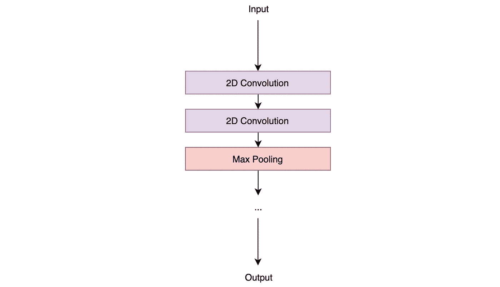
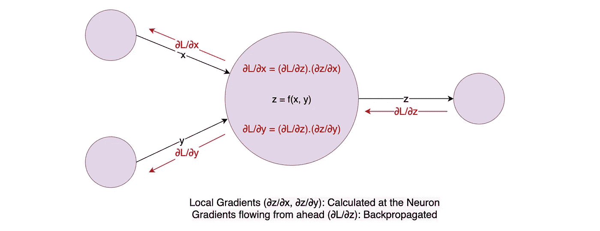
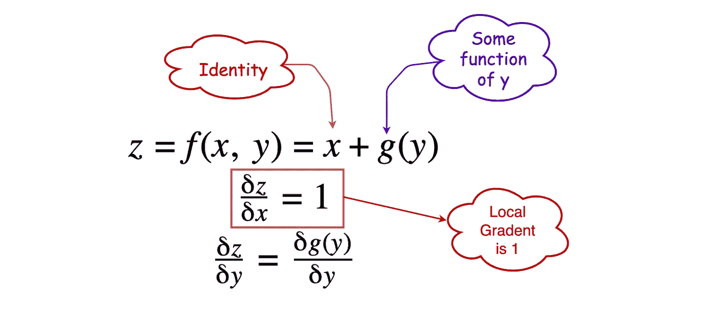
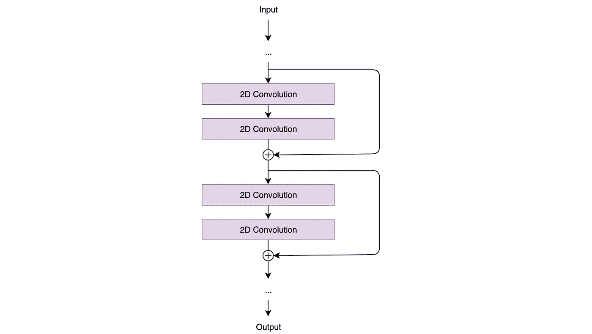

# VGGNet vs ResNet

> 原文：<https://towardsdatascience.com/vggnet-vs-resnet-924e9573ca5c?source=collection_archive---------7----------------------->

## 消失梯度问题的清晰答案！

Photo by [Bench Accounting](https://unsplash.com/@benchaccounting?utm_source=unsplash&utm_medium=referral&utm_content=creditCopyText) on [Unsplash](https://unsplash.com/s/photos/office-chair?utm_source=unsplash&utm_medium=referral&utm_content=creditCopyText)

"你能解释一下 VGGNet 和 ResNet 的区别吗？"是人工智能和机器学习领域的一个流行的面试问题。虽然答案就在网上，但我还没能找到一个简明扼要的答案。我们将从什么是 VGGNet 开始，它遇到了什么问题，以及 ResNet 是如何解决这个问题的。

# VGGNet

VGG 代表*视觉几何小组*(一组牛津的研究人员开发了这种架构)。VGG 架构由块组成，其中每个块由 2D 卷积和最大池层组成。VGGNet 有两种风格，VGG16 和 VGG19，其中 16 和 19 分别是它们各自的层数。

Fig. 1 VGGNet architecture

在卷积神经网络(CNN)中，随着层数的增加，模型适应更复杂函数的能力也会增加。因此，层数越多越好(不要与人工神经网络混淆，后者不一定随着隐藏层数的增加而提供明显更好的性能)。所以现在你可以争论为什么不用 VGG20，或者 VGG50 或者 VGG100 等等。

嗯，有一个问题。

使用反向传播算法更新神经网络的权重。反向传播算法以减少模型损失的方式对每个权重进行小的改变。这是怎么发生的？它更新每个权重，以便在损失减少的方向上迈出一步。这个方向不过是这个重量的梯度(相对于损失)。

使用链式法则，我们可以找到每个重量的梯度。它等于(局部梯度)x(从前方流出的梯度)，如图 2 所示。

Fig. 2 Flow of Gradients through a Neuron

问题来了。由于这个梯度不断流向初始层，这个值不断乘以每个局部梯度。因此，梯度变得越来越小，使得对初始层的更新非常小，大大增加了训练时间。

如果局部梯度不知何故变成了 1，我们就能解决这个问题。

瞧啊。输入 ResNet。

# 雷斯内特

局部梯度怎么会是 1，也就是说，哪个函数的导数总是 1？身份功能！

Fig. 3 Mathematics behind solving the Vanishing Gradient problem

因此，当这个梯度反向传播时，它的值不会减少，因为局部梯度是 1。

ResNet 架构，如下所示，现在应该可以很好地理解它是如何不允许渐变消失问题发生的。ResNet 代表残余网络。

Fig. 4 ResNet architecture

这些*跳跃连接*充当坡度*高速公路*，让坡度畅通无阻。现在你可以理解为什么 ResNet 有 ResNet50、ResNet101 和 ResNet152 这样的风格了。

我希望这篇文章对你有所帮助。

另一篇值得一读的文章:[用 Keras 增强图像数据！](/exploring-image-data-augmentation-with-keras-and-tensorflow-a8162d89b844)

## 参考资料:

[1] [用于视觉识别的 CS231n 卷积神经网络](http://cs231n.github.io/)作者 Andrej Karpathy。

[2] K. Simonyan 和 A. Zisserman。用于大规模图像识别的非常深的卷积网络。2015 年在 ICLR。

[3] K. He，X. Zhang，S. Ren 和 J. Sun，“用于图像识别的深度残差学习”，2016 年 IEEE 计算机视觉和模式识别会议(CVPR)，拉斯维加斯，NV，2016 年，第 770-778 页。

[4] [draw.io](http://www.draw.io) 供图。