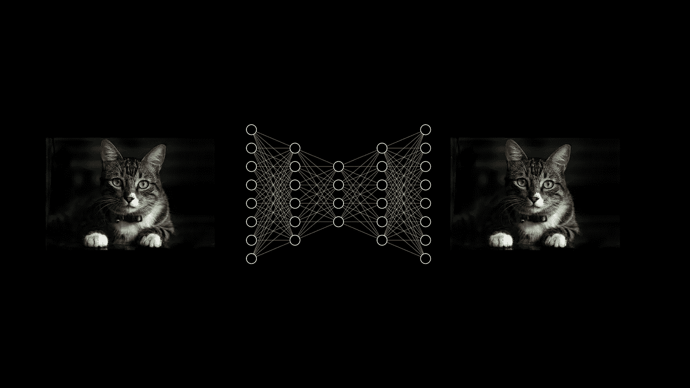

# 视频:关于自动编码器的一切

> 原文：<https://towardsdatascience.com/video-all-about-autoencoders-ab0a85b8d1fa?source=collection_archive---------42----------------------->

## 深入了解应用程序

A 自动编码器是一个非常强大的工具，可以利用未标记的数据来解决各种问题——你经常会在获奖的 Kaggle 提交文件以及先进的行业解决方案中发现它们的组件。例如，您可以使用它们来学习“特征提取器”,以帮助构建更强大的分类器，发现异常，或进行缺失值插补。

该视频介绍了自动编码器，深入探讨了它们的工作原理，并解释了如何使用它们。

*想了解更多类似内容，可以在 blog.zakjost.com*[*订阅我的邮件列表或者关注*](https://blog.zakjost.com/)[*WelcomeAIOverlords YouTube 频道*](https://www.youtube.com/channel/UCxw9_WYmLqlj5PyXu2AWU_g/) *。*