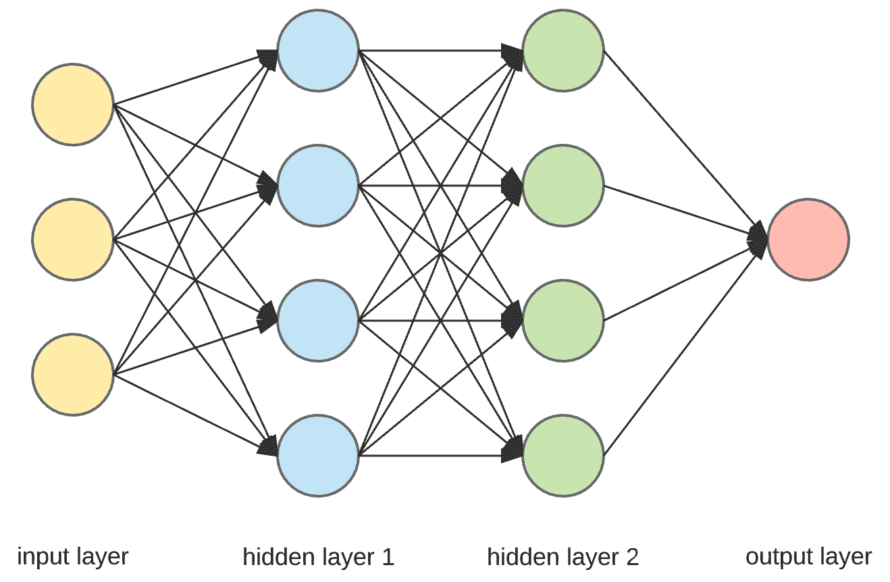
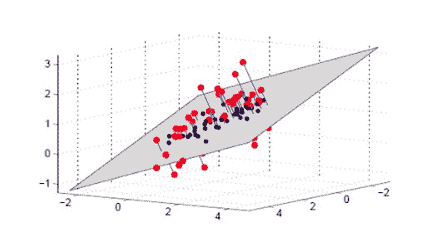
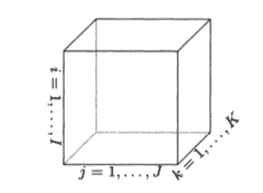
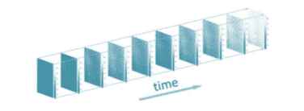
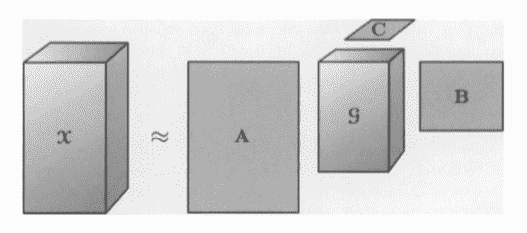
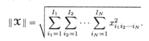
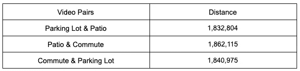
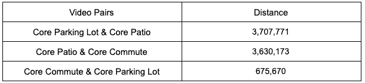

# Python 中张量分解的视频分析

> 原文：<https://towardsdatascience.com/video-analysis-with-tensor-decomposition-in-python-3a1fe088831c?source=collection_archive---------13----------------------->

人工智能。深度学习。卷积神经网络。强化学习。这些都是机器学习领域的革命性进步，让不可能变成了可能。尽管有这些优点，也有缺点和限制。例如，神经网络由于需要庞大的训练集而容易过度拟合。它们通常是特定于任务的，并且它们的能力不能很好地转化到其他环境中。



Neural Network Illustration, by Arden Dertat, [https://towardsdatascience.com/applied-deep-learning-part-1-artificial-neural-networks-d7834f67a4f6](https://www.google.com/url?q=https://towardsdatascience.com/applied-deep-learning-part-1-artificial-neural-networks-d7834f67a4f6&sa=D&ust=1565761359578000&usg=AFQjCNFJxaxkAiypOaQbpcNMOSF_4rIn3w)

虽然正在进行的研究解决了这些问题(我个人对 [OpenAI 在人工通用智能](https://openai.com/about/)方面的努力很感兴趣)，但替代方法也可以拯救这些问题。例如，计算机视觉的主要挑战之一是涉及的数据量:一幅图像通常被表示为具有数百万元素的矩阵，而一个视频包含数千幅这样的图像。此外，这种数据中经常存在噪声。因此，减少维数的无监督学习技术是改进的潜在来源。

考虑到这一点，张量分解的概念在高维数据环境中尤其强大。在 Python 中实现这些思想来分析视频产生了重要的见解，并且可以在其他方法之前充当有用的预处理阶段。

# **高维数据**

高维数据分析的概念指的是一组问题，其中特征的数量比观察值的数量大。在许多应用程序中(回归是最常见的)，这会导致速度和模型学习问题，例如过度拟合或者甚至不可能产生模型。这在计算机视觉、材料科学甚至商业中很常见，因为互联网上捕获了大量数据。

一种解决方案是找到数据的低维表示，并在我们的模型中使用它作为训练观察值，因为维度减少缓解了上面列出的问题。这个低维空间通常包含大部分信息，因此是一个合适的替代物。样条、正则化和张量分解是这种方法的例子。我们将深入研究后一种方法，并看看它的一个应用。



Projecting 3D data onto a 2D plane. Credit: May Morrison

# **数学插曲**

本文的核心概念是张量，它只是一个多维数组:

*   数字是一个零维张量
*   向量是一维张量
*   矩阵是二维张量
*   除此之外，我们只提到张量的维数

这种数据结构对于存储图像或视频特别有用。在传统的 [RGB 模型](https://en.wikipedia.org/wiki/RGB_color_model)中，单幅图像由一个 3D 张量表示:

*   每个像素在矩阵中具有(x，y)坐标；因此，矩阵的大小取决于图像的分辨率
*   每个颜色通道(红色、绿色、蓝色)都有自己的矩阵，矩阵中给定像素的值编码了这种特定颜色的强度



Representation of a 3D tensor. For an image, K = 3, and I and J depend on the resolution of the image. Credits: Kolda, Tamara G., and Brett W. Bader.

更进一步说，视频就是一系列的帧，每一帧都是一幅图像。这变得有点难以想象，但这可以存储在 4D 张量中:3 维用于存储单个帧，第四维编码时间的流逝。



Each slice is a 3D tensor for one frame, and there are multiple such slices over time. Credits: Kamran Paynabar

更具体地说，让我们以 60fps(每秒帧数)和 800 x 600 分辨率的 60 秒视频为例。这个视频可以存储在一个 800 x 600 x 3 x 3600 的张量中。因此它将有 50 亿个元素！这是太多的希望建立一个可靠的模型。这就是张量分解的用武之地。

有大量关于张量分解的文献，我向感兴趣的读者推荐科尔达和巴尔德关于这个主题的伟大研究。特别地，Tucker 分解有许多应用，例如张量回归，用张量作为目标或预测变量。关键是它允许提取核心张量，即原始数据的压缩版本。如果这让你想起了 PCA，那么你是正确的:Tucker 分解的步骤之一实际上是高阶奇异值分解，是 SVD 的扩展。

现有算法允许提取核心张量以及分解矩阵(在我们的应用中没有使用)。超参数是 n 秩。不涉及太多细节，主要思想是 n 秩值越高，分解越精确。n 阶也控制核心张量的大小。对于小的 n 秩，重建的张量可能不完全匹配原始张量，但是我们在降维方面获得了很多:权衡取决于手边的应用。



A, B and C are factorizing matrices while G is the core tensor, whose dimensions are specified by the n-rank. Credits: Kolda, Tamara G., and Brett W. Bader.

提取这个核心张量产生了重要的好处，正如我们在实际数据的应用中所看到的。

# **应用**

举个玩具的例子，我用手机拍了三个 10s 的视频:

*   我喜欢的咖啡馆的露台
*   停车场
*   在我下午通勤期间，汽车在高速公路上行驶

我把它们(和开发笔记本)上传到了 [GitHub](https://github.com/celestinhermez/video-analysis-tensor-decomposition) 上。我的主要目标是确定我们是否可以根据相似性对潜在的配对进行严格的排序，假设停车场和通勤视频最相似。

我利用流行的 OpenCV Python 库在分析之前加载和操作这些数据。步骤如下:

*   创建 VideoCapture 对象并提取每个对象的帧数——我使用较短的视频来截断其他两个对象，以便有一个共同的比较基础

```
# Import libraries
import cv2
import numpy as np
import random
import tensorly as tl
from tensorly.decomposition import tucker# Create VideoCapture objects
parking_lot = cv2.VideoCapture('parking_lot.MOV')
patio = cv2.VideoCapture('patio.MOV')
commute = cv2.VideoCapture('commute.MOV')# Get number of frames in each video
parking_lot_frames = int(parking_lot.get(cv2.CAP_PROP_FRAME_COUNT))
patio_frames = int(patio.get(cv2.CAP_PROP_FRAME_COUNT))
commute_frames = int(commute.get(cv2.CAP_PROP_FRAME_COUNT))
```

*   在适当维度的张量中阅读它们。我选择 TensorLy 和 tensors 一起工作

```
# Create function to read all frames of a video in an array
def read_frames(video_capture, max_frames):
    """
    INPUTS:
    video_capture: an OpenCV VideoCapture object whose frames we   want to read
    max_frames: the maximum number of frames we want to read

    OUTPUT:
    array of all the frames until max_frames
    """
    # Initialize empty array
    frames_array = []

    # Keep track of the frame number
    frame_nb = 0

    # iterate through the frames and append them to the array
    while video_capture.isOpened() and frame_nb < max_frames:
        ret, frame = video_capture.read()
        if not ret:
            break
        frames_array.append(frame)
        if cv2.waitKey(1) & 0xFF == ord('q'):
            break
        frame_nb += 1

    # release the video capture
    video_capture.release()
    cv2.destroyAllWindows()

    # return the array
    return(frames_array)# Read in all the videos
parking_lot_array = read_frames(video_capture=parking_lot, max_frames=commute_frames)patio_array = read_frames(video_capture=patio, max_frames=commute_frames)commute_array = read_frames(video_capture=commute, max_frames=commute_frames)# Create tensors from matrices
parking_lot_tensor = tl.tensor(parking_lot_array)
patio_tensor = tl.tensor(patio_array)
commute_tensor = tl.tensor(commute_array)
```

*   从这些张量中随机抽取 50 帧，以加速未来的运算

```
# Set the seed for reproducibility
random.seed(42)
random_frames = random.sample(range(0, commute_frames), 50)# Use these random frames to subset the tensors
subset_parking_lot = parking_lot_tensor[random_frames,:,:,:]
subset_patio = patio_tensor[random_frames,:,:,:]
subset_commute = commute_tensor[random_frames, :, :, :]# Convert three tensors to double
subset_parking_lot = subset_parking_lot.astype('d')
subset_patio = subset_patio.astype('d')
subset_commute = subset_commute.astype('d')
```

经过这些步骤，就有了三个 50 x 1080 x 1920 x 3 的张量。我们可以继续分析。

# **结果**

为了确定这些视频彼此之间的相似程度，我们需要一种方法来对它们进行排序。两个张量之差的 L2 范数是相似性的常用度量。较小的值与较大的相似性相关联。数学上，张量的范数是



Each I represents a given dimension, and x is a given element, identified by position

因此，差的范数类似于欧几里德距离。

用全张量实现这一点产生了不令人满意的结果。

```
# Parking and patio
parking_patio_naive_diff = tl.norm(subset_parking_lot - subset_patio)# Parking and commute
parking_commute_naive_diff = tl.norm(subset_parking_lot - subset_commute)# Patio and commute
patio_commute_naive_diff = tl.norm(subset_patio - subset_commute)
```

将相似性显示为表格:



不仅配对之间没有明确的排名，而且停车场和天井视频也似乎最相似，这与最初的假设形成了鲜明对比。这就是塔克分解发挥作用的地方。

TensorLy 库使得分解张量变得相对容易(尽管很慢):我们需要的只是张量和它的 n 阶。尽管 AIC 准则是寻找该参数最优值的常用方法，但在这种特定情况下，达到最优实际上是不必要的，因为目的是进行比较。我们需要一个跨越所有三个变量的公共 n 秩。因此，我们选择 n-rank = [2，2，2，2]，这是精度和速度之间的一个很好的折衷。作为旁注，n-rank = [5，5，5，5]超过了 LAPACK(引擎盖下的线性代数例程)的能力，这表明这些方法在计算上是多么昂贵。

一旦我们提取了核心张量，我们可以做同样的比较。

```
# Get core tensor for the parking lot video
core_parking_lot, factors_parking_lot = tucker(subset_parking_lot, ranks = [2,2,2,2])# Get core tensor for the patio video
core_patio, factors_patio = tucker(subset_patio, ranks = [2,2,2,2])# Get core tensor for the commute video
core_commute, factors_commute = tucker(subset_commute, ranks = [2,2,2,2])# Compare core parking lot and patio
parking_patio_diff = tl.norm(core_parking_lot - core_patio)
int(parking_patio_diff)# Compare core parking lot and commute
parking_commute_diff= tl.norm(core_parking_lot - core_commute)
int(parking_commute_diff)# Compare core patio and commute
patio_commute_diff = tl.norm(core_patio - core_commute)
int(patio_commute_diff)
```

再次在表格中显示结果:



这些结果是有意义的:虽然天井视频与停车场和通勤视频不一样，但后两者在数量级上是最接近的。

# **结论**

在本文中，我展示了无监督学习方法如何为我们的数据提供洞察力。只有在通过 Tucker 分解降低维度以从视频中提取核心张量之后，它们的比较才有意义。我们确认停车场和通勤视频最相似。

随着视频成为越来越常见的数据源，这项技术有许多潜在的应用。我想到的第一件事(由于我对电视的热情以及视频流媒体服务如何使用数据)是通过检查电影/电视节目的预告片或一些关键场景如何彼此相似来改进现有的推荐系统。第二个是在材料科学领域，加热金属的红外视频可以根据其与基准的相似性进行分类。为了使这些方法完全可扩展，计算成本应该得到解决:Tucker 分解在我的计算机上对三个 10 秒的视频很慢。并行化是一种潜在的加速方法。

除了这些直接的应用之外，这种技术与介绍中提出的一些方法结合起来也是有前途的。使用核心张量而不是完整的图像或视频作为神经网络中的训练点，可以帮助解决过度拟合问题并加快训练速度，通过解决两个主要问题来推动该方法。

[1]:科尔达，塔玛拉 g，和布雷特 w .巴德。"张量分解和应用."暹罗评论 51.3(2009):455–500。

[2]:颜、郝、卡姆兰·佩纳巴尔、马西莫·帕切拉。"用于过程建模和优化的通过正则化张量回归的结构化点云数据分析."*技术计量学*(2019):1–19。

[3]:方、、卡姆兰·佩纳巴尔和·格布雷尔。"使用惩罚张量回归的基于图像的预测."*技术指标*(2019):1–29。