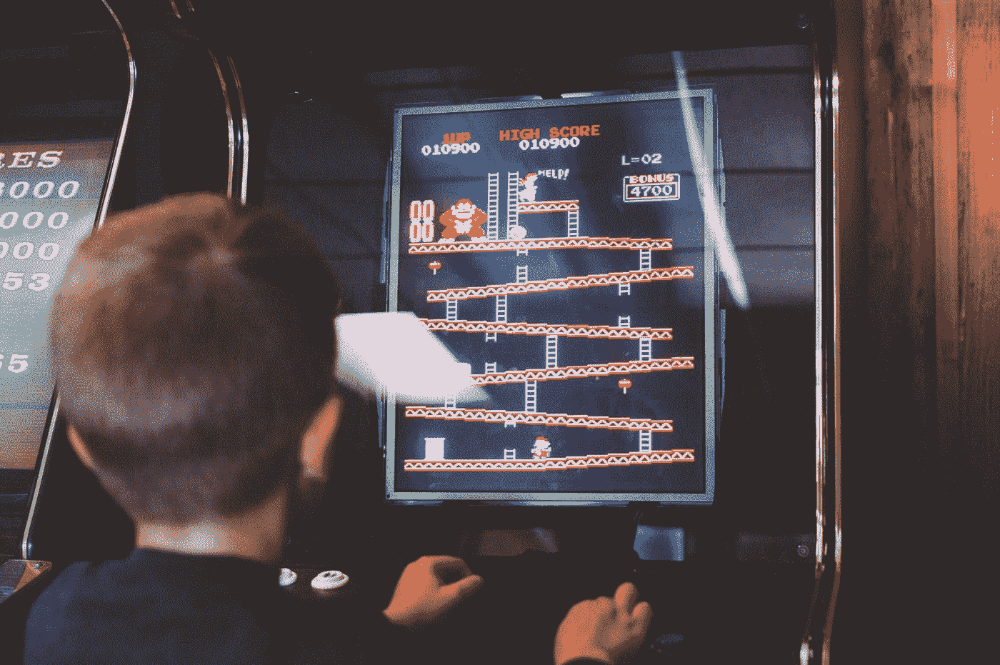

# 视频游戏是人工智能的完美游乐场

> 原文：<https://towardsdatascience.com/video-games-as-a-perfect-playground-for-artificial-intelligence-3b4ebeea36ce?source=collection_archive---------7----------------------->

## 为什么科学家使用虚拟世界来创造现实生活中的解决方案

Photo by [Franck V.](https://unsplash.com/@franckinjapan?utm_source=medium&utm_medium=referral) on [Unsplash](https://unsplash.com?utm_source=medium&utm_medium=referral)

近年来，人工智能领域发展迅速，人工智能背后的一系列技术有望改善我们生活的几乎每个方面。因此，人工智能被用于提高制造效率，为汽车创造自动驾驶系统，预测股票价格，安排工业产品的维修，以及其他可以直接改善我们生活的有用事情。

然而，人工智能算法的另一个应用似乎没有带来任何经济效益，但仍被广泛研究——玩视频游戏的人工智能。

在这里，我们不是在谈论作为你在游戏中旅程的一部分的 NPC(游戏中的非人类角色，机器人)，尽管它们中的一些是稍微有点人工智能的，使它们感觉更真实。焦点在于真正的人工智能算法，即*像任何其他独立演员一样玩*视频游戏，当他们按下控制器上的按钮时，完全像人类一样。从这里，一个问题出现了——为什么开发者和研究人员在似乎没有增加价值的算法上投入了如此多的精力，因为他们只是在玩游戏？

# 科学家如何将游戏和人工智能结合起来？

答案很简单——玩电子游戏的人工智能不仅仅是为了玩电子游戏而被创造出来的(令人惊讶)。在这种情况下，游戏环境充当不同类型算法的游戏场，它们可以在那里测试和尝试新事物；这些结果可以应用于现实生活或未来的研究中。

例如，这是 the Verge [写的](https://www.theverge.com/2018/7/4/17533898/deepmind-ai-agent-video-game-quake-iii-capture-the-flag)关于 DeepMind 的人工智能代理玩《雷神之锤 3》的内容:

> “和以往类似的研究一样，我们的目标不是在电子游戏中真正打败人类，而是找到新的方法来教会智能体在复杂的环境中导航，同时追求共同的目标。换句话说，它是关于教授集体智慧的——这是(尽管有大量相反的证据)人类作为一个物种的成功所不可或缺的。“夺旗只是未来更大游戏的一个代表。”

在视频游戏中测试的人工智能技术的主要子集是机器学习，更具体地说，是强化学习。强化学习是一种机器学习，它意味着代理通过执行动作并获得反馈来学习如何在环境中表现。换句话说，这种类型的机器学习类似于人类甚至狗早年的学习方式:

采取行动→收到反馈(正面或负面)→根据反馈得出结论，行动是好是坏。

视频游戏中也使用了类似的结构。想象一个计算机系统，它有一个视频游戏和控制器。系统不知道该做什么，但它有一套可以执行的操作。如果它在一局游戏中前进，没有死亡，环境给系统一些奖励(没死:+1)。如果系统右移并死亡，则不获得奖励(死亡:0)甚至获得惩罚(死亡:-1)。由此，一台机器明白了向前比向右好。最终，算法的目标是最大化从其行为中获得的回报。

显然，这是对背景中实际发生的事情的简化，但是为了将重点放在视频游戏而不是实际的算法上，这个例子应该足够了。关于更多细节，有一篇很好的文章解释了 RL 如何工作的基本原理:

 [## 强化学习导论

### 本文是🕹️. tensor flow 深度强化学习课程的一部分点击这里查看教学大纲

medium.freecodecamp.org](https://medium.freecodecamp.org/an-introduction-to-reinforcement-learning-4339519de419) 

DeepMind Technologies 首次成功尝试在视频游戏中实现机器学习，他们[创造了](https://www.cs.toronto.edu/~vmnih/docs/dqn.pdf)一种深度强化学习算法，可以玩旧的 Atari 2600 游戏。

然而，最新和最有趣的进展之一是由来自埃隆·马斯克共同创立的“专注于奇点的智库”[开放人工智能](https://www.openai.com/)的研究人员取得的。这组研究人员应用了一种所谓的“[好奇心驱动的](https://pathak22.github.io/large-scale-curiosity/)方法，这意味着他们没有解释算法要做什么，甚至没有解释获胜意味着什么。相反，他们编写了自然的“好奇心”来驱动机器“探索”事物，而机器只是出于好奇而玩游戏。

> “这并不像听起来那么奇怪。发展心理学家认为内在动机(即好奇心)是发展早期的主要驱动力:婴儿似乎采用无目标探索来学习对以后生活有用的技能。还有很多其他不需要外在奖励的例子，从玩《我的世界》到参观当地动物园。”

 [## 研究人员给了人工智能好奇心，它整天玩视频游戏

### 如果你教机器人钓鱼，它很可能会捉到鱼。然而，如果你教它好奇，它只会看电视…

thenextweb.com](https://thenextweb.com/artificial-intelligence/2018/08/23/researchers-gave-ai-curiosity-and-it-played-video-games-all-day/) 

所以总的来说，在电子游戏中测试不同 AI 算法的总体思路是收集数据，为现实世界的应用或后续研究创建知识库。

# 为什么电子游戏对机器学习如此有益？

视频游戏在人工智能研究人员中流行背后的第一个原因是视频游戏在许多方面模仿现实生活的趋势。当涉及到老游戏时，这个想法不是很直接，因为它们有街机风格的图形和物理。

Photo by [Kelly Sikkema](https://unsplash.com/@kellysikkema?utm_source=medium&utm_medium=referral) on [Unsplash](https://unsplash.com?utm_source=medium&utm_medium=referral)

## 内在动机

然而，深入挖掘一下，我们会发现，即使在像马里奥这样的卡通游戏中，前进和执行某些动作的动机与我们的日常生活并没有太大的不同。作为一个英雄，你有一个你想要实现的特定目标，你采取特定的行动来让自己更接近这个目标。如果你的英雄在游戏中死亡，你将此视为负面反馈并改变策略。

> 向主要目标迈进一步→获得反馈→根据反馈改进→再试一次。

简·麦克戈尼格尔(Jane McGonigal)等作者甚至将这种反馈循环[描述为在现实生活中使用游戏方法实现目标的聪明策略，因此人工智能算法可以直接从视频游戏中学习这一点是很自然的。正如 ITUNews](https://www.ted.com/speakers/jane_mcgonigal) [所说的:](https://news.itu.int/video-games-artificial-intelligence/)

> “视频游戏旨在通过让玩家专注于包括克服障碍和跟随子故事在内的元素来挑战人类的思维。游戏设计的一个核心理念——也是许多人喜欢玩游戏的部分原因——是玩家一直在学习。”

## 真实的生活，但又安全又快捷

说到现代电子游戏，对现实生活的模拟更加明显。例如，侠盗猎车手，这基本上是一个带有有趣元素的生活模拟器，已经被某些研究人员用来训练自动驾驶汽车。由于交通规则、道路和汽车物理已经编码在游戏中，科学家在那里测试算法比在现实生活中更容易。由于 GTA 非常逼真，它可以用来生成“与使用真实世界图像生成的数据一样好”的数据。

Classifying different objects in the road scenes. Source: MIT Technology Review

此外，视频游戏安全而快速——不需要与真实环境进行交互来训练 AI，而虚拟环境允许算法训练和开发的速度比物理空间快得多。据称，在机器人可以执行 10 项任务并在现实生活中获得有用反馈的时间内，一个算法可以玩一个游戏 10，000 次，并生成有价值的数据。对于自动驾驶系统等人工智能应用领域，这一功能尤其有用，因为收集道路数据非常耗时，而在交通方面，人们的生命也岌岌可危。

此外，视频游戏很复杂，但提供了一个渐进的过程，使学习过程可以自然进行。因此，游戏往往以不同但相对容易的关卡开始，并随着每个后续的关卡而逐渐变得更难。因此，人工智能算法可以像人类一样学习玩游戏——通过试错和随着时间的推移提高技能。

> “视频游戏是训练人工智能算法的一种很好的方式，因为它们旨在让人类的思维逐渐进入越来越困难的挑战。”

## 简单数据

另一个要点与数据清理有关。对于现实生活中的观察，大多数导出的数据在用于机器学习之前应该被“清洗”，因为诸如缺少某些值或有偏见的反馈之类的不完善之处在现实中会出现。然而，可以预期的是，由于视频游戏基本上是由数据点创建的，所以在让机器从那里学习之前，您不需要清理太多数据。这在理论上应该可以减少一个机器学习项目所需的时间相关资源。

## 电子游戏很有趣

最后，在电子游戏中实现人工智能算法的一个简单原因是游戏很有趣。这种类型的娱乐与高参与度相关，一些游戏拥有数百万忠实粉丝，这在其他类型的活动中不像游戏那样常见。

因此，如果一项科学成就不是用数学术语而是用游戏洞察力来解释，人们更有可能对它感兴趣。例如，创造一种算法，让[在《星际争霸》中击败](https://www.technologyreview.com/the-download/612832/deepminds-new-ai-just-beat-top-human-pro-gamers-at-starcraft-ii-for-the-first/)职业电竞玩家，或者以极高的效率玩雅达利游戏，吸引了大量的关注，并增加了媒体对这项研究的报道。这让人们更加了解人工智能和视频游戏，这对所有参与方来说都是一个双赢的局面。