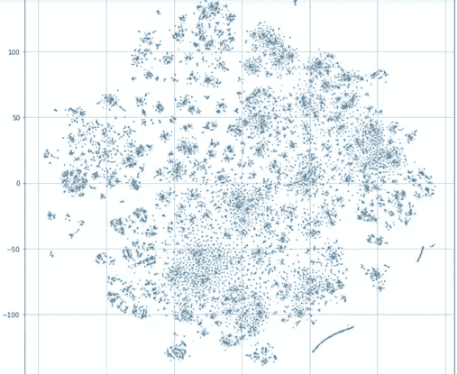

# 视频:欺诈检测中的神经网络入门

> 原文：<https://towardsdatascience.com/video-getting-started-with-neural-networks-in-fraud-detection-b17932ea215?source=collection_archive---------27----------------------->

## 从预处理到学习范畴嵌入

神经网络(NNs)最常用于处理自然数据，如文本、语音或图像。在处理传统的表格数据时，很少使用它们。然而，它们可以提供许多好处。我在一个关于卡格尔信用卡欺诈检测竞赛的新视频中探讨了这个话题。

首先，您可以通过将 NN 模型与更传统的基于树的模型预测相结合来提高性能。这是有效的，因为神经网络很可能学到了一些*不同的*，正是这种差异导致了有用的集合。*【如果你想了解更多关于组装的知识，你可以在这里* *观看我关于这个话题的视频* [*。]*](https://youtu.be/lgnl-Jiu1D0)

其次，学习嵌入本身可以启发分析。例如，在上图中，我们绘制了完整事务嵌入的 2D 投影。这显示了许多集群的有趣结构。通过分析这些聚类，我们可以看到模型认为哪些交易是相似的。这可以帮助我们创造新的功能，以促进更好的学习。

你可以在这里看到视频:

更多类似的内容，你可以订阅我在[blog.zakjost.com](https://blog.zakjost.com)的邮件列表