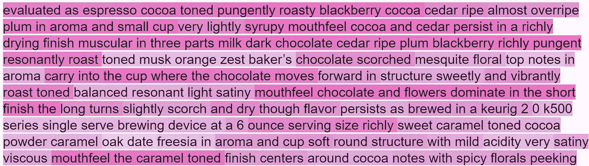
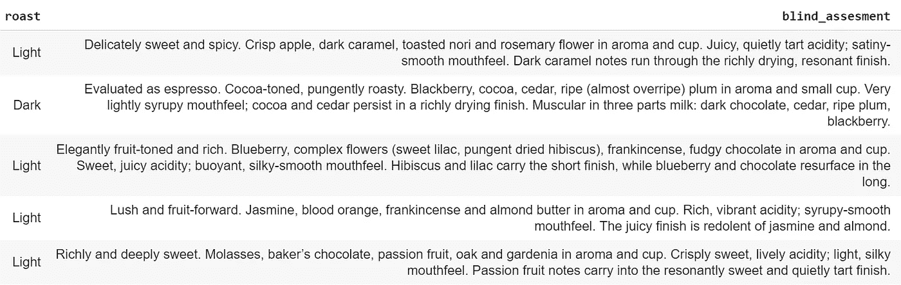
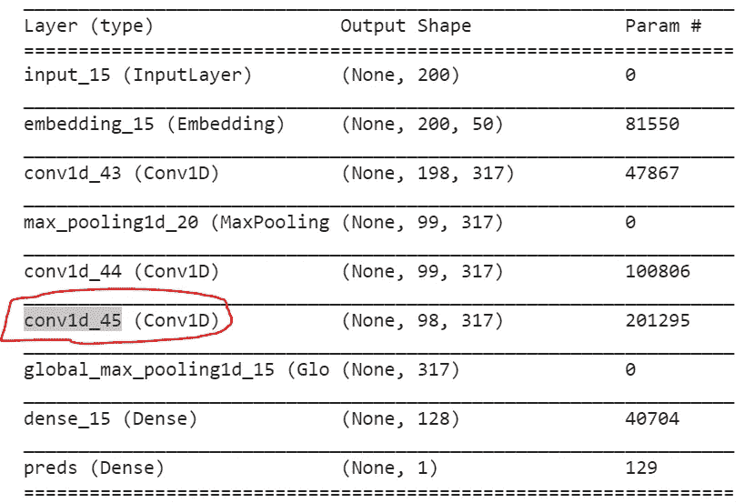
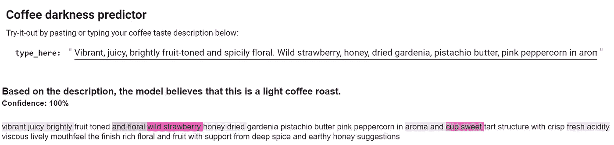

# 通过机器的眼睛看文本

> 原文：<https://towardsdatascience.com/viewing-text-through-the-eyes-of-a-machine-db30c744ee17?source=collection_archive---------11----------------------->

## 如何让黑盒语言模型更加透明



Visualising how machines read text. In this article we will build a heatmap to identify where a text model is ‘reading’ to determine whether a coffee is a light or dark roast

多年来，我们已经能够在计算机视觉任务中揭开卷积神经网络(CNN)的盖子。这给该领域带来了重大改进，具体表现在:

*   提高模型的稳健性；
*   模型偏差的可见性和减少；和
*   更好地理解对立图像如何改变深度学习模型的输出。

既然更好的模型理解带来了如此明显的好处，为什么我们在自然语言处理(NLP)领域对模型可解释性的关注程度似乎不一样呢？


This is what a neural network thinks dumbbells look like. Notice that the model has not separated arms from weights in this case and therefore has not learned generalised representations of this class. Photo from [Google AI Blog](https://ai.googleblog.com/2015/06/inceptionism-going-deeper-into-neural.html)

# 创建一个 CNN 正在看的地方的可视化:

在这篇文章中，我们将看到如何应用同样的技术来理解基于视觉的 CNN 在看什么，并将其应用于文本。然后，我们将创建一个热图，显示 CNN 在输入文本的特定区域“聚焦”的位置，以便进行分类。

是的，我知道，在 GPT-2，伯特，埃尔莫等时代，CNN 现在被认为有点“过时”。然而，它们仍然提供了很好的现实世界性能，没有这些尖端模型带来的大模型大小，长推理时间和大内存使用。

## 预测咖啡烘焙:

为了浏览一个例子，我们将首先建立一个简单的分类器，根据它的描述来预测一杯咖啡是浅烘焙咖啡还是深烘焙咖啡。

我们的数据集是一系列咖啡评论。在这张桌子上，我们将使用盲品笔记来尝试预测烘焙的颜色是浅还是深。



在 Keras 中构建 CNN 并根据这些数据对其进行训练的代码如下:

```
X = df.blind_assesment.values
y = df.y.valuestokenizer = Tokenizer(num_words=4000)
tokenizer.fit_on_texts(X)X = tokenizer.texts_to_sequences(X)vocab_size = len(tokenizer.word_index) + 1  # Adding 1 because of reserved 0 indexmaxlen = 200
embedding_dim = 50X = pad_sequences(X, padding='post', maxlen=maxlen)sequence_input = layers.Input(shape=(maxlen,), dtype='int32')
embedded_sequences = layers.Embedding(vocab_size, embedding_dim, input_length=maxlen)(sequence_input)
l_cov1  = layers.Conv1D(317, 3, activation='relu')(embedded_sequences)
l_pool1 = layers.MaxPooling1D(2)(l_cov1)
l_cov2  = layers.Conv1D(317, 1, activation='relu')(l_pool1)
l_cov3  = layers.Conv1D(317, 2, activation='relu')(l_cov2)
l_pool3 = layers.GlobalMaxPooling1D()(l_cov3)  # global max pooling
l_bnorm = layers.BatchNormalization()(l_pool3)
l_dense = layers.Dense(128, activation='relu')(l_pool3)
preds   = layers.Dense(1, activation='sigmoid',name='preds')(l_dense)model = Model(sequence_input, outputs=preds)model.compile(optimizer='adam',
              loss='binary_crossentropy',
              metrics=['accuracy'])
model.summary()model.fit(X, y, epochs=3, validation_split=0.1, batch_size=10)
```

如果 Keras 中的模型看起来有点不同，这是因为它使用了函数式 API ( [这里有更多细节](https://keras.io/getting-started/functional-api-guide/))。该代码训练并拟合模型，验证准确率约为 75–80%。有很多关于构建 CNN 文本分类器的其他帖子，所以我在这里不再赘述。相反，我们将关注如何解释这个分类器做出的预测。

## 创建激活图:

使用 Keras，这既快速又简单，只需要几行代码:

1.  得到模型预测和网络的最终 CNN 层:



You can get a breakdown of the model structure in Keras using model.summary(). Here conv1d_45 is the name of the final CNN layer in the model

然后，以下代码获取预测类和最后一个 CNN 图层:

```
class_idx = np.argmax(y_pred[0]) #not needed in this case as only two classes
class_output = model.output[:, class_idx]
last_conv_layer = model.get_layer("conv1d_45")
```

2.由此，我们可以计算类输出相对于特征图的梯度，然后汇集所有的梯度。这听起来很复杂，但使用 Keras 后端函数，只需几行代码就可以完成:

```
grads = K.gradients(class_output, last_conv_layer.output)[0]
pooled_grads = K.mean(grads)
iterate = K.function([model.input], [pooled_grads, last_conv_layer.output[0]])
pooled_grads_value, conv_layer_output_value = iterate([Xtst])
```

3.然后，我们对该特征图进行平均，并将其归一化到 0 和 1 之间:

```
heatmap = np.mean(conv_layer_output_value, axis=-1)
heatmap = np.maximum(heatmap,0)
heatmap /= np.max(heatmap)#normalise values in the prediction
```

我们现在有了预测类在最后一个 CNN 层的输出形状长度上的激活热图。我们现在需要做的就是根据原始输入的长度(单词数)来调整(拉伸)它，以了解哪些单词触发了网络。

## 用 HTML 可视化输出:

向最终预测添加一些基本的 HTML 可以创建一个非常有影响力的用户界面，同时增加了理解模型如何达到其预测的能力:

```
norm_len = maxlen/last_conv_layer.output_shape[1] # find the ratio of the text vs the conv layer lengthhtml = ""
if y_pred[0]>0.5:
  pred = 'light'
else:
  pred = 'dark'
html += "<span><h3>Based on the description, the model believes that this is a {} coffee roast. ".format(pred)
html += "<small><br>Confidence: {:.0f}%<br><br></small></h3></span>".format(abs(((y_pred[0][0]*100)-50)*2))
for j,i in enumerate(tokenizer.sequences_to_texts(Xtst)[0].split()):
  html += "<span style='background-color:rgba({},0,150,{})'>{} </span>".format(heatmap[math.floor(j/norm_len)]*255,heatmap[math.floor(j/norm_len)]-0.3,i)HTML(html)
```

这个 HTML 片段在 Google Colab 中创建了以下输出:



Here we can see the model has ‘read’ that the coffee in question has tastes of ‘wild strawberry’ and has a ‘sweet’, ‘fresh acidity’ and is therefore (correctly) confident that this is a light roast.

总之，在本文中，我们已经看到了如何轻松地突出显示模型正在“阅读”的文本区域，以进行预测。这些信息对于以下工作至关重要:

1.  执行基本模型调试和意义检查。
2.  更好地理解为什么模型会对训练样本进行错误分类。
3.  检测潜在的模型偏差。

感谢阅读。如果你有任何问题，请在评论中告诉我。

完整的代码可以在下面的 Colab 笔记本中找到:

[](https://colab.research.google.com/drive/1taIt9A9tsENJTYh3eK0ZuUyRIdrHeNty) [## CNN 文字热图

### 文本可解释性

colab.research.google.com](https://colab.research.google.com/drive/1taIt9A9tsENJTYh3eK0ZuUyRIdrHeNty)