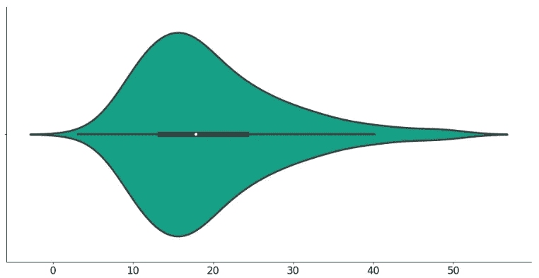

# 小提琴情节——是时候抛弃盒子情节了

> 原文：<https://towardsdatascience.com/violin-plot-its-time-to-ditch-the-box-plots-785629b0ff3a?source=collection_archive---------9----------------------->

## 在您的数据探索之旅中，您很可能遇到过许多类型的图表，它们的主要目标是提供您正在处理的数据的可视化摘要。

Photo by [Providence Doucet](https://unsplash.com/@providence?utm_source=unsplash&utm_medium=referral&utm_content=creditCopyText) on [Unsplash](https://unsplash.com/s/photos/violin?utm_source=unsplash&utm_medium=referral&utm_content=creditCopyText)

你已经得到了你的**直方图**和/或 **KDE 图**，向你展示一个特定的属性是如何分布的，你已经得到了你的**箱线图**来寻找最终的异常值。但是你觉得把这两种图表结合起来的想法怎么样？

这就是小提琴情节的由来。

在潜入文章之前，我先说清楚**这篇文章是给**看的。如果你已经每天都在使用小提琴的情节，并且对它们了如指掌，你可能就不应该继续读下去了。但是对于其他人来说，这篇文章将是一个很好的复习资料，甚至对于初次学习者来说是一个很好的资源。

# 小提琴情节——精粹

violin 图背后的主要思想是结合直方图(*或 KDE 图，更准确地说是*)和箱形图的功能。也就是说，violin plots 将显示您将在方框图中看到的所有信息，例如:

*   **中值**(中间的白点，稍后你会看到)
*   **四分位数范围** (IQR，白点周围的粗黑条)
*   **下/上限值**(从粗黑条延伸的线，定义为 Q1-1.5 IQR 和 Q3+1.5 IQR-用于异常值检测)

你知道上面所有的那些术语是什么，因为我相信你以前见过一个盒子图，所以没有必要继续纠缠下去。

然而，这三件事并没有使小提琴情节变得特别(*因为那是盒子情节*的工作)。它的特别之处在于，它还显示了数据的**整体分布**。

让我们来看看实际情况，我将从**标准正态分布**中抽取一个样本，然后在 KDE 旁边绘制直方图，然后是箱线图，最后是小提琴图:

执行上面的代码将产生以下输出:

**爽！**简单提一下，如果你对调整 *Matlotlib* 图表的外观感兴趣，请参考[我的上一篇文章](/the-last-matplotlib-tweaking-guide-youll-ever-need-dbd4374a1c1e)。

现在，当我们了解了基础知识后，让我们进一步探索在真实数据集上绘制 violin 图的能力。

# 向下钻取

为了这篇文章，我将使用[技巧数据集](https://raw.githubusercontent.com/mwaskom/seaborn-data/master/tips.csv)，您可以免费下载并跟随它。很容易将它加载到*熊猫*中，不需要下载 CSV 文件，只需传入 URL:

执行上面的代码将显示数据集的前几行:

[以防你想知道 Bamboolib 是什么](/violin-plots-explained-fb1d115e023d)。现在我真的不想对这个数据集进行深入分析，因为，嗯，今天是**圣诞节** ( *祝你节日快乐，我的读者朋友*)，但是我将探索小提琴情节的一些属性。

首先是`total_bill`属性(代码:`sns.violinplot(tips_df['total_bill'])`):

如你所见，分布有点倾斜。右侧有异常值(*延伸条结束处右侧的区域*)，表明有几张昂贵的钞票，大约在 40 美元以上。

现在，让我们更深入地探索每天和每次总账单金额(代码:`sns.violingplot(x='day', y='total_bill', data=tips_df)``)的 violin 情节:

嗯，这很奇怪。不要误会我的意思，所有的情节都很好，但似乎酒吧/餐厅在周一，周二和周三不工作。有史以来最高的账单是在周六，大约 60 美元，但是每天都有异常值。

有一句老话说，吸烟者往往在酒吧和餐馆花更多的钱(*我只是为了证明一点而编造的*)，让我们看看这是不是真的(代码:`sns.violinplot(x='day', y='total_bill', hue='smoker', data=tips_df)`:

看起来这种说法在大多数日子里都是正确的，至少如果我们看一下账单金额的中位数(*中的白点*)，但对于周五来说，情况通常不是这样。当然，有一些异常值，但是你不能真的指望他们作为大多数数据。

这个`hue`的东西实质上是图表上小提琴图数量的两倍，这有点不必要，因为小提琴图是对称的，你只要看它的一边就可以得出相同的结论。这就是`split`参数派上用场的地方。让我们看看它在示例中做了什么(代码:`sns.violinplot(x='day', y='total_bill', hue='smoker', data=tips_df, split=True)`:

现在有了这张更加紧凑的图表，你可以像以前一样看到每一点信息。

# 在你走之前

现在，您已经拥有了将数据分析技能提升到下一个水平所需的基本工具。箱形图很好，KDE 图也很好，但是小提琴图会让你在做决定时节省一些时间。

我鼓励你继续深入探索，在评论区与世界分享你的发现。

感谢阅读。保重。

喜欢这篇文章吗？成为 [*中等会员*](https://medium.com/@radecicdario/membership) *继续无限制学习。如果你使用下面的链接，我会收到你的一部分会员费，不需要你额外付费。*

 [## 通过我的推荐链接加入 Medium-Dario rade ci

### 作为一个媒体会员，你的会员费的一部分会给你阅读的作家，你可以完全接触到每一个故事…

medium.com](https://medium.com/@radecicdario/membership)